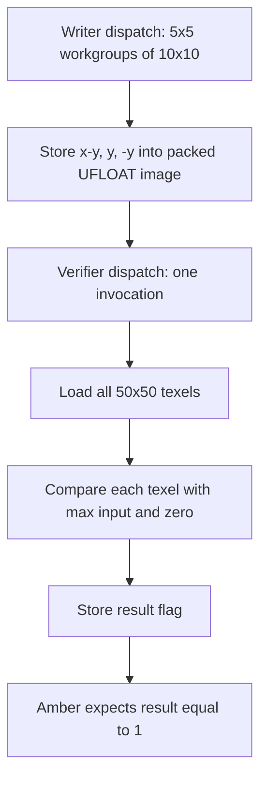
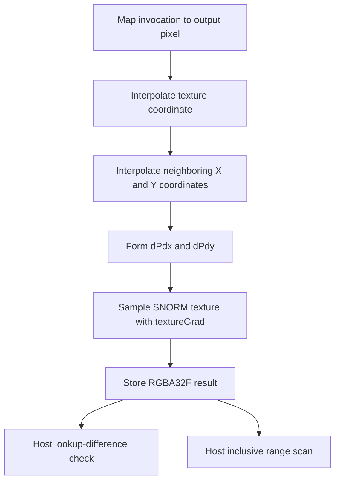

## Overview

**Core question:** Do image stores, sampled-image conversion, and linear filtering return valid shader-visible values at UFLOAT and SNORM conversion boundaries?

- `vktTextureConversionTests.cpp` registers three intermediate nodes under the `conversion` test family.
- `ufloat_negative_values` and `snorm_clamp` load focused Amber recipes. The first checks negative values stored into `VK_FORMAT_B10G11R11_UFLOAT_PACK32`; the second checks the most-negative encoding of 13 SNORM formats.
- `snorm_clamp_linear` uses the C++ texture renderer, a matching software texture, lookup-difference validation, and a separate range scan.
- The three paths use different validation routes: a device-written integer flag, an exact Amber framebuffer expectation, and host-side float-image analysis.

## Background Knowledge

For the shared concept of format conversion, see [Background Knowledge](../../categories/texture.md#background-knowledge) of the `texture` page.

- **UFLOAT components:** `VK_FORMAT_B10G11R11_UFLOAT_PACK32` stores unsigned floating-point R, G, and B components. Vulkan's floating-point conversion rules convert negative values to zero for unsigned destination formats, which supplies the expected boundary result for this storage-image case. See the [`VK_FORMAT_B10G11R11_UFLOAT_PACK32` definition](../../../../vulkan-docs/src/chapters/formats.adoc#L468-L472) and [floating-point format conversion](../../../../vulkan-docs/src/chapters/fundamentals.adoc#L1595-L1608).
- **SNORM endpoint conversion:** For a `b`-bit signed normalized component, Vulkan converts integer `c` to `max(c / (2^(b-1) - 1), -1.0)`. The extra most-negative two's-complement value therefore becomes `-1.0`. An implementation may carry values below `-1.0` through texture filtering, but it must clamp the value before returning it to a shader. See [Conversion From Normalized Fixed-Point to Floating-Point](../../../../vulkan-docs/src/chapters/fundamentals.adoc#L1682-L1717).

## Registration Hierarchy

```text
texture.conversion
├── ufloat_negative_values
├── snorm_clamp
└── snorm_clamp_linear
```

The texture dispatcher attaches `conversion` below `texture` only in non-VulkanSC builds. The default Vulkan mustpass lists 40 executable leaves: one unsigned-float case, 13 direct SNORM cases, and 26 registered linear SNORM cases.

## Parameter Dimensions and Observed Values

| Dimension | Registered values | Meaning in this test | Evidence |
|-----------|-------------------|----------------------|----------|
| Intermediate node | `ufloat_negative_values`, `snorm_clamp`, `snorm_clamp_linear` | Selects storage conversion, direct sampled conversion, or conversion combined with linear filtering. | [path registration](../../../modules/vulkan/texture/vktTextureConversionTests.cpp#L424-L433) |
| Format | `VK_FORMAT_B10G11R11_UFLOAT_PACK32` (`b10g11r11` leaf); SNORM leaves: `a2b10g10r10_snorm_pack32`, `a2r10g10b10_snorm_pack32`, `a8b8g8r8_snorm_pack32`, `b8g8r8a8_snorm`, `b8g8r8_snorm`, `r16g16b16a16_snorm`, `r16g16b16_snorm`, `r16g16_snorm`, `r16_snorm`, `r8g8b8a8_snorm`, `r8g8b8_snorm`, `r8g8_snorm`, `r8_snorm` | Covers packed unsigned float and packed, BGR/BGRA, R-based, 8-bit, 16-bit, and one- through four-component SNORM layouts. | [UFLOAT registration](../../../modules/vulkan/texture/vktTextureConversionTests.cpp#L291-L318), [Amber SNORM table](../../../modules/vulkan/texture/vktTextureConversionTests.cpp#L349-L368), [linear SNORM table](../../../modules/vulkan/texture/vktTextureConversionTests.cpp#L384-L402) |
| Image shape | UFLOAT `50x50`; direct SNORM `1x1` sampled into `32x32`; linear source `7x7` sampled into `140x140` through `308x308` | Gives each behavior a focused data shape. The increasing linear output sizes exercise many sub-texel positions. | [UFLOAT requirement](../../../modules/vulkan/texture/vktTextureConversionTests.cpp#L295-L318), [SNORM requirement](../../../modules/vulkan/texture/vktTextureConversionTests.cpp#L328-L375), [linear size generation](../../../modules/vulkan/texture/vktTextureConversionTests.cpp#L404-L420) |
| Linear leaf name | unsuffixed format name, format name plus `_compute` | Registers two names for each linear format. Current shared parameter ownership makes both names select the compute renderer, as explained below. | [linear leaf construction](../../../modules/vulkan/texture/vktTextureConversionTests.cpp#L407-L418) |
| Validation route | integer result buffer, exact framebuffer image, host lookup difference plus range scan | Separates shader-side exact checks from a precision-aware software reference and an explicit range check. | [UFLOAT expectation](../../../data/vulkan/amber/texture/conversion/ufloat_negative_values/b10g11r11-ufloat-pack32.amber#L65-L73), [direct SNORM expectation](../../../data/vulkan/amber/texture/conversion/snorm_clamp/r8-snorm.amber#L42-L50), [linear verifier](../../../modules/vulkan/texture/vktTextureConversionTests.cpp#L145-L215) |

## Behavior Parameters

The intermediate node below the `texture.conversion` test family is the primary behavioral axis. Each value chooses a different conversion point and pass signal.

### `ufloat_negative_values`: negative storage values converted to packed UFLOAT

One Amber case dispatches a compute shader across a 50 by 50 `VK_FORMAT_B10G11R11_UFLOAT_PACK32` storage image. The shader writes `(x-y, y, -y, 1)`, which supplies positive, zero, and negative components. A second compute shader loads all texels and compares them with `max(original, 0)`. Amber passes only when the one-int result buffer remains `1`.

### `snorm_clamp`: the extra most-negative integer sampled as `-1.0`

Each of 13 Amber cases creates a one-texel SNORM image containing the most-negative component encoding. A fragment shader samples that texel and checks every component present in the format for exact equality with `-1.0`. It writes green on success and red on failure; Amber requires the complete 32 by 32 target to be opaque green.

The scripts use `-128` for ordinary 8-bit channels, `-32768` for 16-bit channels, and packed bit patterns whose component sign bits are set. Formats with one, two, three, or four components change the loop bound and image declaration.

### `snorm_clamp_linear`: endpoint-focused SNORM filtering and returned range

The C++ instance builds matching host and device 7 by 7 textures. Its pattern uses each component's ordinary negative endpoint, `-(2^(b-1)-1)`, plus small format-scaled offsets. It does not initialize the extra most-negative encoding used by `snorm_clamp`. Linear repeat sampling covers texture coordinates from `(0,0)` to `(1,1)` and writes `R32G32B32A32_SFLOAT`, preserving values for host inspection.

The host compares the rendered image with the result from `sampleTexture` by calling `computeTextureLookupDiff`. It then scans every output `vec4` and rejects any component outside the inclusive `[-1,1]` range. The image comparison detects lookup and filtering disagreement. The range scan enforces the shader-visible SNORM limit.

The source registers one unsuffixed leaf and one `_compute` leaf per format, but both `SnormLinearClampTestCase` objects retain the same `de::SharedPtr<Params>`. The registration loop sets `params->useCompute = true` after adding the unsuffixed case. Later, both instances read that shared value and select the compute backend. The two leaf names provide duplicate compute execution rather than distinct graphics and compute coverage.

## Shader Analysis

The Amber recipe and the shared texture renderer use different shader routes. The Amber program verifies its own storage conversion. The renderer writes float results for the host to validate.

### Representative Shader Walkthrough 1

#### Parameter Values Chosen

Representative path:

```text
dEQP-VK.texture.conversion.ufloat_negative_values.b10g11r11
```

| Parameter choice | Meaning in this representative case |
|------------------|-------------------------------------|
| `ufloat_negative_values` | Tests conversion during `imageStore` to an unsigned packed-float storage image. |
| `b10g11r11` | Selects the only format and leaf in this path. |
| verifier compute shader | Loads every converted texel and reduces 2500 exact comparisons to one integer. |

#### Purpose

The two compute shaders test whether storage-image conversion removes negative values from an unsigned floating-point format. The verifier checks the complete image on the device and exposes one exact pass flag to Amber.

#### Structural Design



#### Shader Code

##### Verifier Compute Shader

```glsl
#version 430
layout(local_size_x=1, local_size_y=1) in;
/// Binding 0 is the 50x50 B10G11R11 unsigned-float storage image written by the first dispatch.
uniform layout (set=0, binding=0, r11f_g11f_b10f) image2D texture;
/// Binding 1 holds one int. The shader leaves it at 1 only when every loaded texel matches the clamped input.
layout(binding = 1) buffer Buf1
{
    int result;
};
void main ()
{
  result = 1;
  for (int y = 0; y < 50; y++)
      for (int x = 0; x < 50; x++)
      {
          ivec2 uv = ivec2(x, y);
          vec4 color = imageLoad(texture, uv);
          // Conversion to tiny float should clamp negative values to zero,
          // thus the max operation here.
          vec4 ref = max(vec4(uv.x - uv.y, uv.y, -uv.y, 1), vec4(0));
          if (color != ref)
              result = 0;
      }
}
```

##### Writer Compute Shader

```glsl
#version 430
layout(local_size_x=10, local_size_y=10) in;
/// Binding 0 is the image whose format conversion is under test.
uniform layout (set=0, binding=0, r11f_g11f_b10f) image2D texture;
void main ()
{
    ivec2 uv = ivec2(gl_GlobalInvocationID.xy);
    /// The R and B expressions become negative in different parts of the image.
    vec4 color = vec4(uv.x - uv.y, uv.y, -uv.y, 1);
    imageStore(texture, uv, color);
}
```

#### Additional Info

- The writer is the supporting shader in this walkthrough. This leaf uses it to create the converted image that the verifier reads.
- The verifier uses exact vector inequality. No host-side numeric tolerance participates in this path.
- [`AmberTestCase::initPrograms`](../../../modules/vulkan/amber/vktAmberTestCase.cpp#L435-L543) compiles Amber GLSL with a default SPIR-V 1.0 target when the script declares no other target.

#### Parameter Variation Summary

| Parameter dimension | Shader-level variation from this shader | Evidence |
|---------------------|---------------------------------------|----------|
| Intermediate node | `snorm_clamp` changes to sampled-image fragment validation; `snorm_clamp_linear` uses generated renderer shaders and host validation. | [three-path registration](../../../modules/vulkan/texture/vktTextureConversionTests.cpp#L424-L433) |
| Format within this path | None. The path contains only `VK_FORMAT_B10G11R11_UFLOAT_PACK32`. | [single Amber registration](../../../modules/vulkan/texture/vktTextureConversionTests.cpp#L291-L318) |

#### SPIR-V

##### Verifier Compute Shader

- Status: generated and validated
- Source: reconstructed `GLSL` from this walkthrough
- Stage: `comp`
- Target SPIRV version: `spirv1.0`

<details>
<summary>Click to expand SPIRV asm code</summary>

```llvm
; SPIR-V
; Version: 1.0
; Generator: Khronos Glslang Reference Front End; 11
; Bound: 85
; Schema: 0
               OpCapability Shader
               OpCapability StorageImageExtendedFormats
          %1 = OpExtInstImport "GLSL.std.450"
               OpMemoryModel Logical GLSL450
               OpEntryPoint GLCompute %main "main"
               OpExecutionMode %main LocalSize 1 1 1
               OpSource GLSL 430
               OpName %main "main"
               OpName %Buf1 "Buf1"
               OpMemberName %Buf1 0 "result"
               OpName %_ ""
               OpName %y "y"
               OpName %x "x"
               OpName %uv "uv"
               OpName %color "color"
               OpName %texture "texture"
               OpName %ref "ref"
               OpDecorate %Buf1 BufferBlock
               OpMemberDecorate %Buf1 0 Offset 0
               OpDecorate %_ Binding 1
               OpDecorate %_ DescriptorSet 0
               OpDecorate %texture Binding 0
               OpDecorate %texture DescriptorSet 0
               OpDecorate %gl_WorkGroupSize BuiltIn WorkgroupSize
       %void = OpTypeVoid
          %3 = OpTypeFunction %void
        %int = OpTypeInt 32 1
       %Buf1 = OpTypeStruct %int
%_ptr_Uniform_Buf1 = OpTypePointer Uniform %Buf1
          %_ = OpVariable %_ptr_Uniform_Buf1 Uniform
      %int_0 = OpConstant %int 0
      %int_1 = OpConstant %int 1
%_ptr_Uniform_int = OpTypePointer Uniform %int
%_ptr_Function_int = OpTypePointer Function %int
     %int_50 = OpConstant %int 50
       %bool = OpTypeBool
      %v2int = OpTypeVector %int 2
%_ptr_Function_v2int = OpTypePointer Function %v2int
      %float = OpTypeFloat 32
    %v4float = OpTypeVector %float 4
%_ptr_Function_v4float = OpTypePointer Function %v4float
         %43 = OpTypeImage %float 2D 0 0 0 2 R11fG11fB10f
%_ptr_UniformConstant_43 = OpTypePointer UniformConstant %43
    %texture = OpVariable %_ptr_UniformConstant_43 UniformConstant
       %uint = OpTypeInt 32 0
     %uint_0 = OpConstant %uint 0
     %uint_1 = OpConstant %uint 1
    %float_1 = OpConstant %float 1
    %float_0 = OpConstant %float 0
         %69 = OpConstantComposite %v4float %float_0 %float_0 %float_0 %float_0
     %v4bool = OpTypeVector %bool 4
     %v3uint = OpTypeVector %uint 3
%gl_WorkGroupSize = OpConstantComposite %v3uint %uint_1 %uint_1 %uint_1
       %main = OpFunction %void None %3
          %5 = OpLabel
          %y = OpVariable %_ptr_Function_int Function
          %x = OpVariable %_ptr_Function_int Function
         %uv = OpVariable %_ptr_Function_v2int Function
      %color = OpVariable %_ptr_Function_v4float Function
        %ref = OpVariable %_ptr_Function_v4float Function
         %13 = OpAccessChain %_ptr_Uniform_int %_ %int_0
               OpStore %13 %int_1
               OpStore %y %int_0
               OpBranch %16
         %16 = OpLabel
               OpLoopMerge %18 %19 None
               OpBranch %20
         %20 = OpLabel
         %21 = OpLoad %int %y
         %24 = OpSLessThan %bool %21 %int_50
               OpBranchConditional %24 %17 %18
         %17 = OpLabel
               OpStore %x %int_0
               OpBranch %26
         %26 = OpLabel
               OpLoopMerge %28 %29 None
               OpBranch %30
         %30 = OpLabel
         %31 = OpLoad %int %x
         %32 = OpSLessThan %bool %31 %int_50
               OpBranchConditional %32 %27 %28
         %27 = OpLabel
         %36 = OpLoad %int %x
         %37 = OpLoad %int %y
         %38 = OpCompositeConstruct %v2int %36 %37
               OpStore %uv %38
         %46 = OpLoad %43 %texture
         %47 = OpLoad %v2int %uv
         %48 = OpImageRead %v4float %46 %47
               OpStore %color %48
         %52 = OpAccessChain %_ptr_Function_int %uv %uint_0
         %53 = OpLoad %int %52
         %55 = OpAccessChain %_ptr_Function_int %uv %uint_1
         %56 = OpLoad %int %55
         %57 = OpISub %int %53 %56
         %58 = OpConvertSToF %float %57
         %59 = OpAccessChain %_ptr_Function_int %uv %uint_1
         %60 = OpLoad %int %59
         %61 = OpConvertSToF %float %60
         %62 = OpAccessChain %_ptr_Function_int %uv %uint_1
         %63 = OpLoad %int %62
         %64 = OpSNegate %int %63
         %65 = OpConvertSToF %float %64
         %67 = OpCompositeConstruct %v4float %58 %61 %65 %float_1
         %70 = OpExtInst %v4float %1 FMax %67 %69
               OpStore %ref %70
         %71 = OpLoad %v4float %color
         %72 = OpLoad %v4float %ref
         %74 = OpFUnordNotEqual %v4bool %71 %72
         %75 = OpAny %bool %74
               OpSelectionMerge %77 None
               OpBranchConditional %75 %76 %77
         %76 = OpLabel
         %78 = OpAccessChain %_ptr_Uniform_int %_ %int_0
               OpStore %78 %int_0
               OpBranch %77
         %77 = OpLabel
               OpBranch %29
         %29 = OpLabel
         %79 = OpLoad %int %x
         %80 = OpIAdd %int %79 %int_1
               OpStore %x %80
               OpBranch %26
         %28 = OpLabel
               OpBranch %19
         %19 = OpLabel
         %81 = OpLoad %int %y
         %82 = OpIAdd %int %81 %int_1
               OpStore %y %82
               OpBranch %16
         %18 = OpLabel
               OpReturn
               OpFunctionEnd
```

</details>

##### Writer Compute Shader

- Status: generated and validated
- Source: reconstructed `GLSL` from this walkthrough
- Stage: `comp`
- Target SPIRV version: `spirv1.0`

<details>
<summary>Click to expand SPIRV asm code</summary>

```llvm
; SPIR-V
; Version: 1.0
; Generator: Khronos Glslang Reference Front End; 11
; Bound: 48
; Schema: 0
               OpCapability Shader
               OpCapability StorageImageExtendedFormats
          %1 = OpExtInstImport "GLSL.std.450"
               OpMemoryModel Logical GLSL450
               OpEntryPoint GLCompute %main "main" %gl_GlobalInvocationID
               OpExecutionMode %main LocalSize 10 10 1
               OpSource GLSL 430
               OpName %main "main"
               OpName %uv "uv"
               OpName %gl_GlobalInvocationID "gl_GlobalInvocationID"
               OpName %color "color"
               OpName %texture "texture"
               OpDecorate %gl_GlobalInvocationID BuiltIn GlobalInvocationId
               OpDecorate %texture Binding 0
               OpDecorate %texture DescriptorSet 0
               OpDecorate %gl_WorkGroupSize BuiltIn WorkgroupSize
       %void = OpTypeVoid
          %3 = OpTypeFunction %void
        %int = OpTypeInt 32 1
      %v2int = OpTypeVector %int 2
%_ptr_Function_v2int = OpTypePointer Function %v2int
       %uint = OpTypeInt 32 0
     %v3uint = OpTypeVector %uint 3
%_ptr_Input_v3uint = OpTypePointer Input %v3uint
%gl_GlobalInvocationID = OpVariable %_ptr_Input_v3uint Input
     %v2uint = OpTypeVector %uint 2
      %float = OpTypeFloat 32
    %v4float = OpTypeVector %float 4
%_ptr_Function_v4float = OpTypePointer Function %v4float
     %uint_0 = OpConstant %uint 0
%_ptr_Function_int = OpTypePointer Function %int
     %uint_1 = OpConstant %uint 1
    %float_1 = OpConstant %float 1
         %40 = OpTypeImage %float 2D 0 0 0 2 R11fG11fB10f
%_ptr_UniformConstant_40 = OpTypePointer UniformConstant %40
    %texture = OpVariable %_ptr_UniformConstant_40 UniformConstant
    %uint_10 = OpConstant %uint 10
%gl_WorkGroupSize = OpConstantComposite %v3uint %uint_10 %uint_10 %uint_1
       %main = OpFunction %void None %3
          %5 = OpLabel
         %uv = OpVariable %_ptr_Function_v2int Function
      %color = OpVariable %_ptr_Function_v4float Function
         %15 = OpLoad %v3uint %gl_GlobalInvocationID
         %16 = OpVectorShuffle %v2uint %15 %15 0 1
         %17 = OpBitcast %v2int %16
               OpStore %uv %17
         %24 = OpAccessChain %_ptr_Function_int %uv %uint_0
         %25 = OpLoad %int %24
         %27 = OpAccessChain %_ptr_Function_int %uv %uint_1
         %28 = OpLoad %int %27
         %29 = OpISub %int %25 %28
         %30 = OpConvertSToF %float %29
         %31 = OpAccessChain %_ptr_Function_int %uv %uint_1
         %32 = OpLoad %int %31
         %33 = OpConvertSToF %float %32
         %34 = OpAccessChain %_ptr_Function_int %uv %uint_1
         %35 = OpLoad %int %34
         %36 = OpSNegate %int %35
         %37 = OpConvertSToF %float %36
         %39 = OpCompositeConstruct %v4float %30 %33 %37 %float_1
               OpStore %color %39
         %43 = OpLoad %40 %texture
         %44 = OpLoad %v2int %uv
         %45 = OpLoad %v4float %color
               OpImageWrite %43 %44 %45
               OpReturn
               OpFunctionEnd
```

</details>

### Representative Shader Walkthrough 2

#### Parameter Values Chosen

Representative path:

```text
dEQP-VK.texture.conversion.snorm_clamp_linear.r8_snorm_compute
```

| Parameter choice | Meaning in this representative case |
|------------------|-------------------------------------|
| `snorm_clamp_linear` | Selects the C++ linear filtering and host verification route. |
| `r8_snorm` | Uses one 8-bit SNORM source channel and a 308 by 308 output. |
| `_compute` | Selects the generated compute renderer explicitly. Current source also makes the unsuffixed partner use this backend. |

#### Purpose

The compute shader reconstructs the coordinate field of a rendered quad, supplies explicit gradients, and samples the endpoint-focused SNORM texture with linear filtering. It stores four 32-bit floats so the host can compare the image and detect any returned value outside `[-1,1]`.

#### Structural Design



#### Shader Code

```glsl
#version 450
layout (local_size_x = 16, local_size_y = 16, local_size_z = 1) in;
layout (set=0, binding=0, std140) uniform Block
{
  highp float u_bias;
  highp float u_ref;
  highp vec2  u_viewSize;
  highp vec4  u_colorScale;
  highp vec4  u_colorBias;
  int u_lod;
};
layout(push_constant) uniform PushConstants { ivec2 u_offset; } pc;
/// Binding 1 samples the 7x7 SNORM texture with repeat addressing and linear filtering.
layout (set=0, binding=1) uniform highp sampler2D u_sampler;
/// Binding 2 stores four 32-bit floats so the host can inspect values outside [-1,1].
layout (set=0, binding=2, rgba32f) uniform writeonly image2D u_outputImage;
/// Binding 3 supplies the four quad texture coordinates and positions.
layout (set=0, binding=3, std430) readonly buffer Geometry
{
  vec4 u_texCoords[4];
  vec4 u_positions[4];
};
// Helper to interpolate at a specific screen coordinate
highp vec2 interpolate(vec2 p, ivec2 size)
{
  vec2 uv = (p + 0.5) / vec2(size);
  // Vertices layout in buffer: 0:TL, 1:BL, 2:TR, 3:BR
  float w0 = u_positions[0].w; float w1 = u_positions[1].w;
  float w2 = u_positions[2].w; float w3 = u_positions[3].w;
  // Emulate rasterizer triangle interpolation for perspective correctness
  // Indices: 0:TL, 1:BL, 2:TR, 3:BR
  float b0, b1, b2, b3;
  if (uv.x + uv.y <= 1.0)
  {
    b0 = 1.0 - uv.x - uv.y; b1 = uv.y; b2 = uv.x; b3 = 0.0;
  }
  else
  {
    b0 = 0.0; b1 = 1.0 - uv.x; b2 = 1.0 - uv.y; b3 = uv.x + uv.y - 1.0;
  }
  // Interpolate (TexCoord / W)
  vec2 tc = vec2(u_texCoords[0]) * (b0 / w0) +
            vec2(u_texCoords[1]) * (b1 / w1) +
            vec2(u_texCoords[2]) * (b2 / w2) +
            vec2(u_texCoords[3]) * (b3 / w3);
  // Interpolate (1 / W)
  float invW = (b0 / w0) + (b1 / w1) + (b2 / w2) + (b3 / w3);
  return vec2(tc / invW);
}
void main (void)
{
  ivec2 coord = ivec2(gl_GlobalInvocationID.xy);
  ivec2 size  = ivec2(u_viewSize);
  if (coord.x >= size.x || coord.y >= size.y)
    return;
  // Calculate Texture Coordinate at Current Pixel
  highp vec2 texCoord = interpolate(vec2(coord), size);
  // Calculate Derivatives (Gradients) for Mipmapping
  // We calculate the coordinate at X+1 and Y+1 to approximate dFdx/dFdy
  highp vec2 texCoordX = interpolate(vec2(coord) + vec2(1.0, 0.0), size);
  highp vec2 texCoordY = interpolate(vec2(coord) + vec2(0.0, 1.0), size);
  highp vec2 dPdx = texCoordX - texCoord;
  highp vec2 dPdy = texCoordY - texCoord;
  // Lookup is performed with texture gradients
  // For bias mode, we calculate LOD manually
  /// The host checks the filtered result against a reference and against the SNORM range.
  vec4 result = textureGrad(u_sampler, texCoord, dPdx, dPdy) * u_colorScale + u_colorBias;
  imageStore(u_outputImage, coord + pc.u_offset, result);
}
```

#### Additional Info

- [`initializePrograms`](../../../modules/vulkan/texture/vktTextureTestUtil.cpp#L245-L331) emits the compute template. The `PROGRAM_2D_FLOAT` branch selects `sampler2D` and `textureGrad`.
- The output qualifier comes from `VK_FORMAT_R32G32B32A32_SFLOAT`; an 8-bit normalized output would hide the out-of-range values that the host must detect.
- Shared parameter ownership also sends the unsuffixed partner through this compute shader.

#### Parameter Variation Summary

| Parameter dimension | Shader-level variation from this shader | Evidence |
|---------------------|---------------------------------------|----------|
| SNORM format | Does not change this generated `sampler2D` shader. It changes source representation, active-channel mask, endpoint pattern, tolerance, and output size. | [format loop](../../../modules/vulkan/texture/vktTextureConversionTests.cpp#L382-L420) |
| Unsuffixed versus `_compute` | Intended to select renderer backend, but current leaves share a mutated `Params` object and both observe `useCompute = true`. | [parameter storage](../../../modules/vulkan/texture/vktTextureConversionTests.cpp#L257-L268), [leaf construction](../../../modules/vulkan/texture/vktTextureConversionTests.cpp#L412-L418) |
| Sampler state | Fixed to normalized coordinates, repeat addressing, and linear minification/magnification. It changes runtime behavior, not shader text. | [sampler setup](../../../modules/vulkan/texture/vktTextureConversionTests.cpp#L231-L241) |

#### SPIR-V

- Status: generated and validated
- Source: reconstructed `GLSL` from this walkthrough
- Stage: `comp`
- Target SPIRV version: `spirv1.0`

<details>
<summary>Click to expand SPIRV asm code</summary>

```llvm
; SPIR-V
; Version: 1.0
; Generator: Khronos Glslang Reference Front End; 11
; Bound: 255
; Schema: 0
               OpCapability Shader
          %1 = OpExtInstImport "GLSL.std.450"
               OpMemoryModel Logical GLSL450
               OpEntryPoint GLCompute %main "main" %gl_GlobalInvocationID
               OpExecutionMode %main LocalSize 16 16 1
               OpSource GLSL 450
               OpName %main "main"
               OpName %interpolate_vf2_vi2_ "interpolate(vf2;vi2;"
               OpName %p "p"
               OpName %size "size"
               OpName %uv "uv"
               OpName %w0 "w0"
               OpName %Geometry "Geometry"
               OpMemberName %Geometry 0 "u_texCoords"
               OpMemberName %Geometry 1 "u_positions"
               OpName %_ ""
               OpName %w1 "w1"
               OpName %w2 "w2"
               OpName %w3 "w3"
               OpName %b0 "b0"
               OpName %b1 "b1"
               OpName %b2 "b2"
               OpName %b3 "b3"
               OpName %tc "tc"
               OpName %invW "invW"
               OpName %coord "coord"
               OpName %gl_GlobalInvocationID "gl_GlobalInvocationID"
               OpName %size_0 "size"
               OpName %Block "Block"
               OpMemberName %Block 0 "u_bias"
               OpMemberName %Block 1 "u_ref"
               OpMemberName %Block 2 "u_viewSize"
               OpMemberName %Block 3 "u_colorScale"
               OpMemberName %Block 4 "u_colorBias"
               OpMemberName %Block 5 "u_lod"
               OpName %__0 ""
               OpName %texCoord "texCoord"
               OpName %param "param"
               OpName %param_0 "param"
               OpName %texCoordX "texCoordX"
               OpName %param_1 "param"
               OpName %param_2 "param"
               OpName %texCoordY "texCoordY"
               OpName %param_3 "param"
               OpName %param_4 "param"
               OpName %dPdx "dPdx"
               OpName %dPdy "dPdy"
               OpName %result "result"
               OpName %u_sampler "u_sampler"
               OpName %u_outputImage "u_outputImage"
               OpName %PushConstants "PushConstants"
               OpMemberName %PushConstants 0 "u_offset"
               OpName %pc "pc"
               OpDecorate %_arr_v4float_uint_4 ArrayStride 16
               OpDecorate %_arr_v4float_uint_4_0 ArrayStride 16
               OpDecorate %Geometry BufferBlock
               OpMemberDecorate %Geometry 0 NonWritable
               OpMemberDecorate %Geometry 0 Offset 0
               OpMemberDecorate %Geometry 1 NonWritable
               OpMemberDecorate %Geometry 1 Offset 64
               OpDecorate %_ NonWritable
               OpDecorate %_ Binding 3
               OpDecorate %_ DescriptorSet 0
               OpDecorate %gl_GlobalInvocationID BuiltIn GlobalInvocationId
               OpDecorate %Block Block
               OpMemberDecorate %Block 0 Offset 0
               OpMemberDecorate %Block 1 Offset 4
               OpMemberDecorate %Block 2 Offset 8
               OpMemberDecorate %Block 3 Offset 16
               OpMemberDecorate %Block 4 Offset 32
               OpMemberDecorate %Block 5 Offset 48
               OpDecorate %__0 Binding 0
               OpDecorate %__0 DescriptorSet 0
               OpDecorate %u_sampler Binding 1
               OpDecorate %u_sampler DescriptorSet 0
               OpDecorate %u_outputImage NonReadable
               OpDecorate %u_outputImage Binding 2
               OpDecorate %u_outputImage DescriptorSet 0
               OpDecorate %PushConstants Block
               OpMemberDecorate %PushConstants 0 Offset 0
               OpDecorate %gl_WorkGroupSize BuiltIn WorkgroupSize
       %void = OpTypeVoid
          %3 = OpTypeFunction %void
      %float = OpTypeFloat 32
    %v2float = OpTypeVector %float 2
%_ptr_Function_v2float = OpTypePointer Function %v2float
        %int = OpTypeInt 32 1
      %v2int = OpTypeVector %int 2
%_ptr_Function_v2int = OpTypePointer Function %v2int
         %12 = OpTypeFunction %v2float %_ptr_Function_v2float %_ptr_Function_v2int
  %float_0_5 = OpConstant %float 0.5
%_ptr_Function_float = OpTypePointer Function %float
    %v4float = OpTypeVector %float 4
       %uint = OpTypeInt 32 0
     %uint_4 = OpConstant %uint 4
%_arr_v4float_uint_4 = OpTypeArray %v4float %uint_4
%_arr_v4float_uint_4_0 = OpTypeArray %v4float %uint_4
   %Geometry = OpTypeStruct %_arr_v4float_uint_4 %_arr_v4float_uint_4_0
%_ptr_Uniform_Geometry = OpTypePointer Uniform %Geometry
          %_ = OpVariable %_ptr_Uniform_Geometry Uniform
      %int_1 = OpConstant %int 1
      %int_0 = OpConstant %int 0
     %uint_3 = OpConstant %uint 3
%_ptr_Uniform_float = OpTypePointer Uniform %float
      %int_2 = OpConstant %int 2
      %int_3 = OpConstant %int 3
     %uint_0 = OpConstant %uint 0
     %uint_1 = OpConstant %uint 1
    %float_1 = OpConstant %float 1
       %bool = OpTypeBool
    %float_0 = OpConstant %float 0
%_ptr_Uniform_v4float = OpTypePointer Uniform %v4float
     %v3uint = OpTypeVector %uint 3
%_ptr_Input_v3uint = OpTypePointer Input %v3uint
%gl_GlobalInvocationID = OpVariable %_ptr_Input_v3uint Input
     %v2uint = OpTypeVector %uint 2
      %Block = OpTypeStruct %float %float %v2float %v4float %v4float %int
%_ptr_Uniform_Block = OpTypePointer Uniform %Block
        %__0 = OpVariable %_ptr_Uniform_Block Uniform
%_ptr_Uniform_v2float = OpTypePointer Uniform %v2float
%_ptr_Function_int = OpTypePointer Function %int
        %199 = OpConstantComposite %v2float %float_1 %float_0
        %208 = OpConstantComposite %v2float %float_0 %float_1
%_ptr_Function_v4float = OpTypePointer Function %v4float
        %224 = OpTypeImage %float 2D 0 0 0 1 Unknown
        %225 = OpTypeSampledImage %224
%_ptr_UniformConstant_225 = OpTypePointer UniformConstant %225
  %u_sampler = OpVariable %_ptr_UniformConstant_225 UniformConstant
      %int_4 = OpConstant %int 4
        %240 = OpTypeImage %float 2D 0 0 0 2 Rgba32f
%_ptr_UniformConstant_240 = OpTypePointer UniformConstant %240
%u_outputImage = OpVariable %_ptr_UniformConstant_240 UniformConstant
%PushConstants = OpTypeStruct %v2int
%_ptr_PushConstant_PushConstants = OpTypePointer PushConstant %PushConstants
         %pc = OpVariable %_ptr_PushConstant_PushConstants PushConstant
%_ptr_PushConstant_v2int = OpTypePointer PushConstant %v2int
    %uint_16 = OpConstant %uint 16
%gl_WorkGroupSize = OpConstantComposite %v3uint %uint_16 %uint_16 %uint_1
       %main = OpFunction %void None %3
          %5 = OpLabel
      %coord = OpVariable %_ptr_Function_v2int Function
     %size_0 = OpVariable %_ptr_Function_v2int Function
   %texCoord = OpVariable %_ptr_Function_v2float Function
      %param = OpVariable %_ptr_Function_v2float Function
    %param_0 = OpVariable %_ptr_Function_v2int Function
  %texCoordX = OpVariable %_ptr_Function_v2float Function
    %param_1 = OpVariable %_ptr_Function_v2float Function
    %param_2 = OpVariable %_ptr_Function_v2int Function
  %texCoordY = OpVariable %_ptr_Function_v2float Function
    %param_3 = OpVariable %_ptr_Function_v2float Function
    %param_4 = OpVariable %_ptr_Function_v2int Function
       %dPdx = OpVariable %_ptr_Function_v2float Function
       %dPdy = OpVariable %_ptr_Function_v2float Function
     %result = OpVariable %_ptr_Function_v4float Function
        %160 = OpLoad %v3uint %gl_GlobalInvocationID
        %161 = OpVectorShuffle %v2uint %160 %160 0 1
        %162 = OpBitcast %v2int %161
               OpStore %coord %162
        %168 = OpAccessChain %_ptr_Uniform_v2float %__0 %int_2
        %169 = OpLoad %v2float %168
        %170 = OpConvertFToS %v2int %169
               OpStore %size_0 %170
        %172 = OpAccessChain %_ptr_Function_int %coord %uint_0
        %173 = OpLoad %int %172
        %174 = OpAccessChain %_ptr_Function_int %size_0 %uint_0
        %175 = OpLoad %int %174
        %176 = OpSGreaterThanEqual %bool %173 %175
        %177 = OpLogicalNot %bool %176
               OpSelectionMerge %179 None
               OpBranchConditional %177 %178 %179
        %178 = OpLabel
        %180 = OpAccessChain %_ptr_Function_int %coord %uint_1
        %181 = OpLoad %int %180
        %182 = OpAccessChain %_ptr_Function_int %size_0 %uint_1
        %183 = OpLoad %int %182
        %184 = OpSGreaterThanEqual %bool %181 %183
               OpBranch %179
        %179 = OpLabel
        %185 = OpPhi %bool %176 %5 %184 %178
               OpSelectionMerge %187 None
               OpBranchConditional %185 %186 %187
        %186 = OpLabel
               OpReturn
        %187 = OpLabel
        %190 = OpLoad %v2int %coord
        %191 = OpConvertSToF %v2float %190
               OpStore %param %191
        %194 = OpLoad %v2int %size_0
               OpStore %param_0 %194
        %195 = OpFunctionCall %v2float %interpolate_vf2_vi2_ %param %param_0
               OpStore %texCoord %195
        %197 = OpLoad %v2int %coord
        %198 = OpConvertSToF %v2float %197
        %200 = OpFAdd %v2float %198 %199
               OpStore %param_1 %200
        %203 = OpLoad %v2int %size_0
               OpStore %param_2 %203
        %204 = OpFunctionCall %v2float %interpolate_vf2_vi2_ %param_1 %param_2
               OpStore %texCoordX %204
        %206 = OpLoad %v2int %coord
        %207 = OpConvertSToF %v2float %206
        %209 = OpFAdd %v2float %207 %208
               OpStore %param_3 %209
        %212 = OpLoad %v2int %size_0
               OpStore %param_4 %212
        %213 = OpFunctionCall %v2float %interpolate_vf2_vi2_ %param_3 %param_4
               OpStore %texCoordY %213
        %215 = OpLoad %v2float %texCoordX
        %216 = OpLoad %v2float %texCoord
        %217 = OpFSub %v2float %215 %216
               OpStore %dPdx %217
        %219 = OpLoad %v2float %texCoordY
        %220 = OpLoad %v2float %texCoord
        %221 = OpFSub %v2float %219 %220
               OpStore %dPdy %221
        %228 = OpLoad %225 %u_sampler
        %229 = OpLoad %v2float %texCoord
        %230 = OpLoad %v2float %dPdx
        %231 = OpLoad %v2float %dPdy
        %232 = OpImageSampleExplicitLod %v4float %228 %229 Grad %230 %231
        %233 = OpAccessChain %_ptr_Uniform_v4float %__0 %int_3
        %234 = OpLoad %v4float %233
        %235 = OpFMul %v4float %232 %234
        %237 = OpAccessChain %_ptr_Uniform_v4float %__0 %int_4
        %238 = OpLoad %v4float %237
        %239 = OpFAdd %v4float %235 %238
               OpStore %result %239
        %243 = OpLoad %240 %u_outputImage
        %244 = OpLoad %v2int %coord
        %249 = OpAccessChain %_ptr_PushConstant_v2int %pc %int_0
        %250 = OpLoad %v2int %249
        %251 = OpIAdd %v2int %244 %250
        %252 = OpLoad %v4float %result
               OpImageWrite %243 %251 %252
               OpReturn
               OpFunctionEnd
%interpolate_vf2_vi2_ = OpFunction %v2float None %12
          %p = OpFunctionParameter %_ptr_Function_v2float
       %size = OpFunctionParameter %_ptr_Function_v2int
         %16 = OpLabel
         %uv = OpVariable %_ptr_Function_v2float Function
         %w0 = OpVariable %_ptr_Function_float Function
         %w1 = OpVariable %_ptr_Function_float Function
         %w2 = OpVariable %_ptr_Function_float Function
         %w3 = OpVariable %_ptr_Function_float Function
         %b0 = OpVariable %_ptr_Function_float Function
         %b1 = OpVariable %_ptr_Function_float Function
         %b2 = OpVariable %_ptr_Function_float Function
         %b3 = OpVariable %_ptr_Function_float Function
         %tc = OpVariable %_ptr_Function_v2float Function
       %invW = OpVariable %_ptr_Function_float Function
         %18 = OpLoad %v2float %p
         %20 = OpCompositeConstruct %v2float %float_0_5 %float_0_5
         %21 = OpFAdd %v2float %18 %20
         %22 = OpLoad %v2int %size
         %23 = OpConvertSToF %v2float %22
         %24 = OpFDiv %v2float %21 %23
               OpStore %uv %24
         %39 = OpAccessChain %_ptr_Uniform_float %_ %int_1 %int_0 %uint_3
         %40 = OpLoad %float %39
               OpStore %w0 %40
         %42 = OpAccessChain %_ptr_Uniform_float %_ %int_1 %int_1 %uint_3
         %43 = OpLoad %float %42
               OpStore %w1 %43
         %46 = OpAccessChain %_ptr_Uniform_float %_ %int_1 %int_2 %uint_3
         %47 = OpLoad %float %46
               OpStore %w2 %47
         %50 = OpAccessChain %_ptr_Uniform_float %_ %int_1 %int_3 %uint_3
         %51 = OpLoad %float %50
               OpStore %w3 %51
         %53 = OpAccessChain %_ptr_Function_float %uv %uint_0
         %54 = OpLoad %float %53
         %56 = OpAccessChain %_ptr_Function_float %uv %uint_1
         %57 = OpLoad %float %56
         %58 = OpFAdd %float %54 %57
         %61 = OpFOrdLessThanEqual %bool %58 %float_1
               OpSelectionMerge %63 None
               OpBranchConditional %61 %62 %79
         %62 = OpLabel
         %65 = OpAccessChain %_ptr_Function_float %uv %uint_0
         %66 = OpLoad %float %65
         %67 = OpFSub %float %float_1 %66
         %68 = OpAccessChain %_ptr_Function_float %uv %uint_1
         %69 = OpLoad %float %68
         %70 = OpFSub %float %67 %69
               OpStore %b0 %70
         %72 = OpAccessChain %_ptr_Function_float %uv %uint_1
         %73 = OpLoad %float %72
               OpStore %b1 %73
         %75 = OpAccessChain %_ptr_Function_float %uv %uint_0
         %76 = OpLoad %float %75
               OpStore %b2 %76
               OpStore %b3 %float_0
               OpBranch %63
         %79 = OpLabel
               OpStore %b0 %float_0
         %80 = OpAccessChain %_ptr_Function_float %uv %uint_0
         %81 = OpLoad %float %80
         %82 = OpFSub %float %float_1 %81
               OpStore %b1 %82
         %83 = OpAccessChain %_ptr_Function_float %uv %uint_1
         %84 = OpLoad %float %83
         %85 = OpFSub %float %float_1 %84
               OpStore %b2 %85
         %86 = OpAccessChain %_ptr_Function_float %uv %uint_0
         %87 = OpLoad %float %86
         %88 = OpAccessChain %_ptr_Function_float %uv %uint_1
         %89 = OpLoad %float %88
         %90 = OpFAdd %float %87 %89
         %91 = OpFSub %float %90 %float_1
               OpStore %b3 %91
               OpBranch %63
         %63 = OpLabel
         %94 = OpAccessChain %_ptr_Uniform_v4float %_ %int_0 %int_0
         %95 = OpLoad %v4float %94
         %96 = OpCompositeExtract %float %95 0
         %97 = OpCompositeExtract %float %95 1
         %98 = OpCompositeConstruct %v2float %96 %97
         %99 = OpLoad %float %b0
        %100 = OpLoad %float %w0
        %101 = OpFDiv %float %99 %100
        %102 = OpVectorTimesScalar %v2float %98 %101
        %103 = OpAccessChain %_ptr_Uniform_v4float %_ %int_0 %int_1
        %104 = OpLoad %v4float %103
        %105 = OpCompositeExtract %float %104 0
        %106 = OpCompositeExtract %float %104 1
        %107 = OpCompositeConstruct %v2float %105 %106
        %108 = OpLoad %float %b1
        %109 = OpLoad %float %w1
        %110 = OpFDiv %float %108 %109
        %111 = OpVectorTimesScalar %v2float %107 %110
        %112 = OpFAdd %v2float %102 %111
        %113 = OpAccessChain %_ptr_Uniform_v4float %_ %int_0 %int_2
        %114 = OpLoad %v4float %113
        %115 = OpCompositeExtract %float %114 0
        %116 = OpCompositeExtract %float %114 1
        %117 = OpCompositeConstruct %v2float %115 %116
        %118 = OpLoad %float %b2
        %119 = OpLoad %float %w2
        %120 = OpFDiv %float %118 %119
        %121 = OpVectorTimesScalar %v2float %117 %120
        %122 = OpFAdd %v2float %112 %121
        %123 = OpAccessChain %_ptr_Uniform_v4float %_ %int_0 %int_3
        %124 = OpLoad %v4float %123
        %125 = OpCompositeExtract %float %124 0
        %126 = OpCompositeExtract %float %124 1
        %127 = OpCompositeConstruct %v2float %125 %126
        %128 = OpLoad %float %b3
        %129 = OpLoad %float %w3
        %130 = OpFDiv %float %128 %129
        %131 = OpVectorTimesScalar %v2float %127 %130
        %132 = OpFAdd %v2float %122 %131
               OpStore %tc %132
        %134 = OpLoad %float %b0
        %135 = OpLoad %float %w0
        %136 = OpFDiv %float %134 %135
        %137 = OpLoad %float %b1
        %138 = OpLoad %float %w1
        %139 = OpFDiv %float %137 %138
        %140 = OpFAdd %float %136 %139
        %141 = OpLoad %float %b2
        %142 = OpLoad %float %w2
        %143 = OpFDiv %float %141 %142
        %144 = OpFAdd %float %140 %143
        %145 = OpLoad %float %b3
        %146 = OpLoad %float %w3
        %147 = OpFDiv %float %145 %146
        %148 = OpFAdd %float %144 %147
               OpStore %invW %148
        %149 = OpLoad %v2float %tc
        %150 = OpLoad %float %invW
        %151 = OpCompositeConstruct %v2float %150 %150
        %152 = OpFDiv %v2float %149 %151
               OpReturnValue %152
               OpFunctionEnd

```

</details>

## Runtime Execution and Result Checking

- The C++ registration code gives each Amber case a concrete `VkImageCreateInfo`. The common Amber support path checks that image requirement before execution. Amber parses each recipe, compiles its shaders, creates and binds the declared resources, runs the commands, and turns `EXPECT` success into the CTS result.
- The unsigned-float recipe runs a 5 by 5 workgroup grid with a 10 by 10 local size, covering all 2500 texels. One verifier invocation loops over the image. `EXPECT result IDX 0 EQ 1` converts all comparisons into one result.
- Each direct SNORM recipe samples a one-texel 1D image across a 32 by 32 draw. The green/red signal and `EQ_RGBA 0 255 0 255` expectation make the direct endpoint check exact.
- The C++ constructor writes the same integer texel pattern into a `pipeline::TestTexture2D` for Vulkan upload and a `tcu::Texture2D` for software sampling. Both textures have one 7 by 7 level.
- The linear sampler uses repeat addressing, linear minification and magnification, exact LOD mode, identity color scale, and zero bias. Quad coordinates span `(0,0)` to `(1,1)`.
- `computeTextureLookupDiff` uses `derivateBits = 18`, `lodBits = 5`, `uvwBits = (5,5,0)`, `coordBits = (20,20,0)`, an active-channel mask, and a per-component threshold of `0.9 / colorDistance`. Invalid pixels produce rendered, reference, and error-mask images in the log.
- The range scan reads every rendered `vec4` and counts any pixel with a component below `-1.0` or above `+1.0`. The case passes when both counters are zero.

## Failure Meaning

### Failure Cause Mapping

| If this behavior parameter value fails | Possible failure cause(s) |
|----------------------------------------|---------------------------|
| `ufloat_negative_values` | Incorrect negative-to-unsigned packed-float image-store conversion, storage-image load/store behavior, or device-side verification transport. |
| `snorm_clamp` | Incorrect conversion of the most-negative SNORM encoding to shader-visible `-1.0`, format/component handling, sampled-image access, or exact framebuffer signaling. |
| `snorm_clamp_linear` | Incorrect SNORM decoding or linear filtering near the negative endpoint, failure to clamp the returned value to `[-1,1]`, or a mismatch in generated renderer, upload, or readback behavior. |

A broad failure across all three paths can also come from shared image-format capability reporting, image creation, shader compilation, descriptor binding, synchronization, or result transport. Source-level investigation must separate those infrastructure causes from the conversion operation itself.

### Cause Analysis

#### Negative-to-UFLOAT storage conversion

**Possible failure symptoms:** the result buffer becomes zero because at least one loaded texel differs from `max(vec4(x-y, y, -y, 1), vec4(0))`. Failures may cluster where `x-y` or `-y` was negative.

**Possible implementation causes:** image-store format conversion may retain a negative sign, produce the wrong packed exponent or mantissa, map channels incorrectly, or make the store unavailable to the verifier dispatch.

#### Direct most-negative SNORM conversion

**Possible failure symptoms:** one or more Amber framebuffer pixels are red instead of green for a particular format. A channel-count or packed-layout error can affect only selected components or format classes.

**Possible implementation causes:** sampled-image conversion may divide by the wrong endpoint, omit the required `max(..., -1.0)`, sign-extend packed components incorrectly, or return the wrong component order. Image fill, view creation, sampler binding, or framebuffer signaling can cause the same output and require source-level separation.

#### Linear SNORM filtering and returned range

**Possible failure symptoms:** `computeTextureLookupDiff` reports invalid pixels, the explicit scan reports values outside `[-1,1]`, or both checks fail. A range-only failure directly identifies a shader-visible value outside the SNORM contract.

**Possible implementation causes:** the sampler may decode SNORM values incorrectly, choose the wrong neighbors or interpolation weights, exceed permitted coordinate or filtering precision, or omit the final clamp after filtering. Faults in upload, generated interpolation, output, synchronization, or readback can produce broad image corruption.

#### Shared test infrastructure

**Possible failure symptoms:** unrelated formats or all three paths fail with corrupted resources, shader compilation errors, unsupported image creation, or inconsistent output transport.

**Possible implementation causes:** format capability reporting, image creation, descriptor updates, shader lowering, layout transitions, memory visibility, or result copying may be wrong. Source-level investigation must distinguish these paths.

## Case Pruning

### Requirement-based pruning

- The texture dispatcher omits `conversion` entirely when `CTS_USES_VULKANSC` is defined. No test case on this page is registered in the Vulkan SC tree.
- Amber registrations provide exact optimal-tiling image types, extents, usages, and formats to the common support checker. Unsupported image creation requirements produce `NotSupported` before recipe execution.
- Every `snorm_clamp_linear` case requires `VK_FORMAT_FEATURE_SAMPLED_IMAGE_FILTER_LINEAR_BIT` in the format's optimal-tiling features.
- The generated compute renderer requires an available compute queue path. Direct SNORM Amber cases contain graphics shaders and are not eligible when the command line requests compute-only execution.

### Design-based pruning

- `ufloat_negative_values` fixes the format to the packed UFLOAT representation targeted by the negative-value boundary.
- `snorm_clamp` fixes the source image to one texel and samples the most-negative encoding without linear filtering.
- `snorm_clamp_linear` fixes the source to one 7 by 7 pattern, repeat addressing, linear filtering, one mip level, and a float output. Only format and registered backend suffix vary.
- The output multiplier starts at 20 and increases by 2 per format. Output size is deterministic but not an independent registered parameter.
- Shared mutable parameters alias the unsuffixed and `_compute` leaves to the compute backend. The unsuffixed leaves do not execute graphics coverage unless parameter ownership changes.

## Key Takeaways

- The three paths cover storage into unsigned packed float, direct SNORM sampling of the extra most-negative encoding, and SNORM sampling combined with linear filtering.
- Amber performs exact device-side validation for the first two paths. The C++ path combines a precision-aware software lookup comparison with a separate exact range contract.
- The direct and linear SNORM cases use the same 13 formats but not the same texel values. Only the direct Amber cases write the extra most-negative encoding.
- The unsuffixed and `_compute` linear names do not produce distinct runtime backends because both cases retain one mutated parameter object.
- Use [Failure Meaning](#failure-meaning) to distinguish format conversion, filtering/range, and shared resource-path symptoms.

## Source Reference Appendix

| Entry point | Link | Why it matters |
|-------------|------|----------------|
| Texture dispatcher | [`createTextureTests`](../../../modules/vulkan/texture/vktTextureTests.cpp#L48-L67) | Registers `conversion` below `texture` in non-VulkanSC builds. |
| Conversion factory | [`createTextureConversionTests`](../../../modules/vulkan/texture/vktTextureConversionTests.cpp#L424-L440) | Creates the test family and its three direct children. |
| UFLOAT registration and recipe | [`populateUfloatNegativeValuesTests`](../../../modules/vulkan/texture/vktTextureConversionTests.cpp#L291-L322), [`b10g11r11-ufloat-pack32.amber`](../../../data/vulkan/amber/texture/conversion/ufloat_negative_values/b10g11r11-ufloat-pack32.amber) | Defines the image requirement, shaders, dispatches, bindings, and expectation. |
| Direct SNORM registration and recipe | [`populateSnormClampTests`](../../../modules/vulkan/texture/vktTextureConversionTests.cpp#L324-L380), [`r8-snorm.amber`](../../../data/vulkan/amber/texture/conversion/snorm_clamp/r8-snorm.amber) | Defines all formats and shows most-negative fill, exact checking, and framebuffer validation. |
| Linear construction and execution | [`SnormLinearClampInstance` constructor](../../../modules/vulkan/texture/vktTextureConversionTests.cpp#L91-L129), [`iterate`](../../../modules/vulkan/texture/vktTextureConversionTests.cpp#L217-L252) | Creates matching textures, configures sampling, renders, and builds the reference. |
| Linear verification | [`SnormLinearClampInstance::verifyPixels`](../../../modules/vulkan/texture/vktTextureConversionTests.cpp#L145-L215) | Performs lookup-difference and returned-range checks. |
| Linear format and leaf matrix | [`populateSnormLinearClampTests`](../../../modules/vulkan/texture/vktTextureConversionTests.cpp#L382-L422) | Defines formats, output sizes, suffixes, and current shared parameter behavior. |
| Shared shader generator | [`initializePrograms`](../../../modules/vulkan/texture/vktTextureTestUtil.cpp#L210-L760) | Emits fragment and compute `PROGRAM_2D_FLOAT` shaders. |
| Amber execution | [`AmberTestCase::initPrograms`](../../../modules/vulkan/amber/vktAmberTestCase.cpp#L435-L543), [`AmberTestInstance::iterate`](../../../modules/vulkan/amber/vktAmberTestCase.cpp#L546-L615) | Compiles recipe shaders and maps Amber success to CTS status. |
| Mustpass coverage | [`vk-default/texture.txt`](../../../mustpass/main/vk-default/texture.txt#L1813-L1852) | Lists all 40 default Vulkan conversion leaves. |
| Specification | [Floating-point format conversion](../../../../vulkan-docs/src/chapters/fundamentals.adoc#L1595-L1608), [fixed-point conversion](../../../../vulkan-docs/src/chapters/fundamentals.adoc#L1682-L1717), [numeric formats](../../../../vulkan-docs/src/chapters/formats.adoc#L1620-L1644) | Defines negative-to-UFLOAT conversion, SNORM endpoint handling, post-filter clamping, and numeric-format interpretation. |
