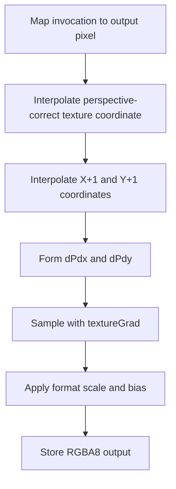

## Overview

**Core question:** Do sampled-image lookups obey the selected dimensional, coordinate, filter, mipmap, address, and cube-edge rules within Vulkan's permitted precision?

- This page covers the `texture.filtering` test family implemented by [`vktTextureFilteringTests.cpp`](../../../modules/vulkan/texture/vktTextureFilteringTests.cpp).
- Five direct families exercise normalized 2D, unnormalized 2D, cube, 2D array, and 3D sampling. The generated matrix varies formats, sizes, filters, address modes, cube-edge behavior, and graphics versus compute execution.
- Each instance prepares a gradient texture and a grid texture, then samples one of them in each of four coordinate cases. Grid colors distinguish mip levels and, where applicable, cube faces or array layers; the single-level `unnormal` family still uses the grid to expose within-level sampling. A precision-aware software verifier checks the rendered image, first with stronger bounds and then with lower accepted bounds.
- The current implementation uses regular image backing. It does not register sparse filtering leaves.

## Background Knowledge

For the shared concepts of sampled-image filtering, coordinates and LOD, and precision-aware verification, see [Background Knowledge](../../categories/texture.md#background-knowledge) of the `texture` page.

- **Coordinate domains.** Normalized coordinates use a zero-to-one domain before conversion to texel coordinates. Unnormalized coordinates use image-space values and require one mip level, equal minification and magnification filters, and restricted address modes. Array layer coordinates remain unnormalized even when the spatial coordinates are normalized.
- **Cube coordinates.** A cube lookup treats its three coordinates as a direction vector. The major axis selects a face, then Vulkan transforms the direction and derivatives into face coordinates. Sampling near an edge can involve adjacent faces when seamless cube filtering is enabled.

## Registration Hierarchy

```text
texture.filtering
├── 2d
├── unnormal
├── cube
├── 2d_array
└── 3d
```

Each family contains matrix branches such as `formats`, `sizes`, and `combinations`. `cube` also contains `no_edges_visible`. Those deeper registered paths are described below rather than expanded in the tree.

## Parameter Dimensions and Observed Values

| Dimension | Registered values | Meaning in this test | Evidence |
|-----------|-------------------|----------------------|----------|
| Direct family | `2d`, `unnormal`, `cube`, `2d_array`, `3d` | Changes coordinate interpretation, image-view dimensionality, generated sampler type, and reference verifier. | [family registration](../../../modules/vulkan/texture/vktTextureFilteringTests.cpp#L1322-L2076) |
| Matrix branch | `formats`, `sizes`, `combinations`; plus `cube.no_edges_visible` | Separates format coverage, extent coverage, sampler-state cross-products, and face-interior cube sampling. | [branch construction](../../../modules/vulkan/texture/vktTextureFilteringTests.cpp#L1327-L1330) and [cube branches](../../../modules/vulkan/texture/vktTextureFilteringTests.cpp#L1567-L1767) |
| 2D minification filter | `nearest`, `linear`, `cubic`, `nearest_mipmap_nearest`, `linear_mipmap_nearest`, `nearest_mipmap_linear`, `linear_mipmap_linear`, `cubic_mipmap_nearest`, `cubic_mipmap_linear` | Varies within-level filtering and nearest or linear selection between mip levels. | [2D filter table](../../../modules/vulkan/texture/vktTextureFilteringTests.cpp#L1236-L1247) |
| Other normalized-family minification filter | `nearest`, `linear`, `nearest_mipmap_nearest`, `linear_mipmap_nearest`, `nearest_mipmap_linear`, `linear_mipmap_linear` | Exercises nearest and linear filtering without cubic extension coverage. | [filter table](../../../modules/vulkan/texture/vktTextureFilteringTests.cpp#L1227-L1234) |
| Magnification filter | 2D: `nearest`, `linear`, `cubic`; other normalized families: `nearest`, `linear` | Selects the filter for negative LOD regions. | [magnification tables](../../../modules/vulkan/texture/vktTextureFilteringTests.cpp#L1234-L1247) |
| Address mode | `repeat`, `mirrored_repeat`, `clamp_to_edge`, `clamp_to_border`, `mirror_clamp_to_edge` | The `combinations` branches vary S/T, and also R for 3D. Format and size branches normally hold these axes at `repeat`; `unnormal` instead chooses edge or border clamp. Cube paths contain registered S/T names, but the cube instance does not use those parameters: both the Vulkan sampler and reference sampler are created with clamp-to-edge. | [address table](../../../modules/vulkan/texture/vktTextureFilteringTests.cpp#L1211-L1219), [cube registration](../../../modules/vulkan/texture/vktTextureFilteringTests.cpp#L1678-L1734), and [cube runtime sampler](../../../modules/vulkan/texture/vktTextureFilteringTests.cpp#L622-L633) |
| Format | `r16g16b16a16_sfloat`, `b10g11r11_ufloat`, `e5b9g9r9_ufloat`, `r8g8b8a8_unorm`, `r8g8b8a8_snorm`, `r5g6b5_unorm`, `r10x6g10x6b10x6a10x6_unorm`, `r4g4b4a4_unorm`, `a4r4g4b4_unorm`, `a4b4g4r4_unorm`, `r5g5b5a1_unorm`, `a8b8g8r8_srgb`, `a1r5g5b5_unorm`, `s8_uint`, `d24_unorm_s8_uint_stencil`, `d32_sfloat_s8_uint_stencil` | Varies sampled conversion, channel precision, floating versus unsigned shader sampling, and stencil-aspect access. | [format table](../../../modules/vulkan/texture/vktTextureFilteringTests.cpp#L1274-L1315) |
| Extent | Size branches: 2D/unnormal: `4x8`, `32x64`, `128x128`, `3x7`, `31x55`, `127x99`; cube: `8x8`, `64x64`, `128x128`, `7x7`, `63x63`; 2D array and 3D: `4x8x8`, `32x64x16`, `128x32x64`, `3x7x5`, `63x63x63`. Controlled format/combination defaults add 2D `64x64`/`63x57`, cube `64x64`/`63x63`, 2D array `128x128x8`/`123x107x7`, and 3D `64x64x64`/`63x57x67`. | Covers power-of-two, non-power-of-two, square, rectangular, layered, and volume dimensions while holding extent fixed outside the size branches. | [size tables](../../../modules/vulkan/texture/vktTextureFilteringTests.cpp#L1249-L1272) and [branch defaults](../../../modules/vulkan/texture/vktTextureFilteringTests.cpp#L1332-L1462) |
| Cube seam behavior | `seamless`, `non_seamless`; `no_edges_visible` uses `nearest` and `linear` leaves | Selects cross-face behavior or confines coordinates to face interiors. | [cube variants](../../../modules/vulkan/texture/vktTextureFilteringTests.cpp#L1316-L1320) and [interior cases](../../../modules/vulkan/texture/vktTextureFilteringTests.cpp#L1736-L1767) |
| Execution route | unsuffixed graphics leaf, `_compute` leaf | Graphics uses the generated fragment lookup. Compute reconstructs coordinates and derivatives; floating normalized programs pass those derivatives to `textureGrad`, while unsigned normalized programs generated for stencil formats retain `texture(...)` and do not consume the calculated gradients. Unnormalized programs use `textureLod(..., 0)` on both routes. | [paired 2D leaves](../../../modules/vulkan/texture/vktTextureFilteringTests.cpp#L1363-L1369) and [lookup generation](../../../modules/vulkan/texture/vktTextureTestUtil.cpp#L473-L507) |

`unnormal` uses only `formats` and `sizes`. It registers `nearest`, `linear`, or `cubic`, keeps minification and magnification equal, disables mipmaps, and selects `clamp_to_edge` or `clamp_to_border` as required by unnormalized-coordinate sampler rules.

## Behavior Parameters

The primary behavioral axis is the direct family under `texture.filtering`. Each value changes the sampling coordinate model and dimensional verification path.

### `2d` - normalized planar filtering

`2d` checks normalized S/T addressing over full mip chains. Its matrix includes cubic filtering, stencil-aspect sampling through unsigned samplers, six extents, sixteen formats, and the full S/T address-mode cross-product. Four coordinate spans cover minification and magnification on gradient and grid textures.

### `unnormal` - image-space 2D coordinates

`unnormal` checks 2D sampling when coordinates are expressed in texel-space units. The generated shader calls `textureLod(..., 0)`, the images have one level, minification equals magnification, and only edge or border clamp modes are selected. This family isolates unnormalized-coordinate conversion and filtering from mip-level selection.

### `cube` - direction, face, and edge filtering

`cube` treats each input as a direction and renders all six faces for every coordinate span. The ordinary branches cross face edges and vary seamless behavior. `no_edges_visible` keeps the sampled region inside each face so nearest and linear filtering can be checked without edge contributions. At runtime the test creates both the Vulkan and software-reference cube samplers with clamp-to-edge and applies the selected seamless flag. Consequently, the S/T address-mode components present in registered `cube.combinations` paths do not change sampling state; those names should not be interpreted as cube wrapping coverage.

### `2d_array` - planar filtering with discrete layer selection

`2d_array` varies normalized S/T coordinates and an unnormalized layer coordinate. Layer-specific gradients and grid colors reveal incorrect layer selection. The coordinate cases include traversal across the layer range, reversed traversal, and values around the 1.5 rounding boundary. Filtering and mip selection operate within the chosen layer rather than blending neighboring layers.

### `3d` - volume filtering and R addressing

`3d` extends normalized filtering to S/T/R coordinates. Its combination matrix varies R independently from S and T, and its coordinate spans create different derivatives along all three texture axes. This exposes errors in volume interpolation, mip choice, or the third address mode.

## Shader Analysis

The representative floating-point `_compute` leaf shows more of that route's normalized floating sampling mechanism than the fragment leaf: it reconstructs the quad coordinate, calculates gradients, and performs the dimensional lookup. The paired graphics leaf uses a generated pass-through vertex shader and a fragment `texture(...)` lookup with implicit derivatives. This representative is not the template substitution used by every format: normalized unsigned programs used for the stencil formats calculate the same local gradients but generate `texture(...)`, not `textureGrad(...)`; unnormalized programs generate `textureLod(..., 0)`.

### Representative Shader Walkthrough 1

#### Parameter Values Chosen

Representative path:

```text
dEQP-VK.texture.filtering.2d.formats.r8g8b8a8_unorm.linear_mipmap_linear_compute
```

| Parameter choice | Meaning in this representative case |
|------------------|-------------------------------------|
| `2d.formats.r8g8b8a8_unorm` | Uses normalized 2D coordinates, a floating-point `sampler2D`, and a complete `64x64` mip chain. |
| `linear_mipmap_linear` | Uses linear filtering inside levels and linear interpolation between neighboring levels. |
| `_compute` | Reconstructs perspective interpolation and explicit gradients before writing the result to an `rgba8` storage image. |

#### Purpose

This shader checks whether a compute pipeline can reproduce the sampled result expected from the configured 2D sampler and quad coordinate field. The grid texture exposes wrong mip choice or mip blending, while the gradient texture exposes coordinate and within-level interpolation errors.

#### Structural Design



#### Shader Code

```glsl
#version 450
layout (local_size_x = 16, local_size_y = 16, local_size_z = 1) in;
layout (set=0, binding=0, std140) uniform Block
{
  highp float u_bias;
  highp float u_ref;
  highp vec2  u_viewSize;
  highp vec4  u_colorScale;
  highp vec4  u_colorBias;
  int u_lod;
};

layout(push_constant) uniform PushConstants {
  ivec2 u_offset;
} pc;

layout (set=0, binding=1) uniform highp sampler2D u_sampler;
layout (set=0, binding=2, rgba8) uniform writeonly image2D u_outputImage;
layout (set=0, binding=3, std430) readonly buffer Geometry
{
  vec4 u_texCoords[4];
  vec4 u_positions[4];
};

// Helper to interpolate at a specific screen coordinate
/// Reproduce perspective-correct interpolation for the two triangles of the quad.
highp vec2 interpolate(vec2 p, ivec2 size)
{
  vec2 uv = (p + 0.5) / vec2(size);

  // Vertices layout in buffer: 0:TL, 1:BL, 2:TR, 3:BR
  float w0 = u_positions[0].w; float w1 = u_positions[1].w;
  float w2 = u_positions[2].w; float w3 = u_positions[3].w;

  // Emulate rasterizer triangle interpolation for perspective correctness
  // Indices: 0:TL, 1:BL, 2:TR, 3:BR
  float b0, b1, b2, b3;
  if (uv.x + uv.y <= 1.0)
  {
    b0 = 1.0 - uv.x - uv.y;
    b1 = uv.y;
    b2 = uv.x;
    b3 = 0.0;
  }
  else
  {
    b0 = 0.0;
    b1 = 1.0 - uv.x;
    b2 = 1.0 - uv.y;
    b3 = uv.x + uv.y - 1.0;
  }

  // Interpolate (TexCoord / W)
  vec2 tc =
      vec2(u_texCoords[0]) * (b0 / w0) +
      vec2(u_texCoords[1]) * (b1 / w1) +
      vec2(u_texCoords[2]) * (b2 / w2) +
      vec2(u_texCoords[3]) * (b3 / w3);

  // Interpolate (1 / W)
  float invW =
      (b0 / w0) + (b1 / w1) + (b2 / w2) + (b3 / w3);

  return vec2(tc / invW);
}

void main (void)
{
  ivec2 coord = ivec2(gl_GlobalInvocationID.xy);
  ivec2 size  = ivec2(u_viewSize);
  if (coord.x >= size.x || coord.y >= size.y)
    return;

  // Calculate Texture Coordinate at Current Pixel
  highp vec2 texCoord = interpolate(vec2(coord), size);
  // Calculate Derivatives (Gradients) for Mipmapping
  // We calculate the coordinate at X+1 and Y+1 to approximate dFdx/dFdy
  highp vec2 texCoordX = interpolate(vec2(coord) + vec2(1.0, 0.0), size);
  highp vec2 texCoordY = interpolate(vec2(coord) + vec2(0.0, 1.0), size);
  highp vec2 dPdx      = texCoordX - texCoord;
  highp vec2 dPdy      = texCoordY - texCoord;

  // Lookup is performed with texture gradients
  // For bias mode, we calculate LOD manually
  /// textureGrad supplies the derivatives that rasterization would provide to a fragment shader.
  vec4 result = textureGrad(u_sampler, texCoord, dPdx, dPdy) * u_colorScale + u_colorBias;
  imageStore(u_outputImage, coord + pc.u_offset, result);
}

```

#### Additional Info

- [`initializePrograms`](../../../modules/vulkan/texture/vktTextureTestUtil.cpp#L245-L331) emits this compute template, and the `PROGRAM_2D_FLOAT` branch selects `sampler2D` plus `textureGrad` for normalized compute sampling.
- The quad geometry buffer stores the same positions and texture coordinates used by the graphics route. The helper uses the two-triangle layout and perspective division to reconstruct per-pixel coordinates.
- The unsuffixed partner uses `texture(u_sampler, texCoord)` in the fragment shader. Rasterization supplies its implicit derivatives, so it does not need the geometry buffer or storage-image write path.

#### Parameter Variation Summary

| Parameter dimension | Shader-level variation from this shader | Evidence |
|---------------------|---------------------------------------|----------|
| Direct family | Changes `vec2`/`vec3` coordinate width, sampler type, reference path, and, for normalized floating compute programs, the dimensional gradient arguments supplied to `textureGrad`. | [generator classification](../../../modules/vulkan/texture/vktTextureTestUtil.cpp#L342-L475) |
| Format | Selects floating or unsigned sampler programs; result conversion still writes RGBA8 for these tests. Unlike this floating representative, a normalized unsigned compute program retains `texture(...)` rather than substituting `textureGrad(...)`. | [format-to-program table](../../../modules/vulkan/texture/vktTextureFilteringTests.cpp#L1274-L1315) and [unsigned lookup generation](../../../modules/vulkan/texture/vktTextureTestUtil.cpp#L490-L507) |
| `unnormal` | Replaces normalized sampling with `textureLod(..., 0)` and disables the gradient lookup requirement. | [lookup selection](../../../modules/vulkan/texture/vktTextureTestUtil.cpp#L416-L487) |
| Graphics versus compute | Graphics uses interpolated fragment input. Compute reconstructs interpolation; for this normalized floating case it calls `textureGrad`. Other program classes use the lookup substitutions described above. | [generated templates](../../../modules/vulkan/texture/vktTextureTestUtil.cpp#L214-L331) and [lookup generation](../../../modules/vulkan/texture/vktTextureTestUtil.cpp#L473-L507) |
| Filter and address modes | Do not change GLSL text. Effective modes change bound sampler state and therefore the result of the same lookup; the registered cube S/T components are the exception because the cube runtime hard-codes clamp-to-edge. | [registered sampler matrix](../../../modules/vulkan/texture/vktTextureFilteringTests.cpp#L1415-L1462) and [cube runtime sampler](../../../modules/vulkan/texture/vktTextureFilteringTests.cpp#L622-L633) |

#### SPIR-V

- Status: generated and validated
- Source: reconstructed `GLSL` from this walkthrough
- Stage: `comp`
- Target SPIRV version: `spirv1.0`

<details>
<summary>Click to expand SPIRV asm code</summary>

```llvm
; SPIR-V
; Version: 1.0
; Generator: Khronos Glslang Reference Front End; 11
; Bound: 255
; Schema: 0
               OpCapability Shader
          %1 = OpExtInstImport "GLSL.std.450"
               OpMemoryModel Logical GLSL450
               OpEntryPoint GLCompute %main "main" %gl_GlobalInvocationID
               OpExecutionMode %main LocalSize 16 16 1
               OpSource GLSL 450
               OpName %main "main"
               OpName %interpolate_vf2_vi2_ "interpolate(vf2;vi2;"
               OpName %p "p"
               OpName %size "size"
               OpName %uv "uv"
               OpName %w0 "w0"
               OpName %Geometry "Geometry"
               OpMemberName %Geometry 0 "u_texCoords"
               OpMemberName %Geometry 1 "u_positions"
               OpName %_ ""
               OpName %w1 "w1"
               OpName %w2 "w2"
               OpName %w3 "w3"
               OpName %b0 "b0"
               OpName %b1 "b1"
               OpName %b2 "b2"
               OpName %b3 "b3"
               OpName %tc "tc"
               OpName %invW "invW"
               OpName %coord "coord"
               OpName %gl_GlobalInvocationID "gl_GlobalInvocationID"
               OpName %size_0 "size"
               OpName %Block "Block"
               OpMemberName %Block 0 "u_bias"
               OpMemberName %Block 1 "u_ref"
               OpMemberName %Block 2 "u_viewSize"
               OpMemberName %Block 3 "u_colorScale"
               OpMemberName %Block 4 "u_colorBias"
               OpMemberName %Block 5 "u_lod"
               OpName %__0 ""
               OpName %texCoord "texCoord"
               OpName %param "param"
               OpName %param_0 "param"
               OpName %texCoordX "texCoordX"
               OpName %param_1 "param"
               OpName %param_2 "param"
               OpName %texCoordY "texCoordY"
               OpName %param_3 "param"
               OpName %param_4 "param"
               OpName %dPdx "dPdx"
               OpName %dPdy "dPdy"
               OpName %result "result"
               OpName %u_sampler "u_sampler"
               OpName %u_outputImage "u_outputImage"
               OpName %PushConstants "PushConstants"
               OpMemberName %PushConstants 0 "u_offset"
               OpName %pc "pc"
               OpDecorate %_arr_v4float_uint_4 ArrayStride 16
               OpDecorate %_arr_v4float_uint_4_0 ArrayStride 16
               OpDecorate %Geometry BufferBlock
               OpMemberDecorate %Geometry 0 NonWritable
               OpMemberDecorate %Geometry 0 Offset 0
               OpMemberDecorate %Geometry 1 NonWritable
               OpMemberDecorate %Geometry 1 Offset 64
               OpDecorate %_ NonWritable
               OpDecorate %_ Binding 3
               OpDecorate %_ DescriptorSet 0
               OpDecorate %gl_GlobalInvocationID BuiltIn GlobalInvocationId
               OpDecorate %Block Block
               OpMemberDecorate %Block 0 Offset 0
               OpMemberDecorate %Block 1 Offset 4
               OpMemberDecorate %Block 2 Offset 8
               OpMemberDecorate %Block 3 Offset 16
               OpMemberDecorate %Block 4 Offset 32
               OpMemberDecorate %Block 5 Offset 48
               OpDecorate %__0 Binding 0
               OpDecorate %__0 DescriptorSet 0
               OpDecorate %u_sampler Binding 1
               OpDecorate %u_sampler DescriptorSet 0
               OpDecorate %u_outputImage NonReadable
               OpDecorate %u_outputImage Binding 2
               OpDecorate %u_outputImage DescriptorSet 0
               OpDecorate %PushConstants Block
               OpMemberDecorate %PushConstants 0 Offset 0
               OpDecorate %gl_WorkGroupSize BuiltIn WorkgroupSize
       %void = OpTypeVoid
          %3 = OpTypeFunction %void
      %float = OpTypeFloat 32
    %v2float = OpTypeVector %float 2
%_ptr_Function_v2float = OpTypePointer Function %v2float
        %int = OpTypeInt 32 1
      %v2int = OpTypeVector %int 2
%_ptr_Function_v2int = OpTypePointer Function %v2int
         %12 = OpTypeFunction %v2float %_ptr_Function_v2float %_ptr_Function_v2int
  %float_0_5 = OpConstant %float 0.5
%_ptr_Function_float = OpTypePointer Function %float
    %v4float = OpTypeVector %float 4
       %uint = OpTypeInt 32 0
     %uint_4 = OpConstant %uint 4
%_arr_v4float_uint_4 = OpTypeArray %v4float %uint_4
%_arr_v4float_uint_4_0 = OpTypeArray %v4float %uint_4
   %Geometry = OpTypeStruct %_arr_v4float_uint_4 %_arr_v4float_uint_4_0
%_ptr_Uniform_Geometry = OpTypePointer Uniform %Geometry
          %_ = OpVariable %_ptr_Uniform_Geometry Uniform
      %int_1 = OpConstant %int 1
      %int_0 = OpConstant %int 0
     %uint_3 = OpConstant %uint 3
%_ptr_Uniform_float = OpTypePointer Uniform %float
      %int_2 = OpConstant %int 2
      %int_3 = OpConstant %int 3
     %uint_0 = OpConstant %uint 0
     %uint_1 = OpConstant %uint 1
    %float_1 = OpConstant %float 1
       %bool = OpTypeBool
    %float_0 = OpConstant %float 0
%_ptr_Uniform_v4float = OpTypePointer Uniform %v4float
     %v3uint = OpTypeVector %uint 3
%_ptr_Input_v3uint = OpTypePointer Input %v3uint
%gl_GlobalInvocationID = OpVariable %_ptr_Input_v3uint Input
     %v2uint = OpTypeVector %uint 2
      %Block = OpTypeStruct %float %float %v2float %v4float %v4float %int
%_ptr_Uniform_Block = OpTypePointer Uniform %Block
        %__0 = OpVariable %_ptr_Uniform_Block Uniform
%_ptr_Uniform_v2float = OpTypePointer Uniform %v2float
%_ptr_Function_int = OpTypePointer Function %int
        %199 = OpConstantComposite %v2float %float_1 %float_0
        %208 = OpConstantComposite %v2float %float_0 %float_1
%_ptr_Function_v4float = OpTypePointer Function %v4float
        %224 = OpTypeImage %float 2D 0 0 0 1 Unknown
        %225 = OpTypeSampledImage %224
%_ptr_UniformConstant_225 = OpTypePointer UniformConstant %225
  %u_sampler = OpVariable %_ptr_UniformConstant_225 UniformConstant
      %int_4 = OpConstant %int 4
        %240 = OpTypeImage %float 2D 0 0 0 2 Rgba8
%_ptr_UniformConstant_240 = OpTypePointer UniformConstant %240
%u_outputImage = OpVariable %_ptr_UniformConstant_240 UniformConstant
%PushConstants = OpTypeStruct %v2int
%_ptr_PushConstant_PushConstants = OpTypePointer PushConstant %PushConstants
         %pc = OpVariable %_ptr_PushConstant_PushConstants PushConstant
%_ptr_PushConstant_v2int = OpTypePointer PushConstant %v2int
    %uint_16 = OpConstant %uint 16
%gl_WorkGroupSize = OpConstantComposite %v3uint %uint_16 %uint_16 %uint_1
       %main = OpFunction %void None %3
          %5 = OpLabel
      %coord = OpVariable %_ptr_Function_v2int Function
     %size_0 = OpVariable %_ptr_Function_v2int Function
   %texCoord = OpVariable %_ptr_Function_v2float Function
      %param = OpVariable %_ptr_Function_v2float Function
    %param_0 = OpVariable %_ptr_Function_v2int Function
  %texCoordX = OpVariable %_ptr_Function_v2float Function
    %param_1 = OpVariable %_ptr_Function_v2float Function
    %param_2 = OpVariable %_ptr_Function_v2int Function
  %texCoordY = OpVariable %_ptr_Function_v2float Function
    %param_3 = OpVariable %_ptr_Function_v2float Function
    %param_4 = OpVariable %_ptr_Function_v2int Function
       %dPdx = OpVariable %_ptr_Function_v2float Function
       %dPdy = OpVariable %_ptr_Function_v2float Function
     %result = OpVariable %_ptr_Function_v4float Function
        %160 = OpLoad %v3uint %gl_GlobalInvocationID
        %161 = OpVectorShuffle %v2uint %160 %160 0 1
        %162 = OpBitcast %v2int %161
               OpStore %coord %162
        %168 = OpAccessChain %_ptr_Uniform_v2float %__0 %int_2
        %169 = OpLoad %v2float %168
        %170 = OpConvertFToS %v2int %169
               OpStore %size_0 %170
        %172 = OpAccessChain %_ptr_Function_int %coord %uint_0
        %173 = OpLoad %int %172
        %174 = OpAccessChain %_ptr_Function_int %size_0 %uint_0
        %175 = OpLoad %int %174
        %176 = OpSGreaterThanEqual %bool %173 %175
        %177 = OpLogicalNot %bool %176
               OpSelectionMerge %179 None
               OpBranchConditional %177 %178 %179
        %178 = OpLabel
        %180 = OpAccessChain %_ptr_Function_int %coord %uint_1
        %181 = OpLoad %int %180
        %182 = OpAccessChain %_ptr_Function_int %size_0 %uint_1
        %183 = OpLoad %int %182
        %184 = OpSGreaterThanEqual %bool %181 %183
               OpBranch %179
        %179 = OpLabel
        %185 = OpPhi %bool %176 %5 %184 %178
               OpSelectionMerge %187 None
               OpBranchConditional %185 %186 %187
        %186 = OpLabel
               OpReturn
        %187 = OpLabel
        %190 = OpLoad %v2int %coord
        %191 = OpConvertSToF %v2float %190
               OpStore %param %191
        %194 = OpLoad %v2int %size_0
               OpStore %param_0 %194
        %195 = OpFunctionCall %v2float %interpolate_vf2_vi2_ %param %param_0
               OpStore %texCoord %195
        %197 = OpLoad %v2int %coord
        %198 = OpConvertSToF %v2float %197
        %200 = OpFAdd %v2float %198 %199
               OpStore %param_1 %200
        %203 = OpLoad %v2int %size_0
               OpStore %param_2 %203
        %204 = OpFunctionCall %v2float %interpolate_vf2_vi2_ %param_1 %param_2
               OpStore %texCoordX %204
        %206 = OpLoad %v2int %coord
        %207 = OpConvertSToF %v2float %206
        %209 = OpFAdd %v2float %207 %208
               OpStore %param_3 %209
        %212 = OpLoad %v2int %size_0
               OpStore %param_4 %212
        %213 = OpFunctionCall %v2float %interpolate_vf2_vi2_ %param_3 %param_4
               OpStore %texCoordY %213
        %215 = OpLoad %v2float %texCoordX
        %216 = OpLoad %v2float %texCoord
        %217 = OpFSub %v2float %215 %216
               OpStore %dPdx %217
        %219 = OpLoad %v2float %texCoordY
        %220 = OpLoad %v2float %texCoord
        %221 = OpFSub %v2float %219 %220
               OpStore %dPdy %221
        %228 = OpLoad %225 %u_sampler
        %229 = OpLoad %v2float %texCoord
        %230 = OpLoad %v2float %dPdx
        %231 = OpLoad %v2float %dPdy
        %232 = OpImageSampleExplicitLod %v4float %228 %229 Grad %230 %231
        %233 = OpAccessChain %_ptr_Uniform_v4float %__0 %int_3
        %234 = OpLoad %v4float %233
        %235 = OpFMul %v4float %232 %234
        %237 = OpAccessChain %_ptr_Uniform_v4float %__0 %int_4
        %238 = OpLoad %v4float %237
        %239 = OpFAdd %v4float %235 %238
               OpStore %result %239
        %243 = OpLoad %240 %u_outputImage
        %244 = OpLoad %v2int %coord
        %249 = OpAccessChain %_ptr_PushConstant_v2int %pc %int_0
        %250 = OpLoad %v2int %249
        %251 = OpIAdd %v2int %244 %250
        %252 = OpLoad %v4float %result
               OpImageWrite %243 %251 %252
               OpReturn
               OpFunctionEnd
%interpolate_vf2_vi2_ = OpFunction %v2float None %12
          %p = OpFunctionParameter %_ptr_Function_v2float
       %size = OpFunctionParameter %_ptr_Function_v2int
         %16 = OpLabel
         %uv = OpVariable %_ptr_Function_v2float Function
         %w0 = OpVariable %_ptr_Function_float Function
         %w1 = OpVariable %_ptr_Function_float Function
         %w2 = OpVariable %_ptr_Function_float Function
         %w3 = OpVariable %_ptr_Function_float Function
         %b0 = OpVariable %_ptr_Function_float Function
         %b1 = OpVariable %_ptr_Function_float Function
         %b2 = OpVariable %_ptr_Function_float Function
         %b3 = OpVariable %_ptr_Function_float Function
         %tc = OpVariable %_ptr_Function_v2float Function
       %invW = OpVariable %_ptr_Function_float Function
         %18 = OpLoad %v2float %p
         %20 = OpCompositeConstruct %v2float %float_0_5 %float_0_5
         %21 = OpFAdd %v2float %18 %20
         %22 = OpLoad %v2int %size
         %23 = OpConvertSToF %v2float %22
         %24 = OpFDiv %v2float %21 %23
               OpStore %uv %24
         %39 = OpAccessChain %_ptr_Uniform_float %_ %int_1 %int_0 %uint_3
         %40 = OpLoad %float %39
               OpStore %w0 %40
         %42 = OpAccessChain %_ptr_Uniform_float %_ %int_1 %int_1 %uint_3
         %43 = OpLoad %float %42
               OpStore %w1 %43
         %46 = OpAccessChain %_ptr_Uniform_float %_ %int_1 %int_2 %uint_3
         %47 = OpLoad %float %46
               OpStore %w2 %47
         %50 = OpAccessChain %_ptr_Uniform_float %_ %int_1 %int_3 %uint_3
         %51 = OpLoad %float %50
               OpStore %w3 %51
         %53 = OpAccessChain %_ptr_Function_float %uv %uint_0
         %54 = OpLoad %float %53
         %56 = OpAccessChain %_ptr_Function_float %uv %uint_1
         %57 = OpLoad %float %56
         %58 = OpFAdd %float %54 %57
         %61 = OpFOrdLessThanEqual %bool %58 %float_1
               OpSelectionMerge %63 None
               OpBranchConditional %61 %62 %79
         %62 = OpLabel
         %65 = OpAccessChain %_ptr_Function_float %uv %uint_0
         %66 = OpLoad %float %65
         %67 = OpFSub %float %float_1 %66
         %68 = OpAccessChain %_ptr_Function_float %uv %uint_1
         %69 = OpLoad %float %68
         %70 = OpFSub %float %67 %69
               OpStore %b0 %70
         %72 = OpAccessChain %_ptr_Function_float %uv %uint_1
         %73 = OpLoad %float %72
               OpStore %b1 %73
         %75 = OpAccessChain %_ptr_Function_float %uv %uint_0
         %76 = OpLoad %float %75
               OpStore %b2 %76
               OpStore %b3 %float_0
               OpBranch %63
         %79 = OpLabel
               OpStore %b0 %float_0
         %80 = OpAccessChain %_ptr_Function_float %uv %uint_0
         %81 = OpLoad %float %80
         %82 = OpFSub %float %float_1 %81
               OpStore %b1 %82
         %83 = OpAccessChain %_ptr_Function_float %uv %uint_1
         %84 = OpLoad %float %83
         %85 = OpFSub %float %float_1 %84
               OpStore %b2 %85
         %86 = OpAccessChain %_ptr_Function_float %uv %uint_0
         %87 = OpLoad %float %86
         %88 = OpAccessChain %_ptr_Function_float %uv %uint_1
         %89 = OpLoad %float %88
         %90 = OpFAdd %float %87 %89
         %91 = OpFSub %float %90 %float_1
               OpStore %b3 %91
               OpBranch %63
         %63 = OpLabel
         %94 = OpAccessChain %_ptr_Uniform_v4float %_ %int_0 %int_0
         %95 = OpLoad %v4float %94
         %96 = OpCompositeExtract %float %95 0
         %97 = OpCompositeExtract %float %95 1
         %98 = OpCompositeConstruct %v2float %96 %97
         %99 = OpLoad %float %b0
        %100 = OpLoad %float %w0
        %101 = OpFDiv %float %99 %100
        %102 = OpVectorTimesScalar %v2float %98 %101
        %103 = OpAccessChain %_ptr_Uniform_v4float %_ %int_0 %int_1
        %104 = OpLoad %v4float %103
        %105 = OpCompositeExtract %float %104 0
        %106 = OpCompositeExtract %float %104 1
        %107 = OpCompositeConstruct %v2float %105 %106
        %108 = OpLoad %float %b1
        %109 = OpLoad %float %w1
        %110 = OpFDiv %float %108 %109
        %111 = OpVectorTimesScalar %v2float %107 %110
        %112 = OpFAdd %v2float %102 %111
        %113 = OpAccessChain %_ptr_Uniform_v4float %_ %int_0 %int_2
        %114 = OpLoad %v4float %113
        %115 = OpCompositeExtract %float %114 0
        %116 = OpCompositeExtract %float %114 1
        %117 = OpCompositeConstruct %v2float %115 %116
        %118 = OpLoad %float %b2
        %119 = OpLoad %float %w2
        %120 = OpFDiv %float %118 %119
        %121 = OpVectorTimesScalar %v2float %117 %120
        %122 = OpFAdd %v2float %112 %121
        %123 = OpAccessChain %_ptr_Uniform_v4float %_ %int_0 %int_3
        %124 = OpLoad %v4float %123
        %125 = OpCompositeExtract %float %124 0
        %126 = OpCompositeExtract %float %124 1
        %127 = OpCompositeConstruct %v2float %125 %126
        %128 = OpLoad %float %b3
        %129 = OpLoad %float %w3
        %130 = OpFDiv %float %128 %129
        %131 = OpVectorTimesScalar %v2float %127 %130
        %132 = OpFAdd %v2float %122 %131
               OpStore %tc %132
        %134 = OpLoad %float %b0
        %135 = OpLoad %float %w0
        %136 = OpFDiv %float %134 %135
        %137 = OpLoad %float %b1
        %138 = OpLoad %float %w1
        %139 = OpFDiv %float %137 %138
        %140 = OpFAdd %float %136 %139
        %141 = OpLoad %float %b2
        %142 = OpLoad %float %w2
        %143 = OpFDiv %float %141 %142
        %144 = OpFAdd %float %140 %143
        %145 = OpLoad %float %b3
        %146 = OpLoad %float %w3
        %147 = OpFDiv %float %145 %146
        %148 = OpFAdd %float %144 %147
               OpStore %invW %148
        %149 = OpLoad %v2float %tc
        %150 = OpLoad %float %invW
        %151 = OpCompositeConstruct %v2float %150 %150
        %152 = OpFDiv %v2float %149 %151
               OpReturnValue %152
               OpFunctionEnd

```

</details>

## Runtime Execution and Result Checking

- The host builds two CPU texture objects for the selected format and dimensionality. The first receives component gradients. The second receives a grid whose colors differ by mip level, cube face, or array layer.
- `TextureRenderer` uploads both textures with regular backing, creates the selected image views and samplers, and chooses a graphics or compute backend from the leaf suffix.
- Every instance prepares four coordinate cases. The 2D, 2D array, and 3D cases derive coordinate spans from requested per-axis LOD values. Cube cases choose face-coordinate rectangles and then render every face.
- A graphics leaf draws a quad into a 64 by 64 result, except cube leaves which use 28 by 28. A compute leaf dispatches the generated compute program and writes the corresponding storage image.
- The host reads the result and calls the overload of `verifyTextureResult` for `Texture2DView`, `TextureCubeView`, `Texture2DArrayView`, or `Texture3DView`. The reference parameters carry sampler state, sampler type, format scale and bias, coordinate mode, cube seam state, and exact LOD mode.
- The first verification uses stronger precision bounds. For 2D, 2D array, and 3D it uses 18 derivative bits, 6 LOD bits, and 20 coordinate bits per used coordinate. The within-level `uvwBits` are `(7,7,0)` for 2D and 2D array and `(7,7,7)` for 3D. Cube uses 10 derivative bits, 5 LOD bits, 10 coordinate bits on all three direction components, and `uvwBits=(6,6,0)` after face projection.
- If the first verification rejects the image, the host retries with 4 LOD bits and `uvwBits=(4,4,0)` for 2D, cube, and 2D array or `(4,4,4)` for 3D. Other precision fields remain unchanged. The case fails with `Image verification failed` only if this lower-precision check also rejects the result.
- In Vulkan SC builds, the verification block executes only when the command line reports subprocess mode. Outside subprocess mode the instance advances without a local image check; the SC harness is therefore expected to obtain the checked result from subprocess execution. A successful checked run advances through all coordinate cases before returning `Pass`.

## Failure Meaning

### Failure Cause Mapping

| If this behavior parameter value fails | Possible failure cause(s) |
|----------------------------------------|---------------------------|
| `2d` | Incorrect 2D coordinate addressing, minification or magnification filtering, mip-level selection or blending, format conversion, stencil sampling, or graphics/compute gradient handling. |
| `unnormal` | Incorrect unnormalized coordinate interpretation, clamp-to-edge or clamp-to-border behavior, single-level filtering, or unnormalized shader lookup handling. |
| `cube` | Incorrect direction-to-face mapping, transformed derivatives, face-edge handling, seamless or non-seamless behavior, or cube sampler filtering. |
| `2d_array` | Incorrect 2D filtering or LOD computation, incorrect unnormalized array-layer selection, or dimensional shader/reference handling. |
| `3d` | Incorrect three-coordinate addressing, R-axis wrapping, trilinear within-level filtering, mip-level selection, or dimensional gradient handling. |

Graphics-only or `_compute`-only failures narrow the likely cause to that pipeline's coordinate interpolation, lookup generation, descriptor layout, shader compilation, output write, or readback route. For normalized floating compute programs, derivative reconstruction is an additional differentiator. Failures shared by both routes point more directly to sampler and image behavior or shared setup and verification inputs.

### Cause Analysis

#### 2D filtering, level selection, or format handling

**Possible failure symptoms:** Pixels from a gradient fall outside the allowed interpolation range, grid colors indicate a wrong mip level or wrong inter-level blend, border regions use the wrong source, or stencil-aspect values fail in one or both execution routes.

**Possible implementation causes:** The implementation may select the wrong minification or magnification filter, calculate or clamp LOD incorrectly, apply the wrong mipmap mode, address S/T incorrectly, convert the sampled format incorrectly, or compile the generated lookup with gradients that do not match the coordinate field. Vulkan defines these operations in the linked sampler and texture chapters.

#### Unnormalized coordinate handling

**Possible failure symptoms:** Samples shift by texels, edge or border regions disagree with the reference, or nearest, linear, or cubic values fail despite the single-level image.

**Possible implementation causes:** The implementation may treat image-space coordinates as normalized, apply an incorrect texel-center convention, mishandle `textureLod(..., 0)`, or apply the wrong clamp operation. The family follows the sampler restrictions for `unnormalizedCoordinates` described in [`samplers.adoc`](../../../../vulkan-docs/src/chapters/samplers.adoc#L122-L140).

#### Cube face and edge handling

**Possible failure symptoms:** One face fails while others pass, failures cluster near face boundaries, `non_seamless` differs incorrectly from `seamless`, or face-interior leaves fail without edge involvement.

**Possible implementation causes:** Direction-to-face selection, face-coordinate transformation, derivative transformation, adjacent-face texel selection, or non-seamless sampler state may be wrong. The face-interior cases help separate basic cube lookup and filtering from edge behavior.

#### Array layer selection

**Possible failure symptoms:** The result uses colors from an adjacent layer, changes incorrectly as the layer coordinate crosses a rounding boundary, or fails only when the layer range runs outside the image view.

**Possible implementation causes:** The implementation may filter the array coordinate, round it incorrectly, or clamp it against the wrong base layer or layer count. Vulkan keeps the array coordinate unnormalized and selects a discrete layer before texel filtering.

#### 3D interpolation or R addressing

**Possible failure symptoms:** Volume gradients or grid transitions fail along depth, failures depend on the registered R address mode, or mip selection differs from the software range when the R derivative changes.

**Possible implementation causes:** The implementation may omit the R derivative from the footprint, apply the wrong R address mode, interpolate the wrong depth neighbors, or use incorrect dimensions in LOD calculation.

#### Pipeline-specific setup, shader, or readback

**Possible failure symptoms:** Only unsuffixed leaves fail, only `_compute` leaves fail, the output contains clear or stale values, or failures occur across unrelated filters and dimensions on one route.

**Possible implementation causes:** The graphics route may provide incorrect interpolants or fragment derivatives. The compute route may reconstruct coordinates incorrectly, generate the wrong dimensional lookup, bind the combined sampler or geometry buffer incorrectly, dispatch the wrong extent, or fail to make storage-image writes visible to readback. For normalized floating programs it may also reconstruct or pass gradients incorrectly. Shared failures can also come from image upload, sampler creation, format scale and bias, or result copyback.

## Case Pruning

### Requirement-based pruning

- Cubic 2D cases require `VK_EXT_filter_cubic`, a `filterCubic` result for the 2D image view, and `VK_FORMAT_FEATURE_SAMPLED_IMAGE_FILTER_CUBIC_BIT_EXT` for optimal tiling.
- 2D, 2D-array, and 3D cases whose effective S/T/R state uses `mirror_clamp_to_edge` require `VK_KHR_sampler_mirror_clamp_to_edge`. The cube filtering specialization neither uses its registered S/T wrap parameters nor performs that extension check.
- `non_seamless` cube cases require `VK_EXT_non_seamless_cube_map` and are unavailable in Vulkan SC.
- Outside Vulkan SC, `VK_FORMAT_R10X6G10X6B10X6A10X6_UNORM_4PACK16` cases require `formatRgba10x6WithoutYCbCrSampler` (the 2D-array check applies when mip levels are present, as they are here). The cube specialization explicitly rejects this format in Vulkan SC; the 2D, 2D-array, and 3D specializations contain no equivalent Vulkan-SC-specific rejection in this source.
- A `_compute` case skips when the required compute queue route is unavailable.

### Design-based pruning

- Integer channel classes are not combined with linear or cubic filtering because the CTS verifier cannot validate those combinations. `verifierCanBeUsed` removes them before registration.
- `unnormal` omits mipmap filters, `combinations`, repeat modes, and differing minification or magnification filters to satisfy unnormalized sampler constraints.
- Cubic filtering is limited to 2D and unnormalized 2D coverage in this source.
- `cube.no_edges_visible` uses only nearest and linear filters because its purpose is to separate face-interior filtering from cube-edge behavior.
- Format and size branches hold unrelated dimensions at controlled defaults. The full sampler cross-products use one fixed format and non-power-of-two extent to keep the matrix bounded.
- No sparse variants are generated by this implementation. Every texture upload uses the default regular backing mode.

## Key Takeaways

- The five direct families separate planar, image-space, directional, layered, and volume coordinate semantics while reusing one render-and-verify design.
- Gradient and level-distinguishing grid textures expose different classes of filtering error across four coordinate footprints.
- Graphics and compute leaves aim at the same image result. Normalized floating compute programs replace fragment implicit derivatives with reconstructed gradients passed to `textureGrad`; unsigned stencil and unnormalized substitutions use different lookup forms as described above.
- A high-precision verification miss is diagnostic, not an immediate conformance failure. The case fails only when the lower accepted precision bounds also reject the image.
- The matrix contains no sparse filtering leaves despite the texture utilities supporting sparse backing elsewhere.

## Source Reference Appendix

| Entry point | Link | Why it matters |
|-------------|------|----------------|
| Texture dispatcher | [`createTextureTests`](../../../modules/vulkan/texture/vktTextureTests.cpp#L48-L66) | Registers `filtering` directly below `texture`. |
| Filtering factory and matrix | [`createTextureFilteringTests` and `populateTextureFilteringTests`](../../../modules/vulkan/texture/vktTextureFilteringTests.cpp#L1207-L2082) | Defines the direct families, matrix values, paired routes, and pruning. |
| 2D instance | [`Texture2DFilteringTestInstance`](../../../modules/vulkan/texture/vktTextureFilteringTests.cpp#L242-L437) | Builds 2D patterns and coordinate cases and applies two-tier verification. |
| Cube instance | [`TextureCubeFilteringTestInstance`](../../../modules/vulkan/texture/vktTextureFilteringTests.cpp#L478-L709) | Traverses faces and applies seamless state and cube precision bounds. |
| 2D array instance | [`Texture2DArrayFilteringTestInstance`](../../../modules/vulkan/texture/vktTextureFilteringTests.cpp#L754-L962) | Varies array layers and verifies through `Texture2DArrayView`. |
| 3D instance | [`Texture3DFilteringTestInstance`](../../../modules/vulkan/texture/vktTextureFilteringTests.cpp#L1005-L1190) | Builds volume patterns and verifies S/T/R sampling. |
| Verifier registration filter | [`verifierCanBeUsed`](../../../modules/vulkan/texture/vktTextureFilteringTests.cpp#L1193-L1203) | Excludes channel/filter combinations the verifier cannot assess. |
| Generated shader templates | [`initializePrograms`](../../../modules/vulkan/texture/vktTextureTestUtil.cpp#L210-L759) | Emits dimensional graphics and compute GLSL. |
| Texture resources and renderer API | [`vktTextureTestUtil.hpp`](../../../modules/vulkan/texture/vktTextureTestUtil.hpp#L143-L255) | Defines regular or sparse backing support and dimensional texture bindings. |
| Software sampler conversion | [`createSampler`](../../../modules/vulkan/texture/vktTextureTestUtil.cpp#L1351-L1391) | Builds the sampler used by the software reference and renderer. |
| Precision-aware verifier | [`verifyTextureResult`](../../../../../framework/opengl/gluTextureTestUtil.cpp#L1735-L2612) | Implements dimensional result verification against allowed lookup and LOD ranges. |
| Mustpass paths | [`texture.txt`](../../../mustpass/main/vk-default/texture.txt#L2233-L9742) | Confirms 7,510 generated filtering leaves, including graphics and compute pairs. |
| Vulkan sampler rules | [`samplers.adoc`](../../../../vulkan-docs/src/chapters/samplers.adoc#L76-L171) | Defines filter, mipmap, address, and coordinate-normalization state. |
| Vulkan sampled-image rules | [`textures.adoc`](../../../../vulkan-docs/src/chapters/textures.adoc#L1315-L1802) | Defines derivatives, cube transformation, LOD, and image-level selection. |
