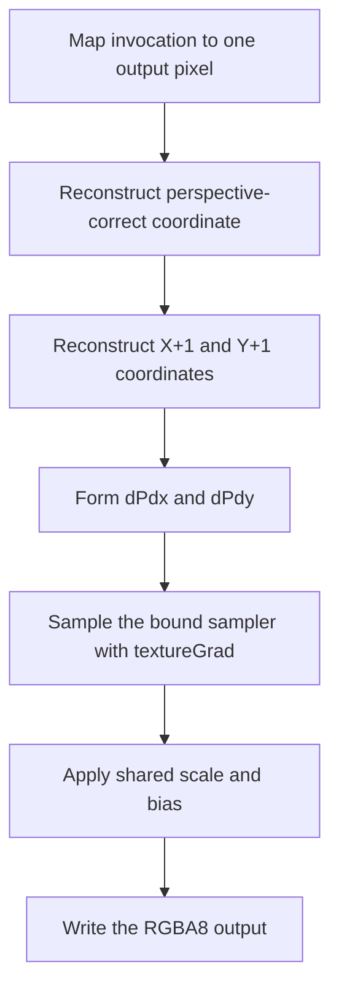

## Overview

**Core question:** When sampler anisotropy is enabled, does an obliquely projected 2D texture stay close to the isotropic result and, where checked, change by a detectable amount in graphics and compute pipelines?

- This page covers the `texture.filtering_anisotropy` test family implemented by [`vktTextureFilteringAnisotropyTests.cpp`](../../../modules/vulkan/texture/vktTextureFilteringAnisotropyTests.cpp).
- Every case renders the same perspective-varying, grid-textured quad twice: once with anisotropy disabled and once with the selected anisotropy enabled.
- The matrix separates level-0, physically single-level, and mipmapped sampling. It also varies anisotropy limits, texel and mipmap filters, and graphics versus compute execution.
- Validation compares the two GPU-produced images. It requires broad similarity and conditionally requires a detectable difference: only the linear/linear leaves in `basic` and `single_level`, but every `mipmap` minification mode paired with linear magnification. The test does not calculate an exact CPU anisotropic reference image.

## Background Knowledge

For the shared concepts of texture coordinates and LOD and precision-aware verification, see [Background Knowledge](../../categories/texture.md#background-knowledge) of the `texture` page.

- **Anisotropic footprints.** An oblique projection can map one screen pixel to an elongated footprint in texture space. Vulkan derives major and minor footprint scales from coordinate derivatives, limits their ratio by `maxAnisotropy` and `maxSamplerAnisotropy`, and may sample more often along the major direction. A ratio of one is isotropic. See the Vulkan [scale-factor and anisotropy calculation](../../../../vulkan-docs/src/chapters/textures.adoc#L1535-L1651).
- **Derivative sources.** A fragment `texture(...)` lookup receives implicit derivatives from rasterization. A compute shader has no fragment derivatives, so the shared texture utility reconstructs perspective-correct neighboring coordinates and passes explicit gradients to `textureGrad(...)`.

## Registration Hierarchy

```text
texture.filtering_anisotropy
├── basic
├── single_level
└── mipmap
```

## Parameter Dimensions and Observed Values

| Dimension | Registered values | Meaning in this test | Evidence |
|-----------|-------------------|----------------------|----------|
| Intermediate node | `basic`, `single_level`, `mipmap` | Chooses the level structure and whether minification can select or blend mip levels. | [family registration](../../../modules/vulkan/texture/vktTextureFilteringAnisotropyTests.cpp#L207-L319) |
| Requested anisotropy | `anisotropy_2`, `anisotropy_4`, `anisotropy_8`, `anisotropy_max` | Requests `2.0`, `4.0`, `8.0`, or `10000.0`; every request is clamped to the smaller of that value and the device limit. | [anisotropy table and clamp](../../../modules/vulkan/texture/vktTextureFilteringAnisotropyTests.cpp#L91-L94) and [names](../../../modules/vulkan/texture/vktTextureFilteringAnisotropyTests.cpp#L213-L217) |
| Minification filter for `basic` and `single_level` | `nearest`, `linear` | Selects nearest or linear filtering while sampling stays at level 0. | [basic matrix](../../../modules/vulkan/texture/vktTextureFilteringAnisotropyTests.cpp#L221-L252) and [single-level matrix](../../../modules/vulkan/texture/vktTextureFilteringAnisotropyTests.cpp#L255-L285) |
| Minification filter for `mipmap` | `nearest_mipmap_nearest`, `nearest_mipmap_linear`, `linear_mipmap_nearest`, `linear_mipmap_linear` | Varies nearest or linear filtering within a level and nearest or linear choice between levels. | [mipmap filter table](../../../modules/vulkan/texture/vktTextureFilteringAnisotropyTests.cpp#L288-L319) |
| Magnification filter | `mag_nearest`, `mag_linear` | Selects nearest or linear texel filtering for magnified regions. | [magnification table](../../../modules/vulkan/texture/vktTextureFilteringAnisotropyTests.cpp#L218-L219) |
| Execution route | unsuffixed graphics leaf, `_compute` leaf | Uses fragment implicit derivatives or compute-generated explicit gradients and storage-image output. | [paired registration](../../../modules/vulkan/texture/vktTextureFilteringAnisotropyTests.cpp#L235-L248) |
| Fixed image state | `128x128`, `VK_FORMAT_R8G8B8A8_UNORM`, clamp-to-edge | Holds extent, format, and address mode constant while the sampler dimensions vary. | [instance setup](../../../modules/vulkan/texture/vktTextureFilteringAnisotropyTests.cpp#L53-L103) |

The source registers 32 `basic`, 32 `single_level`, and 64 `mipmap` leaves, for 128 executable cases. Mustpass entries confirm the three intermediate nodes and every unsuffixed/`_compute` pair in [`texture.txt`](../../../mustpass/main/vk-default/texture.txt#L9743-L9870).

## Behavior Parameters

The primary behavioral axis is the intermediate node directly below `texture.filtering_anisotropy`.

### `basic` - level-0 filtering

`basic` checks anisotropy with `nearest` or `linear` minification and magnification filters while `maxLevel` remains zero. The normal 2D texture object has a complete allocated chain, but the test fills level 0 and the non-mipmap filter state keeps sampling at that level. This setup isolates anisotropy enablement and 2D footprint handling.

### `single_level` - physically single-level image

`single_level` repeats the `basic` filter matrix with a texture object constructed with exactly one mip level. It separates anisotropic sampling of a true single-level image from the normal complete-chain object used by `basic`. The comparison policy and perspective footprint remain unchanged.

### `mipmap` - anisotropic level selection and blending

`mipmap` fills levels 0 through 7 with scaled grids and sets sampler LOD limits to the same range. Its four minification values cross nearest or linear texel filtering with nearest or linear mipmap selection. This extends the check from directional within-level filtering to anisotropy's effect on LOD, level selection, and inter-level blending.

## Shader Analysis

The shader source does not contain an anisotropy instruction. The host changes `VkSamplerCreateInfo::anisotropyEnable` and `maxAnisotropy` between the two executions. The representative compute leaf is useful because it shows how the test supplies the gradients from which Vulkan derives the elongated footprint. The paired graphics leaf uses the generated fragment `texture(...)` path with implicit derivatives.

### Representative Shader Walkthrough 1

#### Parameter Values Chosen

Representative path:

```text
dEQP-VK.texture.filtering_anisotropy.mipmap.anisotropy_max.mag_linear_min_linear_mipmap_linear_compute
```

| Parameter choice | Meaning in this representative case |
|------------------|-------------------------------------|
| `mipmap` | Uses a 128 by 128 RGBA8 texture with filled levels 0 through 7. |
| `anisotropy_max` | Requests `10000.0`, then uses `min(10000.0, maxSamplerAnisotropy)` for the enabled sampler. |
| `mag_linear_min_linear_mipmap_linear` | Uses linear texel filtering and linear interpolation between mip levels. |
| `_compute` | Reconstructs perspective interpolation, supplies explicit gradients, and writes an `rgba8` storage image. |

#### Purpose

The compute shader supplies the coordinate footprint used for both isotropic and anisotropic sampling. The host runs it with two sampler objects, then checks that the enabled result stays close to the isotropic result and differs where the second comparison applies.

#### Structural Design



#### Shader Code

```glsl
#version 450
layout (local_size_x = 16, local_size_y = 16, local_size_z = 1) in;

/// Binding 0 carries the 128 by 128 output size and shared color conversion fields.
layout (set=0, binding=0, std140) uniform Block
{
  highp float u_bias;
  highp float u_ref;
  highp vec2  u_viewSize;
  highp vec4  u_colorScale;
  highp vec4  u_colorBias;
  int u_lod;
};

layout(push_constant) uniform PushConstants {
  ivec2 u_offset;
} pc;

/// Binding 1 is the same sampled image paired first with an isotropic sampler and then with the enabled anisotropic sampler.
layout (set=0, binding=1) uniform highp sampler2D u_sampler;
/// Binding 2 receives the 128 by 128 result that the host reads back.
layout (set=0, binding=2, rgba8) uniform writeonly image2D u_outputImage;
/// Binding 3 stores the four texture coordinates and clip-space positions used to reproduce rasterizer interpolation.
layout (set=0, binding=3, std430) readonly buffer Geometry
{
  vec4 u_texCoords[4];
  vec4 u_positions[4];
};

/// Reproduce perspective-correct interpolation over the renderer's two-triangle quad.
highp vec2 interpolate(vec2 p, ivec2 size)
{
  vec2 uv = (p + 0.5) / vec2(size);

  /// Vertices layout in buffer: 0:TL, 1:BL, 2:TR, 3:BR
  float w0 = u_positions[0].w; float w1 = u_positions[1].w;
  float w2 = u_positions[2].w; float w3 = u_positions[3].w;

  /// Emulate rasterizer triangle interpolation for perspective correctness.
  /// Indices: 0:TL, 1:BL, 2:TR, 3:BR
  float b0, b1, b2, b3;
  if (uv.x + uv.y <= 1.0)
  {
    b0 = 1.0 - uv.x - uv.y;
    b1 = uv.y;
    b2 = uv.x;
    b3 = 0.0;
  }
  else
  {
    b0 = 0.0;
    b1 = 1.0 - uv.x;
    b2 = 1.0 - uv.y;
    b3 = uv.x + uv.y - 1.0;
  }

  /// Interpolate (TexCoord / W).
  vec2 tc =
      vec2(u_texCoords[0]) * (b0 / w0) +
      vec2(u_texCoords[1]) * (b1 / w1) +
      vec2(u_texCoords[2]) * (b2 / w2) +
      vec2(u_texCoords[3]) * (b3 / w3);

  /// Interpolate (1 / W).
  float invW =
      (b0 / w0) + (b1 / w1) + (b2 / w2) + (b3 / w3);

  return vec2(tc / invW);
}

void main (void)
{
  ivec2 coord = ivec2(gl_GlobalInvocationID.xy);
  ivec2 size  = ivec2(u_viewSize);
  if (coord.x >= size.x || coord.y >= size.y)
    return;

  /// Calculate Texture Coordinate at Current Pixel.
  highp vec2 texCoord = interpolate(vec2(coord), size);
  /// Calculate Derivatives (Gradients) for Mipmapping.
  /// We calculate the coordinate at X+1 and Y+1 to approximate dFdx/dFdy.
  highp vec2 texCoordX = interpolate(vec2(coord) + vec2(1.0, 0.0), size);
  highp vec2 texCoordY = interpolate(vec2(coord) + vec2(0.0, 1.0), size);
  highp vec2 dPdx      = texCoordX - texCoord;
  highp vec2 dPdy      = texCoordY - texCoord;

  /// Lookup is performed with texture gradients.
  /// For bias mode, we calculate LOD manually.
  /// The sampler state, not the shader text, decides whether this lookup is isotropic or anisotropic.
  vec4 result = textureGrad(u_sampler, texCoord, dPdx, dPdy) * u_colorScale + u_colorBias;
  imageStore(u_outputImage, coord + pc.u_offset, result);
}
```

#### Additional Info

- The host supplies clip-space W values `3.5` on one side and `1.0` on the other. The interpolation helper uses those values, so the gradient footprint changes across the image.
- The two executions rebuild the frame resources and sampler. Passing `1.0` leaves anisotropy disabled; passing the clamped selected value enables it.

#### Parameter Variation Summary

| Parameter dimension | Shader-level variation from this shader | Evidence |
|---------------------|---------------------------------------|----------|
| Intermediate node | Does not change GLSL. It changes the texture's mip-level allocation, populated levels, and sampler minification state. | [instance texture setup](../../../modules/vulkan/texture/vktTextureFilteringAnisotropyTests.cpp#L113-L130) |
| Requested anisotropy | Does not change GLSL. It changes `anisotropyEnable` and `maxAnisotropy` in the sampler bound at descriptor binding 1. | [compute sampler creation](../../../modules/vulkan/texture/vktTextureTestUtil.cpp#L2647-L2657) |
| Filter values | Do not change GLSL. They change the bound sampler's texel and mipmap filters. | [sampler mapping](../../../framework/vulkan/vkImageUtil.cpp#L4472-L4507) |
| Graphics versus compute | Graphics uses a vertex pass-through and fragment `texture(...)`; compute uses this explicit interpolation and `textureGrad(...)` path. | [shader generator](../../../modules/vulkan/texture/vktTextureTestUtil.cpp#L214-L331) |

#### SPIR-V

- Status: generated and validated
- Source: reconstructed `GLSL` from this walkthrough
- Stage: `comp`
- Target SPIRV version: `spirv1.0`

<details>
<summary>Click to expand SPIRV asm code</summary>

```llvm
; SPIR-V
; Version: 1.0
; Generator: Khronos Glslang Reference Front End; 11
; Bound: 255
; Schema: 0
               OpCapability Shader
          %1 = OpExtInstImport "GLSL.std.450"
               OpMemoryModel Logical GLSL450
               OpEntryPoint GLCompute %main "main" %gl_GlobalInvocationID
               OpExecutionMode %main LocalSize 16 16 1
               OpSource GLSL 450
               OpName %main "main"
               OpName %interpolate_vf2_vi2_ "interpolate(vf2;vi2;"
               OpName %p "p"
               OpName %size "size"
               OpName %uv "uv"
               OpName %w0 "w0"
               OpName %Geometry "Geometry"
               OpMemberName %Geometry 0 "u_texCoords"
               OpMemberName %Geometry 1 "u_positions"
               OpName %_ ""
               OpName %w1 "w1"
               OpName %w2 "w2"
               OpName %w3 "w3"
               OpName %b0 "b0"
               OpName %b1 "b1"
               OpName %b2 "b2"
               OpName %b3 "b3"
               OpName %tc "tc"
               OpName %invW "invW"
               OpName %coord "coord"
               OpName %gl_GlobalInvocationID "gl_GlobalInvocationID"
               OpName %size_0 "size"
               OpName %Block "Block"
               OpMemberName %Block 0 "u_bias"
               OpMemberName %Block 1 "u_ref"
               OpMemberName %Block 2 "u_viewSize"
               OpMemberName %Block 3 "u_colorScale"
               OpMemberName %Block 4 "u_colorBias"
               OpMemberName %Block 5 "u_lod"
               OpName %__0 ""
               OpName %texCoord "texCoord"
               OpName %param "param"
               OpName %param_0 "param"
               OpName %texCoordX "texCoordX"
               OpName %param_1 "param"
               OpName %param_2 "param"
               OpName %texCoordY "texCoordY"
               OpName %param_3 "param"
               OpName %param_4 "param"
               OpName %dPdx "dPdx"
               OpName %dPdy "dPdy"
               OpName %result "result"
               OpName %u_sampler "u_sampler"
               OpName %u_outputImage "u_outputImage"
               OpName %PushConstants "PushConstants"
               OpMemberName %PushConstants 0 "u_offset"
               OpName %pc "pc"
               OpDecorate %_arr_v4float_uint_4 ArrayStride 16
               OpDecorate %_arr_v4float_uint_4_0 ArrayStride 16
               OpDecorate %Geometry BufferBlock
               OpMemberDecorate %Geometry 0 NonWritable
               OpMemberDecorate %Geometry 0 Offset 0
               OpMemberDecorate %Geometry 1 NonWritable
               OpMemberDecorate %Geometry 1 Offset 64
               OpDecorate %_ NonWritable
               OpDecorate %_ Binding 3
               OpDecorate %_ DescriptorSet 0
               OpDecorate %gl_GlobalInvocationID BuiltIn GlobalInvocationId
               OpDecorate %Block Block
               OpMemberDecorate %Block 0 Offset 0
               OpMemberDecorate %Block 1 Offset 4
               OpMemberDecorate %Block 2 Offset 8
               OpMemberDecorate %Block 3 Offset 16
               OpMemberDecorate %Block 4 Offset 32
               OpMemberDecorate %Block 5 Offset 48
               OpDecorate %__0 Binding 0
               OpDecorate %__0 DescriptorSet 0
               OpDecorate %u_sampler Binding 1
               OpDecorate %u_sampler DescriptorSet 0
               OpDecorate %u_outputImage NonReadable
               OpDecorate %u_outputImage Binding 2
               OpDecorate %u_outputImage DescriptorSet 0
               OpDecorate %PushConstants Block
               OpMemberDecorate %PushConstants 0 Offset 0
               OpDecorate %gl_WorkGroupSize BuiltIn WorkgroupSize
       %void = OpTypeVoid
          %3 = OpTypeFunction %void
      %float = OpTypeFloat 32
    %v2float = OpTypeVector %float 2
%_ptr_Function_v2float = OpTypePointer Function %v2float
        %int = OpTypeInt 32 1
      %v2int = OpTypeVector %int 2
%_ptr_Function_v2int = OpTypePointer Function %v2int
         %12 = OpTypeFunction %v2float %_ptr_Function_v2float %_ptr_Function_v2int
  %float_0_5 = OpConstant %float 0.5
%_ptr_Function_float = OpTypePointer Function %float
    %v4float = OpTypeVector %float 4
       %uint = OpTypeInt 32 0
     %uint_4 = OpConstant %uint 4
%_arr_v4float_uint_4 = OpTypeArray %v4float %uint_4
%_arr_v4float_uint_4_0 = OpTypeArray %v4float %uint_4
   %Geometry = OpTypeStruct %_arr_v4float_uint_4 %_arr_v4float_uint_4_0
%_ptr_Uniform_Geometry = OpTypePointer Uniform %Geometry
          %_ = OpVariable %_ptr_Uniform_Geometry Uniform
      %int_1 = OpConstant %int 1
      %int_0 = OpConstant %int 0
     %uint_3 = OpConstant %uint 3
%_ptr_Uniform_float = OpTypePointer Uniform %float
      %int_2 = OpConstant %int 2
      %int_3 = OpConstant %int 3
     %uint_0 = OpConstant %uint 0
     %uint_1 = OpConstant %uint 1
    %float_1 = OpConstant %float 1
       %bool = OpTypeBool
    %float_0 = OpConstant %float 0
%_ptr_Uniform_v4float = OpTypePointer Uniform %v4float
     %v3uint = OpTypeVector %uint 3
%_ptr_Input_v3uint = OpTypePointer Input %v3uint
%gl_GlobalInvocationID = OpVariable %_ptr_Input_v3uint Input
     %v2uint = OpTypeVector %uint 2
      %Block = OpTypeStruct %float %float %v2float %v4float %v4float %int
%_ptr_Uniform_Block = OpTypePointer Uniform %Block
        %__0 = OpVariable %_ptr_Uniform_Block Uniform
%_ptr_Uniform_v2float = OpTypePointer Uniform %v2float
%_ptr_Function_int = OpTypePointer Function %int
        %199 = OpConstantComposite %v2float %float_1 %float_0
        %208 = OpConstantComposite %v2float %float_0 %float_1
%_ptr_Function_v4float = OpTypePointer Function %v4float
        %224 = OpTypeImage %float 2D 0 0 0 1 Unknown
        %225 = OpTypeSampledImage %224
%_ptr_UniformConstant_225 = OpTypePointer UniformConstant %225
  %u_sampler = OpVariable %_ptr_UniformConstant_225 UniformConstant
      %int_4 = OpConstant %int 4
        %240 = OpTypeImage %float 2D 0 0 0 2 Rgba8
%_ptr_UniformConstant_240 = OpTypePointer UniformConstant %240
%u_outputImage = OpVariable %_ptr_UniformConstant_240 UniformConstant
%PushConstants = OpTypeStruct %v2int
%_ptr_PushConstant_PushConstants = OpTypePointer PushConstant %PushConstants
         %pc = OpVariable %_ptr_PushConstant_PushConstants PushConstant
%_ptr_PushConstant_v2int = OpTypePointer PushConstant %v2int
    %uint_16 = OpConstant %uint 16
%gl_WorkGroupSize = OpConstantComposite %v3uint %uint_16 %uint_16 %uint_1
       %main = OpFunction %void None %3
          %5 = OpLabel
      %coord = OpVariable %_ptr_Function_v2int Function
     %size_0 = OpVariable %_ptr_Function_v2int Function
   %texCoord = OpVariable %_ptr_Function_v2float Function
      %param = OpVariable %_ptr_Function_v2float Function
    %param_0 = OpVariable %_ptr_Function_v2int Function
  %texCoordX = OpVariable %_ptr_Function_v2float Function
    %param_1 = OpVariable %_ptr_Function_v2float Function
    %param_2 = OpVariable %_ptr_Function_v2int Function
  %texCoordY = OpVariable %_ptr_Function_v2float Function
    %param_3 = OpVariable %_ptr_Function_v2float Function
    %param_4 = OpVariable %_ptr_Function_v2int Function
       %dPdx = OpVariable %_ptr_Function_v2float Function
       %dPdy = OpVariable %_ptr_Function_v2float Function
     %result = OpVariable %_ptr_Function_v4float Function
        %160 = OpLoad %v3uint %gl_GlobalInvocationID
        %161 = OpVectorShuffle %v2uint %160 %160 0 1
        %162 = OpBitcast %v2int %161
               OpStore %coord %162
        %168 = OpAccessChain %_ptr_Uniform_v2float %__0 %int_2
        %169 = OpLoad %v2float %168
        %170 = OpConvertFToS %v2int %169
               OpStore %size_0 %170
        %172 = OpAccessChain %_ptr_Function_int %coord %uint_0
        %173 = OpLoad %int %172
        %174 = OpAccessChain %_ptr_Function_int %size_0 %uint_0
        %175 = OpLoad %int %174
        %176 = OpSGreaterThanEqual %bool %173 %175
        %177 = OpLogicalNot %bool %176
               OpSelectionMerge %179 None
               OpBranchConditional %177 %178 %179
        %178 = OpLabel
        %180 = OpAccessChain %_ptr_Function_int %coord %uint_1
        %181 = OpLoad %int %180
        %182 = OpAccessChain %_ptr_Function_int %size_0 %uint_1
        %183 = OpLoad %int %182
        %184 = OpSGreaterThanEqual %bool %181 %183
               OpBranch %179
        %179 = OpLabel
        %185 = OpPhi %bool %176 %5 %184 %178
               OpSelectionMerge %187 None
               OpBranchConditional %185 %186 %187
        %186 = OpLabel
               OpReturn
        %187 = OpLabel
        %190 = OpLoad %v2int %coord
        %191 = OpConvertSToF %v2float %190
               OpStore %param %191
        %194 = OpLoad %v2int %size_0
               OpStore %param_0 %194
        %195 = OpFunctionCall %v2float %interpolate_vf2_vi2_ %param %param_0
               OpStore %texCoord %195
        %197 = OpLoad %v2int %coord
        %198 = OpConvertSToF %v2float %197
        %200 = OpFAdd %v2float %198 %199
               OpStore %param_1 %200
        %203 = OpLoad %v2int %size_0
               OpStore %param_2 %203
        %204 = OpFunctionCall %v2float %interpolate_vf2_vi2_ %param_1 %param_2
               OpStore %texCoordX %204
        %206 = OpLoad %v2int %coord
        %207 = OpConvertSToF %v2float %206
        %209 = OpFAdd %v2float %207 %208
               OpStore %param_3 %209
        %212 = OpLoad %v2int %size_0
               OpStore %param_4 %212
        %213 = OpFunctionCall %v2float %interpolate_vf2_vi2_ %param_3 %param_4
               OpStore %texCoordY %213
        %215 = OpLoad %v2float %texCoordX
        %216 = OpLoad %v2float %texCoord
        %217 = OpFSub %v2float %215 %216
               OpStore %dPdx %217
        %219 = OpLoad %v2float %texCoordY
        %220 = OpLoad %v2float %texCoord
        %221 = OpFSub %v2float %219 %220
               OpStore %dPdy %221
        %228 = OpLoad %225 %u_sampler
        %229 = OpLoad %v2float %texCoord
        %230 = OpLoad %v2float %dPdx
        %231 = OpLoad %v2float %dPdy
        %232 = OpImageSampleExplicitLod %v4float %228 %229 Grad %230 %231
        %233 = OpAccessChain %_ptr_Uniform_v4float %__0 %int_3
        %234 = OpLoad %v4float %233
        %235 = OpFMul %v4float %232 %234
        %237 = OpAccessChain %_ptr_Uniform_v4float %__0 %int_4
        %238 = OpLoad %v4float %237
        %239 = OpFAdd %v4float %235 %238
               OpStore %result %239
        %243 = OpLoad %240 %u_outputImage
        %244 = OpLoad %v2int %coord
        %249 = OpAccessChain %_ptr_PushConstant_v2int %pc %int_0
        %250 = OpLoad %v2int %249
        %251 = OpIAdd %v2int %244 %250
        %252 = OpLoad %v4float %result
               OpImageWrite %243 %251 %252
               OpReturn
               OpFunctionEnd
%interpolate_vf2_vi2_ = OpFunction %v2float None %12
          %p = OpFunctionParameter %_ptr_Function_v2float
       %size = OpFunctionParameter %_ptr_Function_v2int
         %16 = OpLabel
         %uv = OpVariable %_ptr_Function_v2float Function
         %w0 = OpVariable %_ptr_Function_float Function
         %w1 = OpVariable %_ptr_Function_float Function
         %w2 = OpVariable %_ptr_Function_float Function
         %w3 = OpVariable %_ptr_Function_float Function
         %b0 = OpVariable %_ptr_Function_float Function
         %b1 = OpVariable %_ptr_Function_float Function
         %b2 = OpVariable %_ptr_Function_float Function
         %b3 = OpVariable %_ptr_Function_float Function
         %tc = OpVariable %_ptr_Function_v2float Function
       %invW = OpVariable %_ptr_Function_float Function
         %18 = OpLoad %v2float %p
         %20 = OpCompositeConstruct %v2float %float_0_5 %float_0_5
         %21 = OpFAdd %v2float %18 %20
         %22 = OpLoad %v2int %size
         %23 = OpConvertSToF %v2float %22
         %24 = OpFDiv %v2float %21 %23
               OpStore %uv %24
         %39 = OpAccessChain %_ptr_Uniform_float %_ %int_1 %int_0 %uint_3
         %40 = OpLoad %float %39
               OpStore %w0 %40
         %42 = OpAccessChain %_ptr_Uniform_float %_ %int_1 %int_1 %uint_3
         %43 = OpLoad %float %42
               OpStore %w1 %43
         %46 = OpAccessChain %_ptr_Uniform_float %_ %int_1 %int_2 %uint_3
         %47 = OpLoad %float %46
               OpStore %w2 %47
         %50 = OpAccessChain %_ptr_Uniform_float %_ %int_1 %int_3 %uint_3
         %51 = OpLoad %float %50
               OpStore %w3 %51
         %53 = OpAccessChain %_ptr_Function_float %uv %uint_0
         %54 = OpLoad %float %53
         %56 = OpAccessChain %_ptr_Function_float %uv %uint_1
         %57 = OpLoad %float %56
         %58 = OpFAdd %float %54 %57
         %61 = OpFOrdLessThanEqual %bool %58 %float_1
               OpSelectionMerge %63 None
               OpBranchConditional %61 %62 %79
         %62 = OpLabel
         %65 = OpAccessChain %_ptr_Function_float %uv %uint_0
         %66 = OpLoad %float %65
         %67 = OpFSub %float %float_1 %66
         %68 = OpAccessChain %_ptr_Function_float %uv %uint_1
         %69 = OpLoad %float %68
         %70 = OpFSub %float %67 %69
               OpStore %b0 %70
         %72 = OpAccessChain %_ptr_Function_float %uv %uint_1
         %73 = OpLoad %float %72
               OpStore %b1 %73
         %75 = OpAccessChain %_ptr_Function_float %uv %uint_0
         %76 = OpLoad %float %75
               OpStore %b2 %76
               OpStore %b3 %float_0
               OpBranch %63
         %79 = OpLabel
               OpStore %b0 %float_0
         %80 = OpAccessChain %_ptr_Function_float %uv %uint_0
         %81 = OpLoad %float %80
         %82 = OpFSub %float %float_1 %81
               OpStore %b1 %82
         %83 = OpAccessChain %_ptr_Function_float %uv %uint_1
         %84 = OpLoad %float %83
         %85 = OpFSub %float %float_1 %84
               OpStore %b2 %85
         %86 = OpAccessChain %_ptr_Function_float %uv %uint_0
         %87 = OpLoad %float %86
         %88 = OpAccessChain %_ptr_Function_float %uv %uint_1
         %89 = OpLoad %float %88
         %90 = OpFAdd %float %87 %89
         %91 = OpFSub %float %90 %float_1
               OpStore %b3 %91
               OpBranch %63
         %63 = OpLabel
         %94 = OpAccessChain %_ptr_Uniform_v4float %_ %int_0 %int_0
         %95 = OpLoad %v4float %94
         %96 = OpCompositeExtract %float %95 0
         %97 = OpCompositeExtract %float %95 1
         %98 = OpCompositeConstruct %v2float %96 %97
         %99 = OpLoad %float %b0
        %100 = OpLoad %float %w0
        %101 = OpFDiv %float %99 %100
        %102 = OpVectorTimesScalar %v2float %98 %101
        %103 = OpAccessChain %_ptr_Uniform_v4float %_ %int_0 %int_1
        %104 = OpLoad %v4float %103
        %105 = OpCompositeExtract %float %104 0
        %106 = OpCompositeExtract %float %104 1
        %107 = OpCompositeConstruct %v2float %105 %106
        %108 = OpLoad %float %b1
        %109 = OpLoad %float %w1
        %110 = OpFDiv %float %108 %109
        %111 = OpVectorTimesScalar %v2float %107 %110
        %112 = OpFAdd %v2float %102 %111
        %113 = OpAccessChain %_ptr_Uniform_v4float %_ %int_0 %int_2
        %114 = OpLoad %v4float %113
        %115 = OpCompositeExtract %float %114 0
        %116 = OpCompositeExtract %float %114 1
        %117 = OpCompositeConstruct %v2float %115 %116
        %118 = OpLoad %float %b2
        %119 = OpLoad %float %w2
        %120 = OpFDiv %float %118 %119
        %121 = OpVectorTimesScalar %v2float %117 %120
        %122 = OpFAdd %v2float %112 %121
        %123 = OpAccessChain %_ptr_Uniform_v4float %_ %int_0 %int_3
        %124 = OpLoad %v4float %123
        %125 = OpCompositeExtract %float %124 0
        %126 = OpCompositeExtract %float %124 1
        %127 = OpCompositeConstruct %v2float %125 %126
        %128 = OpLoad %float %b3
        %129 = OpLoad %float %w3
        %130 = OpFDiv %float %128 %129
        %131 = OpVectorTimesScalar %v2float %127 %130
        %132 = OpFAdd %v2float %122 %131
               OpStore %tc %132
        %134 = OpLoad %float %b0
        %135 = OpLoad %float %w0
        %136 = OpFDiv %float %134 %135
        %137 = OpLoad %float %b1
        %138 = OpLoad %float %w1
        %139 = OpFDiv %float %137 %138
        %140 = OpFAdd %float %136 %139
        %141 = OpLoad %float %b2
        %142 = OpLoad %float %w2
        %143 = OpFDiv %float %141 %142
        %144 = OpFAdd %float %140 %143
        %145 = OpLoad %float %b3
        %146 = OpLoad %float %w3
        %147 = OpFDiv %float %145 %146
        %148 = OpFAdd %float %144 %147
               OpStore %invW %148
        %149 = OpLoad %v2float %tc
        %150 = OpLoad %float %invW
        %151 = OpCompositeConstruct %v2float %150 %150
        %152 = OpFDiv %v2float %149 %151
               OpReturnValue %152
               OpFunctionEnd
```

</details>

## Runtime Execution and Result Checking

- The instance creates one `TextureRenderer` for a 128 by 128 RGBA8 result. Its `useCompute` flag selects `GraphicsBackend` or `ComputeBackend`.
- The host creates a `VK_FORMAT_R8G8B8A8_UNORM` 2D texture. `single_level` requests one mip level explicitly. `mipmap` fills levels 0 through 7; the other intermediate nodes fill level 0.
- Every populated level receives a black-and-white grid with cells sized to one eighth of that level's height, with a minimum cell size of one texel.
- The quad spans clip-space X from `-3.5` to `+3.5`. Its W component is `3.5` on two vertices and `1.0` on the other two. Full-range texture coordinates are interpolated across that projection.
- The renderer executes twice. The first call passes `1.0`, so the utility leaves Vulkan anisotropy disabled. The second passes the selected, device-clamped value, so the utility enables anisotropy.
- Each execution uploads or binds the required resources, submits the draw or dispatch, waits for completion, and copies the result into a host `Surface`.
- The first comparison uses `tcu::fuzzyCompare` with threshold `0.05`. Failure means the enabled result differs too much from the disabled result.
- If the stored `minFilter` and `magFilter` enums are both different from plain `NEAREST`, `floatThresholdCompare` with `Vec4(0.02f)` must return false. Thus the check applies only to linear/linear `basic` and `single_level` leaves, but to every `mipmap` minification mode when magnification is linear: mipmapped filter enums such as `NEAREST_MIPMAP_NEAREST` are not equal to plain `NEAREST`. A false comparison means at least one component of at least one pixel differs by more than `0.02`; if every component remains within the threshold, the case fails.
- The source explicitly treats this second condition as a useful diagnostic rather than a specification guarantee. Vulkan does not require anisotropic and isotropic linear filtering to produce visibly different images.

## Failure Meaning

### Failure Cause Mapping

| If this behavior parameter value fails | Possible failure cause(s) |
|----------------------------------------|---------------------------|
| `basic` | Incorrect anisotropy enablement or clamping, 2D footprint handling, nearest or linear texel filtering, or graphics/compute execution with sampling restricted to level 0. |
| `single_level` | Incorrect anisotropic sampling of a physically single-level image, single-level image/view setup, or graphics/compute handling for that image shape. |
| `mipmap` | Incorrect anisotropic footprint-to-LOD handling, mip-level selection or blending, mip-chain sampling, or graphics/compute gradient handling. |

Failures shared by all three values can also come from grid upload, sampler creation, the shared perspective quad, readback, or comparison handling. A graphics-only or `_compute`-only pattern narrows investigation to the corresponding pipeline route.

### Cause Analysis

#### Anisotropy enablement, clamping, or footprint handling

**Possible failure symptoms:** The enabled image may remain equal to the disabled image within `0.02` for a combination subject to the distinction check, or the two images may differ enough to fail the `0.05` fuzzy comparison across one or more intermediate nodes.

**Possible implementation causes:** Sampler creation may fail to honor `anisotropyEnable`, use the wrong effective maximum, or apply an invalid footprint ratio or sampling pattern. Vulkan defines the effective limit as the minimum of sampler `maxAnisotropy` and `maxSamplerAnisotropy`, and permits implementation-dependent approximations within its anisotropy rules.

#### Single-level image or mip-chain handling

**Possible failure symptoms:** `single_level` may fail while `basic` passes, or failures may appear only in `mipmap` and depend on the registered mipmap mode.

**Possible implementation causes:** A `single_level`-only failure can come from image creation, view setup, or sampler behavior that incorrectly assumes more levels exist. A `mipmap`-only failure can come from incorrect anisotropic LOD calculation, level clamping, nearest level selection, or linear blending between adjacent mip levels.

#### Graphics or compute derivative and output path

**Possible failure symptoms:** Only unsuffixed graphics leaves fail, only `_compute` leaves fail, or one route produces clear, stale, or spatially distorted output across otherwise unrelated filter combinations.

**Possible implementation causes:** The graphics route may produce incorrect perspective interpolation or implicit derivatives. The compute route may reconstruct coordinates or gradients incorrectly, bind the sampler or geometry buffer incorrectly, dispatch the wrong extent, or mishandle storage-image write visibility and readback. Shared failures point instead to common texture upload, sampler state, or comparison inputs.

#### Comparison-specific diagnostic outcome

**Possible failure symptoms:** A case subject to the distinction check fails only because enabled and disabled images remain equal within `0.02`, even though no large visual error appears.

**Possible implementation causes:** The anisotropic sampler may have been left disabled or ignored. The source also acknowledges that a conformant implementation need not make anisotropic and bilinear filtering differ, so this symptom alone does not identify a specific Vulkan rule violation. It records the intended CTS diagnostic policy for this family and needs source-level investigation before assigning a driver defect.

## Case Pruning

### Requirement-based pruning

- Every case requires the `samplerAnisotropy` device feature. `checkSupport` raises `NotSupportedError` when the feature is unavailable.
- `anisotropy_max` uses the smaller of `10000.0` and `VkPhysicalDeviceLimits::maxSamplerAnisotropy`; the test never exceeds either value.
- Linear filter combinations require `VK_FORMAT_FEATURE_SAMPLED_IMAGE_FILTER_LINEAR_BIT` for the fixed RGBA8 format. The shared renderer checks this before sampler creation.
- A `_compute` leaf skips if the shared utility cannot obtain its compute queue route.

### Design-based pruning

- The source fixes texture type, format, extent, address mode, component mapping, sample count, and normalized coordinates. The matrix targets anisotropy, filter state, level structure, and execution route rather than general format or addressing coverage.
- `basic` and `single_level` omit mipmap filter values because both test behaviors keep sampling at level 0.
- The source omits the detectable-difference check when either stored filter enum is plain `NEAREST`. For `basic` and `single_level`, this leaves only the linear/linear pair. Every mipmapped minification enum differs from plain `NEAREST`, even when its within-level filter is nearest, so `mipmap` omits the check only when magnification is `mag_nearest`.
- The implementation registers no sparse image variants.

## Key Takeaways

- Each leaf compares the same GPU path with anisotropy disabled and enabled, which isolates sampler state but does not provide an exact anisotropic reference.
- `basic`, `single_level`, and `mipmap` distinguish level-0 filtering, a physically single-level image, and full anisotropic mipmap behavior.
- The graphics and compute leaves use different derivative and output mechanisms while testing the same sampler comparison policy.
- The `0.05` fuzzy check limits overall divergence. The conditional `0.02` check looks for evidence that anisotropy changed the output, but the source does not present that difference as a Vulkan requirement.
- Failure diagnosis must account for this comparison policy, especially when only the diagnostic difference check fails.

## Source Reference Appendix

| Entry point | Link | Why it matters |
|-------------|------|----------------|
| Texture dispatcher | [`createTextureTests`](../../../modules/vulkan/texture/vktTextureTests.cpp#L48-L66) | Registers `filtering_anisotropy` directly below `texture`. |
| Parameters and instance setup | [`AnisotropyParams` and `FilteringAnisotropyInstance`](../../../modules/vulkan/texture/vktTextureFilteringAnisotropyTests.cpp#L55-L104) | Defines filters, level behavior, execution route, and device-limit clamping. |
| Render and comparison flow | [`FilteringAnisotropyInstance::iterate`](../../../modules/vulkan/texture/vktTextureFilteringAnisotropyTests.cpp#L106-L166) | Builds patterns, executes both sampler states, and decides pass or fail. |
| Feature support | [`FilteringAnisotropyTests::checkSupport`](../../../modules/vulkan/texture/vktTextureFilteringAnisotropyTests.cpp#L193-L199) | Requires `samplerAnisotropy`. |
| Registered matrix | [`createFilteringAnisotropyTests`](../../../modules/vulkan/texture/vktTextureFilteringAnisotropyTests.cpp#L207-L322) | Defines the hierarchy, 128 leaves, and graphics/compute pairs. |
| Shader generator | [`initializePrograms`](../../../modules/vulkan/texture/vktTextureTestUtil.cpp#L210-L759) | Generates the 2D graphics and compute GLSL paths. |
| Renderer selection and readback | [`TextureRenderer`](../../../modules/vulkan/texture/vktTextureTestUtil.cpp#L1023-L1053) and [`renderQuad`](../../../modules/vulkan/texture/vktTextureTestUtil.cpp#L1079-L1337) | Selects the backend, builds frame resources, submits, and reads the output. |
| Graphics sampler state | [`GraphicsBackend::createFrameResources`](../../../modules/vulkan/texture/vktTextureTestUtil.cpp#L2212-L2330) | Enables anisotropy only when the renderer argument exceeds one. |
| Compute sampler state | [`ComputeBackend::createFrameResources`](../../../modules/vulkan/texture/vktTextureTestUtil.cpp#L2611-L2677) | Applies the same sampler rule to the compute route. |
| Base Vulkan sampler mapping | [`mapSampler`](../../../framework/vulkan/vkImageUtil.cpp#L4472-L4509) | Maps CTS filters, mipmap mode, LOD limits, and initial disabled anisotropy state. |
| Image comparison utilities | [`tcuImageCompare.cpp`](../../../../../framework/common/tcuImageCompare.cpp#L224-L244) | Implements the fuzzy comparison used for the first condition. |
| Mustpass paths | [`texture.txt`](../../../mustpass/main/vk-default/texture.txt#L9743-L9870) | Confirms registered `basic`, `mipmap`, and `single_level` leaves. |
| Vulkan anisotropy calculation | [`textures.adoc`](../../../../vulkan-docs/src/chapters/textures.adoc#L1535-L1651) | Defines footprint scales, effective anisotropy, and permitted approximation. |
| Sampler anisotropy state and validity | [`samplers.adoc`](../../../../vulkan-docs/src/chapters/samplers.adoc#L99-L106) and [`samplers.adoc`](../../../../vulkan-docs/src/chapters/samplers.adoc#L234-L240) | Defines sampler fields, feature dependence, and the valid anisotropy range. |
| Device anisotropy limit | [`limits.adoc`](../../../../vulkan-docs/src/chapters/limits.adoc#L562-L567) | Defines `maxSamplerAnisotropy` and the effective clamp. |
