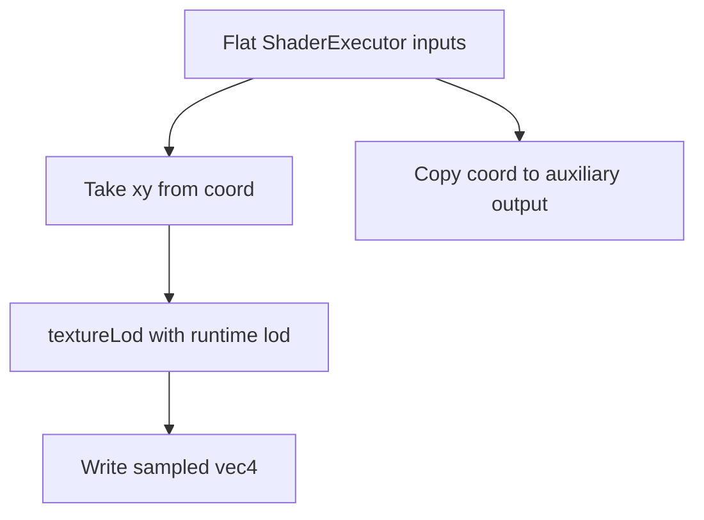
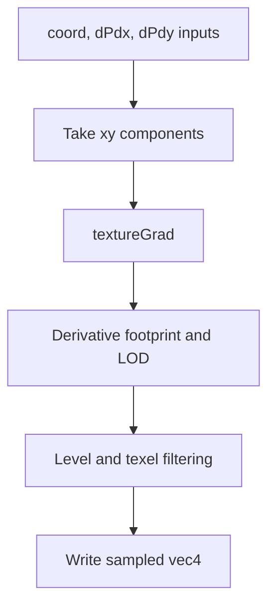

## Overview

**Core question:** Do explicit LOD and explicit gradient operations produce a permitted filtered sample for every tested coordinate and sampler configuration?

- This page covers the `texture.explicit_lod` test family implemented by `vktTextureFilteringExplicitLodTests.cpp`.
- Every case samples a generated 2D mip chain with either `textureLod` or `textureGrad`, through a graphics or compute ShaderExecutor.
- In normal execution (and Vulkan SC subprocess mode), the host checks every returned sample against mathematical intervals that account for Vulkan's permitted coordinate, mipmap, format-conversion, and filtering precision. Vulkan SC's main process intentionally skips this costly verification.
- The family varies image dimensions, sampled formats, sampler filtering and addressing, and the operation used to control LOD.

## Background Knowledge

For the shared concepts of texture coordinates and LOD and precision-aware verification, see [Background Knowledge](../../categories/texture.md#background-knowledge) of the `texture` page.

- **Explicit LOD and explicit gradients:** `textureLod` supplies the LOD directly. `textureGrad` supplies coordinate derivatives, from which the implementation computes a texture footprint and LOD. Both paths then use the sampler's level-selection and filtering rules.
- **Permitted result intervals:** Vulkan quantizes sub-texel positions according to `subTexelPrecisionBits` and mipmap interpolation according to `mipmapPrecisionBits`. Format conversion and filtering also have finite precision. A conformant sample can therefore belong to a bounded interval rather than equal one ideal floating-point value.

The Vulkan specification defines these rules in [Scale Factor Operation, LOD Operation and Image Level(s) Selection](../../../../vulkan-docs/src/chapters/textures.adoc#L1525-L1802). The precision limits are described in [Physical Device Limits](../../../../vulkan-docs/src/chapters/limits.adoc#L534-L545).

## Registration Hierarchy

```text
texture.explicit_lod
└── 2d
```

The `2d` intermediate node contains `sizes`, `formats`, and `derivatives`. Those deeper descendants define the primary behavioral axis and are described below. The texture dispatcher attaches `explicit_lod` directly under the [`texture` test category](../../../modules/vulkan/texture/vktTextureTests.cpp#L46-L69).

## Parameter Dimensions and Observed Values

| Dimension | Registered values | Meaning in this test | Evidence |
|-----------|-------------------|----------------------|----------|
| Behavioral intermediate node | `sizes`, `formats`, `derivatives` | Selects whether the matrix stresses dimensions and sampler state, texel formats, or derivative-to-LOD calculation. | [`create2DTests`](../../../modules/vulkan/texture/vktTextureFilteringExplicitLodTests.cpp#L1398-L1406) |
| Image size | `2x2`, `2x3`, `3x7`, `4x8`, `31x55`, `32x32`, `32x64`, `57x35`, `128x128`; fixed `32x32` for `formats`; fixed `16x16` for `derivatives` | Covers small, large, power-of-two, and non-power-of-two mip chains. | [`create2DSizeTests`](../../../modules/vulkan/texture/vktTextureFilteringExplicitLodTests.cpp#L1290-L1305) |
| Sampled format | `b4g4r4a4_unorm_pack16`, `r5g6b5_unorm_pack16`, `a1r5g5b5_unorm_pack16`, `r8_unorm`, `r8_snorm`, `r8g8_unorm`, `r8g8_snorm`, `r8g8b8a8_unorm`, `r8g8b8a8_snorm`, `b8g8r8a8_unorm`, `a8b8g8r8_unorm_pack32`, `a8b8g8r8_snorm_pack32`, `a2b10g10r10_unorm_pack32`, `r16_sfloat`, `r16g16_sfloat`, `r16g16b16a16_sfloat`, `r32_sfloat`, `r32g32_sfloat`, `r32g32b32a32_sfloat`; fixed `VK_FORMAT_R8G8B8A8_UNORM` outside `formats` | Exercises conversion to shader-visible floating-point values and format-dependent filtering precision. | [`create2DFormatTests`](../../../modules/vulkan/texture/vktTextureFilteringExplicitLodTests.cpp#L1150-L1167) |
| Explicit LOD | `-1.0`, `-0.5`, `0.0`, `0.5`, `1.0`, `1.5`, `2.0` | Covers magnification, exact mip levels, and interpolation points between levels. | [`Generator::getSampleArgs`](../../../modules/vulkan/texture/vktTextureFilteringExplicitLodTests.cpp#L1116-L1134) |
| Explicit derivative pair | `(0,0)/(0,0)`, `(1,1)/(1,1)`, `(0,0)/(1,1)`, `(1,1)/(0,0)`, `(2,2)/(2,2)` in the active xy components | Produces point, one-axis, and symmetric footprints at two scales. | [`Generator::getSampleArgs`](../../../modules/vulkan/texture/vktTextureFilteringExplicitLodTests.cpp#L1087-L1115) |
| Magnification and minification filter | `nearest`, `linear` | Selects one texel or a precision-bounded weighted neighborhood in the active mip level. | [`create2DDerivTests`](../../../modules/vulkan/texture/vktTextureFilteringExplicitLodTests.cpp#L1211-L1227) |
| Mipmap mode | `mipmap_nearest`, `mipmap_linear` | Selects one mip level or blends two adjacent levels. | [`create2DDerivTests`](../../../modules/vulkan/texture/vktTextureFilteringExplicitLodTests.cpp#L1213-L1216) |
| Address mode | `repeat`, `clamp`; fixed `repeat` for `formats`; fixed `clamp` for `derivatives` | Exercises coordinate handling at and around image edges. | [`create2DSizeTests`](../../../modules/vulkan/texture/vktTextureFilteringExplicitLodTests.cpp#L1299-L1303) |
| Execution path | graphics leaf has no suffix; compute leaf ends in `_compute` | Runs the same lookup expression through fragment and compute ShaderExecutor implementations and queue paths. | [`create2DDerivTests`](../../../modules/vulkan/texture/vktTextureFilteringExplicitLodTests.cpp#L1218-L1222) |

The source registers 76 `formats` cases, 16 `derivatives` cases, and 288 `sizes` cases, for 380 executable leaves before support checks.

## Behavior Parameters

The primary behavioral axis is the intermediate node below `texture.explicit_lod.2d`. It changes the sampling property that the generated matrix isolates.

### `sizes`: dimension, sampler-state, and addressing coverage

These cases use `VK_FORMAT_R8G8B8A8_UNORM` and `textureLod`. Nine dimensions are crossed with both magnification filters, both minification filters, both mipmap modes, repeat and clamp-to-edge addressing, and graphics and compute execution. The matrix exposes mistakes that depend on mip dimensions, boundaries, selected filter, or execution path without introducing format variation.

### `formats`: sampled representation and filtering precision

These cases use a 32 by 32 image, repeat addressing, and `textureLod`. Each of 19 normalized or floating-point formats runs matched nearest settings and matched linear settings in graphics and compute. This isolates format decoding, conversion to `vec4`, channel precision, and legal filtering error across representations.

### `derivatives`: explicit gradient to LOD calculation

These cases use `textureGrad`, a 16 by 16 `VK_FORMAT_R8G8B8A8_UNORM` image, clamp-to-edge addressing, and all combinations of minification, magnification, and mipmap filters. Five derivative pairs exercise zero, one-axis, and symmetric footprints. The verifier derives an LOD interval from each pair because Vulkan permits bounded scale-factor approximations.

## Shader Analysis

Two walkthroughs are needed because the shader operation changes the source of LOD. The first exposes the `Lod` operand and the second exposes the `Grad` operands of `OpImageSampleExplicitLod`. The graphics variants keep the sampling operation visible without the compute executor's storage-buffer transport.

### Representative Shader Walkthrough 1

#### Parameter Values Chosen

Representative path:

```text
dEQP-VK.texture.explicit_lod.2d.formats.r8g8b8a8_unorm_linear
```

| Parameter choice | Meaning in this representative case |
|------------------|-------------------------------------|
| `formats.r8g8b8a8_unorm_linear` | Uses a common four-channel normalized format and linear filtering across texels and mip levels. |
| graphics path | Places the generated operation in a fragment shader and writes the sampled value to a ShaderExecutor result attachment. |
| seven runtime LOD values | Reuses this shader for magnification, exact-level, and between-level lookups. |

#### Purpose

This shader tests that a caller-supplied LOD drives level selection and linear filtering for a mipmapped `VK_FORMAT_R8G8B8A8_UNORM` image.

#### Structural Design



#### Shader Code

```glsl
#version 450

/// The host binds the generated mipmapped image and sampler at set 1, binding 0.
layout(set = 1, binding = 0) uniform highp sampler2D testSampler;

/// ShaderExecutor transports each sample argument as a flat fragment input.
layout(location = 0) flat in highp vec4 vtx_out_coord;
layout(location = 1) flat in highp float vtx_out_layer;
layout(location = 2) flat in highp float vtx_out_dRef;
layout(location = 3) flat in highp vec4 vtx_out_dPdx;
layout(location = 4) flat in highp vec4 vtx_out_dPdy;
layout(location = 5) flat in highp float vtx_out_lod;
layout(location = 0) out highp vec4 o_result;
layout(location = 1) out highp vec4 o_sampledCoord;

void main (void)
{
    highp vec4 coord = vtx_out_coord;
    highp float layer = vtx_out_layer;
    highp float dRef = vtx_out_dRef;
    highp vec4 dPdx = vtx_out_dPdx;
    highp vec4 dPdy = vtx_out_dPdy;
    highp float lod = vtx_out_lod;
    highp vec4 result;
    highp vec4 sampledCoord;
    /// Only xy and the explicit lod affect this 2D non-comparison lookup.
    result = textureLod(testSampler, vec2(vec2(coord)), lod);
    sampledCoord = coord;
    o_result = result;
    o_sampledCoord = sampledCoord;
}
```

#### Additional Info

- `ShaderSpec` declares all common ShaderExecutor inputs, although this lookup uses only `coord` and `lod`.
- The 32 by 32 case generates 29,575 samples from a 65 by 65 coordinate grid crossed with seven LOD values.

#### Parameter Variation Summary

| Parameter dimension | Shader-level variation from this shader | Evidence |
|---------------------|---------------------------------------|----------|
| `sizes` and `formats` leaf values | The shader structure stays fixed. The host changes image dimensions, format, sampler state, address mode, and runtime LOD inputs. | [`Texture2DGradientTestCase` and generator](../../../modules/vulkan/texture/vktTextureFilteringExplicitLodTests.cpp#L961-L1138) |
| `_compute` suffix | The operation snippet stays `textureLod`, but ShaderExecutor places it in a compute shader with buffer-backed input and output transport. | [`initSpec`](../../../modules/vulkan/texture/vktTextureFilteringExplicitLodTests.cpp#L940-L959) |
| `derivatives` intermediate node | Replaces `textureLod` and its scalar LOD operand with `textureGrad` and two gradient operands. | [`genLookupCode`](../../../modules/vulkan/texture/vktTextureFilteringExplicitLodTests.cpp#L243-L285) |

#### SPIR-V

- Status: generated and validated
- Source: reconstructed `GLSL` from this walkthrough
- Stage: `frag`
- Target SPIRV version: `spirv1.0`

<details>
<summary>Click to expand SPIRV asm code</summary>

```llvm
; SPIR-V
; Version: 1.0
; Generator: Khronos Glslang Reference Front End; 11
; Bound: 50
; Schema: 0
               OpCapability Shader
          %1 = OpExtInstImport "GLSL.std.450"
               OpMemoryModel Logical GLSL450
               OpEntryPoint Fragment %main "main" %vtx_out_coord %vtx_out_layer %vtx_out_dRef %vtx_out_dPdx %vtx_out_dPdy %vtx_out_lod %o_result %o_sampledCoord
               OpExecutionMode %main OriginUpperLeft
               OpSource GLSL 450
               OpName %main "main"
               OpName %coord "coord"
               OpName %vtx_out_coord "vtx_out_coord"
               OpName %layer "layer"
               OpName %vtx_out_layer "vtx_out_layer"
               OpName %dRef "dRef"
               OpName %vtx_out_dRef "vtx_out_dRef"
               OpName %dPdx "dPdx"
               OpName %vtx_out_dPdx "vtx_out_dPdx"
               OpName %dPdy "dPdy"
               OpName %vtx_out_dPdy "vtx_out_dPdy"
               OpName %lod "lod"
               OpName %vtx_out_lod "vtx_out_lod"
               OpName %result "result"
               OpName %testSampler "testSampler"
               OpName %sampledCoord "sampledCoord"
               OpName %o_result "o_result"
               OpName %o_sampledCoord "o_sampledCoord"
               OpDecorate %vtx_out_coord Flat
               OpDecorate %vtx_out_coord Location 0
               OpDecorate %vtx_out_layer Flat
               OpDecorate %vtx_out_layer Location 1
               OpDecorate %vtx_out_dRef Flat
               OpDecorate %vtx_out_dRef Location 2
               OpDecorate %vtx_out_dPdx Flat
               OpDecorate %vtx_out_dPdx Location 3
               OpDecorate %vtx_out_dPdy Flat
               OpDecorate %vtx_out_dPdy Location 4
               OpDecorate %vtx_out_lod Flat
               OpDecorate %vtx_out_lod Location 5
               OpDecorate %testSampler Binding 0
               OpDecorate %testSampler DescriptorSet 1
               OpDecorate %o_result Location 0
               OpDecorate %o_sampledCoord Location 1
       %void = OpTypeVoid
          %3 = OpTypeFunction %void
      %float = OpTypeFloat 32
    %v4float = OpTypeVector %float 4
%_ptr_Function_v4float = OpTypePointer Function %v4float
%_ptr_Input_v4float = OpTypePointer Input %v4float
%vtx_out_coord = OpVariable %_ptr_Input_v4float Input
%_ptr_Function_float = OpTypePointer Function %float
%_ptr_Input_float = OpTypePointer Input %float
%vtx_out_layer = OpVariable %_ptr_Input_float Input
%vtx_out_dRef = OpVariable %_ptr_Input_float Input
%vtx_out_dPdx = OpVariable %_ptr_Input_v4float Input
%vtx_out_dPdy = OpVariable %_ptr_Input_v4float Input
%vtx_out_lod = OpVariable %_ptr_Input_float Input
         %31 = OpTypeImage %float 2D 0 0 0 1 Unknown
         %32 = OpTypeSampledImage %31
%_ptr_UniformConstant_32 = OpTypePointer UniformConstant %32
%testSampler = OpVariable %_ptr_UniformConstant_32 UniformConstant
    %v2float = OpTypeVector %float 2
%_ptr_Output_v4float = OpTypePointer Output %v4float
   %o_result = OpVariable %_ptr_Output_v4float Output
%o_sampledCoord = OpVariable %_ptr_Output_v4float Output
       %main = OpFunction %void None %3
          %5 = OpLabel
      %coord = OpVariable %_ptr_Function_v4float Function
      %layer = OpVariable %_ptr_Function_float Function
       %dRef = OpVariable %_ptr_Function_float Function
       %dPdx = OpVariable %_ptr_Function_v4float Function
       %dPdy = OpVariable %_ptr_Function_v4float Function
        %lod = OpVariable %_ptr_Function_float Function
     %result = OpVariable %_ptr_Function_v4float Function
%sampledCoord = OpVariable %_ptr_Function_v4float Function
         %12 = OpLoad %v4float %vtx_out_coord
               OpStore %coord %12
         %17 = OpLoad %float %vtx_out_layer
               OpStore %layer %17
         %20 = OpLoad %float %vtx_out_dRef
               OpStore %dRef %20
         %23 = OpLoad %v4float %vtx_out_dPdx
               OpStore %dPdx %23
         %26 = OpLoad %v4float %vtx_out_dPdy
               OpStore %dPdy %26
         %29 = OpLoad %float %vtx_out_lod
               OpStore %lod %29
         %35 = OpLoad %32 %testSampler
         %36 = OpLoad %v4float %coord
         %38 = OpCompositeExtract %float %36 0
         %39 = OpCompositeExtract %float %36 1
         %40 = OpCompositeConstruct %v2float %38 %39
         %41 = OpLoad %float %lod
         %42 = OpImageSampleExplicitLod %v4float %35 %40 Lod %41
               OpStore %result %42
         %44 = OpLoad %v4float %coord
               OpStore %sampledCoord %44
         %47 = OpLoad %v4float %result
               OpStore %o_result %47
         %49 = OpLoad %v4float %sampledCoord
               OpStore %o_sampledCoord %49
               OpReturn
               OpFunctionEnd
```

</details>

### Representative Shader Walkthrough 2

#### Parameter Values Chosen

Representative path:

```text
dEQP-VK.texture.explicit_lod.2d.derivatives.linear_linear_mipmap_linear
```

| Parameter choice | Meaning in this representative case |
|------------------|-------------------------------------|
| `derivatives` | Makes explicit gradients, rather than a scalar LOD, control the texture footprint. |
| `linear_linear_mipmap_linear` | Exercises linear filtering within both selected levels and linear interpolation between them. |
| graphics path | Shows the generated operation in a fragment shader. The supplied gradients remain explicit operands and do not come from implicit fragment derivatives. |

#### Purpose

This shader tests that caller-supplied x and y coordinate gradients produce a permitted LOD and filtered sample.

#### Structural Design



#### Shader Code

```glsl
#version 450

/// The combined image sampler uses clamp-to-edge and the leaf's three filter choices.
layout(set = 1, binding = 0) uniform highp sampler2D testSampler;

layout(location = 0) flat in highp vec4 vtx_out_coord;
layout(location = 1) flat in highp float vtx_out_layer;
layout(location = 2) flat in highp float vtx_out_dRef;
/// The host supplies explicit gradient vectors for every coordinate.
layout(location = 3) flat in highp vec4 vtx_out_dPdx;
layout(location = 4) flat in highp vec4 vtx_out_dPdy;
layout(location = 5) flat in highp float vtx_out_lod;
layout(location = 0) out highp vec4 o_result;
layout(location = 1) out highp vec4 o_sampledCoord;

void main (void)
{
    highp vec4 coord = vtx_out_coord;
    highp float layer = vtx_out_layer;
    highp float dRef = vtx_out_dRef;
    highp vec4 dPdx = vtx_out_dPdx;
    highp vec4 dPdy = vtx_out_dPdy;
    highp float lod = vtx_out_lod;
    highp vec4 result;
    highp vec4 sampledCoord;
    /// The xy components define the footprint for this 2D lookup.
    result = textureGrad(testSampler, vec2(vec2(coord)), vec2(dPdx), vec2(dPdy));
    sampledCoord = coord;
    o_result = result;
    o_sampledCoord = sampledCoord;
}
```

#### Additional Info

- The derivative vectors are explicit operation operands even in the fragment shader. ShaderExecutor marks their transported inputs flat, so implicit interpolation does not define them.
- The 16 by 16 case generates 5,445 samples from a 33 by 33 coordinate grid crossed with five derivative pairs.

#### Parameter Variation Summary

| Parameter dimension | Shader-level variation from this shader | Evidence |
|---------------------|---------------------------------------|----------|
| Derivative pair | Changes only the runtime `dPdx` and `dPdy` values. It can produce point, line-like, or symmetric texture footprints. | [`Generator::getSampleArgs`](../../../modules/vulkan/texture/vktTextureFilteringExplicitLodTests.cpp#L1087-L1115) |
| Filter and mipmap modes | The shader stays fixed; the bound sampler changes the within-level and between-level filtering rules. | [`create2DDerivTests`](../../../modules/vulkan/texture/vktTextureFilteringExplicitLodTests.cpp#L1203-L1287) |
| `_compute` suffix | Keeps the same explicit-gradient operation but uses the compute ShaderExecutor path. | [`genTestCaseData`](../../../modules/vulkan/texture/vktTextureFilteringExplicitLodTests.cpp#L986-L1019) |

#### SPIR-V

- Status: generated and validated
- Source: reconstructed `GLSL` from this walkthrough
- Stage: `frag`
- Target SPIRV version: `spirv1.0`

<details>
<summary>Click to expand SPIRV asm code</summary>

```llvm
; SPIR-V
; Version: 1.0
; Generator: Khronos Glslang Reference Front End; 11
; Bound: 57
; Schema: 0
               OpCapability Shader
          %1 = OpExtInstImport "GLSL.std.450"
               OpMemoryModel Logical GLSL450
               OpEntryPoint Fragment %main "main" %vtx_out_coord %vtx_out_layer %vtx_out_dRef %vtx_out_dPdx %vtx_out_dPdy %vtx_out_lod %o_result %o_sampledCoord
               OpExecutionMode %main OriginUpperLeft
               OpSource GLSL 450
               OpName %main "main"
               OpName %coord "coord"
               OpName %vtx_out_coord "vtx_out_coord"
               OpName %layer "layer"
               OpName %vtx_out_layer "vtx_out_layer"
               OpName %dRef "dRef"
               OpName %vtx_out_dRef "vtx_out_dRef"
               OpName %dPdx "dPdx"
               OpName %vtx_out_dPdx "vtx_out_dPdx"
               OpName %dPdy "dPdy"
               OpName %vtx_out_dPdy "vtx_out_dPdy"
               OpName %lod "lod"
               OpName %vtx_out_lod "vtx_out_lod"
               OpName %result "result"
               OpName %testSampler "testSampler"
               OpName %sampledCoord "sampledCoord"
               OpName %o_result "o_result"
               OpName %o_sampledCoord "o_sampledCoord"
               OpDecorate %vtx_out_coord Flat
               OpDecorate %vtx_out_coord Location 0
               OpDecorate %vtx_out_layer Flat
               OpDecorate %vtx_out_layer Location 1
               OpDecorate %vtx_out_dRef Flat
               OpDecorate %vtx_out_dRef Location 2
               OpDecorate %vtx_out_dPdx Flat
               OpDecorate %vtx_out_dPdx Location 3
               OpDecorate %vtx_out_dPdy Flat
               OpDecorate %vtx_out_dPdy Location 4
               OpDecorate %vtx_out_lod Flat
               OpDecorate %vtx_out_lod Location 5
               OpDecorate %testSampler Binding 0
               OpDecorate %testSampler DescriptorSet 1
               OpDecorate %o_result Location 0
               OpDecorate %o_sampledCoord Location 1
       %void = OpTypeVoid
          %3 = OpTypeFunction %void
      %float = OpTypeFloat 32
    %v4float = OpTypeVector %float 4
%_ptr_Function_v4float = OpTypePointer Function %v4float
%_ptr_Input_v4float = OpTypePointer Input %v4float
%vtx_out_coord = OpVariable %_ptr_Input_v4float Input
%_ptr_Function_float = OpTypePointer Function %float
%_ptr_Input_float = OpTypePointer Input %float
%vtx_out_layer = OpVariable %_ptr_Input_float Input
%vtx_out_dRef = OpVariable %_ptr_Input_float Input
%vtx_out_dPdx = OpVariable %_ptr_Input_v4float Input
%vtx_out_dPdy = OpVariable %_ptr_Input_v4float Input
%vtx_out_lod = OpVariable %_ptr_Input_float Input
         %31 = OpTypeImage %float 2D 0 0 0 1 Unknown
         %32 = OpTypeSampledImage %31
%_ptr_UniformConstant_32 = OpTypePointer UniformConstant %32
%testSampler = OpVariable %_ptr_UniformConstant_32 UniformConstant
    %v2float = OpTypeVector %float 2
%_ptr_Output_v4float = OpTypePointer Output %v4float
   %o_result = OpVariable %_ptr_Output_v4float Output
%o_sampledCoord = OpVariable %_ptr_Output_v4float Output
       %main = OpFunction %void None %3
          %5 = OpLabel
      %coord = OpVariable %_ptr_Function_v4float Function
      %layer = OpVariable %_ptr_Function_float Function
       %dRef = OpVariable %_ptr_Function_float Function
       %dPdx = OpVariable %_ptr_Function_v4float Function
       %dPdy = OpVariable %_ptr_Function_v4float Function
        %lod = OpVariable %_ptr_Function_float Function
     %result = OpVariable %_ptr_Function_v4float Function
%sampledCoord = OpVariable %_ptr_Function_v4float Function
         %12 = OpLoad %v4float %vtx_out_coord
               OpStore %coord %12
         %17 = OpLoad %float %vtx_out_layer
               OpStore %layer %17
         %20 = OpLoad %float %vtx_out_dRef
               OpStore %dRef %20
         %23 = OpLoad %v4float %vtx_out_dPdx
               OpStore %dPdx %23
         %26 = OpLoad %v4float %vtx_out_dPdy
               OpStore %dPdy %26
         %29 = OpLoad %float %vtx_out_lod
               OpStore %lod %29
         %35 = OpLoad %32 %testSampler
         %36 = OpLoad %v4float %coord
         %38 = OpCompositeExtract %float %36 0
         %39 = OpCompositeExtract %float %36 1
         %40 = OpCompositeConstruct %v2float %38 %39
         %41 = OpLoad %v4float %dPdx
         %42 = OpCompositeExtract %float %41 0
         %43 = OpCompositeExtract %float %41 1
         %44 = OpCompositeConstruct %v2float %42 %43
         %45 = OpLoad %v4float %dPdy
         %46 = OpCompositeExtract %float %45 0
         %47 = OpCompositeExtract %float %45 1
         %48 = OpCompositeConstruct %v2float %46 %47
         %49 = OpImageSampleExplicitLod %v4float %35 %40 Grad %44 %48
               OpStore %result %49
         %51 = OpLoad %v4float %coord
               OpStore %sampledCoord %51
         %54 = OpLoad %v4float %result
               OpStore %o_result %54
         %56 = OpLoad %v4float %sampledCoord
               OpStore %o_sampledCoord %56
               OpReturn
               OpFunctionEnd
```

</details>

## Runtime Execution and Result Checking

- The generator creates a complete mip chain. Every level contains known per-component gradients scaled to the format's value range. Sample coordinates cover a grid with two intervals per base-level texel in each dimension.
- The host creates an optimal-tiled sampled image, uploads every mip level, transitions it to `VK_IMAGE_LAYOUT_SHADER_READ_ONLY_OPTIMAL`, and binds an image view and sampler as a combined image sampler at set 1, binding 0.
- [`execute`](../../../modules/vulkan/texture/vktTextureFilteringExplicitLodTests.cpp#L687-L733) packs all coordinates, derivatives, and LODs into ShaderExecutor inputs. One executor call processes the complete sample set and returns sampled `vec4` values. The auxiliary sampled-coordinate output is stored but is not part of the final comparison loop.
- [`verify`](../../../modules/vulkan/texture/vktTextureFilteringExplicitLodTests.cpp#L615-L685) creates `SampleVerifier` with the device's `subTexelPrecisionBits` and `mipmapPrecisionBits`. For each sample, the verifier determines permitted LOD and level bounds, candidate coordinate-grid positions, addressed texels, filter weights, and component intervals.
- Strict verification uses precision derived from the sampled format. If strict checking fails for linear filtering of half-float or SNORM8 data, a second verifier relaxes filtering precision by six or two bits, respectively. Passing only this fallback yields `QP_TEST_RESULT_QUALITY_WARNING`.
- Any rejected sample makes the case fail. The log prints detailed reports for at most five failed samples, while the loop still counts all failures.
- In Vulkan SC's main process, the source returns pass before costly verification. Verification runs in subprocess mode.

## Failure Meaning

### Failure Cause Mapping

| If this behavior parameter value fails | Possible failure cause(s) |
|----------------------------------------|---------------------------|
| `sizes` | Incorrect explicit LOD level selection, texel addressing, or filtering for an image-size, filter, mipmap, address-mode, or pipeline combination. |
| `formats` | Incorrect explicit LOD sampling, format conversion, or filtering precision for the affected sampled format and pipeline. |
| `derivatives` | Incorrect explicit-gradient footprint-to-LOD calculation, level selection, or filtering for the affected gradient, sampler, or pipeline combination. |

A failure in any value can also come from incorrect image upload, descriptor binding, ShaderExecutor input/output transport, or host/device visibility, because those mechanisms are shared by every case.

### Cause Analysis

#### Explicit LOD sampling and filtering

**Possible failure symptoms:** a `sizes` sample falls outside every acceptable interval for the supplied LOD. Failures may cluster at negative or fractional LODs, non-power-of-two dimensions, image edges, one address mode, one filter combination, or one execution path.

**Possible implementation causes:** the implementation may select the wrong mip level, quantize the mipmap weight outside the permitted precision, apply minification or magnification filtering at the wrong boundary, compute texel coordinates incorrectly for the selected level, or apply repeat or clamp-to-edge addressing incorrectly. A graphics-only or compute-only pattern can instead indicate a stage-specific image-sampling or ShaderExecutor transport problem.

#### Format conversion and filtering precision

**Possible failure symptoms:** a `formats` case returns one or more components outside the strict interval and, where applicable, outside the relaxed half-float or SNORM8 interval. The affected cases may share a channel width, normalized representation, floating-point representation, or linear-filter setting.

**Possible implementation causes:** sampled texels may be decoded into incorrect component values, missing channels may receive incorrect defaults, or filtering arithmetic may exceed the precision allowed for that format. The verifier derives intervals from the uploaded texels and format class, so a consistent mismatch can also indicate incorrect image upload or view interpretation.

#### Explicit-gradient LOD calculation

**Possible failure symptoms:** a `derivatives` case fails only for particular derivative pairs, such as one-axis or larger symmetric footprints, or only when mipmap interpolation is linear.

**Possible implementation causes:** the implementation may scale gradients by the wrong base-level dimensions, derive a scale factor outside Vulkan's permitted bounds, compute or clamp the LOD incorrectly, select the wrong candidate levels, or combine levels with an invalid mipmap weight. Because `textureGrad` carries explicit `Grad` operands in SPIR-V, an incorrect compiler translation or stage-specific operand path can produce the same symptom.

#### Shared resource or execution path

**Possible failure symptoms:** many unrelated `sizes`, `formats`, and `derivatives` cases return similarly corrupted values, or failures follow all graphics or all compute leaves rather than a sampling dimension.

**Possible implementation causes:** image upload and layout transition, combined image sampler binding, queue selection, descriptor visibility, ShaderExecutor input transport, or output readback may be incorrect. Source-level investigation is needed to distinguish shared test infrastructure from implementation behavior if the pattern does not track sampler semantics.

## Case Pruning

### Requirement-based pruning

- Each case requires the format's optimal-tiling features to include `VK_FORMAT_FEATURE_SAMPLED_IMAGE_BIT`.
- If minification, magnification, or mipmap filtering is linear, the case also requires `VK_FORMAT_FEATURE_SAMPLED_IMAGE_FILTER_LINEAR_BIT`.
- Unsupported combinations throw `NotSupportedError` before resource creation. The family does not require optional anisotropy or comparison sampling.

### Design-based pruning

- `formats` uses only matched nearest settings and matched linear settings. The `sizes` matrix already covers mixed minification, magnification, and mipmap filter combinations.
- `formats` fixes size and repeat addressing to isolate sampled representation. `derivatives` fixes size, format, and clamp-to-edge addressing to isolate explicit-gradient behavior.
- The registered family covers 2D, non-array, non-comparison images. Cube maps, depth/stencil formats, and comparison sampling are outside this implementation's intended matrix.
- Commented-out sRGB and packed unsigned-float formats are not registered and therefore are not part of conformance coverage from this family.

## Key Takeaways

- The behavioral split is `sizes`, `formats`, and `derivatives`: sampler and dimension coverage, representation coverage, and explicit-gradient LOD coverage.
- Both GLSL operations compile to `OpImageSampleExplicitLod`, with either a `Lod` operand or `Grad` operands.
- The host validates every sample against a set of mathematically permitted results in normal execution (and Vulkan SC subprocess mode), using the implementation's reported coordinate and mipmap precision limits rather than exact floating-point equality. Vulkan SC's main process intentionally skips this costly verification.
- Graphics and compute leaves share test data and verification, which makes stage-specific failure patterns useful. See `## Failure Meaning` for diagnostic interpretation.

## Source Reference Appendix

| Topic | Source |
|-------|--------|
| Texture category dispatch | [`vktTextureTests.cpp`](../../../modules/vulkan/texture/vktTextureTests.cpp#L46-L69) |
| Family registration and full test implementation | [`vktTextureFilteringExplicitLodTests.cpp`](../../../modules/vulkan/texture/vktTextureFilteringExplicitLodTests.cpp) |
| Lookup expression and shader interface | [`genLookupCode`](../../../modules/vulkan/texture/vktTextureFilteringExplicitLodTests.cpp#L158-L287) and [`TextureFilteringTestCase::initSpec`](../../../modules/vulkan/texture/vktTextureFilteringExplicitLodTests.cpp#L940-L959) |
| Image, sampler, descriptor, and executor resources | [`TextureFilteringTestInstance::createResources`](../../../modules/vulkan/texture/vktTextureFilteringExplicitLodTests.cpp#L735-L872) |
| Sample generation and mip contents | [`Texture2DGradientTestCase::Generator`](../../../modules/vulkan/texture/vktTextureFilteringExplicitLodTests.cpp#L1032-L1138) |
| Strict and relaxed result policy | [`TextureFilteringTestInstance::verify`](../../../modules/vulkan/texture/vktTextureFilteringExplicitLodTests.cpp#L615-L685) |
| Mathematical verifier | [`vktSampleVerifier.cpp`](../../../modules/vulkan/texture/vktSampleVerifier.cpp#L417-L860) |
| LOD, level, and coordinate bound helpers | [`vktSampleVerifierUtil.cpp`](../../../modules/vulkan/texture/vktSampleVerifierUtil.cpp#L63-L285) |
| ShaderExecutor source generation | [`vktShaderExecutor.cpp`](../../../modules/vulkan/shaderexecutor/vktShaderExecutor.cpp#L556-L618) |
| Representative mustpass leaf | [`vk-default/texture.txt`](../../../mustpass/main/vk-default/texture.txt#L1941) |
| Vulkan texture sampling rules | [`textures.adoc`](../../../../vulkan-docs/src/chapters/textures.adoc#L1525-L1802) |
| Vulkan sampling precision limits | [`limits.adoc`](../../../../vulkan-docs/src/chapters/limits.adoc#L534-L545) |
