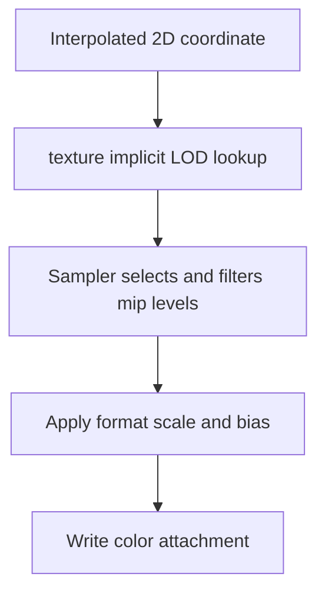

## Overview

**Core question:** Does Vulkan choose and filter the permitted mip levels for each lookup?

- This page covers the `texture.mipmap` test family implemented by `vktTextureMipmapTests.cpp`.
- The cases sample 2D, cube, and 3D images whose mip levels have distinct colors. Coordinate derivatives, shader bias, sampler LOD clamps, image-view level ranges, and image-view minimum LOD make the selected level observable.
- Most results undergo a precision-aware lookup verification. A separate `textureGather` path checks component gathering and the robustness rule for accesses below an image-view minimum LOD; its `minlod_1_1` case specifically relies on `robustImageAccess2` for the defined zero result.
- Graphics and compute variants exercise the same sampling contract through rasterized implicit derivatives or compute-side reconstructed gradients.

## Background Knowledge

For the shared concepts of texture coordinates and LOD, image-view selection, and precision-aware verification, see [Background Knowledge](../../categories/texture.md#background-knowledge) of the `texture` page.

- **Image-view level restrictions:** `baseMipLevel` and `levelCount` define the levels visible through a view. `VK_EXT_image_view_min_lod` adds a lower image-level bound and permits preferred and alternative rounding at relevant boundaries.

## Registration Hierarchy

```text
texture.mipmap
├── 2d
├── cubemap
├── 3d
└── min_lod_gather (non-Vulkan SC builds)
```

The first three direct children contain deeper intermediate nodes for coordinate behavior and LOD controls. `min_lod_gather` contains `minlod_0_1` and `minlod_1_1`, each with four component test cases.

## Parameter Dimensions and Observed Values

| Dimension | Registered values | Meaning in this test | Evidence |
|-----------|-------------------|----------------------|----------|
| Image type | `2d`, `cubemap`, `3d` | Changes coordinate dimensionality, image-view type, derivative calculation, and software lookup model. | [Case population](../../../modules/vulkan/texture/vktTextureMipmapTests.cpp#L3411-L4187) |
| Coordinate behavior | `basic`, `affine`, `projected`; cube also uses `bias` | Changes how coordinates vary and therefore how implicit LOD is produced. Bias adds a shader-supplied LOD shift. | [Coordinate registrations](../../../modules/vulkan/texture/vktTextureMipmapTests.cpp#L3369-L3409) |
| Minification and mipmap filtering | `nearest_nearest`, `linear_nearest`, `nearest_linear`, `linear_linear` | The first term controls filtering within a level. The second controls nearest-level selection or blending between levels. | [Filter table](../../../modules/vulkan/texture/vktTextureMipmapTests.cpp#L3354-L3361) |
| Magnification filter | `nearest`, `linear` for ordinary cube cases | Selects the filter used when the effective LOD represents magnification. | [Cube registration](../../../modules/vulkan/texture/vktTextureMipmapTests.cpp#L3706-L3755) |
| Addressing | `clamp`, `repeat`, `mirror` | Exercises samples inside and outside normalized coordinate bounds. | [Wrap table](../../../modules/vulkan/texture/vktTextureMipmapTests.cpp#L3347-L3352) |
| Image extent | 2D: `64x64`, `63x57` (`npot`), `32x64` (`non_square`); 3D: `32x32x32`, `33x29x27` (`npot`); cube: `64` | Checks power-of-two, non-power-of-two, and unequal-axis derivative scaling. Extra sizes appear only under `basic`. | [Size tables](../../../modules/vulkan/texture/vktTextureMipmapTests.cpp#L3380-L3398) |
| LOD or view control | `bias`, `min_lod`, `max_lod`, `base_level`, `max_level`, `image_view_min_lod` | Isolates shader bias, sampler clamps, image-view subresource bounds, and the extension's floating-point image-level lower bound. | [LOD-control registration](../../../modules/vulkan/texture/vktTextureMipmapTests.cpp#L3510-L3674) |
| Execution path | graphics leaf, or a corresponding `_compute` leaf where that variant is registered | Compares rasterized sampling with compute sampling that reconstructs interpolation and gradients. Cube `projected` and `bias` cases intentionally have no `_compute` leaf. | [2D generated cases](../../../modules/vulkan/texture/vktTextureMipmapTests.cpp#L3430-L3506), [cube compute exclusions](../../../modules/vulkan/texture/vktTextureMipmapTests.cpp#L3742-L3749) |
| Gather minimum LOD | `minlod_0_1`, `minlod_1_1` | Chooses whether base-level gathering is defined or must return zero with `robustImageAccess2`. | [Gather parameters](../../../modules/vulkan/texture/vktTextureMipmapTests.cpp#L2661-L2710) |
| Gather component | `component_0` through `component_3` | Selects the component copied from each of the four gathered texels. | [Gather registration](../../../modules/vulkan/texture/vktTextureMipmapTests.cpp#L3294-L3338) |

## Behavior Parameters

The primary behavioral axis is the direct child below `texture.mipmap`. Each value changes the coordinate domain, lookup rules, or validation path.

### `2d`: two-dimensional mip selection and filtering

These cases vary 2D coordinates over a 4 by 4 output grid. Each cell can induce a different LOD or use a different control value. The deeper structure covers ordinary, affine, projected, biased, sampler-clamped, view-restricted, and integer-coordinate fetch behavior.

### `cubemap`: cube-face sampling and projected derivatives

Cube cases add face selection and seamless cube sampling to mip-level choice. Their ordinary matrix varies coordinate behavior, minification, magnification, and wrapping. The `misc.projected_derivatives` case supplies explicit projected cube derivatives through `textureGrad`.

### `3d`: three-dimensional mip selection and filtering

These cases extend derivative and addressing checks to the third texture coordinate. The test uses solid-colored 3D mip levels, so output color still identifies selected levels without hiding an error behind detailed texel content.

### `min_lod_gather`: gather behavior below an image-view minimum

The gather path reads one selected component from four neighboring texels at the image-view base level. With minimum LOD `0.1`, the integer minimum remains level 0 and the gathered value comes from that level. With minimum LOD `1.1`, base-level gathering lies below the integer minimum and `robustImageAccess2` requires zero values.

## Shader Analysis

One ordinary 2D graphics case represents the main generated shader path. The variation table covers compute gradients, bias, integer fetch, cube derivatives, and gather operations without repeating mostly shared shader structure.

### Representative Shader Walkthrough 1

#### Parameter Values Chosen

Representative path:

```text
dEQP-VK.texture.mipmap.2d.basic.linear_linear_clamp
```

| Parameter choice | Meaning in this representative case |
|------------------|-------------------------------------|
| `2d.basic` | Rasterized 2D coordinates produce the implicit derivatives used for LOD. |
| `linear_linear` | The sampler filters linearly within each selected level and between adjacent levels. |
| `clamp` | Out-of-range coordinates clamp to the image edge. |
| graphics path | The fragment shader uses implicit LOD through `texture`; it does not use the `_compute` variant's explicit gradients. |

#### Purpose

The fragment shader performs the sampled lookup whose level selection and filtering are under test. Distinct solid colors in each mip level make a wrong level or blend visible in the output.

#### Structural Design



#### Shader Code

```glsl
#version 450
/// Location 0 carries the rasterizer-interpolated 2D coordinate. Its screen-space derivatives drive implicit LOD.
layout(location = 0) in highp vec2 v_texCoord;
layout(location = 0) out mediump vec4 dEQP_FragColor;
/// Set 0 stores lookup adjustment values shared by the texture test renderer. This case uses color scale and bias.
layout(set = 0, binding = 0, std140) uniform Block
{
  highp float u_bias;
  highp float u_ref;
  highp vec4 u_colorScale;
  highp vec4 u_colorBias;
};
/// Set 1 binding 0 combines the mipmapped R8G8B8A8_UNORM image view with the linear-linear clamp sampler.
layout(set = 1, binding = 0) uniform highp sampler2D u_sampler;
void main(void)
{
  highp vec2 texCoord = v_texCoord;
  /// texture() obtains implicit derivatives, selects the permitted mip level or levels, and filters the sampled value.
  dEQP_FragColor = texture(u_sampler, texCoord) * u_colorScale + u_colorBias;
}
```

#### Additional Info

- The shared generator emits this fragment program from `PROGRAM_2D_FLOAT`; the corresponding vertex shader only forwards position and texture coordinates.
- `TextureCommonTestCaseParameters` defaults texture coordinates to `highp`, while the shared generator defaults fragment output precision to `mediump`.

#### Parameter Variation Summary

| Parameter dimension | Shader-level variation from this shader | Evidence |
|---------------------|---------------------------------------|----------|
| Bias | Bias graphics cases use `texture(u_sampler, texCoord, u_bias)`. | [2D generator branch](../../../modules/vulkan/texture/vktTextureTestUtil.cpp#L477-L488) |
| Compute | The compute template reconstructs perspective-correct coordinates, derives neighboring gradients, samples with `textureGrad`, and stores to an output image. | [Compute template](../../../modules/vulkan/texture/vktTextureTestUtil.cpp#L245-L331) |
| Cube or 3D | The generated coordinate and sampler types become `vec3` with `samplerCube` or `sampler3D`. | [Type and lookup selection](../../../modules/vulkan/texture/vktTextureTestUtil.cpp#L386-L395) |
| Integer-coordinate image-view minimum LOD | Dedicated shaders use `texelFetch` with a uniform integer LOD. | [2D explicit-fetch shaders](../../../modules/vulkan/texture/vktTextureMipmapTests.cpp#L2338-L2401) |
| Projected cube derivatives | The special cube case uses supplied `dx` and `dy` vectors in `textureGrad`. | [`MiscTestCase::initPrograms`](../../../modules/vulkan/texture/vktTextureMipmapTests.cpp#L3104-L3216) |
| Gather | The fragment shader uses `textureGather` with the registered component index. | [`TextureGatherMinLodTest::initPrograms`](../../../modules/vulkan/texture/vktTextureMipmapTests.cpp#L2775-L2807) |

#### SPIR-V

- Status: generated and validated
- Source: reconstructed `GLSL` from this walkthrough
- Stage: `frag`
- Target SPIRV version: `spirv1.0`

<details>
<summary>Click to expand SPIRV asm code</summary>

```llvm
; SPIR-V
; Version: 1.0
; Generator: Khronos Glslang Reference Front End; 11
; Bound: 36
; Schema: 0
               OpCapability Shader
          %1 = OpExtInstImport "GLSL.std.450"
               OpMemoryModel Logical GLSL450
               OpEntryPoint Fragment %main "main" %v_texCoord %dEQP_FragColor
               OpExecutionMode %main OriginUpperLeft
               OpSource GLSL 450
               OpName %main "main"
               OpName %texCoord "texCoord"
               OpName %v_texCoord "v_texCoord"
               OpName %dEQP_FragColor "dEQP_FragColor"
               OpName %u_sampler "u_sampler"
               OpName %Block "Block"
               OpMemberName %Block 0 "u_bias"
               OpMemberName %Block 1 "u_ref"
               OpMemberName %Block 2 "u_colorScale"
               OpMemberName %Block 3 "u_colorBias"
               OpName %_ ""
               OpDecorate %v_texCoord Location 0
               OpDecorate %dEQP_FragColor RelaxedPrecision
               OpDecorate %dEQP_FragColor Location 0
               OpDecorate %u_sampler Binding 0
               OpDecorate %u_sampler DescriptorSet 1
               OpDecorate %Block Block
               OpMemberDecorate %Block 0 Offset 0
               OpMemberDecorate %Block 1 Offset 4
               OpMemberDecorate %Block 2 Offset 16
               OpMemberDecorate %Block 3 Offset 32
               OpDecorate %_ Binding 0
               OpDecorate %_ DescriptorSet 0
       %void = OpTypeVoid
          %3 = OpTypeFunction %void
      %float = OpTypeFloat 32
    %v2float = OpTypeVector %float 2
%_ptr_Function_v2float = OpTypePointer Function %v2float
%_ptr_Input_v2float = OpTypePointer Input %v2float
 %v_texCoord = OpVariable %_ptr_Input_v2float Input
    %v4float = OpTypeVector %float 4
%_ptr_Output_v4float = OpTypePointer Output %v4float
%dEQP_FragColor = OpVariable %_ptr_Output_v4float Output
         %16 = OpTypeImage %float 2D 0 0 0 1 Unknown
         %17 = OpTypeSampledImage %16
%_ptr_UniformConstant_17 = OpTypePointer UniformConstant %17
  %u_sampler = OpVariable %_ptr_UniformConstant_17 UniformConstant
      %Block = OpTypeStruct %float %float %v4float %v4float
%_ptr_Uniform_Block = OpTypePointer Uniform %Block
          %_ = OpVariable %_ptr_Uniform_Block Uniform
        %int = OpTypeInt 32 1
      %int_2 = OpConstant %int 2
%_ptr_Uniform_v4float = OpTypePointer Uniform %v4float
      %int_3 = OpConstant %int 3
       %main = OpFunction %void None %3
          %5 = OpLabel
   %texCoord = OpVariable %_ptr_Function_v2float Function
         %12 = OpLoad %v2float %v_texCoord
               OpStore %texCoord %12
         %20 = OpLoad %17 %u_sampler
         %21 = OpLoad %v2float %texCoord
         %22 = OpImageSampleImplicitLod %v4float %20 %21
         %29 = OpAccessChain %_ptr_Uniform_v4float %_ %int_2
         %30 = OpLoad %v4float %29
         %31 = OpFMul %v4float %22 %30
         %33 = OpAccessChain %_ptr_Uniform_v4float %_ %int_3
         %34 = OpLoad %v4float %33
         %35 = OpFAdd %v4float %31 %34
               OpStore %dEQP_FragColor %35
               OpReturn
               OpFunctionEnd
```

</details>

## Runtime Execution and Result Checking

- The host creates complete mip chains. Ordinary 2D and 3D levels use distinct solid colors; cube levels also vary color by face. The color identifies which level or blend the implementation returned.
- Ordinary and LOD-control cases render or dispatch into an output image. The host divides 2D and 3D outputs into a 4 by 4 grid. Cube cases use a deterministic partition and cycle through cube faces.
- For each cell, the host sets coordinates and any bias, sampler LOD clamp, image-view base or maximum level, or image-view minimum LOD. It updates the view when level restrictions change.
- The host computes an ideal software image with the same sampler and view model. `computeTextureLookupDiff` accepts a direct threshold match first. For a mismatch, it reconstructs coordinates and bounded derivative and LOD intervals, then calls the texture verifier to decide whether the implementation's pixel is still permitted.
- An image-view-minimum-LOD mismatch is retried under the specification's alternative rounding interpretation. A case fails only if invalid pixels remain.
- `min_lod_gather` clears three mip levels to distinct pseudorandom colors, draws one pixel, copies it to host-visible memory, and compares it against either the selected level component or exact zero. Its nonzero-color generation prevents a wrong ordinary gather from looking like the robust zero result.

## Failure Meaning

### Failure Cause Mapping

| If this behavior parameter value fails | Possible failure cause(s) |
|----------------------------------------|---------------------------|
| `2d` | Incorrect 2D derivative-based LOD, filtering, wrapping, bias or clamp handling, image-view level restriction, or explicit fetch behavior. |
| `cubemap` | Incorrect cube face or seamless coordinate handling, cube derivative-based LOD, filtering, bias or clamp handling, or image-view level restriction. |
| `3d` | Incorrect three-coordinate derivative-based LOD, 3D filtering and wrapping, bias or clamp handling, image-view level restriction, or explicit fetch behavior. |
| `min_lod_gather` | Incorrect gather component selection, image-view minimum-LOD interpretation, or robust zero result below the permitted level. |

### Cause Analysis

#### 2D level selection or lookup failure

**Possible failure symptoms:** One or more pixels fall outside both the ideal threshold and every result allowed by coordinate, derivative, LOD, and filtering precision. An explicit-fetch variant can return a color from the wrong level.

**Possible implementation causes:** The implementation may compute implicit derivatives or LOD incorrectly, apply bias or sampler clamps in the wrong order, choose or blend the wrong mip levels, mishandle view-relative levels, lower `texture` or `texelFetch` incorrectly, or use wrong addressing and filtering state.

#### Cube level selection or lookup failure

**Possible failure symptoms:** Invalid pixels can cluster on a face, across face transitions, or in cells whose derivatives choose different levels. The projected-derivative case can return a color inconsistent with the supplied gradients.

**Possible implementation causes:** The cube lookup may select the wrong face or seamless neighbor, transform cube derivatives incorrectly, choose the wrong mip level, or mishandle bias, sampler clamps, or image-view restrictions. Shader compilation of `textureGrad` is another source-grounded path to the same symptom.

#### 3D level selection or lookup failure

**Possible failure symptoms:** Pixels show a level color or inter-level blend that the three-dimensional coordinate and allowed LOD interval cannot produce.

**Possible implementation causes:** The implementation may omit or mis-scale one derivative component, apply 3D addressing or filtering incorrectly, choose the wrong mip levels, or mishandle sampler and image-view restrictions. Incorrect lowering of the generated 3D sampling or fetch operation can produce the same result.

#### Gather minimum-LOD or robustness failure

**Possible failure symptoms:** `minlod_0_1` returns the wrong selected component, while `minlod_1_1` returns nonzero data or an incorrect alpha instead of `(0, 0, 0, 1)`.

**Possible implementation causes:** The implementation may apply the image-view minimum LOD to gathering incorrectly, select the wrong gather component, or fail to provide the `robustImageAccess2` zero result when the base level is below the integer image-view minimum.

## Case Pruning

### Requirement-based pruning

- The non-Vulkan-SC `image_view_min_lod` groups require `VK_EXT_image_view_min_lod` and its `minLod` feature; their support checks query the feature and [`RenderBackend`](../../../modules/vulkan/texture/vktTextureTestUtil.cpp#L1587-L1644) enables it on a custom device. `min_lod_gather` also requires the extension and is absent from Vulkan SC builds, but its `checkSupport` path does not explicitly query `minLod`, and its `minlod_0_1` case uses the default device. [`checkTextureSupport`](../../../modules/vulkan/texture/vktTextureMipmapTests.cpp#L3226-L3289)
- Integer-coordinate image-view-minimum-LOD cases additionally require robustness2 support and `robustImageAccess2`; their support checks require that feature and the shared renderer enables it on its custom device because a generated fetch LOD can lie below the allowed image-view minimum.
- The gather setup is different and has a source-level capability gap: `minlod_0_1` uses the default device without an explicit `minLod` feature check, while `minlod_1_1` checks `robustImageAccess2` and selects a custom device whose `initDeviceCapabilities` registers `robustBufferAccess2` and core `robustBufferAccess`, not `robustImageAccess2`. Thus a gather failure must first rule out incomplete test-device feature enablement before being attributed to image-view or robustness implementation behavior. [`checkSupport`](../../../modules/vulkan/texture/vktTextureMipmapTests.cpp#L2809-L2828), [`initDeviceCapabilities`](../../../modules/vulkan/texture/vktTextureMipmapTests.cpp#L2728-L2745)
- `min_lod_gather.minlod_1_1` requires robustness2 and `robustImageAccess2` for its defined zero result.
- Compute variants require an exclusive compute queue in the shared renderer. Unsupported image format capabilities or insufficient mip-level limits cause a supportedness skip rather than a test failure.

### Design-based pruning

- Additional `npot` and `non_square` extents appear only for `basic`; repeating them for affine and projected coordinate paths would duplicate the size dimension without adding a new mechanism.
- Cube maps have no affine intermediate node. Their matrix uses `basic`, `projected`, and `bias`.
- Cube projected and bias cases omit `_compute` variants because the source marks the compute-side calculations as insufficiently accurate for these combinations.
- The gather path fixes the coordinate at the texture center and varies only minimum LOD and component. It isolates image-view and robustness semantics from ordinary derivative-based filtering.

## Key Takeaways

- Distinct colors per mip level turn level choice and inter-level blending into observable output.
- The matrix separates coordinate-derived LOD, shader bias, sampler clamps, image-view subresource limits, and `VK_EXT_image_view_min_lod` instead of treating every restriction as the same control.
- Lookup verification checks the Vulkan-permitted result set after an ideal comparison fails. It does not require one bit-exact software image when the specification allows bounded precision variation.
- Graphics and compute cases reach the same sampling contract through different sources of derivatives.
- See `Failure Meaning` for the distinction between ordinary lookup failures, cube-specific behavior, 3D derivative handling, and robust gather failures.

## Source Reference Appendix

| Entry point | Link | Why it matters |
|-------------|------|----------------|
| Test-family dispatcher | [`createTextureTests`](../../../modules/vulkan/texture/vktTextureTests.cpp#L48-L66) | Registers `mipmap` under the `texture` test category. |
| Mipmap family creation | [`createTextureMipmappingTests`](../../../modules/vulkan/texture/vktTextureMipmapTests.cpp#L4198-L4201) | Creates the registered `mipmap` test family. |
| Matrix and direct-child population | [`populateTextureMipmappingTests`](../../../modules/vulkan/texture/vktTextureMipmapTests.cpp#L3343-L4196) | Defines the parameter tables, direct children, deeper intermediate nodes, and graphics or compute leaves. |
| Ordinary sampled-image execution | [2D](../../../modules/vulkan/texture/vktTextureMipmapTests.cpp#L149-L401), [cube](../../../modules/vulkan/texture/vktTextureMipmapTests.cpp#L432-L665), [3D](../../../modules/vulkan/texture/vktTextureMipmapTests.cpp#L696-L984) | Creates colored mip chains, executes the lookup matrix, and applies precision-aware verification. |
| LOD-control execution | [2D](../../../modules/vulkan/texture/vktTextureMipmapTests.cpp#L1013-L1265), [cube](../../../modules/vulkan/texture/vktTextureMipmapTests.cpp#L1293-L1554), [3D](../../../modules/vulkan/texture/vktTextureMipmapTests.cpp#L1780-L2042) | Applies sampler and image-view controls per cell. |
| Image-view-minimum-LOD variants | [Extension instances](../../../modules/vulkan/texture/vktTextureMipmapTests.cpp#L2044-L2311), [integer 2D and 3D shaders](../../../modules/vulkan/texture/vktTextureMipmapTests.cpp#L2313-L2653) | Covers floating and integer-coordinate behavior plus feature checks. |
| Gather path | [`TextureGatherMinLodTest`](../../../modules/vulkan/texture/vktTextureMipmapTests.cpp#L2661-L3100) | Generates the gather shader and performs exact host comparison. |
| Shared GLSL specialization | [`initializePrograms`](../../../modules/vulkan/texture/vktTextureTestUtil.cpp#L210-L760) | Produces ordinary graphics and compute shader programs. |
| Texture image and view setup | [`TextureBinding::updateTextureData`](../../../modules/vulkan/texture/vktTextureTestUtil.cpp#L808-L921), [`updateTextureViewMipLevels`](../../../modules/vulkan/texture/vktTextureTestUtil.cpp#L923-L967) | Creates sampled images and updates image-view mip restrictions. |
| Precision-aware lookup verification | [`computeTextureLookupDiff` for 2D](../../../../../framework/opengl/gluTextureTestUtil.cpp#L1550-L1699), [cube](../../../../../framework/opengl/gluTextureTestUtil.cpp#L1769-L1931), [3D](../../../../../framework/opengl/gluTextureTestUtil.cpp#L1968-L2126) | Checks ideal values and the bounded set of valid lookup results. |
| Vulkan sampler state | [Samplers chapter](../../../../vulkan-docs/src/chapters/samplers.adoc#L78-L171) | Defines minification, magnification, mipmap mode, bias, and sampler LOD clamps. |
| Vulkan LOD and image-level selection | [Textures chapter](../../../../vulkan-docs/src/chapters/textures.adoc#L1524-L1802) | Defines derivative or explicit LOD, clamp order, image-view bounds, and nearest or linear level selection. |
| Vulkan gather semantics | [Texel Gathering](../../../../vulkan-docs/src/chapters/textures.adoc#L2122-L2190) | Defines component gathering and robust behavior below image-view minimum LOD. |
