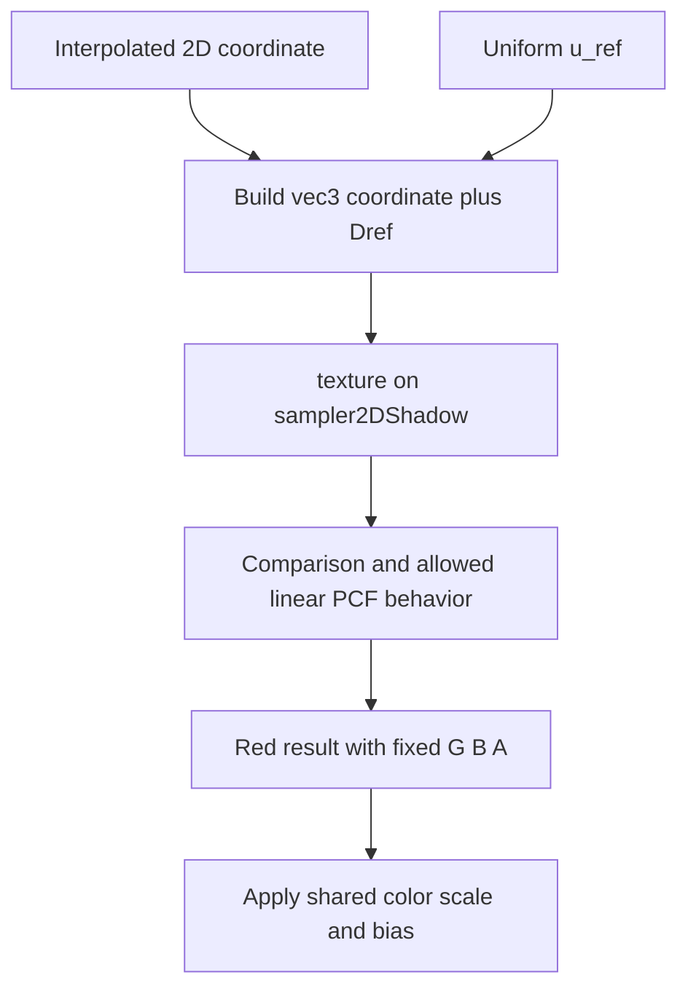

## Overview

**Core question:** Does each shadow lookup produce a comparison result allowed by Vulkan for the selected image, sampler, coordinates, and LOD?

- This page covers the `texture.shadow` test family implemented by [`vktTextureShadowTests.cpp`](../../../modules/vulkan/texture/vktTextureShadowTests.cpp), with shared shader, image, sampler, and rendering support in [`vktTextureTestUtil.cpp`](../../../modules/vulkan/texture/vktTextureTestUtil.cpp).
- Six direct families exercise generated depth-comparison sampling for 1D, 2D, cube, and array image views. A seventh family uses Amber to isolate border texel replacement before comparison.
- The generated matrix varies filters, compare operations, depth and color formats, regular and sparse backing, and cube edge handling.
- Validation uses a software texture model plus a per-pixel legality check. A strict first tier diagnoses lower-quality PCF behavior; a wider second tier decides whether the image still satisfies the test's minimum precision assumptions.

## Background Knowledge

For the shared concepts of sampled-image filtering, coordinates and LOD, and precision-aware verification, see [Background Knowledge](../../categories/texture.md#background-knowledge) of the `texture` page.

- **Depth-comparison sampling:** A Dref image instruction compares a shader-supplied reference value with the selected texel depth. The sampler's `VkCompareOp` receives the reference as its first operand and texel depth as its second. Each comparison produces `1.0` for true or `0.0` for false. Unsigned normalized formats clamp the reference to `[0,1]` before comparison.
- **Filtered comparison results:** Linear filtering can combine comparison outcomes, often called percentage-closer filtering or PCF. Vulkan permits implementation-dependent behavior that differs from ordinary color filtering. The result must remain in `[0,1]` and should track a weighted proportion of comparison passes or failures. A verifier must accept a legal range rather than demand one exact interpolation algorithm.

## Registration Hierarchy

```text
texture.shadow
├── 2d
├── cube
├── 2d_array
├── 1d
├── 1d_array
├── cube_array
└── texel_replacement (non-VulkanSC only)
```

Each generated family contains filter intermediate nodes. Under those nodes, a test case leaf encodes backing mode, optional cube edge mode, compare operation, and format. For example:

Concrete leaves include `2d.linear.less_or_equal_d16_unorm`, `cube.linear.sparse_non_seamless_greater_d32_sfloat`, and `texel_replacement.d32_sfloat`.

## Parameter Dimensions and Observed Values

| Dimension | Registered values | Meaning in this test | Evidence |
|-----------|-------------------|----------------------|----------|
| Direct test family | `2d`, `cube`, `2d_array`, `1d`, `1d_array`, `cube_array`, `texel_replacement` | Changes the shadow coordinate shape, image view, iteration pattern, and special behavior under test. | [family registration](../../../modules/vulkan/texture/vktTextureShadowTests.cpp#L1792-L2077) |
| Filter intermediate node | `nearest`, `linear`, `nearest_mipmap_nearest`, `linear_mipmap_nearest`, `nearest_mipmap_linear`, `linear_mipmap_linear` | Selects nearest or linear filtering within a level and nearest or linear selection between mip levels. Magnification remains linear for the four mipmap nodes. | [filter table](../../../modules/vulkan/texture/vktTextureShadowTests.cpp#L1757-L1767) |
| Compare operation | `less_or_equal`, `greater_or_equal`, `less`, `greater`, `equal`, `not_equal`, `always`, `never` | Becomes the sampler's compare operation. This changes each texel comparison before filtering. | [compare table](../../../modules/vulkan/texture/vktTextureShadowTests.cpp#L1769-L1780) |
| Format | `d16_unorm`, `x8_d24_unorm_pack32`, `d32_sfloat`, `d16_unorm_s8_uint`, `d24_unorm_s8_uint`, `d32_sfloat_s8_uint`, `r16_unorm`, `r32_sfloat` | Covers depth, depth-stencil, and color formats that advertise sampled-image depth-comparison support. Depth-stencil image views select only the depth aspect. | [format table](../../../modules/vulkan/texture/vktTextureShadowTests.cpp#L1743-L1755) |
| Image backing | regular leaf with no prefix, or `sparse_` | Runs identical sampling logic over normally bound or sparse-resident images. Sparse leaves exist for the 2D-based families, not `1d` or `1d_array`. | [backing table and registration loops](../../../modules/vulkan/texture/vktTextureShadowTests.cpp#L1733-L1740) |
| Cube edge mode | seamless leaf with no prefix, or `non_seamless_` | Chooses normal cube edge handling or disables it through `VK_EXT_non_seamless_cube_map`. Applies only to `cube` and `cube_array`. | [seam table](../../../modules/vulkan/texture/vktTextureShadowTests.cpp#L1782-L1790) |
| Texture shape | 2D: 32 by 64; cube: 32 by 32 per face; 2D array: 32 by 64 by 8 layers; 1D: 32; 1D array: 32 by 8 layers; cube array: 32 by 32 with 24 face layers | Keeps resources small while supplying full mip chains, multiple faces or layers, and enough coordinate variation for magnification and minification cases. | [family construction](../../../modules/vulkan/texture/vktTextureShadowTests.cpp#L1792-L2065) |
| Per-instance FilterCase | two generated textures, in-range references, references `1.1` and `-0.1`, and several coordinate spans | Exercises gradient and grid data, magnification and minification, mip selection, wrapping or cube edges, and reference clamping. | [2D FilterCases](../../../modules/vulkan/texture/vktTextureShadowTests.cpp#L295-L375) |

The Vulkan default texture mustpass file contains 5,377 `texture.shadow` leaves: 384 each for `1d` and `1d_array`, 768 each for `2d` and `2d_array`, 1,536 each for `cube` and `cube_array`, and one `texel_replacement` leaf.

## Behavior Parameters

The primary behavioral axis is the direct test family below `texture.shadow`. It changes how coordinates, layers, faces, and Dref reach the sampling instruction, and it gives the clearest first split when diagnosing a failure.

### `2d` - normalized 2D comparison sampling

This family samples two mipmapped 2D textures over a 64 by 64 render target. Generated coordinate spans drive both magnification and minification. Regular and sparse leaves use the same fragment shader and verifier, so differences isolate image backing and upload rather than compare semantics.

### `cube` - direction and cube-edge comparison sampling

This family converts a coordinate grid into directions and renders every cube face. It checks direction-to-face selection together with comparison and filtering. Seamless leaves use standard cube edge handling; `non_seamless_` leaves disable cross-face handling in the sampler.

### `2d_array` - comparison sampling with discrete array layers

This family combines 2D filtered coordinates with an array-layer coordinate that varies across each rendered quad, so one draw exercises several layer selections. Filtering and implicit LOD apply to the spatial coordinates; the array layer itself is selected discretely rather than filtered. Layer selection must remain separate from Dref in the generated `sampler2DArrayShadow` lookup.

### `1d` - one-dimensional comparison sampling

This family reduces the spatial lookup to one coordinate but retains generated mip levels, compare operations, and all six filter nodes. It has no sparse leaves because the generated image is `VK_IMAGE_TYPE_1D`.

### `1d_array` - one-dimensional sampling plus a layer

This family adds array-layer selection to the 1D lookup. The generated shadow coordinate packs the spatial coordinate, layer, and Dref in distinct positions. Like `1d`, it intentionally omits sparse backing.

### `cube_array` - cube direction, array layer, and separate Dref

This family selects among four cubes stored as 24 face layers. The GLSL cube-array shadow operation passes a four-component direction-and-layer coordinate plus Dref as a separate argument. Each run covers cube faces, array layers, edge mode, filtering, and comparison together.

### `texel_replacement` - border replacement before comparison

This non-VulkanSC Amber case samples outside a `D32_SFLOAT` image with a float opaque-white border. With Dref `0.5` and compare operation `greater`, it expects `0.5 > 1.0` to be false. Every framebuffer pixel must therefore be `(0,0,0,255)`.

## Shader Analysis

One fragment shader represents the generated matrix because all six C++ families use the same template and differ mainly in shadow sampler type and coordinate signature. The selected 2D case shows the central Dref operation without cube or array packing. The fixed Amber shader is summarized under `texel_replacement` and in the runtime section because its extra logic is only a constant out-of-range coordinate.

### Representative Shader Walkthrough 1

#### Parameter Values Chosen

Representative path:

```text
dEQP-VK.texture.shadow.2d.linear.less_or_equal_d16_unorm
```

| Parameter choice | Meaning in this representative case |
|------------------|-------------------------------------|
| `2d` | Generates `vec2` texture coordinates and a `sampler2DShadow`. |
| `linear` | Uses linear minification and magnification without mipmap filtering. |
| `less_or_equal` | The sampler tests whether Dref is less than or equal to texel depth. |
| `d16_unorm` | Uses an unsigned normalized depth format and the depth image aspect. |
| regular backing | Creates and binds the image through ordinary image memory rather than sparse residency. |

#### Purpose

The fragment shader sends the interpolated 2D coordinate and uniform Dref to a comparison-enabled sampler. It writes the filtered comparison result to red so the host can check every pixel.

#### Structural Design



#### Shader Code

```glsl
#version 450
layout(location = 0) in highp vec2 v_texCoord;
layout(location = 0) out mediump vec4 dEQP_FragColor;
/// Set 0 supplies the comparison reference and color transform used for every fragment in this draw.
layout (set=0, binding=0, std140) uniform Block
{
  highp float u_bias;
  highp float u_ref;
  highp vec4 u_colorScale;
  highp vec4 u_colorBias;
};

/// Set 1 binds the sampled 2D image and comparison-enabled sampler as one shadow sampler.
layout (set=1, binding=0) uniform highp sampler2DShadow u_sampler;
void main (void)
{
  highp vec2 texCoord = v_texCoord;
  /// texture() supplies u_ref as Dref. The red output carries the filtered comparison result.
  dEQP_FragColor = vec4(texture(u_sampler, vec3(texCoord, u_ref)), 0.0, 0.0, 1.0) * u_colorScale + u_colorBias;
}
```

#### Additional Info

- `TextureTestCase::initPrograms()` uses the shared `initializePrograms()` generator. With no explicit `ShaderBuildOptions`, the CTS baseline target is SPIR-V 1.0.
- The vertex shader passes `a_texCoord` to `v_texCoord` and writes `a_position` to `gl_Position`. Rasterization supplies the implicit derivatives used for LOD.

#### Parameter Variation Summary

| Parameter dimension | Shader-level variation from this shader | Evidence |
|---------------------|---------------------------------------|----------|
| Direct test family | Changes coordinate type, shadow sampler type, and whether Dref is packed into the lookup coordinate or supplied separately. | [shadow generator branches](../../../modules/vulkan/texture/vktTextureTestUtil.cpp#L509-L718) |
| Filter node | Does not change shader text. Sampler state and implicit derivatives control filtering and LOD. | [sampler mapping](../../../framework/vulkan/vkImageUtil.cpp#L4472-L4510) |
| Compare operation | Does not change shader text. The selected operation is mapped to `VkSamplerCreateInfo::compareOp`. | [compare-state mapping](../../../framework/vulkan/vkImageUtil.cpp#L4475-L4504) |
| Format and backing | Do not change the generated fragment source. They change the image, view aspect, allocation, and upload path. | [image setup](../../../modules/vulkan/texture/vktTextureTestUtil.cpp#L808-L921) |
| Cube edge mode | Does not change shader text. It changes sampler creation flags. | [sampler flags](../../../framework/vulkan/vkImageUtil.cpp#L4481-L4485) |

#### SPIR-V

- Status: generated and validated
- Source: reconstructed `GLSL` from this walkthrough
- Stage: `frag`
- Target SPIRV version: `spirv1.0`

<details>
<summary>Click to expand SPIRV asm code</summary>

```llvm
; SPIR-V
; Version: 1.0
; Generator: Khronos Glslang Reference Front End; 11
; Bound: 48
; Schema: 0
               OpCapability Shader
          %1 = OpExtInstImport "GLSL.std.450"
               OpMemoryModel Logical GLSL450
               OpEntryPoint Fragment %main "main" %v_texCoord %dEQP_FragColor
               OpExecutionMode %main OriginUpperLeft
               OpSource GLSL 450
               OpName %main "main"
               OpName %texCoord "texCoord"
               OpName %v_texCoord "v_texCoord"
               OpName %dEQP_FragColor "dEQP_FragColor"
               OpName %u_sampler "u_sampler"
               OpName %Block "Block"
               OpMemberName %Block 0 "u_bias"
               OpMemberName %Block 1 "u_ref"
               OpMemberName %Block 2 "u_colorScale"
               OpMemberName %Block 3 "u_colorBias"
               OpName %_ ""
               OpDecorate %v_texCoord Location 0
               OpDecorate %dEQP_FragColor RelaxedPrecision
               OpDecorate %dEQP_FragColor Location 0
               OpDecorate %u_sampler Binding 0
               OpDecorate %u_sampler DescriptorSet 1
               OpDecorate %Block Block
               OpMemberDecorate %Block 0 Offset 0
               OpMemberDecorate %Block 1 Offset 4
               OpMemberDecorate %Block 2 Offset 16
               OpMemberDecorate %Block 3 Offset 32
               OpDecorate %_ Binding 0
               OpDecorate %_ DescriptorSet 0
       %void = OpTypeVoid
          %3 = OpTypeFunction %void
      %float = OpTypeFloat 32
    %v2float = OpTypeVector %float 2
%_ptr_Function_v2float = OpTypePointer Function %v2float
%_ptr_Input_v2float = OpTypePointer Input %v2float
 %v_texCoord = OpVariable %_ptr_Input_v2float Input
    %v4float = OpTypeVector %float 4
%_ptr_Output_v4float = OpTypePointer Output %v4float
%dEQP_FragColor = OpVariable %_ptr_Output_v4float Output
         %16 = OpTypeImage %float 2D 1 0 0 1 Unknown
         %17 = OpTypeSampledImage %16
%_ptr_UniformConstant_17 = OpTypePointer UniformConstant %17
  %u_sampler = OpVariable %_ptr_UniformConstant_17 UniformConstant
      %Block = OpTypeStruct %float %float %v4float %v4float
%_ptr_Uniform_Block = OpTypePointer Uniform %Block
          %_ = OpVariable %_ptr_Uniform_Block Uniform
        %int = OpTypeInt 32 1
      %int_1 = OpConstant %int 1
%_ptr_Uniform_float = OpTypePointer Uniform %float
    %v3float = OpTypeVector %float 3
    %float_0 = OpConstant %float 0
    %float_1 = OpConstant %float 1
      %int_2 = OpConstant %int 2
%_ptr_Uniform_v4float = OpTypePointer Uniform %v4float
      %int_3 = OpConstant %int 3
       %main = OpFunction %void None %3
          %5 = OpLabel
   %texCoord = OpVariable %_ptr_Function_v2float Function
         %12 = OpLoad %v2float %v_texCoord
               OpStore %texCoord %12
         %20 = OpLoad %17 %u_sampler
         %21 = OpLoad %v2float %texCoord
         %28 = OpAccessChain %_ptr_Uniform_float %_ %int_1
         %29 = OpLoad %float %28
         %31 = OpCompositeExtract %float %21 0
         %32 = OpCompositeExtract %float %21 1
         %33 = OpCompositeConstruct %v3float %31 %32 %29
         %34 = OpCompositeExtract %float %33 2
         %35 = OpImageSampleDrefImplicitLod %float %20 %33 %34
         %38 = OpCompositeConstruct %v4float %35 %float_0 %float_0 %float_1
         %41 = OpAccessChain %_ptr_Uniform_v4float %_ %int_2
         %42 = OpLoad %v4float %41
         %43 = OpFMul %v4float %38 %42
         %45 = OpAccessChain %_ptr_Uniform_v4float %_ %int_3
         %46 = OpLoad %v4float %45
         %47 = OpFAdd %v4float %43 %46
               OpStore %dEQP_FragColor %47
               OpReturn
               OpFunctionEnd
```

</details>

## Runtime Execution and Result Checking

- Each C++ test instance creates two complete mipmapped textures. One contains component gradients; the other contains level-dependent grids. Floating-point generators may contain values outside `[0,1]`. [`TestTexture::write()`](../../../modules/vulkan/pipeline/vktPipelineImageUtil.cpp#L923-L967) copies those format-native bytes to the staging buffer, and Vulkan buffer-to-image transfer copies texel blocks rather than performing a numeric upload conversion. The software verifier nevertheless clamps a private copy of floating-point depth data to `[0,1]`, following an inherited comment that assumes upload-time clamping. This source-level oracle assumption is unresolved.
- `TextureBinding::updateTextureData()` creates an optimally tiled sampled image. Regular cases bind one allocation and upload normally. Sparse cases add sparse binding and residency flags, establish sparse memory bindings, and upload through the sparse path. Both finish in `VK_IMAGE_LAYOUT_SHADER_READ_ONLY_OPTIMAL`.
- `mapSampler()` converts the CTS sampler model into `VkSamplerCreateInfo`. It enables comparison when the selected compare mode is not `NONE`, maps the compare operation, selects filters and mipmap mode, and applies the non-seamless cube flag when requested.
- Each `iterate()` call selects one FilterCase, computes four quad coordinates, updates Dref and texture bindings, draws, and reads an R8G8B8A8_UNORM image. The `cube` family draws once for each of six faces, and `cube_array` draws for each of 24 face-layer starting combinations. The `2d_array` and `1d_array` families instead vary the layer coordinate across a single draw for each FilterCase.
- `sampleTexture()` produces an ideal software reference. Exact equality with that image is accepted immediately. A differing red value is not an automatic failure because Vulkan allows PCF and LOD precision variation.
- `computeTextureCompareDiff()` reconstructs the pixel's interpolated coordinate and legal LOD interval. It checks the red value with `tcu::isTexCompareResultValid()` and checks the other channels against fixed-point thresholds.
- Tier 1 uses family-specific coordinate and derivative precision, `referenceBits = 16`, `pcfBits = 5`, and `lodBits` of 5 or 6. If it fails, the test logs a warning and retries with `uvwBits = 4` on active spatial components, `pcfBits = 0`, and `lodBits = 4`.
- A FilterCase fails only when tier 2 also reports invalid pixels. Otherwise iteration continues until all FilterCases and family-specific face or layer loops pass.
- Vulkan SC runs the C++ verification block only in subprocess mode. The `texel_replacement` Amber case does not use the two-tier verifier; it compares the complete output to exact RGBA values.

## Failure Meaning

### Failure Cause Mapping

| If this behavior parameter value fails | Possible failure cause(s) |
|----------------------------------------|---------------------------|
| `2d` | Incorrect 2D Dref operand handling, compare operation, implicit LOD, mip filtering, PCF result, format conversion, or sparse 2D sampling. |
| `cube` | A common comparison or filtering fault, or incorrect cube-face selection, edge handling, non-seamless mode, or sparse cube sampling. |
| `2d_array` | A common 2D comparison fault, or incorrect array-layer selection combined with depth comparison and filtering. |
| `1d` | Incorrect 1D shadow coordinate interpretation, implicit LOD, comparison, or filtering. |
| `1d_array` | A 1D comparison fault or incorrect separation of the array layer from the Dref operand. |
| `cube_array` | Incorrect cube-array direction, layer, and Dref operand handling, cube edge behavior, or common comparison and filtering logic. |
| `texel_replacement` | Incorrect clamp-to-border texel replacement or use of the replacement depth in the comparison. |

A failure across several families may instead come from shared sampler compare-state mapping, generated shadow-sampler shader lowering, image upload, or result readback.

### Cause Analysis

#### Dref, compare operation, and shadow-sampler lowering

**Possible failure symptoms:** ordered compare pairs can invert expected light and dark regions, `always` can produce values below one, `never` can produce values above zero, or several families can fail at the same coordinates and compare operation.

**Possible implementation causes:** Vulkan requires a Dref instruction to agree with a comparison-enabled sampler. It also defines Dref as the reference operand and texel depth as the test operand. A wrong `VkCompareOp` mapping, reversed operands, mismatched shader lowering, or wrong coordinate packing can violate those rules.

#### LOD, filtering, and PCF result

**Possible failure symptoms:** failures cluster in minified regions, around mip transitions, or near depth-pattern boundaries. Tier 1 may reject the image while tier 2 accepts it, or tier 2 may still find red values outside every allowed interval.

**Possible implementation causes:** the implementation may select an LOD outside the permitted derivative precision, choose the wrong mip levels, combine the wrong neighboring comparison outcomes, or produce a result outside Vulkan's allowed `[0,1]` comparison-filter range. A tier 1 warning alone is not a conformance failure because tier 2 intentionally models lower permitted precision.

#### Format conversion, aspect, and reference clamping

**Possible failure symptoms:** failures appear only on UNORM, floating-point, depth-stencil, or color formats. Out-of-range Dref cases may disagree while in-range cases pass.

**Possible implementation causes:** a depth-stencil view may select the wrong aspect, the sampled-image depth-comparison format capability may be mishandled, or the implementation may apply the wrong Dref clamping rule for unsigned normalized data. For floating-point depth, first rule out the test's unresolved reference mismatch: the verifier clamps its software copy even though the upload path copies format-native texel blocks without an identified conversion that would clamp the device image.

#### Image backing, face, and layer addressing

**Possible failure symptoms:** only `sparse_` leaves fail, one cube face or array layer differs, or cube-array cases sample data from another cube or face.

**Possible implementation causes:** sparse pages may be bound or made visible incorrectly, image-view addressing may map a coordinate to the wrong subresource, or generated cube-array direction and layer components may be interpreted incorrectly. The shared test utility uploads all required subresources before sampling, so a consistent sparse-only or layer-only split narrows the source investigation.

#### Cube edge mode

**Possible failure symptoms:** failures concentrate at cube edges, differ between seamless and `non_seamless_` leaves, or appear only with linear filtering.

**Possible implementation causes:** normal cube sampling must apply cube edge handling for linear filtering, while the extension flag disables that handling. The sampler flag or edge coordinate resolution may not follow the selected mode.

#### Border texel replacement

**Possible failure symptoms:** `texel_replacement.d32_sfloat` produces nonzero red pixels instead of the exact all-black result.

**Possible implementation causes:** clamp-to-border may supply the wrong floating-point opaque-white depth, the comparison may occur before border replacement, or the implementation may compare the selected values in the wrong order.

#### Shared rendering or readback infrastructure

**Possible failure symptoms:** green, blue, or alpha channels differ from their fixed values, or unrelated families fail across all filters and compare operations with corrupted image patterns.

**Possible implementation causes:** uniform data, descriptor bindings, render-target writes, synchronization, image layout transitions, or host readback may be wrong. Source-level investigation is needed to distinguish these paths from a sampling defect when the failure is broad.

## Case Pruning

### Requirement-based pruning

- Non-VulkanSC generated cases require `VK_FORMAT_FEATURE_2_SAMPLED_IMAGE_DEPTH_COMPARISON_BIT_KHR` in the format's optimal-tiling features. Unsupported formats report `NotSupported` rather than fail.
- Sparse leaves require `sparseBinding` and `sparseResidencyImage2D`. The utility also queries sparse image format support and image limits before creating the resource.
- `non_seamless_` leaves require `VK_EXT_non_seamless_cube_map` and its feature support through the CTS extension check.
- Cube-array image views require the core `imageCubeArray` feature.
- Vulkan SC uses only depth or depth-stencil formats for this family and omits feature paths unavailable in the SC profile.

### Design-based pruning

- `1d` and `1d_array` skip sparse backing because sparse residency image creation is not legal for their `VK_IMAGE_TYPE_1D` resources.
- Seam mode is generated only for `cube` and `cube_array`; it has no meaning for the other image views.
- `texel_replacement` fixes the format, border color, compare operation, coordinate, and expected output to isolate replacement order. It is one focused Amber leaf rather than another cross product.
- Sparse, non-seamless, and Amber branches are not registered in Vulkan SC.

## Key Takeaways

- The family checks comparison sampling, not raw depth fetches. Dref ordering, compare state, LOD, and filtering all contribute to the red result.
- Linear depth comparison does not have one mandatory PCF implementation. The verifier accepts values allowed by bounded coordinate, reference, PCF, output, and LOD precision.
- A tier 1 warning does not fail the case. Failure requires rejection by the wider tier 2 model.
- The direct families separate spatial, cube, layer, sparse, and border-replacement behavior while sharing the core compare and verification path.
- Floating-point depth failures require caution because the software oracle clamps generated depth values to `[0,1]`, while the inspected Vulkan upload path does not establish equivalent clamping.
- Use [Failure Meaning](#failure-meaning) to interpret family-specific and cross-family failure patterns.

## Source Reference Appendix

| Entry point | Link | Why it matters |
|-------------|------|----------------|
| Texture test dispatcher | [`createTextureTests()`](../../../modules/vulkan/texture/vktTextureTests.cpp#L48-L67) | Registers `shadow` as a direct child of `texture`. |
| Shadow test factory | [`createTextureShadowTests()`](../../../modules/vulkan/texture/vktTextureShadowTests.cpp#L2080-L2083) | Creates the `shadow` test family. |
| Matrix and family registration | [`populateTextureShadowTests()`](../../../modules/vulkan/texture/vktTextureShadowTests.cpp#L1729-L2077) | Defines direct families, filter nodes, leaves, formats, compare operations, backing, and seam modes. |
| Shared comparison verification | [`verifyTexCompareResult()`](../../../modules/vulkan/texture/vktTextureShadowTests.cpp#L155-L210) | Builds the reference, handles floating depth copies, computes invalid pixels, and logs images. |
| Representative 2D implementation | [`Texture2DShadowTestInstance`](../../../modules/vulkan/texture/vktTextureShadowTests.cpp#L246-L468) | Shows resource patterns, FilterCases, draws, and the two-tier decision. |
| Shader generator | [`initializePrograms()`](../../../modules/vulkan/texture/vktTextureTestUtil.cpp#L210-L760) | Generates all shadow sampler declarations and lookup signatures. |
| Regular and sparse image setup | [`TextureBinding::updateTextureData()`](../../../modules/vulkan/texture/vktTextureTestUtil.cpp#L808-L921) | Creates, binds, uploads, and transitions sampled images. |
| Staging-buffer serialization | [`TestTexture::write()`](../../../modules/vulkan/pipeline/vktPipelineImageUtil.cpp#L923-L967) | Copies format-native source texels into staging memory without numeric conversion. |
| Sampler mapping | [`mapSampler()`](../../../framework/vulkan/vkImageUtil.cpp#L4472-L4510) | Maps filter, mipmap, compare, address, and cube edge state to Vulkan. |
| Per-pixel legality check | [`computeTextureCompareDiff()`](../../../../../framework/opengl/gluTextureTestUtil.cpp#L2648-L2765) | Reconstructs 2D coordinates and LOD bounds and checks legal compare results. |
| Compare verifier | [`tcuTexCompareVerifier.cpp`](../../../../../framework/common/tcuTexCompareVerifier.cpp) | Implements nearest, bilinear, and trilinear comparison-result validity ranges. |
| Amber border case | [`d32_sfloat.amber`](../../../data/vulkan/amber/texture/shadow/texel_replacement/d32_sfloat.amber) | Defines the border texel replacement setup and exact expected image. |
| Vulkan depth comparison | [Depth Compare Operation](../../../../vulkan-docs/src/chapters/textures.adoc#L703-L728) | Defines Dref comparison, clamping, and filtered comparison latitude. |
| Vulkan buffer-image copies | [Depth/stencil aspect copy](../../../../vulkan-docs/src/chapters/copies.adoc#L903-L947) | Defines the aspect format and texel-block copy used by the upload path. |
| Vulkan sampler compare state | [`VkSamplerCreateInfo`](../../../../vulkan-docs/src/chapters/samplers.adoc#L107-L108) | Defines comparison enablement; the same chapter constrains compare operations and non-seamless flags. |
| Sparse image features | [Sparse feature definitions](../../../../vulkan-docs/src/chapters/features.adoc#L727-L754) | Defines sparse binding and 2D sparse residency support. |
