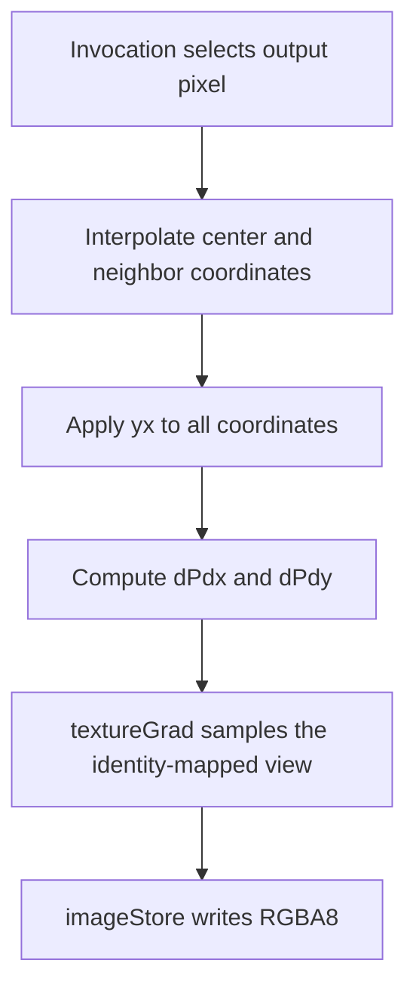

## Overview

**Core question:** Do 2D texture lookups use the requested image-view component mapping or shader-side coordinate swizzle, independent of pipeline and image backing?

- [`vktTextureSwizzleTests.cpp`](../../../modules/vulkan/texture/vktTextureSwizzleTests.cpp) implements the `texture.swizzle` test family described here.
- `component_mapping` tests `VkImageViewCreateInfo::components` for color and for the maintenance5-defined depth/stencil `ONE` case.
- `texture_coordinate` keeps RGBA view mapping and changes the coordinate expression in generated GLSL.
- The matrix uses graphics and compute rendering plus regular and fully resident sparse images. The host checks the complete output against an independently sampled and swizzled software image.

## Background Knowledge

For the shared concepts of image views, format interpretation, and sparse versus ordinary image backing, see [Background Knowledge](../../categories/texture.md#background-knowledge) of the `texture` page.

- **Image-view component mapping:** each destination R, G, B, or A value can select a source component, zero, one, or its identity component. Vulkan applies this mapping to texel input instructions; it is image-view state, not a GLSL result suffix. See [Component Swizzle](../../../../vulkan-docs/src/chapters/textures.adoc#L731-L792).
- **Depth/stencil `ONE` mapping:** a depth/stencil texel swizzled with `VK_COMPONENT_SWIZZLE_ONE` is undefined unless Vulkan 1.4 or `VK_KHR_maintenance5` applies and `depthStencilSwizzleOneSupport` is true. See the [depth/stencil exception](../../../../vulkan-docs/src/chapters/textures.adoc#L800-L810).
- **Coordinate swizzling:** `.yx` swaps the lookup axes; `.xx` and `.yy` duplicate one axis. These suffixes change the sampled position, not the returned component order.

## Registration Hierarchy

```text
texture.swizzle
├── component_mapping
└── texture_coordinate
```

`component_mapping` has `color`, `depth`, and `stencil` intermediate nodes. Depth and stencil are absent from Vulkan SC. The Vulkan default mustpass contains 11,504 leaves: 8,568 color, 48 depth, 32 stencil, and 2,856 coordinate-swizzle cases.

## Parameter Dimensions and Observed Values

| Dimension | Registered values | Meaning in this test | Evidence |
|-----------|-------------------|----------------------|----------|
| Behavior branch | `component_mapping.color`, `component_mapping.depth`, `component_mapping.stencil`, `texture_coordinate` | Selects the property under test. | [registration loops](../../../modules/vulkan/texture/vktTextureSwizzleTests.cpp#L511-L648) |
| Color format | 119 formats: 81 uncompressed and 38 ETC2, EAC, or ASTC | Covers normalized, scaled, integer, floating-point, sRGB, packed, and compressed samples. | [color formats](../../../modules/vulkan/texture/vktTextureSwizzleTests.cpp#L315-L439) |
| Depth/stencil format | six depth formats; four stencil formats | Selects one aspect and its float or unsigned-integer sampler path. | [aspect formats](../../../modules/vulkan/texture/vktTextureSwizzleTests.cpp#L441-L458) |
| Extent | `pot` = 128 by 64; `npot` = 51 by 65 | Covers power-of-two and non-power-of-two addressing. Non-square dimensions expose axis changes. | [sizes](../../../modules/vulkan/texture/vktTextureSwizzleTests.cpp#L461-L473) |
| Component mapping | `zzzz`, `oooo`, `rrrr`, `gggg`, `bbbb`, `aaaa`, `rgba`, `iiii`, `abgr` | Tests constants, replication, explicit default order, identity, and reversal. Depth/stencil use only `oooo`. | [mappings](../../../modules/vulkan/texture/vktTextureSwizzleTests.cpp#L485-L503) |
| Coordinate swizzle | `yx`, `xx`, `yy` | Swaps axes or duplicates x or y before sampling. | [coordinate table](../../../modules/vulkan/texture/vktTextureSwizzleTests.cpp#L505-L509) |
| Backing | regular or `_sparse` | Uses ordinary memory or a fully resident sparse image. Vulkan SC omits sparse leaves. | [backing table](../../../modules/vulkan/texture/vktTextureSwizzleTests.cpp#L475-L483) |
| Execution | graphics or `_compute` | Writes RGBA8 through a fragment shader or compute storage image. | [variant creation](../../../modules/vulkan/texture/vktTextureSwizzleTests.cpp#L537-L545) |
| Sampling state | nearest min/mag without mipmapping, repeat S/T | Keeps texel selection discrete, constrains sampling to the base level, and allows coordinates to wrap on either axis. The generated texture has a full mip pyramid, but the shared sampler mapping clamps this non-mipmapped mode to the base level. | [case parameters](../../../modules/vulkan/texture/vktTextureSwizzleTests.cpp#L527-L536), [texture construction](../../../modules/vulkan/pipeline/vktPipelineImageUtil.cpp#L1204-L1210), [sampler mapping](../../../framework/vulkan/vkImageUtil.cpp#L4472-L4507) |

## Behavior Parameters

The primary axis is the test family or aspect branch below `texture.swizzle`.

### `component_mapping.color`: map returned color components

The image view receives one of nine mappings while the shader performs an ordinary lookup. Replication cases also cover formats with absent channels: missing RGB components contribute zero and missing alpha contributes one.

### `component_mapping.depth`: substitute one for a depth view

The view selects the depth aspect and maps all returned components to `ONE`. Six formats exercise the behavior promised by `depthStencilSwizzleOneSupport`.

### `component_mapping.stencil`: substitute one for a stencil view

The view selects the stencil aspect of four formats and uses `usampler2D`. This separates integer stencil sampling from the floating-point depth path while testing the same maintenance5 rule.

### `texture_coordinate`: remap the lookup position

The view stays RGBA. Generated shaders insert `.yx`, `.xx`, or `.yy`; the software reference applies the corresponding coordinate map before interpolation and sampling.

## Shader Analysis

Two walkthroughs show the mechanisms in their actual locations. ABGR is invisible in shader text because it belongs to the view. The coordinate case exposes `.yx`, gradients, and compute output in GLSL.

### Representative Shader Walkthrough 1

#### Parameter Values Chosen

Representative path:

```text
dEQP-VK.texture.swizzle.component_mapping.color.r8g8b8a8_unorm_2d_pot_abgr
```

| Parameter choice | Meaning in this representative case |
|--------|---------|
| `component_mapping.color`, `abgr` | The image view returns source ABGR as destination RGBA. |
| `r8g8b8a8_unorm`, `pot` | Four-channel normalized 128 by 64 texture. |
| regular, graphics | Ordinary image allocation and fragment lookup. |

#### Purpose

The fragment shader samples without rearranging its result. An unswizzled `(r,g,b,a)` texel must therefore arrive as `(a,b,g,r)` solely because of image-view state.

#### Structural Design

| Stage or state | Operation | Consequence |
|----------------|-----------|-------------|
| Vertex stage | Pass position and coordinate | Rasterization supplies coordinates and derivatives. |
| Image view | Set components to ABGR | Vulkan rearranges the input texel. |
| Fragment stage | Call `texture` | No shader swizzle can mask a view-mapping error. |
| Output | Apply scale/bias and store RGBA8 | Produces the host-compared image. |

#### Shader Code

```glsl
#version 450
layout(location = 0) in highp vec2 v_texCoord;
layout(location = 0) out mediump vec4 dEQP_FragColor;
/// The uniform block carries the shared lookup color transform; this swizzle case uses its scale and bias fields.
layout (set=0, binding=0, std140) uniform Block
{
  highp float u_bias;
  highp float u_ref;
  highp vec4 u_colorScale;
  highp vec4 u_colorBias;
};
/// Set 1 binds the sampler and the image view whose VkComponentMapping is ABGR.
layout (set=1, binding=0) uniform highp sampler2D u_sampler;
void main (void)
{
  highp vec2 texCoord = v_texCoord;
  /// The shader performs an ordinary lookup; Vulkan applies the image-view component mapping to the returned texel.
  dEQP_FragColor = texture(u_sampler, texCoord) * u_colorScale + u_colorBias;
}
```

#### Additional Info

- [`TextureBinding::updateTextureViewMipLevels`](../../../modules/vulkan/texture/vktTextureTestUtil.cpp#L923-L966) places ABGR in the image view.
- The pass-through vertex stage is shared infrastructure, not tested swizzle logic.
- No explicit build options are supplied, so the baseline target is SPIR-V 1.0.

#### Parameter Variation Summary

| Parameter dimension | Shader-level variation from this shader | Evidence |
|-----------|-----------|----------|
| Mapping | Changes view state, not GLSL. | [view setup](../../../modules/vulkan/texture/vktTextureTestUtil.cpp#L923-L966) |
| Format | Selects float, signed-integer, or unsigned-integer sampler code. | [2D lookup generation](../../../modules/vulkan/texture/vktTextureTestUtil.cpp#L477-L507) |
| Coordinate family | Adds the chosen suffix to `texCoord`. | [suffix insertion](../../../modules/vulkan/texture/vktTextureTestUtil.cpp#L397-L398) |
| Compute | Replaces rasterization with coordinate reconstruction and `imageStore`. The lookup form depends on the format's program variant: for example, non-bias floating-point cases use `textureGrad`, while bias cases and integer cases follow separate generated paths. | [compute template and lookup generation](../../../modules/vulkan/texture/vktTextureTestUtil.cpp#L245-L331), [2D lookup selection](../../../modules/vulkan/texture/vktTextureTestUtil.cpp#L477-L507) |

#### SPIR-V

- Status: generated and validated
- Source: reconstructed `GLSL` from this walkthrough
- Stage: `frag`
- Target SPIRV version: `spirv1.0`

<details>
<summary>Click to expand SPIRV asm code</summary>

```llvm
; SPIR-V
; Version: 1.0
; Generator: Khronos Glslang Reference Front End; 11
; Bound: 36
; Schema: 0
               OpCapability Shader
          %1 = OpExtInstImport "GLSL.std.450"
               OpMemoryModel Logical GLSL450
               OpEntryPoint Fragment %main "main" %v_texCoord %dEQP_FragColor
               OpExecutionMode %main OriginUpperLeft
               OpSource GLSL 450
               OpName %main "main"
               OpName %texCoord "texCoord"
               OpName %v_texCoord "v_texCoord"
               OpName %dEQP_FragColor "dEQP_FragColor"
               OpName %u_sampler "u_sampler"
               OpName %Block "Block"
               OpMemberName %Block 0 "u_bias"
               OpMemberName %Block 1 "u_ref"
               OpMemberName %Block 2 "u_colorScale"
               OpMemberName %Block 3 "u_colorBias"
               OpName %_ ""
               OpDecorate %v_texCoord Location 0
               OpDecorate %dEQP_FragColor RelaxedPrecision
               OpDecorate %dEQP_FragColor Location 0
               OpDecorate %u_sampler Binding 0
               OpDecorate %u_sampler DescriptorSet 1
               OpDecorate %Block Block
               OpMemberDecorate %Block 0 Offset 0
               OpMemberDecorate %Block 1 Offset 4
               OpMemberDecorate %Block 2 Offset 16
               OpMemberDecorate %Block 3 Offset 32
               OpDecorate %_ Binding 0
               OpDecorate %_ DescriptorSet 0
       %void = OpTypeVoid
          %3 = OpTypeFunction %void
      %float = OpTypeFloat 32
    %v2float = OpTypeVector %float 2
%_ptr_Function_v2float = OpTypePointer Function %v2float
%_ptr_Input_v2float = OpTypePointer Input %v2float
 %v_texCoord = OpVariable %_ptr_Input_v2float Input
    %v4float = OpTypeVector %float 4
%_ptr_Output_v4float = OpTypePointer Output %v4float
%dEQP_FragColor = OpVariable %_ptr_Output_v4float Output
         %16 = OpTypeImage %float 2D 0 0 0 1 Unknown
         %17 = OpTypeSampledImage %16
%_ptr_UniformConstant_17 = OpTypePointer UniformConstant %17
  %u_sampler = OpVariable %_ptr_UniformConstant_17 UniformConstant
      %Block = OpTypeStruct %float %float %v4float %v4float
%_ptr_Uniform_Block = OpTypePointer Uniform %Block
          %_ = OpVariable %_ptr_Uniform_Block Uniform
        %int = OpTypeInt 32 1
      %int_2 = OpConstant %int 2
%_ptr_Uniform_v4float = OpTypePointer Uniform %v4float
      %int_3 = OpConstant %int 3
       %main = OpFunction %void None %3
          %5 = OpLabel
   %texCoord = OpVariable %_ptr_Function_v2float Function
         %12 = OpLoad %v2float %v_texCoord
               OpStore %texCoord %12
         %20 = OpLoad %17 %u_sampler
         %21 = OpLoad %v2float %texCoord
         %22 = OpImageSampleImplicitLod %v4float %20 %21
         %29 = OpAccessChain %_ptr_Uniform_v4float %_ %int_2
         %30 = OpLoad %v4float %29
         %31 = OpFMul %v4float %22 %30
         %33 = OpAccessChain %_ptr_Uniform_v4float %_ %int_3
         %34 = OpLoad %v4float %33
         %35 = OpFAdd %v4float %31 %34
               OpStore %dEQP_FragColor %35
               OpReturn
               OpFunctionEnd
```

</details>

### Representative Shader Walkthrough 2

#### Parameter Values Chosen

Representative path:

```text
dEQP-VK.texture.swizzle.texture_coordinate.r8g8b8a8_unorm_2d_pot_yx_compute
```

| Parameter choice | Meaning in this representative case |
|--------|---------|
| `texture_coordinate`, `yx` | Swap both lookup axes. |
| `r8g8b8a8_unorm`, `pot` | Sample a 128 by 64 normalized texture. |
| regular, `_compute` | Reconstruct quad coordinates and write an RGBA8 storage image. |

#### Purpose

Each invocation reconstructs the quad coordinate, swaps center and neighboring coordinates, then samples with explicit gradients. This matches the graphics interpretation of `.yx` without relying on rasterization.

#### Structural Design



#### Shader Code

```glsl
#version 450
layout (local_size_x = 16, local_size_y = 16, local_size_z = 1) in;
/// The uniform block supplies output dimensions and the color transform shared with the graphics path.
layout (set=0, binding=0, std140) uniform Block
{
  highp float u_bias;
  highp float u_ref;
  highp vec2  u_viewSize;
  highp vec4  u_colorScale;
  highp vec4  u_colorBias;
  int u_lod;
};
layout(push_constant) uniform PushConstants {
  ivec2 u_offset;
} pc;
/// The sampled texture uses identity image-view component mapping in the texture_coordinate family.
layout (set=0, binding=1) uniform highp sampler2D u_sampler;
/// Each invocation stores one converted sample in the R8G8B8A8_UNORM result image.
layout (set=0, binding=2, rgba8) uniform writeonly image2D u_outputImage;
/// Four texture coordinates and four clip-space positions reproduce the graphics quad's interpolation.
layout (set=0, binding=3, std430) readonly buffer Geometry
{
  vec4 u_texCoords[4];
  vec4 u_positions[4];
};
highp vec2 interpolate(vec2 p, ivec2 size)
{
  vec2 uv = (p + 0.5) / vec2(size);
  float w0 = u_positions[0].w; float w1 = u_positions[1].w;
  float w2 = u_positions[2].w; float w3 = u_positions[3].w;
  float b0, b1, b2, b3;
  if (uv.x + uv.y <= 1.0)
  {
    b0 = 1.0 - uv.x - uv.y;
    b1 = uv.y;
    b2 = uv.x;
    b3 = 0.0;
  }
  else
  {
    b0 = 0.0;
    b1 = 1.0 - uv.x;
    b2 = 1.0 - uv.y;
    b3 = uv.x + uv.y - 1.0;
  }
  highp vec2 tc =
      vec2(u_texCoords[0]) * (b0 / w0) +
      vec2(u_texCoords[1]) * (b1 / w1) +
      vec2(u_texCoords[2]) * (b2 / w2) +
      vec2(u_texCoords[3]) * (b3 / w3);
  float invW = (b0 / w0) + (b1 / w1) + (b2 / w2) + (b3 / w3);
  return vec2(tc / invW);
}
void main (void)
{
  ivec2 coord = ivec2(gl_GlobalInvocationID.xy);
  ivec2 size  = ivec2(u_viewSize);
  if (coord.x >= size.x || coord.y >= size.y)
    return;
  /// The yx suffix is the tested coordinate swizzle: s receives t and t receives s.
  highp vec2 texCoord = interpolate(vec2(coord), size).yx;
  highp vec2 texCoordX = interpolate(vec2(coord) + vec2(1.0, 0.0), size).yx;
  highp vec2 texCoordY = interpolate(vec2(coord) + vec2(0.0, 1.0), size).yx;
  highp vec2 dPdx = texCoordX - texCoord;
  highp vec2 dPdy = texCoordY - texCoord;
  /// Explicit gradients give the compute path the LOD information supplied by rasterization in the graphics path.
  vec4 result = textureGrad(u_sampler, texCoord, dPdx, dPdy) * u_colorScale + u_colorBias;
  imageStore(u_outputImage, coord + pc.u_offset, result);
}
```

#### Additional Info

- The geometry buffer contains four coordinates and four positions for the shared two-triangle quad.
- Push constants carry the output offset.
- The baseline target is SPIR-V 1.0.

#### Parameter Variation Summary

| Parameter dimension | Shader-level variation from this shader | Evidence |
|-----------|-----------|----------|
| Suffix | `.xx` or `.yy` replaces `.yx` on center and neighbor coordinates. | [coordinate cases](../../../modules/vulkan/texture/vktTextureSwizzleTests.cpp#L613-L644) |
| Component mapping | Removes the suffix and changes view state instead. | [mapping cases](../../../modules/vulkan/texture/vktTextureSwizzleTests.cpp#L517-L546) |
| Extent | Changes `u_viewSize` and workgroup count. | [dispatch](../../../modules/vulkan/texture/vktTextureTestUtil.cpp#L2726-L2744) |
| Sparse backing | Changes allocation/upload, not shader text. | [upload paths](../../../modules/vulkan/texture/vktTextureTestUtil.cpp#L808-L920) |

#### SPIR-V

- Status: generated and validated
- Source: reconstructed `GLSL` from this walkthrough
- Stage: `comp`
- Target SPIRV version: `spirv1.0`

<details>
<summary>Click to expand SPIRV asm code</summary>

```llvm
; SPIR-V
; Version: 1.0
; Generator: Khronos Glslang Reference Front End; 11
; Bound: 258
; Schema: 0
               OpCapability Shader
          %1 = OpExtInstImport "GLSL.std.450"
               OpMemoryModel Logical GLSL450
               OpEntryPoint GLCompute %main "main" %gl_GlobalInvocationID
               OpExecutionMode %main LocalSize 16 16 1
               OpSource GLSL 450
               OpName %main "main"
               OpName %interpolate_vf2_vi2_ "interpolate(vf2;vi2;"
               OpName %p "p"
               OpName %size "size"
               OpName %uv "uv"
               OpName %w0 "w0"
               OpName %Geometry "Geometry"
               OpMemberName %Geometry 0 "u_texCoords"
               OpMemberName %Geometry 1 "u_positions"
               OpName %_ ""
               OpName %w1 "w1"
               OpName %w2 "w2"
               OpName %w3 "w3"
               OpName %b0 "b0"
               OpName %b1 "b1"
               OpName %b2 "b2"
               OpName %b3 "b3"
               OpName %tc "tc"
               OpName %invW "invW"
               OpName %coord "coord"
               OpName %gl_GlobalInvocationID "gl_GlobalInvocationID"
               OpName %size_0 "size"
               OpName %Block "Block"
               OpMemberName %Block 0 "u_bias"
               OpMemberName %Block 1 "u_ref"
               OpMemberName %Block 2 "u_viewSize"
               OpMemberName %Block 3 "u_colorScale"
               OpMemberName %Block 4 "u_colorBias"
               OpMemberName %Block 5 "u_lod"
               OpName %__0 ""
               OpName %texCoord "texCoord"
               OpName %param "param"
               OpName %param_0 "param"
               OpName %texCoordX "texCoordX"
               OpName %param_1 "param"
               OpName %param_2 "param"
               OpName %texCoordY "texCoordY"
               OpName %param_3 "param"
               OpName %param_4 "param"
               OpName %dPdx "dPdx"
               OpName %dPdy "dPdy"
               OpName %result "result"
               OpName %u_sampler "u_sampler"
               OpName %u_outputImage "u_outputImage"
               OpName %PushConstants "PushConstants"
               OpMemberName %PushConstants 0 "u_offset"
               OpName %pc "pc"
               OpDecorate %_arr_v4float_uint_4 ArrayStride 16
               OpDecorate %_arr_v4float_uint_4_0 ArrayStride 16
               OpDecorate %Geometry BufferBlock
               OpMemberDecorate %Geometry 0 NonWritable
               OpMemberDecorate %Geometry 0 Offset 0
               OpMemberDecorate %Geometry 1 NonWritable
               OpMemberDecorate %Geometry 1 Offset 64
               OpDecorate %_ NonWritable
               OpDecorate %_ Binding 3
               OpDecorate %_ DescriptorSet 0
               OpDecorate %gl_GlobalInvocationID BuiltIn GlobalInvocationId
               OpDecorate %Block Block
               OpMemberDecorate %Block 0 Offset 0
               OpMemberDecorate %Block 1 Offset 4
               OpMemberDecorate %Block 2 Offset 8
               OpMemberDecorate %Block 3 Offset 16
               OpMemberDecorate %Block 4 Offset 32
               OpMemberDecorate %Block 5 Offset 48
               OpDecorate %__0 Binding 0
               OpDecorate %__0 DescriptorSet 0
               OpDecorate %u_sampler Binding 1
               OpDecorate %u_sampler DescriptorSet 0
               OpDecorate %u_outputImage NonReadable
               OpDecorate %u_outputImage Binding 2
               OpDecorate %u_outputImage DescriptorSet 0
               OpDecorate %PushConstants Block
               OpMemberDecorate %PushConstants 0 Offset 0
               OpDecorate %gl_WorkGroupSize BuiltIn WorkgroupSize
       %void = OpTypeVoid
          %3 = OpTypeFunction %void
      %float = OpTypeFloat 32
    %v2float = OpTypeVector %float 2
%_ptr_Function_v2float = OpTypePointer Function %v2float
        %int = OpTypeInt 32 1
      %v2int = OpTypeVector %int 2
%_ptr_Function_v2int = OpTypePointer Function %v2int
         %12 = OpTypeFunction %v2float %_ptr_Function_v2float %_ptr_Function_v2int
  %float_0_5 = OpConstant %float 0.5
%_ptr_Function_float = OpTypePointer Function %float
    %v4float = OpTypeVector %float 4
       %uint = OpTypeInt 32 0
     %uint_4 = OpConstant %uint 4
%_arr_v4float_uint_4 = OpTypeArray %v4float %uint_4
%_arr_v4float_uint_4_0 = OpTypeArray %v4float %uint_4
   %Geometry = OpTypeStruct %_arr_v4float_uint_4 %_arr_v4float_uint_4_0
%_ptr_Uniform_Geometry = OpTypePointer Uniform %Geometry
          %_ = OpVariable %_ptr_Uniform_Geometry Uniform
      %int_1 = OpConstant %int 1
      %int_0 = OpConstant %int 0
     %uint_3 = OpConstant %uint 3
%_ptr_Uniform_float = OpTypePointer Uniform %float
      %int_2 = OpConstant %int 2
      %int_3 = OpConstant %int 3
     %uint_0 = OpConstant %uint 0
     %uint_1 = OpConstant %uint 1
    %float_1 = OpConstant %float 1
       %bool = OpTypeBool
    %float_0 = OpConstant %float 0
%_ptr_Uniform_v4float = OpTypePointer Uniform %v4float
     %v3uint = OpTypeVector %uint 3
%_ptr_Input_v3uint = OpTypePointer Input %v3uint
%gl_GlobalInvocationID = OpVariable %_ptr_Input_v3uint Input
     %v2uint = OpTypeVector %uint 2
      %Block = OpTypeStruct %float %float %v2float %v4float %v4float %int
%_ptr_Uniform_Block = OpTypePointer Uniform %Block
        %__0 = OpVariable %_ptr_Uniform_Block Uniform
%_ptr_Uniform_v2float = OpTypePointer Uniform %v2float
%_ptr_Function_int = OpTypePointer Function %int
        %200 = OpConstantComposite %v2float %float_1 %float_0
        %210 = OpConstantComposite %v2float %float_0 %float_1
%_ptr_Function_v4float = OpTypePointer Function %v4float
        %227 = OpTypeImage %float 2D 0 0 0 1 Unknown
        %228 = OpTypeSampledImage %227
%_ptr_UniformConstant_228 = OpTypePointer UniformConstant %228
  %u_sampler = OpVariable %_ptr_UniformConstant_228 UniformConstant
      %int_4 = OpConstant %int 4
        %243 = OpTypeImage %float 2D 0 0 0 2 Rgba8
%_ptr_UniformConstant_243 = OpTypePointer UniformConstant %243
%u_outputImage = OpVariable %_ptr_UniformConstant_243 UniformConstant
%PushConstants = OpTypeStruct %v2int
%_ptr_PushConstant_PushConstants = OpTypePointer PushConstant %PushConstants
         %pc = OpVariable %_ptr_PushConstant_PushConstants PushConstant
%_ptr_PushConstant_v2int = OpTypePointer PushConstant %v2int
    %uint_16 = OpConstant %uint 16
%gl_WorkGroupSize = OpConstantComposite %v3uint %uint_16 %uint_16 %uint_1
       %main = OpFunction %void None %3
          %5 = OpLabel
      %coord = OpVariable %_ptr_Function_v2int Function
     %size_0 = OpVariable %_ptr_Function_v2int Function
   %texCoord = OpVariable %_ptr_Function_v2float Function
      %param = OpVariable %_ptr_Function_v2float Function
    %param_0 = OpVariable %_ptr_Function_v2int Function
  %texCoordX = OpVariable %_ptr_Function_v2float Function
    %param_1 = OpVariable %_ptr_Function_v2float Function
    %param_2 = OpVariable %_ptr_Function_v2int Function
  %texCoordY = OpVariable %_ptr_Function_v2float Function
    %param_3 = OpVariable %_ptr_Function_v2float Function
    %param_4 = OpVariable %_ptr_Function_v2int Function
       %dPdx = OpVariable %_ptr_Function_v2float Function
       %dPdy = OpVariable %_ptr_Function_v2float Function
     %result = OpVariable %_ptr_Function_v4float Function
        %160 = OpLoad %v3uint %gl_GlobalInvocationID
        %161 = OpVectorShuffle %v2uint %160 %160 0 1
        %162 = OpBitcast %v2int %161
               OpStore %coord %162
        %168 = OpAccessChain %_ptr_Uniform_v2float %__0 %int_2
        %169 = OpLoad %v2float %168
        %170 = OpConvertFToS %v2int %169
               OpStore %size_0 %170
        %172 = OpAccessChain %_ptr_Function_int %coord %uint_0
        %173 = OpLoad %int %172
        %174 = OpAccessChain %_ptr_Function_int %size_0 %uint_0
        %175 = OpLoad %int %174
        %176 = OpSGreaterThanEqual %bool %173 %175
        %177 = OpLogicalNot %bool %176
               OpSelectionMerge %179 None
               OpBranchConditional %177 %178 %179
        %178 = OpLabel
        %180 = OpAccessChain %_ptr_Function_int %coord %uint_1
        %181 = OpLoad %int %180
        %182 = OpAccessChain %_ptr_Function_int %size_0 %uint_1
        %183 = OpLoad %int %182
        %184 = OpSGreaterThanEqual %bool %181 %183
               OpBranch %179
        %179 = OpLabel
        %185 = OpPhi %bool %176 %5 %184 %178
               OpSelectionMerge %187 None
               OpBranchConditional %185 %186 %187
        %186 = OpLabel
               OpReturn
        %187 = OpLabel
        %190 = OpLoad %v2int %coord
        %191 = OpConvertSToF %v2float %190
               OpStore %param %191
        %194 = OpLoad %v2int %size_0
               OpStore %param_0 %194
        %195 = OpFunctionCall %v2float %interpolate_vf2_vi2_ %param %param_0
        %196 = OpVectorShuffle %v2float %195 %195 1 0
               OpStore %texCoord %196
        %198 = OpLoad %v2int %coord
        %199 = OpConvertSToF %v2float %198
        %201 = OpFAdd %v2float %199 %200
               OpStore %param_1 %201
        %204 = OpLoad %v2int %size_0
               OpStore %param_2 %204
        %205 = OpFunctionCall %v2float %interpolate_vf2_vi2_ %param_1 %param_2
        %206 = OpVectorShuffle %v2float %205 %205 1 0
               OpStore %texCoordX %206
        %208 = OpLoad %v2int %coord
        %209 = OpConvertSToF %v2float %208
        %211 = OpFAdd %v2float %209 %210
               OpStore %param_3 %211
        %214 = OpLoad %v2int %size_0
               OpStore %param_4 %214
        %215 = OpFunctionCall %v2float %interpolate_vf2_vi2_ %param_3 %param_4
        %216 = OpVectorShuffle %v2float %215 %215 1 0
               OpStore %texCoordY %216
        %218 = OpLoad %v2float %texCoordX
        %219 = OpLoad %v2float %texCoord
        %220 = OpFSub %v2float %218 %219
               OpStore %dPdx %220
        %222 = OpLoad %v2float %texCoordY
        %223 = OpLoad %v2float %texCoord
        %224 = OpFSub %v2float %222 %223
               OpStore %dPdy %224
        %231 = OpLoad %228 %u_sampler
        %232 = OpLoad %v2float %texCoord
        %233 = OpLoad %v2float %dPdx
        %234 = OpLoad %v2float %dPdy
        %235 = OpImageSampleExplicitLod %v4float %231 %232 Grad %233 %234
        %236 = OpAccessChain %_ptr_Uniform_v4float %__0 %int_3
        %237 = OpLoad %v4float %236
        %238 = OpFMul %v4float %235 %237
        %240 = OpAccessChain %_ptr_Uniform_v4float %__0 %int_4
        %241 = OpLoad %v4float %240
        %242 = OpFAdd %v4float %238 %241
               OpStore %result %242
        %246 = OpLoad %243 %u_outputImage
        %247 = OpLoad %v2int %coord
        %252 = OpAccessChain %_ptr_PushConstant_v2int %pc %int_0
        %253 = OpLoad %v2int %252
        %254 = OpIAdd %v2int %247 %253
        %255 = OpLoad %v4float %result
               OpImageWrite %246 %254 %255
               OpReturn
               OpFunctionEnd
%interpolate_vf2_vi2_ = OpFunction %v2float None %12
          %p = OpFunctionParameter %_ptr_Function_v2float
       %size = OpFunctionParameter %_ptr_Function_v2int
         %16 = OpLabel
         %uv = OpVariable %_ptr_Function_v2float Function
         %w0 = OpVariable %_ptr_Function_float Function
         %w1 = OpVariable %_ptr_Function_float Function
         %w2 = OpVariable %_ptr_Function_float Function
         %w3 = OpVariable %_ptr_Function_float Function
         %b0 = OpVariable %_ptr_Function_float Function
         %b1 = OpVariable %_ptr_Function_float Function
         %b2 = OpVariable %_ptr_Function_float Function
         %b3 = OpVariable %_ptr_Function_float Function
         %tc = OpVariable %_ptr_Function_v2float Function
       %invW = OpVariable %_ptr_Function_float Function
         %18 = OpLoad %v2float %p
         %20 = OpCompositeConstruct %v2float %float_0_5 %float_0_5
         %21 = OpFAdd %v2float %18 %20
         %22 = OpLoad %v2int %size
         %23 = OpConvertSToF %v2float %22
         %24 = OpFDiv %v2float %21 %23
               OpStore %uv %24
         %39 = OpAccessChain %_ptr_Uniform_float %_ %int_1 %int_0 %uint_3
         %40 = OpLoad %float %39
               OpStore %w0 %40
         %42 = OpAccessChain %_ptr_Uniform_float %_ %int_1 %int_1 %uint_3
         %43 = OpLoad %float %42
               OpStore %w1 %43
         %46 = OpAccessChain %_ptr_Uniform_float %_ %int_1 %int_2 %uint_3
         %47 = OpLoad %float %46
               OpStore %w2 %47
         %50 = OpAccessChain %_ptr_Uniform_float %_ %int_1 %int_3 %uint_3
         %51 = OpLoad %float %50
               OpStore %w3 %51
         %53 = OpAccessChain %_ptr_Function_float %uv %uint_0
         %54 = OpLoad %float %53
         %56 = OpAccessChain %_ptr_Function_float %uv %uint_1
         %57 = OpLoad %float %56
         %58 = OpFAdd %float %54 %57
         %61 = OpFOrdLessThanEqual %bool %58 %float_1
               OpSelectionMerge %63 None
               OpBranchConditional %61 %62 %79
         %62 = OpLabel
         %65 = OpAccessChain %_ptr_Function_float %uv %uint_0
         %66 = OpLoad %float %65
         %67 = OpFSub %float %float_1 %66
         %68 = OpAccessChain %_ptr_Function_float %uv %uint_1
         %69 = OpLoad %float %68
         %70 = OpFSub %float %67 %69
               OpStore %b0 %70
         %72 = OpAccessChain %_ptr_Function_float %uv %uint_1
         %73 = OpLoad %float %72
               OpStore %b1 %73
         %75 = OpAccessChain %_ptr_Function_float %uv %uint_0
         %76 = OpLoad %float %75
               OpStore %b2 %76
               OpStore %b3 %float_0
               OpBranch %63
         %79 = OpLabel
               OpStore %b0 %float_0
         %80 = OpAccessChain %_ptr_Function_float %uv %uint_0
         %81 = OpLoad %float %80
         %82 = OpFSub %float %float_1 %81
               OpStore %b1 %82
         %83 = OpAccessChain %_ptr_Function_float %uv %uint_1
         %84 = OpLoad %float %83
         %85 = OpFSub %float %float_1 %84
               OpStore %b2 %85
         %86 = OpAccessChain %_ptr_Function_float %uv %uint_0
         %87 = OpLoad %float %86
         %88 = OpAccessChain %_ptr_Function_float %uv %uint_1
         %89 = OpLoad %float %88
         %90 = OpFAdd %float %87 %89
         %91 = OpFSub %float %90 %float_1
               OpStore %b3 %91
               OpBranch %63
         %63 = OpLabel
         %94 = OpAccessChain %_ptr_Uniform_v4float %_ %int_0 %int_0
         %95 = OpLoad %v4float %94
         %96 = OpCompositeExtract %float %95 0
         %97 = OpCompositeExtract %float %95 1
         %98 = OpCompositeConstruct %v2float %96 %97
         %99 = OpLoad %float %b0
        %100 = OpLoad %float %w0
        %101 = OpFDiv %float %99 %100
        %102 = OpVectorTimesScalar %v2float %98 %101
        %103 = OpAccessChain %_ptr_Uniform_v4float %_ %int_0 %int_1
        %104 = OpLoad %v4float %103
        %105 = OpCompositeExtract %float %104 0
        %106 = OpCompositeExtract %float %104 1
        %107 = OpCompositeConstruct %v2float %105 %106
        %108 = OpLoad %float %b1
        %109 = OpLoad %float %w1
        %110 = OpFDiv %float %108 %109
        %111 = OpVectorTimesScalar %v2float %107 %110
        %112 = OpFAdd %v2float %102 %111
        %113 = OpAccessChain %_ptr_Uniform_v4float %_ %int_0 %int_2
        %114 = OpLoad %v4float %113
        %115 = OpCompositeExtract %float %114 0
        %116 = OpCompositeExtract %float %114 1
        %117 = OpCompositeConstruct %v2float %115 %116
        %118 = OpLoad %float %b2
        %119 = OpLoad %float %w2
        %120 = OpFDiv %float %118 %119
        %121 = OpVectorTimesScalar %v2float %117 %120
        %122 = OpFAdd %v2float %112 %121
        %123 = OpAccessChain %_ptr_Uniform_v4float %_ %int_0 %int_3
        %124 = OpLoad %v4float %123
        %125 = OpCompositeExtract %float %124 0
        %126 = OpCompositeExtract %float %124 1
        %127 = OpCompositeConstruct %v2float %125 %126
        %128 = OpLoad %float %b3
        %129 = OpLoad %float %w3
        %130 = OpFDiv %float %128 %129
        %131 = OpVectorTimesScalar %v2float %127 %130
        %132 = OpFAdd %v2float %122 %131
               OpStore %tc %132
        %134 = OpLoad %float %b0
        %135 = OpLoad %float %w0
        %136 = OpFDiv %float %134 %135
        %137 = OpLoad %float %b1
        %138 = OpLoad %float %w1
        %139 = OpFDiv %float %137 %138
        %140 = OpFAdd %float %136 %139
        %141 = OpLoad %float %b2
        %142 = OpLoad %float %w2
        %143 = OpFDiv %float %141 %142
        %144 = OpFAdd %float %140 %143
        %145 = OpLoad %float %b3
        %146 = OpLoad %float %w3
        %147 = OpFDiv %float %145 %146
        %148 = OpFAdd %float %144 %147
               OpStore %invW %148
        %149 = OpLoad %v2float %tc
        %150 = OpLoad %float %invW
        %151 = OpCompositeConstruct %v2float %150 %150
        %152 = OpFDiv %v2float %149 %151
               OpReturnValue %152
               OpFunctionEnd
```

</details>

## Runtime Execution and Result Checking

- The instance creates a generated 2D texture and a `TextureRenderer` with the selected mapping and pipeline. It adds the texture with the chosen aspect and backing mode.
- Regular images bind one allocation. Sparse images use sparse binding and residency flags, verify sparse format properties, and upload the same fully resident content through `uploadTestTextureSparse`. Both finish in `VK_IMAGE_LAYOUT_SHADER_READ_ONLY_OPTIMAL`.
- The image view selects color, depth, or stencil and stores the tested mapping. Graphics cases draw two triangles; compute cases bind uniform, sampled-image, storage-image, and geometry resources and dispatch 16 by 16 workgroups.
- The host samples a `tcu::Texture2DView` with exact LOD, nearest filtering, repeat addressing, lookup scale, and lookup bias. Coordinate cases remap coordinate vectors before interpolation.
- For non-default component mappings, the host rewrites each reference pixel. `ZERO` and absent RGB use transformed zero; `ONE` and absent alpha use transformed one; R, G, B, and A select available source components.
- [`compareImages`](../../../modules/vulkan/texture/vktTextureSwizzleTests.cpp#L302-L306) checks the full image with `pixelFormat.getColorThreshold() + RGBA(2,2,2,2)`. Any out-of-threshold pixel fails.

## Failure Meaning

### Failure Cause Mapping

| If this behavior parameter value fails | Possible failure cause(s) |
|----------------------------------------|---------------------------|
| `component_mapping.color` | Incorrect image-view component selection, zero/one substitution, identity handling, missing-component defaults, or sampled-format conversion. |
| `component_mapping.depth` | Incorrect `ONE` swizzle handling for a depth-aspect image view, or incorrect depth-format sampling and conversion under maintenance5 support. |
| `component_mapping.stencil` | Incorrect `ONE` swizzle handling for a stencil-aspect image view, or incorrect unsigned-integer stencil sampling and conversion under maintenance5 support. |
| `texture_coordinate` | Incorrect shader coordinate swizzle, coordinate interpolation or compute reconstruction, explicit-gradient handling, or nearest sampling at the remapped coordinates. |

A failure in any branch can also come from image upload, sparse binding/residency, image-view creation, descriptor binding, graphics/compute output, synchronization, readback, or software-reference disagreement shared by the matrix.

### Cause Analysis

#### Color component mapping

**Possible failure symptoms:** constants vary, replicated channels disagree, `rgba` and `iiii` differ, `abgr` uses the wrong order, or reduced-channel formats fail.

**Possible implementation causes:** the implementation may apply destination-to-source selection in the wrong order, mishandle constants or identity, use wrong absent-component defaults, or place format conversion incorrectly relative to view swizzling.

#### Depth or stencil `ONE`

**Possible failure symptoms:** output is not transformed one in all channels, errors depend on the selected aspect, or only combined formats fail.

**Possible implementation causes:** the implementation may ignore the aspect, use stored texel data despite `ONE`, mishandle float versus unsigned-integer sampling, or advertise `depthStencilSwizzleOneSupport` without implementing it for an advertised format.

#### Coordinate swizzle

**Possible failure symptoms:** `.yx` resembles unswizzled output, duplicated-coordinate cases vary along the wrong axis, or only compute variants disagree.

**Possible implementation causes:** vector shuffles, interpolation, nearest selection, compute coordinate reconstruction, or explicit-gradient lowering may be wrong. A compute-only pattern points away from image-view mapping.

#### Shared resource and result path

**Possible failure symptoms:** regular and sparse cases diverge, graphics and compute fail broadly, or unrelated mappings share one spatial error pattern.

**Possible implementation causes:** upload, sparse residency, view/descriptors, barriers, output conversion, or copyback may expose wrong data. If device output is consistent and only the host reference differs, inspect format scaling and reference conversion.

## Case Pruning

### Requirement-based pruning

- Depth and stencil require `VK_KHR_maintenance5` and `depthStencilSwizzleOneSupport`.
- Image format queries must accept the selected format, extent, usage, and flags. Sparse cases also need sparse image format properties.
- [`TextureBinding::updateTextureData`](../../../modules/vulkan/texture/vktTextureTestUtil.cpp#L840-L842) rejects depth/stencil formats when `m_useCompute` is true. Registered depth/stencil `_compute` leaves therefore report not supported before dispatch.
- Vulkan SC omits sparse backing and depth/stencil branches.

### Design-based pruning

- Color uses all nine mappings. Depth/stencil use only `oooo`, the mapping controlled by the maintenance5 property.
- Linear filtering and mipmapped sampling are excluded. Nearest filtering keeps texel selection discrete, and the non-mipmapped sampler mode constrains sampling to the base level even though the generated texture has a full mip pyramid.
- The family covers 2D textures only.

## Key Takeaways

- Component mapping lives in the image view. The shader cannot hide a bad mapping with its own swizzle.
- Coordinate mapping lives in generated shader code and applies to graphics and compute coordinate construction.
- Depth/stencil test one maintenance5 contract: defined `ONE` substitution.
- Regular/sparse and graphics/compute pairs share one software verifier, making backing-specific and pipeline-specific failures visible.
- See `## Failure Meaning` for diagnosis details.

## Source Reference Appendix

| Entry point | Link | Why it matters |
|-------------|------|----------------|
| Category dispatch | [`createTextureTests`](../../../modules/vulkan/texture/vktTextureTests.cpp#L48-L66) | Attaches `swizzle` under `texture`. |
| Matrix registration | [`populateTextureSwizzleTests`](../../../modules/vulkan/texture/vktTextureSwizzleTests.cpp#L311-L649) | Defines parameters, hierarchy, and leaves. |
| Support | [`SwizzleTestCase::checkSupport`](../../../modules/vulkan/texture/vktTextureSwizzleTests.cpp#L75-L90) | Applies maintenance5 gates. |
| Runtime and verifier | [`Swizzle2DTestInstance`](../../../modules/vulkan/texture/vktTextureSwizzleTests.cpp#L129-L307) | Creates resources, renders the reference, applies swizzles, and compares. |
| Shader generator | [`initializePrograms`](../../../modules/vulkan/texture/vktTextureTestUtil.cpp#L210-L510) | Emits graphics/compute programs and coordinate suffixes. |
| Image and view setup | [`TextureBinding`](../../../modules/vulkan/texture/vktTextureTestUtil.cpp#L808-L966) | Implements regular/sparse upload, aspect selection, and mapping. |
| Graphics backend | [`GraphicsBackend`](../../../modules/vulkan/texture/vktTextureTestUtil.cpp#L2040-L2526) | Draws and copies output. |
| Compute backend | [`ComputeBackend`](../../../modules/vulkan/texture/vktTextureTestUtil.cpp#L2528-L2806) | Dispatches, stores, and copies output. |
| Vulkan semantics | [Component Swizzle](../../../../vulkan-docs/src/chapters/textures.adoc#L731-L810) | Defines mapping and the depth/stencil condition. |
| Maintenance5 property | [Physical Device Limits](../../../../vulkan-docs/src/chapters/limits.adoc#L1863-L1868) | Defines `depthStencilSwizzleOneSupport`. |
| Current leaves | [`vk-default/texture.txt`](../../../mustpass/main/vk-default/texture.txt#L15774-L27277) | Confirms current names and coverage. |
