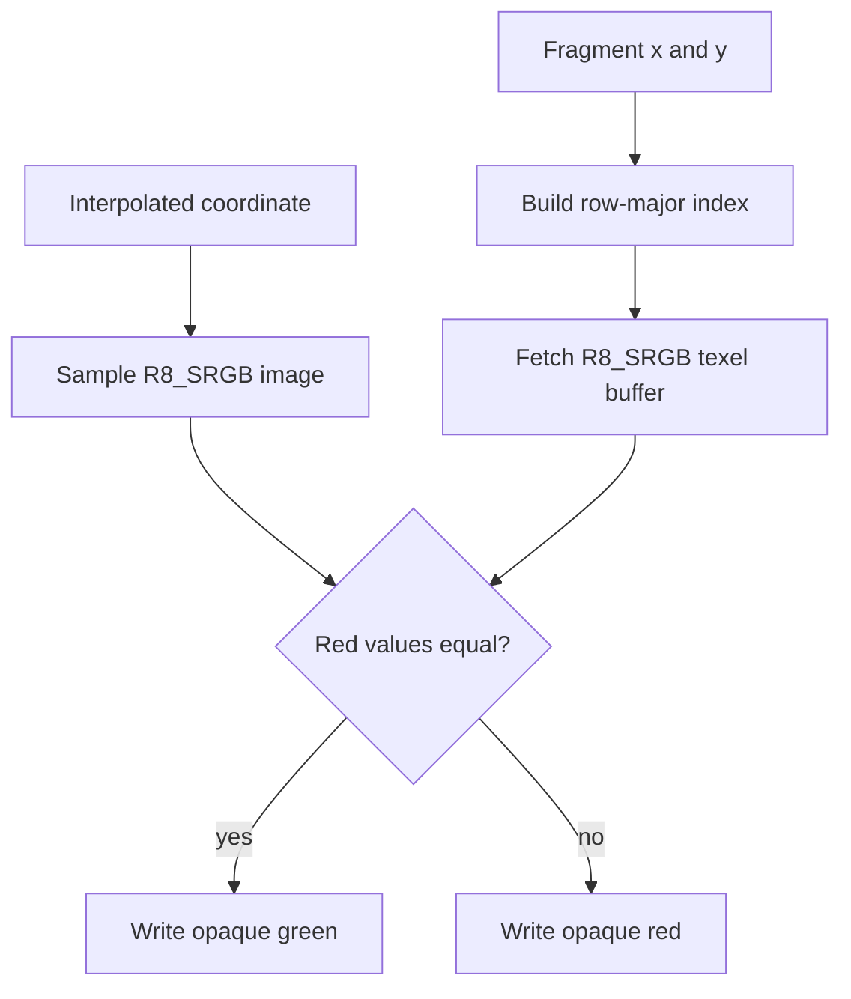

## Overview

**Core question:** Does a Vulkan uniform texel buffer return the values defined by its view format for sRGB, packed, and signed-normalized data?

- The `texture.texel_buffer` test family contains 23 Amber graphics cases under its direct child `uniform`.
- Every case reads a formatted buffer view with `texelFetch`. The view format controls component extraction and numeric conversion.
- Six cases compare sRGB buffer reads with sampled-image reads of identical bytes. Seven cases check packed 32-bit formats. Ten cases cover 8-bit and 16-bit SNORM conversion, including the extra most-negative encoding.
- Amber owns resource creation, drawing, and result comparison. The C++ layer registers recipe files and checks format support before execution.

## Background Knowledge

For the shared concepts of image views and format conversion, see [Background Knowledge](../../categories/texture.md#background-knowledge) of the `texture` page.

- **Uniform texel buffer:** A uniform texel buffer presents a packed one-dimensional array through a formatted buffer view. GLSL uses `samplerBuffer`, `isamplerBuffer`, or `usamplerBuffer` according to the view's numeric type. `texelFetch` takes an integer element index and returns the components produced by the view format.
- **sRGB conversion:** An sRGB read interprets stored components as UNORM and converts R, G, and B from nonlinear sRGB encoding to linear values. Alpha remains unchanged.
- **SNORM conversion:** A signed normalized integer maps to `[-1,1]`. The conversion clamps the extra most-negative two's-complement value to `-1.0`. For example, both `-127` and `-128` in an 8-bit component produce `-1.0`.
- **Packed format:** A packed format places several components into bit fields of one word. The format defines field positions, component order, and whether each field represents an integer, normalized number, or floating-point number.

## Registration Hierarchy

```text
texture.texel_buffer
└── uniform
```

The `uniform` child contains the `srgb`, `packed`, and `snorm` intermediate nodes. This page lists them in prose and tables because the canonical tree shows one level beneath its root.

## Parameter Dimensions and Observed Values

| Dimension | Registered values | Meaning in this test | Evidence |
|-----------|-------------------|----------------------|----------|
| Behavioral family | `srgb` (6 cases), `packed` (7 cases), `snorm` (10 cases) | Selects comparison between resource paths, packed-word decoding, or signed-normalized conversion. | [Registration](../../../modules/vulkan/texture/vktTextureTexelBufferTests.cpp#L38-L160) |
| sRGB format | `r8g8b8a8_srgb`, `b8g8r8a8_srgb`, `b8g8r8_srgb`, `r8g8b8_srgb`, `r8g8_srgb`, `r8_srgb` | Changes channel count and memory order while retaining the same image-versus-buffer equality check. | [sRGB cases](../../../modules/vulkan/texture/vktTextureTexelBufferTests.cpp#L42-L94) |
| Packed format | `a2b10g10r10-uint-pack32`, `a2b10g10r10-unorm-pack32`, `a8b8g8r8-sint-pack32`, `a8b8g8r8-snorm-pack32`, `a8b8g8r8-uint-pack32`, `a8b8g8r8-unorm-pack32`, `b10g11r11-ufloat-pack32` | Varies field widths, component order, and integer, normalized, or unsigned-float interpretation. | [Packed cases](../../../modules/vulkan/texture/vktTextureTexelBufferTests.cpp#L96-L118) |
| SNORM format | `b8g8r8-snorm`, `b8g8r8a8-snorm`, `r16-snorm`, `r16g16-snorm`, `r16g16b16-snorm`, `r16g16b16a16-snorm`, `r8-snorm`, `r8g8-snorm`, `r8g8b8-snorm`, `r8g8b8a8-snorm` | Varies component width, count, and order across sequences containing negative values, zero, positive values, and both negative endpoints. | [SNORM cases](../../../modules/vulkan/texture/vktTextureTexelBufferTests.cpp#L120-L160) |
| Buffer sampler type | `samplerBuffer`, `isamplerBuffer`, `usamplerBuffer` | Matches floating-point/normalized, signed-integer, or unsigned-integer values returned by the format. | [Packed Amber recipes](../../../data/vulkan/amber/texture/texel_buffer/uniform/packed/), [SNORM Amber recipes](../../../data/vulkan/amber/texture/texel_buffer/uniform/snorm/) |
| Validation size | sRGB: 8 by 8; packed: eight columns by 100 rows; SNORM: 39 or 35 columns by 128 rows | Gives every selected buffer element repeated or full-height output coverage. | [`r8_srgb.amber`](../../../data/vulkan/amber/texture/texel_buffer/uniform/srgb/r8_srgb.amber), [`a2b10g10r10-uint-pack32.amber`](../../../data/vulkan/amber/texture/texel_buffer/uniform/packed/a2b10g10r10-uint-pack32.amber), [`r8-snorm.amber`](../../../data/vulkan/amber/texture/texel_buffer/uniform/snorm/r8-snorm.amber) |

The default Vulkan mustpass inventory contains all 23 registered leaves at `dEQP-VK.texture.texel_buffer.uniform.<family>.<case>`.

## Behavior Parameters

The family below `texture.texel_buffer.uniform` is the primary behavioral axis. Choosing a value changes both the conversion under test and the validation method.

### `srgb`: compare image and texel-buffer conversion

Each case stores the same bytes in an 8 by 8 sampled image and a 64-element uniform texel buffer. The fragment shader maps each framebuffer pixel to the corresponding row-major buffer index, reads both resources, and writes green when their returned values match. Multi-component cases compare the full `vec4`; `r8_srgb` compares red because that channel carries the source data.

The test uses the sampled-image path as an on-device reference for the texel-buffer path. An all-green framebuffer shows that both paths applied the same format-dependent component mapping and sRGB conversion to every supplied texel.

### `packed`: decode selected 32-bit words

Each packed case supplies four selected 32-bit words. The fragment shader cycles through them with `int(gl_FragCoord.x) % 4`, fetches through the matching buffer sampler type, and writes the result to a `B8G8R8A8_UNORM` framebuffer.

The words isolate recognizable components. For example, `a2b10g10r10-uint-pack32` uses `0x40000001`, `0x40000400`, `0x40100000`, and `0x40100400` to produce red, green, blue, and green-plus-blue patterns with alpha set. Other recipes retain the four-word structure while changing packed layout or numeric interpretation.

### `snorm`: convert signed fixed-point values and clamp the lowest encoding

The SNORM recipes fill the uniform texel buffer with component sequences that step through negative and positive stored integers. The 8-bit cases cycle through 39 texels; the 16-bit cases use 35. Their sequences include the signed integer encoding `-1`, zero, ordinary positive values, the ordinary negative endpoint (`-127` or `-32767`), and the extra most-negative encoding (`-128` or `-32768`).

The fragment shader fetches one texel and computes `(value + 1.0) / 2.0`, moving the SNORM interval into the UNORM framebuffer's `[0,1]` interval. It sets absent channels to fixed values. Amber checks each expected column with one output-byte tolerance. For both component widths, the ordinary negative endpoint and the extra most-negative encoding must map to framebuffer value zero, which checks the required clamp to `-1.0`.

## Shader Analysis

The walkthrough uses one sRGB case to show the formatted-buffer operation and resource-path comparison. Packed and SNORM recipes use the same `texelFetch` mechanism with different sampler types and output handling. The text after the walkthrough summarizes those variations.

### Representative Shader Walkthrough 1

#### Parameter Values Chosen

Representative path:

```text
dEQP-VK.texture.texel_buffer.uniform.srgb.r8_srgb
```

| Parameter choice | Meaning in this representative case |
|------------------|-------------------------------------|
| `uniform.srgb` | Compares one uniform texel-buffer fetch with the same source texel read through a sampled image. |
| `r8_srgb` | Uses one stored sRGB channel, so the shader compares red and ignores default values supplied for absent channels. |
| 8 by 8 resources | Lets fragment coordinates map to all 64 row-major buffer elements. |

#### Purpose

The fragment shader checks whether an `R8_SRGB` uniform texel-buffer view returns the same converted red value as an `R8_SRGB` sampled image initialized with identical bytes.

#### Structural Design



#### Shader Code

```glsl
#version 430
layout(location = 0) in vec2 texCoordsIn;
layout(location = 0) out vec4 colorOut;
/// Binding 0 samples the 8 by 8 R8_SRGB image used as the reference path.
layout(set=0, binding=0) uniform sampler2D referenceSampler;
/// Binding 1 reads the same 64 bytes through an R8_SRGB uniform texel-buffer view.
layout(set=0, binding=1) uniform samplerBuffer bufferSampler;
void main() {
  vec4 referenceValue = texture(referenceSampler, texCoordsIn);
  /// Convert the current 8 by 8 fragment coordinate to a row-major buffer index.
  vec4 bufferValue = texelFetch(bufferSampler, int((gl_FragCoord.y-0.5) * 8 + (gl_FragCoord.x-0.5)));
  /// Green means both resource paths returned the same converted red component.
  if (bufferValue.r == referenceValue.r)
      colorOut = vec4(0., 1., 0., 1.);
  else
      colorOut = vec4(1., 0., 0., 1.);
}
```

#### Additional Info

- The vertex shader passes through clip-space positions and 2D coordinates. It does not participate in format conversion.
- The script binds the image and uniform texel buffer from separate Amber resources initialized with the same 64 byte values.
- The shader uses exact equality because both reads use the same Vulkan format and data. The test compares two implementation paths rather than a rounded host reference.

#### Parameter Variation Summary

| Parameter dimension | Shader-level variation from this shader | Evidence |
|---------------------|---------------------------------------|----------|
| sRGB channel count and order | Multi-component recipes compare the full returned `vec4`; `r8_srgb` compares `.r`. Resource formats and initial data change with the channel layout. | [sRGB recipe directory](../../../data/vulkan/amber/texture/texel_buffer/uniform/srgb/) |
| Packed numeric type | Removes the reference image and equality branch. The sampler becomes `samplerBuffer`, `isamplerBuffer`, or `usamplerBuffer`, and the shader writes the fetched value to the framebuffer. | [Packed recipe directory](../../../data/vulkan/amber/texture/texel_buffer/uniform/packed/) |
| SNORM component width | Removes the reference image, cycles over 39 8-bit or 35 16-bit texels, remaps the fetched value with `(value + 1) / 2`, and fixes absent output channels. | [SNORM recipe directory](../../../data/vulkan/amber/texture/texel_buffer/uniform/snorm/) |

#### SPIR-V

- Status: generated and validated
- Source: reconstructed `GLSL` from this walkthrough
- Stage: `frag`
- Target SPIRV version: `spirv1.0`

<details>
<summary>Click to expand SPIRV asm code</summary>

```llvm
; SPIR-V
; Version: 1.0
; Generator: Khronos Glslang Reference Front End; 11
; Bound: 62
; Schema: 0
               OpCapability Shader
               OpCapability SampledBuffer
          %1 = OpExtInstImport "GLSL.std.450"
               OpMemoryModel Logical GLSL450
               OpEntryPoint Fragment %main "main" %texCoordsIn %gl_FragCoord %colorOut
               OpExecutionMode %main OriginUpperLeft
               OpSource GLSL 430
               OpName %main "main"
               OpName %referenceValue "referenceValue"
               OpName %referenceSampler "referenceSampler"
               OpName %texCoordsIn "texCoordsIn"
               OpName %bufferValue "bufferValue"
               OpName %bufferSampler "bufferSampler"
               OpName %gl_FragCoord "gl_FragCoord"
               OpName %colorOut "colorOut"
               OpDecorate %referenceSampler Binding 0
               OpDecorate %referenceSampler DescriptorSet 0
               OpDecorate %texCoordsIn Location 0
               OpDecorate %bufferSampler Binding 1
               OpDecorate %bufferSampler DescriptorSet 0
               OpDecorate %gl_FragCoord BuiltIn FragCoord
               OpDecorate %colorOut Location 0
       %void = OpTypeVoid
          %3 = OpTypeFunction %void
      %float = OpTypeFloat 32
    %v4float = OpTypeVector %float 4
%_ptr_Function_v4float = OpTypePointer Function %v4float
         %10 = OpTypeImage %float 2D 0 0 0 1 Unknown
         %11 = OpTypeSampledImage %10
%_ptr_UniformConstant_11 = OpTypePointer UniformConstant %11
%referenceSampler = OpVariable %_ptr_UniformConstant_11 UniformConstant
    %v2float = OpTypeVector %float 2
%_ptr_Input_v2float = OpTypePointer Input %v2float
%texCoordsIn = OpVariable %_ptr_Input_v2float Input
         %21 = OpTypeImage %float Buffer 0 0 0 1 Unknown
         %22 = OpTypeSampledImage %21
%_ptr_UniformConstant_22 = OpTypePointer UniformConstant %22
%bufferSampler = OpVariable %_ptr_UniformConstant_22 UniformConstant
%_ptr_Input_v4float = OpTypePointer Input %v4float
%gl_FragCoord = OpVariable %_ptr_Input_v4float Input
       %uint = OpTypeInt 32 0
     %uint_1 = OpConstant %uint 1
%_ptr_Input_float = OpTypePointer Input %float
  %float_0_5 = OpConstant %float 0.5
    %float_8 = OpConstant %float 8
     %uint_0 = OpConstant %uint 0
        %int = OpTypeInt 32 1
%_ptr_Function_float = OpTypePointer Function %float
       %bool = OpTypeBool
%_ptr_Output_v4float = OpTypePointer Output %v4float
   %colorOut = OpVariable %_ptr_Output_v4float Output
    %float_0 = OpConstant %float 0
    %float_1 = OpConstant %float 1
         %59 = OpConstantComposite %v4float %float_0 %float_1 %float_0 %float_1
         %61 = OpConstantComposite %v4float %float_1 %float_0 %float_0 %float_1
       %main = OpFunction %void None %3
          %5 = OpLabel
%referenceValue = OpVariable %_ptr_Function_v4float Function
%bufferValue = OpVariable %_ptr_Function_v4float Function
         %14 = OpLoad %11 %referenceSampler
         %18 = OpLoad %v2float %texCoordsIn
         %19 = OpImageSampleImplicitLod %v4float %14 %18
               OpStore %referenceValue %19
         %25 = OpLoad %22 %bufferSampler
         %31 = OpAccessChain %_ptr_Input_float %gl_FragCoord %uint_1
         %32 = OpLoad %float %31
         %34 = OpFSub %float %32 %float_0_5
         %36 = OpFMul %float %34 %float_8
         %38 = OpAccessChain %_ptr_Input_float %gl_FragCoord %uint_0
         %39 = OpLoad %float %38
         %40 = OpFSub %float %39 %float_0_5
         %41 = OpFAdd %float %36 %40
         %43 = OpConvertFToS %int %41
         %44 = OpImage %21 %25
         %45 = OpImageFetch %v4float %44 %43
               OpStore %bufferValue %45
         %47 = OpAccessChain %_ptr_Function_float %bufferValue %uint_0
         %48 = OpLoad %float %47
         %49 = OpAccessChain %_ptr_Function_float %referenceValue %uint_0
         %50 = OpLoad %float %49
         %52 = OpFOrdEqual %bool %48 %50
               OpSelectionMerge %54 None
               OpBranchConditional %52 %53 %60
         %53 = OpLabel
               OpStore %colorOut %59
               OpBranch %54
         %60 = OpLabel
               OpStore %colorOut %61
               OpBranch %54
         %54 = OpLabel
               OpReturn
               OpFunctionEnd
```

</details>

## Runtime Execution and Result Checking

- The texture dispatcher registers `texel_buffer` for Vulkan builds without `CTS_USES_VULKANSC`. The family factory creates `texture.texel_buffer` and attaches the direct `uniform` child.
- `createUniformTexelBufferTests` maps each test case name to one Amber file. Amber parses the recipe, compiles its shaders, creates the buffers, images, views, descriptors, pipeline, and framebuffer, then executes the listed draw and `EXPECT` commands.
- Before an sRGB case runs, the common support path checks creation support for an optimal-tiled 8 by 8 sampled image of the selected format. It also requires `VK_FORMAT_FEATURE_UNIFORM_TEXEL_BUFFER_BIT` in the format's `bufferFeatures`.
- The sRGB scripts draw two triangles over an 8 by 8 framebuffer. The shader writes green or red per fragment, and one exact `EXPECT` requires all 64 pixels to be opaque green.
- Each packed script draws a 100 by 100 rectangle at `(50,50)` in a 256 by 256 framebuffer. It checks eight adjacent one-pixel-wide columns, each 100 pixels high. These columns cover the four packed texels twice and use exact RGBA expectations.
- Each SNORM script draws a 100 by 128 rectangle at the framebuffer origin. It checks the first 39 columns for 8-bit formats or the first 35 for 16-bit formats, with every expectation spanning 128 rows and allowing one output-byte tolerance.
- `AmberTestInstance::iterate` passes compiled shader binaries to the Vulkan Amber engine. CTS reports `Pass` when Amber succeeds and `Fail` when an expectation or execution fails.

## Failure Meaning

### Failure Cause Mapping

| If this behavior parameter value fails | Possible failure cause(s) |
|----------------------------------------|---------------------------|
| `srgb` | Uniform texel-buffer sRGB conversion differs from sampled-image conversion, or the image/buffer resources, indexing, or descriptor path supplies different data. |
| `packed` | Packed bit fields, component order, numeric interpretation, sampler type, or formatted buffer fetch produces the wrong output components. |
| `snorm` | Signed fixed-point decoding, the most-negative-value clamp, component order, or formatted buffer fetch returns values outside the expected SNORM conversion tolerance. |

A broad failure across all three families can indicate a problem with buffer-view creation, uniform texel-buffer descriptors, shader compilation, draw execution, synchronization, framebuffer output, or Amber result comparison.

### Cause Analysis

#### sRGB texel-buffer conversion or resource-path mismatch

**Possible failure symptoms:** One or more pixels in an 8 by 8 result are red because the buffer and image reads did not return the same component values. A failure limited to R/B-ordered or multi-component formats can expose channel mapping differences; an `r8_srgb` failure removes those variables.

**Possible implementation causes:** The buffer-view read may omit or misapply sRGB nonlinear-to-linear conversion, decode channels in the wrong order, or return incorrect default components. A difference can also arise if image sampling or texel-buffer indexing addresses different source data, or if image/view creation, descriptor binding, upload, or visibility is wrong.

#### Packed component extraction and interpretation

**Possible failure symptoms:** One or more checked columns differs from the exact red, green, blue, alpha, or combined pattern. Failures may follow a particular field width, component order, or sampler type.

**Possible implementation causes:** Formatted buffer access may extract the wrong bit range, reverse component order, use incorrect integer sign extension, apply or omit normalization, or use incorrect decoding for the packed unsigned-float exponent and mantissa. A mismatched signed, unsigned, or floating-point shader type can produce the same output and requires inspection of buffer-view and shader interface handling.

#### SNORM conversion and endpoint clamp

**Possible failure symptoms:** A checked SNORM column differs from its expected framebuffer value by more than one byte. The columns representing the ordinary negative endpoint and the extra most-negative encoding should both be zero after remapping; a difference between those columns points to endpoint handling.

**Possible implementation causes:** The implementation may divide by the wrong positive endpoint, fail to clamp the extra negative encoding to `-1.0`, use incorrect component extraction or sign extension, or map format channels to the wrong returned components. Framebuffer conversion can move a value beyond Amber's one-byte allowance.

#### Shared uniform texel-buffer and Amber execution path

**Possible failure symptoms:** Many unrelated formats fail, shaders do not execute, resource creation reports errors, or output remains at the clear color rather than showing format-specific patterns.

**Possible implementation causes:** Buffer format capability reporting, buffer-view creation, descriptor updates, shader lowering of `texelFetch`, draw setup, synchronization, color attachment writes, or Amber result transport may be incorrect. The per-family output pattern helps separate these shared failures from one format conversion rule.

## Case Pruning

### Requirement-based pruning

- The texture dispatcher excludes the whole `texel_buffer` test family from Vulkan SC. The local packed and SNORM registrations carry Vulkan SC guards. No Vulkan SC path belongs to this page.
- Every sRGB case requires its format to support `VK_FORMAT_FEATURE_UNIFORM_TEXEL_BUFFER_BIT`, and its matching 8 by 8 sampled image must pass the common image-support check.
- The registration layer adds a uniform-texel-buffer feature requirement for each SNORM format that it marks non-mandatory. It treats `R8_SNORM` and `R8G8_SNORM` as mandatory formats and does not add an explicit buffer-feature requirement for those two cases.
- Source-level discrepancy: the `b8g8r8a8-snorm` entry associates its support check with `VK_FORMAT_B8G8R8A8_SINT`, although the test name and Amber resource use `B8G8R8A8_SNORM`. This can accept or skip the case using the wrong format's `bufferFeatures`. The recipe still creates and reads the SNORM buffer view.
- All recipes contain graphics shaders, so the common Amber executor rejects them when CTS runs with `--deqp-compute-only=enable`.

### Design-based pruning

- The family tests uniform texel buffers. It does not create storage texel buffers or perform writes through texel-buffer descriptors.
- sRGB cases fix resource size to 8 by 8 and compare two Vulkan read paths. They do not use a host-calculated reference or an epsilon comparison.
- Packed cases use four selected words per format instead of enumerating every possible encoding. The words isolate component extraction and familiar output values.
- SNORM cases sample broad deterministic sequences but do not enumerate every 8-bit or 16-bit value. The sequences include both negative endpoints, zero, and representative positive and negative values.
- Every case uses a fragment shader. Shader stage, descriptor array size, buffer offset, and buffer-view range are not registered dimensions.

## Key Takeaways

- The 23 Vulkan leaves test one core operation: `texelFetch` from a formatted uniform texel-buffer view.
- The `srgb` family compares buffer and image conversion on the device. `packed` and `snorm` expose decoded values in an UNORM framebuffer for Amber to inspect.
- Packed cases separate integer, normalized, and unsigned-float interpretations. SNORM cases cover 8-bit and 16-bit formats and make the extra negative endpoint observable.
- The `b8g8r8a8-snorm` support check queries `B8G8R8A8_SINT`; this source discrepancy affects pruning, not the SNORM recipe's declared resource format.
- See [Failure Meaning](#failure-meaning) to separate format-specific symptoms from failures in the shared buffer-view, descriptor, rendering, or Amber path.

## Source Reference Appendix

| Entry point | Link | Why it matters |
|-------------|------|----------------|
| Texture dispatcher | [`createTextureTests`](../../../modules/vulkan/texture/vktTextureTests.cpp#L48-L66) | Registers `texel_buffer` below `texture` in Vulkan builds and excludes it from Vulkan SC. |
| sRGB registration | [`createUniformTexelBufferTests`](../../../modules/vulkan/texture/vktTextureTexelBufferTests.cpp#L38-L94) | Defines six formats, image requirements, buffer feature checks, and Amber recipe mapping. |
| Packed registration | [Packed case population](../../../modules/vulkan/texture/vktTextureTexelBufferTests.cpp#L96-L118) | Defines the seven packed-format leaves and excludes them from Vulkan SC. |
| SNORM registration | [SNORM case population](../../../modules/vulkan/texture/vktTextureTexelBufferTests.cpp#L120-L160) | Defines ten formats, mandatory-format flags, support requirements, and the mismatched BGRA requirement. |
| Family factory | [`createTextureTexelBufferTests`](../../../modules/vulkan/texture/vktTextureTexelBufferTests.cpp#L167-L174) | Creates `texture.texel_buffer` and attaches its direct `uniform` child. |
| Representative sRGB recipe | [`r8_srgb.amber`](../../../data/vulkan/amber/texture/texel_buffer/uniform/srgb/r8_srgb.amber) | Contains identical image/buffer input, the comparison shader, bindings, draw, and all-green expectation. |
| Representative packed recipe | [`a2b10g10r10-uint-pack32.amber`](../../../data/vulkan/amber/texture/texel_buffer/uniform/packed/a2b10g10r10-uint-pack32.amber) | Shows selected packed words, unsigned buffer fetch, and exact expected columns. |
| Packed unsigned-float recipe | [`b10g11r11-ufloat-pack32.amber`](../../../data/vulkan/amber/texture/texel_buffer/uniform/packed/b10g11r11-ufloat-pack32.amber) | Covers unsigned floating-point component extraction from one packed word. |
| Representative SNORM recipe | [`r8-snorm.amber`](../../../data/vulkan/amber/texture/texel_buffer/uniform/snorm/r8-snorm.amber) | Shows the 39-texel sequence, endpoint remapping, and tolerance-1 framebuffer checks. |
| Amber support checks | [`AmberTestCase::checkSupport`](../../../modules/vulkan/amber/vktAmberTestCase.cpp#L203-L286) | Checks image creation requirements and required `bufferFeatures` before execution. |
| Amber execution | [`AmberTestInstance::iterate`](../../../modules/vulkan/amber/vktAmberTestCase.cpp#L546-L615) | Executes the recipes through the Vulkan engine and converts Amber success to CTS status. |
| Default Vulkan mustpass | [`vk-default/texture.txt`](../../../mustpass/main/vk-default/texture.txt#L27278-L27300) | Lists the exact 23 executable paths. |
| Uniform texel-buffer definition | [Uniform texel buffer descriptors](../../../../vulkan-docs/src/chapters/descriptors.adoc#L319-L333) | Defines formatted one-dimensional buffer access and its required format feature. |
| Format feature definition | [`VK_FORMAT_FEATURE_UNIFORM_TEXEL_BUFFER_BIT`](../../../../vulkan-docs/src/chapters/formats.adoc#L2366-L2368) | Defines the queried buffer capability. |
| SNORM conversion | [Normalized fixed-point conversion](../../../../vulkan-docs/src/chapters/fundamentals.adoc#L1682-L1717) | Defines signed-normalized conversion and clamping of the lowest encoding. |
| sRGB conversion | [sRGB image conversion](../../../../vulkan-docs/src/chapters/images.adoc#L129-L132) | Defines UNORM interpretation followed by sRGB-to-linear conversion. |
