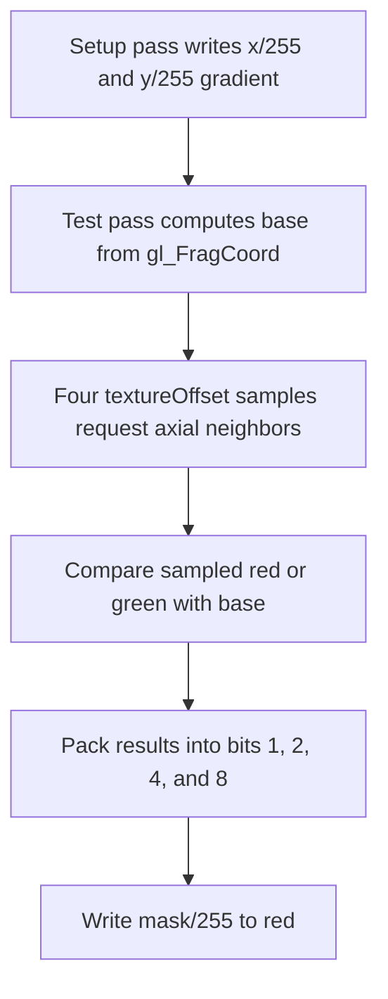

## Overview

**Core question:** Do constant two-dimensional texel offsets move an implicit-LOD texture sample to the requested neighboring texel?

- This page covers the Vulkan-only `texture.texel_offset` test family registered by [`vktTextureTexelOffsetTests.cpp`](../../../modules/vulkan/texture/vktTextureTexelOffsetTests.cpp#L36-L55).
- The family contains one Amber test case. It writes an x/y coordinate gradient into a 256 by 256 image, samples that image four times with one-texel offsets, and packs the four comparison results into a bit mask.
- Amber checks the complete 254 by 254 interior of the result image. Every checked pixel must contain red byte `15`, which means all four directional samples reached a neighbor on the expected side of the base coordinate.

## Background Knowledge

For the shared concepts of sampled-image filtering and texture coordinates and LOD, see [Background Knowledge](../../categories/texture.md#background-knowledge) of the `texture` page.

- A normalized sampled-image coordinate is scaled by the selected mip level's dimensions. A `ConstOffset` or `Offset` image operand then adds an integer texel displacement before filtering selects texels ([coordinate transformation](../../../../vulkan-docs/src/chapters/textures.adoc#L1805-L1859)).
- Nearest filtering selects the integer texel coordinate containing the resulting unnormalized coordinate ([nearest filtering](../../../../vulkan-docs/src/chapters/textures.adoc#L1894-L1915)). This makes a constant offset of `-1` or `1` suitable for checking an immediate neighbor.
- `VK_FORMAT_R8G8B8A8_UNORM` maps byte value `k` to floating-point value `k / 255`. The test uses that conversion to store integer-like x/y evidence in red and green and to return a four-bit mask in the red byte.

## Registration Hierarchy

```text
texture.texel_offset
└── texel_offset
```

The default Vulkan mustpass contains the single executable path `dEQP-VK.texture.texel_offset.texel_offset` ([mustpass entry](../../../mustpass/main/vk-default/texture.txt#L27301)).

## Parameter Dimensions and Observed Values

This is one fixed test case rather than a generated parameter matrix.

| Fixed dimension | Observed value | Meaning | Evidence |
|-----------------|----------------|---------|----------|
| Test case leaf | `texel_offset` | Selects the sole Amber recipe. | [case registration](../../../modules/vulkan/texture/vktTextureTexelOffsetTests.cpp#L40-L50) |
| Sample offsets | `(0,-1)`, `(0,1)`, `(-1,0)`, `(1,0)` | Checks the immediate negative-y, positive-y, negative-x, and positive-x neighbors. | [tested fragment shader](../../../data/vulkan/amber/texture/texel_offset/texel_offset.amber#L15-L31) |
| Image and output format | 256 by 256 `R8G8B8A8_UNORM` | Makes x/y gradient values and the result mask byte-exact. | [resources and framebuffer sizes](../../../data/vulkan/amber/texture/texel_offset/texel_offset.amber#L33-L58) |
| Sampler state | nearest filtering, repeat addressing, normalized coordinates | Amber supplies these defaults because the script declares no sampler properties. | [Amber sampler defaults](../../../../amber/src/src/sampler.h#L98-L110) |
| Checked region | origin `(1,1)`, size 254 by 254 | Omits the one-pixel border, where a requested neighbor would cross the image edge. | [expectation](../../../data/vulkan/amber/texture/texel_offset/texel_offset.amber#L57-L58) |

The offsets `-1` and `1` are inside Vulkan's required `minTexelOffset` and `maxTexelOffset` bounds of at least `-8` through `7` ([limit definitions](../../../../vulkan-docs/src/chapters/limits.adoc#L667-L676), [required limits](../../../../vulkan-docs/src/chapters/limits.adoc#L6703-L6710)).

## Behavior Parameters

There is no meaningful behavior parameter. `texel_offset` is one fixed test case that always checks the same four constant offsets, image format, sampler behavior, and interior region.

## Shader Analysis

The tested fragment shader is the primary shader because it issues the four `textureOffset` operations. The setup fragment shader is also shown because it creates the coordinate evidence that those operations consume.

### Representative Shader Walkthrough 1

#### Parameter Values Chosen

Representative path:

```text
dEQP-VK.texture.texel_offset.texel_offset
```

| Parameter choice | Meaning in this representative case |
|------------------|-------------------------------------|
| four constant one-texel offsets | Each `textureOffset` call must reach one immediate axial neighbor. |
| 256 by 256 `R8G8B8A8_UNORM` image | The setup pass can encode x and y as exact `x/255` and `y/255` channel values. |
| 254 by 254 interior expectation | Every tested lookup has valid neighbors on all four sides. |

#### Purpose

The shader checks whether constant offsets change nearest-filtered texture samples in the requested x or y direction. It assigns one output bit to each direction so one red byte records all four results.

#### Structural Design



#### Shader Code

##### Tested Fragment Shader

```glsl
#version 430

/// Set 0 binding 0 combines the coordinate-gradient image with Amber's nearest sampler.
layout(binding = 0) uniform sampler2D tex;

/// The red UNORM byte stores a four-bit result mask.
layout(location = 0) out vec4 result;

void main() {
  /// The same expression used by the setup pass identifies this output pixel's base coordinate.
  vec2 base = floor(gl_FragCoord.xy) / 255.0f;
  uint mask = 0;
  /// Each comparison sets one bit only if the offset sample lies on the requested side of the base.
  mask |= textureOffset(tex, base, ivec2(0, -1)).g < base.y ? 1 : 0;
  mask |= textureOffset(tex, base, ivec2(0, 1)).g > base.y ? 2 : 0;
  mask |= textureOffset(tex, base, ivec2(-1, 0)).r < base.x ? 4 : 0;
  mask |= textureOffset(tex, base, ivec2(1, 0)).r > base.x ? 8 : 0;
  result = vec4(mask/255.0f, 0, 0, 0);
}
```

##### Setup Fragment Shader

```glsl
#version 430

/// The setup color attachment is the image sampled by the tested pass.
layout(location = 0) out vec4 result;

void main() {
  /// Red increases with integer x and green increases with integer y.
  result = vec4(floor(gl_FragCoord.x) / 255.0f, floor(gl_FragCoord.y) / 255.0f, 0, 0);
}
```

#### Additional Info

- The setup shader stays fixed and supplies the monotonic red/green gradient needed to interpret each tested comparison.
- Both graphics pipelines use Amber's fixed `PASSTHROUGH` vertex shader. It has no offset-specific logic.
- For an interior pixel such as `(100,80)`, the four correct samples contain green `79/255` and `81/255`, and red `99/255` and `101/255`. All comparisons succeed, producing mask `15`.

#### Parameter Variation Summary

| Parameter dimension | Shader-level variation from this shader | Evidence |
|---------------------|-----------------------------------------|----------|
| Test case | None. The registration table contains only this recipe and the Amber file contains one tested pipeline. | [registration](../../../modules/vulkan/texture/vktTextureTexelOffsetTests.cpp#L40-L50), [recipe](../../../data/vulkan/amber/texture/texel_offset/texel_offset.amber#L1-L58) |

#### SPIR-V

##### Tested Fragment Shader

- Status: generated and validated
- Source: reconstructed `GLSL` from this walkthrough
- Stage: `frag`
- Target SPIRV version: `spirv1.0`

<details>
<summary>Click to expand SPIRV asm code</summary>

```llvm
; SPIR-V
; Version: 1.0
; Generator: Khronos Glslang Reference Front End; 11
; Bound: 93
; Schema: 0
               OpCapability Shader
          %1 = OpExtInstImport "GLSL.std.450"
               OpMemoryModel Logical GLSL450
               OpEntryPoint Fragment %main "main" %gl_FragCoord %result
               OpExecutionMode %main OriginUpperLeft
               OpSource GLSL 430
               OpName %main "main"
               OpName %base "base"
               OpName %gl_FragCoord "gl_FragCoord"
               OpName %mask "mask"
               OpName %tex "tex"
               OpName %result "result"
               OpDecorate %gl_FragCoord BuiltIn FragCoord
               OpDecorate %tex Binding 0
               OpDecorate %tex DescriptorSet 0
               OpDecorate %result Location 0
       %void = OpTypeVoid
          %3 = OpTypeFunction %void
      %float = OpTypeFloat 32
    %v2float = OpTypeVector %float 2
%_ptr_Function_v2float = OpTypePointer Function %v2float
    %v4float = OpTypeVector %float 4
%_ptr_Input_v4float = OpTypePointer Input %v4float
%gl_FragCoord = OpVariable %_ptr_Input_v4float Input
  %float_255 = OpConstant %float 255
       %uint = OpTypeInt 32 0
%_ptr_Function_uint = OpTypePointer Function %uint
     %uint_0 = OpConstant %uint 0
         %23 = OpTypeImage %float 2D 0 0 0 1 Unknown
         %24 = OpTypeSampledImage %23
%_ptr_UniformConstant_24 = OpTypePointer UniformConstant %24
        %tex = OpVariable %_ptr_UniformConstant_24 UniformConstant
        %int = OpTypeInt 32 1
      %v2int = OpTypeVector %int 2
      %int_0 = OpConstant %int 0
     %int_n1 = OpConstant %int -1
         %33 = OpConstantComposite %v2int %int_0 %int_n1
     %uint_1 = OpConstant %uint 1
%_ptr_Function_float = OpTypePointer Function %float
       %bool = OpTypeBool
      %int_1 = OpConstant %int 1
         %49 = OpConstantComposite %v2int %int_0 %int_1
      %int_2 = OpConstant %int 2
         %62 = OpConstantComposite %v2int %int_n1 %int_0
      %int_4 = OpConstant %int 4
         %75 = OpConstantComposite %v2int %int_1 %int_0
      %int_8 = OpConstant %int 8
%_ptr_Output_v4float = OpTypePointer Output %v4float
     %result = OpVariable %_ptr_Output_v4float Output
    %float_0 = OpConstant %float 0
       %main = OpFunction %void None %3
          %5 = OpLabel
       %base = OpVariable %_ptr_Function_v2float Function
       %mask = OpVariable %_ptr_Function_uint Function
         %13 = OpLoad %v4float %gl_FragCoord
         %14 = OpVectorShuffle %v2float %13 %13 0 1
         %15 = OpExtInst %v2float %1 Floor %14
         %17 = OpCompositeConstruct %v2float %float_255 %float_255
         %18 = OpFDiv %v2float %15 %17
               OpStore %base %18
               OpStore %mask %uint_0
         %27 = OpLoad %24 %tex
         %28 = OpLoad %v2float %base
         %34 = OpImageSampleImplicitLod %v4float %27 %28 ConstOffset %33
         %36 = OpCompositeExtract %float %34 1
         %38 = OpAccessChain %_ptr_Function_float %base %uint_1
         %39 = OpLoad %float %38
         %41 = OpFOrdLessThan %bool %36 %39
         %43 = OpSelect %int %41 %int_1 %int_0
         %44 = OpBitcast %uint %43
         %45 = OpLoad %uint %mask
         %46 = OpBitwiseOr %uint %45 %44
               OpStore %mask %46
         %47 = OpLoad %24 %tex
         %48 = OpLoad %v2float %base
         %50 = OpImageSampleImplicitLod %v4float %47 %48 ConstOffset %49
         %51 = OpCompositeExtract %float %50 1
         %52 = OpAccessChain %_ptr_Function_float %base %uint_1
         %53 = OpLoad %float %52
         %54 = OpFOrdGreaterThan %bool %51 %53
         %56 = OpSelect %int %54 %int_2 %int_0
         %57 = OpBitcast %uint %56
         %58 = OpLoad %uint %mask
         %59 = OpBitwiseOr %uint %58 %57
               OpStore %mask %59
         %60 = OpLoad %24 %tex
         %61 = OpLoad %v2float %base
         %63 = OpImageSampleImplicitLod %v4float %60 %61 ConstOffset %62
         %64 = OpCompositeExtract %float %63 0
         %65 = OpAccessChain %_ptr_Function_float %base %uint_0
         %66 = OpLoad %float %65
         %67 = OpFOrdLessThan %bool %64 %66
         %69 = OpSelect %int %67 %int_4 %int_0
         %70 = OpBitcast %uint %69
         %71 = OpLoad %uint %mask
         %72 = OpBitwiseOr %uint %71 %70
               OpStore %mask %72
         %73 = OpLoad %24 %tex
         %74 = OpLoad %v2float %base
         %76 = OpImageSampleImplicitLod %v4float %73 %74 ConstOffset %75
         %77 = OpCompositeExtract %float %76 0
         %78 = OpAccessChain %_ptr_Function_float %base %uint_0
         %79 = OpLoad %float %78
         %80 = OpFOrdGreaterThan %bool %77 %79
         %82 = OpSelect %int %80 %int_8 %int_0
         %83 = OpBitcast %uint %82
         %84 = OpLoad %uint %mask
         %85 = OpBitwiseOr %uint %84 %83
               OpStore %mask %85
         %88 = OpLoad %uint %mask
         %89 = OpConvertUToF %float %88
         %90 = OpFDiv %float %89 %float_255
         %92 = OpCompositeConstruct %v4float %90 %float_0 %float_0 %float_0
               OpStore %result %92
               OpReturn
               OpFunctionEnd
```

</details>

##### Setup Fragment Shader

- Status: generated and validated
- Source: reconstructed `GLSL` from this walkthrough
- Stage: `frag`
- Target SPIRV version: `spirv1.0`

<details>
<summary>Click to expand SPIRV asm code</summary>

```llvm
; SPIR-V
; Version: 1.0
; Generator: Khronos Glslang Reference Front End; 11
; Bound: 27
; Schema: 0
               OpCapability Shader
          %1 = OpExtInstImport "GLSL.std.450"
               OpMemoryModel Logical GLSL450
               OpEntryPoint Fragment %main "main" %result %gl_FragCoord
               OpExecutionMode %main OriginUpperLeft
               OpSource GLSL 430
               OpName %main "main"
               OpName %result "result"
               OpName %gl_FragCoord "gl_FragCoord"
               OpDecorate %result Location 0
               OpDecorate %gl_FragCoord BuiltIn FragCoord
       %void = OpTypeVoid
          %3 = OpTypeFunction %void
      %float = OpTypeFloat 32
    %v4float = OpTypeVector %float 4
%_ptr_Output_v4float = OpTypePointer Output %v4float
     %result = OpVariable %_ptr_Output_v4float Output
%_ptr_Input_v4float = OpTypePointer Input %v4float
%gl_FragCoord = OpVariable %_ptr_Input_v4float Input
       %uint = OpTypeInt 32 0
     %uint_0 = OpConstant %uint 0
%_ptr_Input_float = OpTypePointer Input %float
  %float_255 = OpConstant %float 255
     %uint_1 = OpConstant %uint 1
    %float_0 = OpConstant %float 0
       %main = OpFunction %void None %3
          %5 = OpLabel
         %15 = OpAccessChain %_ptr_Input_float %gl_FragCoord %uint_0
         %16 = OpLoad %float %15
         %17 = OpExtInst %float %1 Floor %16
         %19 = OpFDiv %float %17 %float_255
         %21 = OpAccessChain %_ptr_Input_float %gl_FragCoord %uint_1
         %22 = OpLoad %float %21
         %23 = OpExtInst %float %1 Floor %22
         %24 = OpFDiv %float %23 %float_255
         %26 = OpCompositeConstruct %v4float %19 %24 %float_0 %float_0
               OpStore %result %26
               OpReturn
               OpFunctionEnd
```

</details>

## Runtime Execution and Result Checking

- C++ registers `texel_offset.amber`; the common Amber test case parses it and compiles its inline GLSL to SPIR-V 1.0 ([registration](../../../modules/vulkan/texture/vktTextureTexelOffsetTests.cpp#L40-L50), [Amber compilation](../../../modules/vulkan/amber/vktAmberTestCase.cpp#L435-L499)).
- Amber creates `texture`, a 256 by 256 `R8G8B8A8_UNORM` image, plus the default nearest sampler. The `setup` graphics pipeline binds `texture` as its color target and draws a full rectangle, filling red with `x/255` and green with `y/255`.
- The second pipeline binds the same image as a combined image sampler at descriptor set 0, binding 0. It binds a separate `R8G8B8A8_UNORM` buffer named `framebuffer` as the color target and draws another full rectangle.
- The tested fragment shader writes one mask per pixel. Bit `1` checks negative y, bit `2` positive y, bit `4` negative x, and bit `8` positive x.
- `EXPECT framebuffer IDX 1 1 SIZE 254 254 EQ_RGBA 15 0 0 0` compares every interior output pixel exactly. There is no tolerance or C++ reference calculation.
- The common executor maps a successful Amber result to CTS `Pass` and any failed expectation to CTS `Fail` ([execution and result mapping](../../../modules/vulkan/amber/vktAmberTestCase.cpp#L546-L615)).

## Failure Meaning

### Failure Cause Mapping

Because this family has no varying behavior parameter, any failure means that at least one fixed directional offset check did not set its expected mask bit, or that shared setup, binding, rendering, or comparison work prevented the expected `(15,0,0,0)` image from being produced.

### Cause Analysis

#### Constant-offset sampling or shared rendering failure

**Possible failure symptoms:** At least one pixel in the checked interior differs from RGBA byte value `(15,0,0,0)`. A missing red-mask bit identifies a failed direction when the result is available: `1` for negative y, `2` for positive y, `4` for negative x, or `8` for positive x. Multiple missing bits or unrelated channel values can also indicate a failure in the shared setup or render path.

**Possible implementation causes:** The implementation may apply a `ConstOffset` at the wrong point in coordinate transformation, use the wrong offset component or sign, select the wrong nearest texel, or lower GLSL `textureOffset` incorrectly. The same symptom can result if the setup gradient is rendered incorrectly, the image-to-sampler transition or descriptor binding exposes wrong data, the second color attachment is written incorrectly, or Amber cannot compare the expected image. The test alone does not distinguish those shared-path causes.

## Case Pruning

### Requirement-based pruning

- The texture dispatcher registers this test family only for ordinary Vulkan builds; Vulkan SC has no `texture.texel_offset` path ([dispatcher guard](../../../modules/vulkan/texture/vktTextureTests.cpp#L60-L66)).
- The recipe declares no optional extension, feature, or property requirement. The tested offsets fit the Vulkan-required core limit range.
- The case uses graphics shaders, so the common Amber executor rejects it when CTS runs with the compute-only option ([compute-only check](../../../modules/vulkan/amber/vktAmberTestCase.cpp#L557-L569)).

### Design-based pruning

- The test fixes the format, dimensions, sampler defaults, shader stage, offset magnitude, and four axial directions. It does not generate filter, mip, image-type, format, stage, or offset-range variants.
- Amber checks only the interior because every checked base texel needs four immediate neighbors. This removes edge wrapping from the pass condition even though the default sampler uses repeat addressing.

## Key Takeaways

- One setup draw turns texel position into a red/green gradient; one tested draw turns four directional offset results into a red mask.
- Exact red byte `15` proves that all four one-texel offset comparisons succeeded at every checked interior pixel.
- The case isolates constant `textureOffset` sampling with nearest filtering. It does not cover dynamic offsets, larger magnitudes, other dimensions, mip levels, or filter modes.
- See `## Failure Meaning` when a result differs from the expected mask; the aggregate Amber failure can also originate in shared rendering or resource handling.

## Source Reference Appendix

| Entry point | Link | Why it matters |
|-------------|------|----------------|
| Texture dispatcher | [`createTextureTests`](../../../modules/vulkan/texture/vktTextureTests.cpp#L48-L66) | Places `texel_offset` under the Vulkan `texture` test category and excludes Vulkan SC. |
| Family registration | [`createTextureTexelOffsetTests`](../../../modules/vulkan/texture/vktTextureTexelOffsetTests.cpp#L36-L55) | Registers the sole test case leaf and Amber filename. |
| Executable recipe | [`texel_offset.amber`](../../../data/vulkan/amber/texture/texel_offset/texel_offset.amber#L1-L58) | Defines both shaders, resources, pipelines, draws, and the exact expectation. |
| Amber GLSL compilation | [`AmberTestCase::initPrograms`](../../../modules/vulkan/amber/vktAmberTestCase.cpp#L435-L499) | Selects SPIR-V 1.0 by default and inserts the fragment shader sources. |
| Amber execution | [`AmberTestInstance::iterate`](../../../modules/vulkan/amber/vktAmberTestCase.cpp#L546-L615) | Executes the recipe with Vulkan and maps its result to CTS pass or fail. |
| Sampler defaults | [`Sampler` data members](../../../../amber/src/src/sampler.h#L98-L110) | Defines nearest filters, repeat addressing, and normalized coordinates used by the bare `SAMPLER` declaration. |
| Default mustpass | [`texture.txt`](../../../mustpass/main/vk-default/texture.txt#L27301) | Confirms the exact executable Vulkan path. |
| Offset and nearest semantics | [Vulkan texture operations](../../../../vulkan-docs/src/chapters/textures.adoc#L1805-L1915) | Defines offset addition and nearest integer texel selection. |
