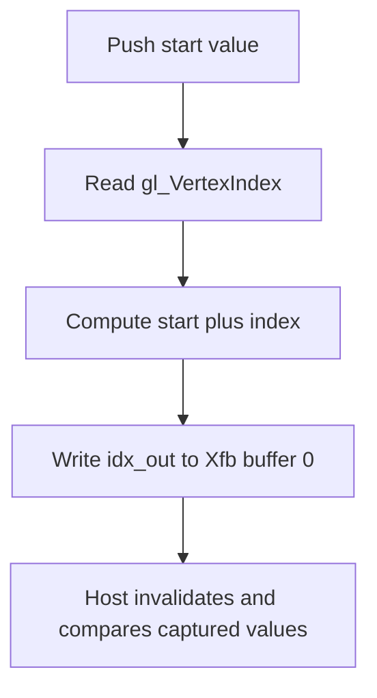

## Overview

**Core question:** Does the simple transform-feedback generator capture the selected pre-rasterization outputs at the requested offsets across pipeline construction, draw, stream, query, and resume variants?

- This page covers the implementation behind the `simple`, `simple_fast_gpl`, and `simple_optimized_gpl` test families. The root dispatcher invokes the same generator with monolithic, fast linked graphics pipeline library, and link-time optimized graphics pipeline library construction modes ([dispatcher](../../../modules/vulkan/transform_feedback/vktTransformFeedbackTests.cpp#L40-L49), [group naming](../../../modules/vulkan/transform_feedback/vktTransformFeedbackSimpleTests.cpp#L7264-L7276)).
- The generator combines basic capture, resume, stream and built-in output, query, indirect draw, multiview, synchronization, and layout cases. The current mustpass contains 7894 `simple`, 7886 `simple_fast_gpl`, and 7886 `simple_optimized_gpl` entries ([mustpass](../../../mustpass/main/vk-default/transform-feedback.txt#L110039)).
- Cases write shader outputs into host-visible transform-feedback storage. The host invalidates the allocation and checks values, counters, query results, or an image produced by an indirect draw.
- The three roots share test behavior. The construction mode changes pipeline creation, while the generated leaf matrices select the transform-feedback operation being exercised.

## Background Knowledge

- **Transform-feedback capture.** While transform feedback is active, outputs from the last pre-rasterization shader stage can be appended to bound buffers. `XfbBuffer`, `Offset`, and `XfbStride` determine where each captured vertex is stored ([Vulkan transform feedback](../../../../../external/vulkan-docs/src/chapters/vertexpostproc.adoc#vertexpostproc-transform-feedback)).
- **Transform-feedback counters and queries.** A counter buffer stores the capture position for ending and resuming transform feedback. A transform-feedback query reports primitives written and primitives needed, so a small buffer can distinguish attempted output from output that fit ([query semantics](../../../../../external/vulkan-docs/src/chapters/queries.adoc#queries-transform-feedback)).
- **Dynamic and indirect draw state.** The indirect cases make the host-visible counter or draw parameters part of the data path. A barrier is required when a later command consumes values written by transform feedback.

## Registration Hierarchy

```text
transform_feedback
├── simple
├── simple_fast_gpl
└── simple_optimized_gpl
```

The three roots use the same generator. Their construction modes are described below rather than represented as descendants of `simple`.

## Parameter Dimensions and Observed Values

| Dimension | Registered values | Meaning in this test | Evidence |
|---|---|---|---|
| Pipeline construction | `simple`, `simple_fast_gpl`, `simple_optimized_gpl` | Selects monolithic, fast linked library, or link-time optimized library construction for the same generator. | [`constructionTypes[]`](../../../modules/vulkan/transform_feedback/vktTransformFeedbackTests.cpp#L40-L49), [`groupNameSuffix`](../../../modules/vulkan/transform_feedback/vktTransformFeedbackSimpleTests.cpp#L7264-L7276) |
| Buffer count | `1`, `2`, `4`, `8` | Splits captured output across the requested number of transform-feedback buffers in the basic matrix. | [`createTransformFeedbackSimpleTests`](../../../modules/vulkan/transform_feedback/vktTransformFeedbackSimpleTests.cpp#L6455-L6483) |
| Buffer size | `256`, `512`, `131072` bytes | Changes the available capture range and exposes offset, stride, resume, and truncation behavior. | [`bufferSizes[]`](../../../modules/vulkan/transform_feedback/vktTransformFeedbackSimpleTests.cpp#L6457-L6459) |
| Test family | `basic`, `resume`, `xfb_pointsize`, `xfb_clipdistance`, `xfb_culldistance`, `xfb_clip_and_cull`, `draw_outside`, plus stream, query, indirect, and layout families | Chooses the output, command sequence, or validation contract under test. | [`testTypes[]`](../../../modules/vulkan/transform_feedback/vktTransformFeedbackSimpleTests.cpp#L6460-L6469) |
| Stream and query settings | Stream ids including `0`, indexed query forms, and multi-query variants | Selects the geometry output stream and query operation. | [`stream/query generation`](../../../modules/vulkan/transform_feedback/vktTransformFeedbackSimpleTests.cpp#L6681-L6691) |
| Point-size variant | Base case and `_ptsz` when `pointSize == 0` permits both values | Adds a shader point-size variant where the test needs to distinguish omitted and explicit point-size output. | [`addTransformFeedbackTestCaseVariants`](../../../modules/vulkan/transform_feedback/vktTransformFeedbackSimpleTests.cpp#L6430-L6452) |
| Special construction | Device-address commands, maintenance-5 buffer usage, shader-object rebind, multiview, topology, and stage selections | Enables the extension or pipeline path required by the selected leaf. | [`checkSupport`](../../../modules/vulkan/transform_feedback/vktTransformFeedbackSimpleTests.cpp#L4597-L4724) |

## Behavior Parameters

The primary behavioral axis is the registered test family. Each family changes the output being captured, the capture command sequence, or the consumer of the captured data.

### simple — Three pipeline-construction roots

`simple`, `simple_fast_gpl`, and `simple_optimized_gpl` run the same generated test matrix. The root name records how the graphics pipeline is built; it does not add a second transform-feedback algorithm.

### basic — Capture a vertex output

The basic path binds a transform-feedback buffer, pushes a starting value, begins and ends transform feedback around a draw, then checks the captured sequence. Its representative vertex shader writes `gl_VertexIndex` plus the pushed start value to an `uint` output with a four-byte stride ([shader generation](../../../modules/vulkan/transform_feedback/vktTransformFeedbackSimpleTests.cpp#L4954-L4974)).

### resume — Continue capture at counter-derived positions

The resume path uses one transform-feedback buffer and a counter buffer divided into generated chunks. It ends and resumes capture across multiple draws, inserting a counter write-to-read barrier before each resume. The check confirms that the resumed data continues at the intended buffer position ([resource and counter setup](../../../modules/vulkan/transform_feedback/vktTransformFeedbackSimpleTests.cpp#L1323-L1403)).

### xfb_pointsize / xfb_clipdistance / xfb_culldistance / xfb_clip_and_cull — Capture built-in outputs

These families select `gl_PointSize`, `gl_ClipDistance`, `gl_CullDistance`, or both distance arrays as captured outputs. They exercise output declarations, component layout, and the corresponding required limits rather than changing the host capture protocol ([program selection](../../../modules/vulkan/transform_feedback/vktTransformFeedbackSimpleTests.cpp#L4733-L4737), [support limits](../../../modules/vulkan/transform_feedback/vktTransformFeedbackSimpleTests.cpp#L4675-L4713)).

### draw_indirect_* — Consume captured counts for an indirect draw

The indirect families write transform-feedback data and use an indirect or indirect-byte-count draw path. The image check then verifies the draw result in addition to the captured buffer. Counter offsets, vertex strides, multiview, and device-address variants alter the path without changing the basic capture contract.

### streams_* / multistreams_* — Capture selected geometry streams

The stream families use geometry output streams and indexed transform-feedback bindings. They vary stream selection, multiple streams, same-location output, point size, and clip/cull built-ins. The result check reads the buffer ranges belonging to each selected stream.

### query_* / multiquery_* — Check transform-feedback query counts

The query families begin indexed or multi-query transform-feedback queries around draws and compare query results with the number of captured or expected primitives. The matrix varies stream id, result width, reset and readback form, query order, and topology.

### holes_* / max_output_components_* — Exercise layout gaps and output limits

The holes families intentionally leave unused transform-feedback components in the layout. The max-output-components families increase per-vertex output until the device and transform-feedback limits become the deciding support checks.

### backward_dependency / shader_object_rebind — Special command dependencies

The backward-dependency cases make a later draw depend on transform-feedback or indirect data written earlier. The shader-object rebind cases test capture across shader-object binding changes and are restricted to devices supporting the selected shader-object path.

## Shader Analysis

The test family has many shader generators, so one walkthrough anchors the common basic capture path. Other families change the generated stage set or output declarations and are summarized under `Behavior Parameters`.

### Representative Shader Walkthrough 1

#### Parameter Values Chosen

Representative path:

```text
dEQP-VK.transform_feedback.simple.basic_1_256
```

| Parameter choice | Meaning in this representative case |
|------------------|-------------------------------------|
| `basic` | Uses the vertex-only basic capture instance. |
| `1` buffer, `256` bytes | Captures the predictable output into one 256-byte range. |
| `simple` | Uses the monolithic pipeline-construction root. |

#### Purpose

This shader isolates transform-feedback capture from vertex attributes. It writes a predictable `uint` sequence so the host can detect an incorrect output value, binding range, or capture stride.

#### Structural Design

The vertex shader converts the invocation index into a captured scalar sequence:



#### Shader Code

```glsl
#version 450

layout(push_constant) uniform pushConstants
{
    uint start;
} uInput;

layout(xfb_buffer = 0, xfb_offset = 0, xfb_stride = 4, location = 0) out uint idx_out;

void main(void)
{
    idx_out = uInput.start + gl_VertexIndex;
}
```

#### Additional Info

- The host binds the selected transform-feedback range, pushes the range start in scalar units, draws `numPoints`, and compares the readback against the generated sequence ([basic iterate](../../../modules/vulkan/transform_feedback/vktTransformFeedbackSimpleTests.cpp#L1155-L1235)).
- This walkthrough does not cover geometry-stream, built-in-output, indirect-draw, query, or resume-specific shader branches. Those branches change the captured declarations or command consumer, not the basic `idx_out` calculation.

#### Parameter Variation Summary

| Parameter dimension | Shader-level variation from this shader | Evidence |
|---|---|---|
| `resume` | Keeps the capture output but changes the host command sequence to resume from counter-derived offsets. | [`resume iterate`](../../../modules/vulkan/transform_feedback/vktTransformFeedbackSimpleTests.cpp#L1323-L1403) |
| `xfb_pointsize` | Adds a point-size output when the selected topology and stage require it. | [`point-size branch`](../../../modules/vulkan/transform_feedback/vktTransformFeedbackSimpleTests.cpp#L4733-L4737) |
| `streams_*` | Uses geometry-stage output and stream-specific capture settings. | [`stream setup`](../../../modules/vulkan/transform_feedback/vktTransformFeedbackSimpleTests.cpp#L7004-L7239) |

#### SPIR-V

- Status: generated and validated
- Source: reconstructed GLSL above
- Stage: `vert`
- Target SPIRV version: `spirv1.0`

<details>
<summary>Click to expand SPIRV asm code</summary>

```llvm
; SPIR-V
; Version: 1.0
; Generator: Khronos Glslang Reference Front End; 11
; Bound: 22
; Schema: 0
               OpCapability Shader
               OpCapability TransformFeedback
          %1 = OpExtInstImport "GLSL.std.450"
               OpMemoryModel Logical GLSL450
               OpEntryPoint Vertex %main "main" %idx_out %gl_VertexIndex
               OpExecutionMode %main Xfb
               OpSource GLSL 450
               OpName %main "main"
               OpName %idx_out "idx_out"
               OpName %pushConstants "pushConstants"
               OpMemberName %pushConstants 0 "start"
               OpName %uInput "uInput"
               OpName %gl_VertexIndex "gl_VertexIndex"
               OpDecorate %idx_out Location 0
               OpDecorate %idx_out Offset 0
               OpDecorate %idx_out XfbBuffer 0
               OpDecorate %idx_out XfbStride 4
               OpDecorate %pushConstants Block
               OpMemberDecorate %pushConstants 0 Offset 0
               OpDecorate %gl_VertexIndex BuiltIn VertexIndex
       %void = OpTypeVoid
          %3 = OpTypeFunction %void
       %uint = OpTypeInt 32 0
%_ptr_Output_uint = OpTypePointer Output %uint
    %idx_out = OpVariable %_ptr_Output_uint Output
%pushConstants = OpTypeStruct %uint
%_ptr_PushConstant_pushConstants = OpTypePointer PushConstant %pushConstants
     %uInput = OpVariable %_ptr_PushConstant_pushConstants PushConstant
        %int = OpTypeInt 32 1
      %int_0 = OpConstant %int 0
%_ptr_PushConstant_uint = OpTypePointer PushConstant %uint
%_ptr_Input_int = OpTypePointer Input %int
%gl_VertexIndex = OpVariable %_ptr_Input_int Input
       %main = OpFunction %void None %3
          %5 = OpLabel
         %15 = OpAccessChain %_ptr_PushConstant_uint %uInput %int_0
         %16 = OpLoad %uint %15
         %19 = OpLoad %int %gl_VertexIndex
         %20 = OpBitcast %uint %19
         %21 = OpIAdd %uint %16 %20
               OpStore %idx_out %21
               OpReturn
               OpFunctionEnd
```

</details>

## Runtime Execution and Result Checking

- `checkSupport()` requires `VK_KHR_get_physical_device_properties2` and `VK_EXT_transform_feedback`, then applies conditional requirements for the selected stage, topology, query, multiview, indirect, device-address, maintenance, shader-object, point-size, and output-limit path ([support checks](../../../modules/vulkan/transform_feedback/vktTransformFeedbackSimpleTests.cpp#L4597-L4724)).
- The basic path creates a host-visible transform-feedback buffer with transfer-source and transform-feedback usage. It computes binding offsets and sizes, binds the buffer, pushes the starting scalar value, begins transform feedback, draws, ends capture, and inserts a transform-feedback-to-host barrier ([basic iterate](../../../modules/vulkan/transform_feedback/vktTransformFeedbackSimpleTests.cpp#L1155-L1233)).
- The resume path allocates a transform-feedback counter buffer, ends capture between chunks, and inserts a transform-feedback counter write-to-read barrier before each `vkCmdBeginTransformFeedbackEXT` resume ([resume setup](../../../modules/vulkan/transform_feedback/vktTransformFeedbackSimpleTests.cpp#L1369-L1403), [resume sequence](../../../modules/vulkan/transform_feedback/vktTransformFeedbackSimpleTests.cpp#L1410-L1462)).
- Stream and built-in cases compare the relevant buffer range. Winding cases compare vertex ordering, while indirect cases also compare a rendered image through `verifyImage()` ([verification helpers](../../../modules/vulkan/transform_feedback/vktTransformFeedbackSimpleTests.cpp#L1125-L1233)).
- Query cases retrieve or copy query results and compare generated and written counts with the expected primitive counts. A successful case returns `Pass`; unsupported combinations are pruned before execution.

## Failure Meaning

### Failure Cause Mapping

| If this behavior parameter value fails | Possible failure cause(s) |
|---|---|
| `basic` | Incorrect output capture, binding range, push-constant start, readback barrier, or host comparison. |
| `resume` | Incorrect counter position, resume barrier, chunk offset, or continuation of captured data. |
| `xfb_pointsize`, `xfb_clipdistance`, `xfb_culldistance`, `xfb_clip_and_cull` | Incorrect built-in declaration, captured layout, output limit handling, or validation of the selected built-in data. |
| `draw_indirect_*` | Incorrect captured counter or indirect command consumption, synchronization, pipeline draw, or image verification. |
| `streams_*`, `multistreams_*` | Incorrect geometry stream selection, stream buffer binding, output layout, or buffer validation. |
| `query_*`, `multiquery_*` | Incorrect transform-feedback query counts, indexed query state, result-width handling, reset/readback path, or count comparison. |
| `holes_*`, `max_output_components_*` | Incorrect layout gaps, output component limit handling, or captured-value validation. |
| `simple_fast_gpl`, `simple_optimized_gpl` | The selected graphics pipeline library construction path differs incorrectly from monolithic construction for the same generated case. |

### Cause Analysis

#### Capture layout and readback

**Possible failure symptoms:** One or more captured scalar, vector, built-in, stream, or layout values differs from the expected host-side value after the transform-feedback-to-host barrier.

**Possible implementation causes:** The implementation may calculate `XfbBuffer`, `Offset`, or `XfbStride` incorrectly, bind the wrong range, or fail to make transform-feedback writes visible to the host. The failing test family identifies the affected output contract, but source and validation logs are needed to distinguish layout from visibility.

#### Counter and resume state

**Possible failure symptoms:** A resumed segment starts at the wrong position, the counter exceeds the allocated range, or an indirect draw consumes an incorrect vertex count.

**Possible implementation causes:** The transform-feedback counter write, counter-to-read dependency, resume offset, or indirect command consumption may be incorrect. The test supplies explicit barriers and compares both counter-derived and buffer-derived results.

#### Query result accounting

**Possible failure symptoms:** A transform-feedback query reports a primitive count that differs from the expected generated or written count, or a result is unavailable when the selected case requires availability.

**Possible implementation causes:** The query may count the wrong stream, apply the wrong reset or result-width path, or mishandle the distinction between primitives needed and primitives written. The Vulkan query contract distinguishes those two values ([specification](../../../../../external/vulkan-docs/src/chapters/queries.adoc#L2516-L2547)).

#### Pipeline construction and stage output

**Possible failure symptoms:** The same generated leaf passes under one construction root but fails under a GPL root, or only stage-specific and built-in-output cases fail.

**Possible implementation causes:** The graphics pipeline library link path, pre-rasterization stage interface, built-in output declaration, or selected geometry/tessellation path may be involved. The failure does not identify a driver, compiler, hardware, or host location without additional evidence.

## Case Pruning

### Requirement-based pruning

- Cases requiring transform feedback are rejected unless `VK_EXT_transform_feedback`, the `transformFeedback` feature, and the relevant transform-feedback properties are supported ([support](../../../modules/vulkan/transform_feedback/vktTransformFeedbackSimpleTests.cpp#L4597-L4640)).
- Geometry and tessellation variants require their core shader features. Point-size variants can require `largePoints` or `shaderTessellationAndGeometryPointSize`; query-reset and indirect variants require their corresponding extensions.
- Output-heavy and multi-buffer cases are rejected when device limits such as `maxTransformFeedbackBuffers`, `maxTransformFeedbackBufferDataSize`, `maxTransformFeedbackStreamDataSize`, or `maxVertexOutputComponents` are insufficient ([limit checks](../../../modules/vulkan/transform_feedback/vktTransformFeedbackSimpleTests.cpp#L4693-L4722)).

### Design-based pruning

- The basic generator uses buffer counts `{1,2,4,8}` and buffer sizes `{256,512,131072}`. It does not enumerate every buffer size or count.
- A `_ptsz` leaf is added only when the base point-size value is zero and the resulting combination is legal. Illegal point cases that omit required point-size output are skipped ([variant filter](../../../modules/vulkan/transform_feedback/vktTransformFeedbackSimpleTests.cpp#L6430-L6452)).
- GPL roots reuse the generator but do not include monolithic-only device-address and shader-object registrations. This accounts for the observed 7894 versus 7886 mustpass counts ([monolithic-only branches](../../../modules/vulkan/transform_feedback/vktTransformFeedbackSimpleTests.cpp#L6511-L6518)).
- Generated leaf cases are summarized here instead of expanded in the parseable hierarchy tree.

## Key Takeaways

- The three simple roots test one generated transform-feedback matrix under three pipeline construction modes.
- The common basic contract is a predictable shader output, an explicitly bound capture range, a device-to-host dependency, and a host-side comparison.
- Resume, indirect, stream, built-in, and query families add distinct consumers or output layouts to that contract.
- A passing query case does not mean that every transform-feedback buffer byte is correct. Query and buffer checks cover different observations.
- Support pruning is part of the test definition. A skipped case means the selected feature, stage, topology, or limit is not available, not that the implementation failed the behavior check.

## Source Reference Appendix

| Entry point | Link | Why it matters |
|---|---|---|
| Category registration and construction modes | [`createTests`](../../../modules/vulkan/transform_feedback/vktTransformFeedbackTests.cpp#L36-L55) | Registers the three simple roots and the other category families. |
| Group naming and generator entry | [`createTransformFeedbackSimpleTests`](../../../modules/vulkan/transform_feedback/vktTransformFeedbackSimpleTests.cpp#L6430-L6529) | Defines the root suffix and the main basic matrix. |
| Test dispatch | [`TransformFeedbackTestCase::createInstance`](../../../modules/vulkan/transform_feedback/vktTransformFeedbackSimpleTests.cpp#L4497-L4560) | Maps registered test families to their instances. |
| Basic capture sequence | [`TransformFeedbackBasicTestInstance::iterate`](../../../modules/vulkan/transform_feedback/vktTransformFeedbackSimpleTests.cpp#L1155-L1235) | Binds, captures, synchronizes, and checks the basic output. |
| Resume sequence | [`TransformFeedbackResumeTestInstance::iterate`](../../../modules/vulkan/transform_feedback/vktTransformFeedbackSimpleTests.cpp#L1323-L1462) | Ends and resumes capture through counter-buffer offsets. |
| Support and limits | [`TransformFeedbackTestCase::checkSupport`](../../../modules/vulkan/transform_feedback/vktTransformFeedbackSimpleTests.cpp#L4597-L4724) | Applies feature, extension, property, and limit gates. |
| Program generation | [`TransformFeedbackTestCase::initPrograms`](../../../modules/vulkan/transform_feedback/vktTransformFeedbackSimpleTests.cpp#L4726-L5062) | Selects generated GLSL and direct SPIR-V stage programs. |
| Verification helpers | [`verifyTransformFeedbackBuffer`](../../../modules/vulkan/transform_feedback/vktTransformFeedbackSimpleTests.cpp#L1125-L1233) | Provides buffer and image validation paths. |
| Current mustpass counts | [`transform-feedback.txt`](../../../mustpass/main/vk-default/transform-feedback.txt#L110039) | Confirms the three sibling root prefixes and generated coverage. |
