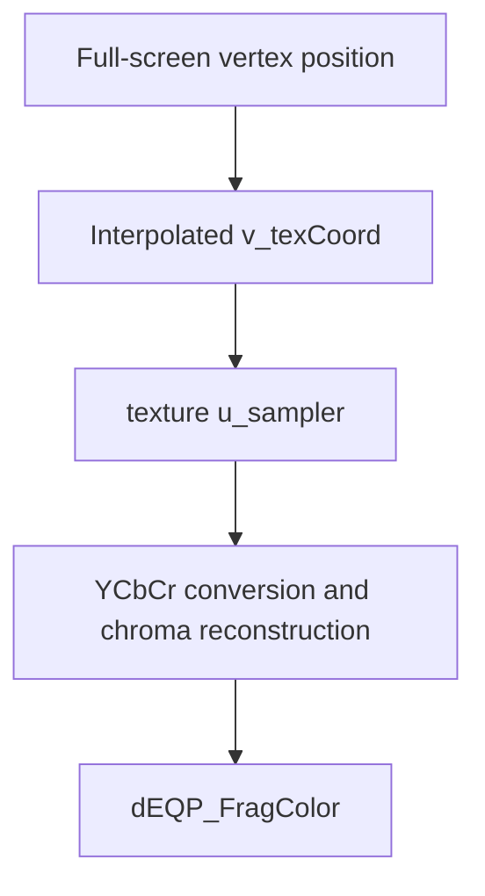

## Overview

**Core question:** Does a sampler apply linear texture filtering and YCbCr chroma reconstruction to supported 4:2:0 images inside the allowed precision bounds?

- `vktYCbCrFilteringTests.cpp` implements the `ycbcr.filtering` test family through [`createFilteringTests()`](../../../modules/vulkan/ycbcr/vktYCbCrFilteringTests.cpp#L787-L838).
- Each of eight explicit 4:2:0 UNORM formats receives nearest and linear chroma-filter cases for both graphics and compute execution.
- The test fills the image planes with gradients, samples through a `VkSamplerYcbcrConversion`, and compares the observed output against bounds calculated from the source planes.
- The page covers the registered matrix, both execution paths, one fragment shader, and the meaning of a bounds failure.

## Background Knowledge

- In a multi-planar 4:2:0 image, luma has full resolution while chroma components are downsampled horizontally and vertically. A sampler YCbCr conversion reconstructs chroma at the sample location before returning the sampled color.
- The conversion's `chromaFilter` controls that reconstruction. `VK_FILTER_NEAREST` selects nearest-neighbour reconstruction; `VK_FILTER_LINEAR` selects interpolation. The sampler's `minFilter` and `magFilter` remain the texture filters and are both `VK_FILTER_LINEAR` in this test. See the Vulkan specification's [Sampler YCbCr Conversion](../../../../vulkan-docs/src/chapters/samplers.adoc#samplers-YCbCr-conversion).
- `VK_CHROMA_LOCATION_MIDPOINT` identifies the location of downsampled chroma samples. The reference calculation must use that location when it derives the permitted output interval.

## Registration Hierarchy

```text
ycbcr.filtering
├── linear_sampler_g10_b10_r10_3plane_420_unorm_3pack16_compute
├── linear_sampler_g10_b10_r10_3plane_420_unorm_3pack16_graphics
├── linear_sampler_g10_b10r10_2plane_420_unorm_3pack16_compute
├── linear_sampler_g10_b10r10_2plane_420_unorm_3pack16_graphics
├── linear_sampler_g12_b12_r12_3plane_420_unorm_3pack16_compute
├── linear_sampler_g12_b12_r12_3plane_420_unorm_3pack16_graphics
├── linear_sampler_g12_b12r12_2plane_420_unorm_3pack16_compute
├── linear_sampler_g12_b12r12_2plane_420_unorm_3pack16_graphics
├── linear_sampler_g16_b16_r16_3plane_420_unorm_compute
├── linear_sampler_g16_b16_r16_3plane_420_unorm_graphics
├── linear_sampler_g16_b16r16_2plane_420_unorm_compute
├── linear_sampler_g16_b16r16_2plane_420_unorm_graphics
├── linear_sampler_g8_b8_r8_3plane_420_unorm_compute
├── linear_sampler_g8_b8_r8_3plane_420_unorm_graphics
├── linear_sampler_g8_b8r8_2plane_420_unorm_compute
├── linear_sampler_g8_b8r8_2plane_420_unorm_graphics
├── linear_sampler_with_chroma_linear_filtering_g10_b10_r10_3plane_420_unorm_3pack16_compute
├── linear_sampler_with_chroma_linear_filtering_g10_b10_r10_3plane_420_unorm_3pack16_graphics
├── linear_sampler_with_chroma_linear_filtering_g10_b10r10_2plane_420_unorm_3pack16_compute
├── linear_sampler_with_chroma_linear_filtering_g10_b10r10_2plane_420_unorm_3pack16_graphics
├── linear_sampler_with_chroma_linear_filtering_g12_b12_r12_3plane_420_unorm_3pack16_compute
├── linear_sampler_with_chroma_linear_filtering_g12_b12_r12_3plane_420_unorm_3pack16_graphics
├── linear_sampler_with_chroma_linear_filtering_g12_b12r12_2plane_420_unorm_3pack16_compute
├── linear_sampler_with_chroma_linear_filtering_g12_b12r12_2plane_420_unorm_3pack16_graphics
├── linear_sampler_with_chroma_linear_filtering_g16_b16_r16_3plane_420_unorm_compute
├── linear_sampler_with_chroma_linear_filtering_g16_b16_r16_3plane_420_unorm_graphics
├── linear_sampler_with_chroma_linear_filtering_g16_b16r16_2plane_420_unorm_compute
├── linear_sampler_with_chroma_linear_filtering_g16_b16r16_2plane_420_unorm_graphics
├── linear_sampler_with_chroma_linear_filtering_g8_b8_r8_3plane_420_unorm_compute
├── linear_sampler_with_chroma_linear_filtering_g8_b8_r8_3plane_420_unorm_graphics
├── linear_sampler_with_chroma_linear_filtering_g8_b8r8_2plane_420_unorm_compute
└── linear_sampler_with_chroma_linear_filtering_g8_b8r8_2plane_420_unorm_graphics
```

The direct children are generated from the eight entries in `ycbcrFormats`, the two `VkFilter` values, and the graphics/compute choice in [`createFilteringTests()`](../../../modules/vulkan/ycbcr/vktYCbCrFilteringTests.cpp#L795-L835).

## Parameter Dimensions and Observed Values

| Dimension | Registered values | Meaning in this test | Evidence |
|-----------|-------------------|----------------------|----------|
| Format | `g8_b8_r8_3plane_420_unorm`, `g8_b8r8_2plane_420_unorm`, `g10_b10_r10_3plane_420_unorm_3pack16`, `g10_b10r10_2plane_420_unorm_3pack16`, `g12_b12_r12_3plane_420_unorm_3pack16`, `g12_b12r12_2plane_420_unorm_3pack16`, `g16_b16_r16_3plane_420_unorm`, `g16_b16r16_2plane_420_unorm` | Selects plane count and component bit depth for the sampled 4:2:0 image and the reference precision. | [`ycbcrFormats`](../../../modules/vulkan/ycbcr/vktYCbCrFilteringTests.cpp#L795-L804) |
| Chroma filter | `VK_FILTER_NEAREST`, `VK_FILTER_LINEAR` | Selects nearest-neighbour or interpolated chroma reconstruction while texture minification and magnification remain linear. | [`createFilteringTests()`](../../../modules/vulkan/ycbcr/vktYCbCrFilteringTests.cpp#L809-L834) |
| Execution path | `graphics`, `compute` | Chooses a fragment shader and framebuffer, or a compute shader and storage-image result. | [`LinearFilteringTestCase::createInstance()`](../../../modules/vulkan/ycbcr/vktYCbCrFilteringTests.cpp#L732-L738) |
| Image and output sizes | image `8 x 8` to output `64 x 64`; image `64 x 32` to output `32 x 64` | Exercises upsampling and a non-square size relationship while preserving pixel-center coordinates. | [`LinearFilteringTestInstance::LinearFilteringTestInstance()`](../../../modules/vulkan/ycbcr/vktYCbCrFilteringTests.cpp#L359-L367) and [`LinearFilteringComputeTestInstance::LinearFilteringComputeTestInstance()`](../../../modules/vulkan/ycbcr/vktYCbCrFilteringTests.cpp#L514-L523) |

## Behavior Parameters

The primary behavioral axis is the chroma reconstruction filter. Format, execution path, and size pair change the surrounding matrix, but these two values change the reconstruction operation under test.

### `VK_FILTER_NEAREST`: nearest chroma reconstruction

The sampler reconstructs each downsampled chroma component with nearest-neighbour sampling while the sampler applies linear texture filtering. The format feature `VK_FORMAT_FEATURE_SAMPLED_IMAGE_YCBCR_CONVERSION_SEPARATE_RECONSTRUCTION_FILTER_BIT` must support the difference between the texture filters and the conversion's chroma filter.

### `VK_FILTER_LINEAR`: interpolated chroma reconstruction

The sampler interpolates downsampled chroma components and applies linear texture filtering. The format must expose `VK_FORMAT_FEATURE_SAMPLED_IMAGE_YCBCR_CONVERSION_LINEAR_FILTER_BIT` for this case.

## Shader Analysis

The graphics fragment shader is the representative walkthrough. Compute uses a separate shader with the same `texture()` sampling operation but obtains coordinates from `gl_GlobalInvocationID` and stores into a storage image; its variation is summarized below.

### Representative Shader Walkthrough 1

#### Parameter Values Chosen

Representative path:

```text
dEQP-VK.ycbcr.filtering.linear_sampler_g8_b8r8_2plane_420_unorm_graphics
```

| Parameter choice | Meaning in this representative case |
|------------------|-------------------------------------|
| `g8_b8r8_2plane_420_unorm` | Uses an 8-bit, 2-plane, 4:2:0 UNORM sampled image. |
| `VK_FILTER_NEAREST` | Uses nearest-neighbour chroma reconstruction. |
| `graphics` | Sends the sampled color to the framebuffer through a fragment shader. |

#### Purpose

This shader samples a combined image sampler at the interpolated texture coordinate and returns the converted color as the fragment output. The sampler conversion supplies the 4:2:0 chroma reconstruction rule.

#### Structural Design



#### Shader Code

```glsl
#version 450
precision mediump int; precision highp float;
/// The vertex stage supplies normalized coordinates for the sampled image.
layout(location = 0) in vec2 v_texCoord;
/// The framebuffer stores the converted sampled color as a floating-point RGBA value.
layout(location = 0) out mediump vec4 dEQP_FragColor;
/// Binding 0 is the combined image sampler. Its immutable sampler carries the VkSamplerYcbcrConversion.
layout (set=0, binding=0) uniform sampler2D u_sampler;
void main (void)
{
    /// texture() performs the linear texture sample and invokes the configured YCbCr conversion.
    dEQP_FragColor = vec4(texture(u_sampler, v_texCoord));
}
```

#### Additional Info

- `createYCbCrConversion()` sets `VK_SAMPLER_YCBCR_MODEL_CONVERSION_RGB_IDENTITY`, `VK_SAMPLER_YCBCR_RANGE_ITU_FULL`, midpoint chroma locations, and `forceExplicitReconstruction = VK_FALSE` in [`createYCbCrConversion()`](../../../modules/vulkan/ycbcr/vktYCbCrFilteringTests.cpp#L135-L157).
- The full-screen vertex shader maps positions from `[-1, 1]` to `[0, 1]`; the host uses each output pixel center as the reference coordinate.
- The compute shader is a separate primary program for compute cases. It uses `gl_GlobalInvocationID`, guards coordinates outside the output extent, samples the same `u_sampler`, and writes the color with `imageStore`.

#### Parameter Variation Summary

| Parameter dimension | Shader-level variation from this shader | Evidence |
|---------------------|---------------------------------------|----------|
| Chroma filter | The sampler conversion changes `chromaFilter` between `VK_FILTER_NEAREST` and `VK_FILTER_LINEAR`; the GLSL source remains the same. | [`createYCbCrConversion()`](../../../modules/vulkan/ycbcr/vktYCbCrFilteringTests.cpp#L135-L157) |
| Format | The sampler conversion and image view use the selected 2-plane or 3-plane 4:2:0 format and its bit depth; the shader interface remains `sampler2D`. | [`createImageView()`](../../../modules/vulkan/ycbcr/vktYCbCrFilteringTests.cpp#L182-L201) and [`ycbcrFormats`](../../../modules/vulkan/ycbcr/vktYCbCrFilteringTests.cpp#L795-L804) |
| Execution path | Graphics uses `vert` plus `frag`; compute uses `comp`, with an additional storage-image binding and `imageStore`. | [`initPrograms()`](../../../modules/vulkan/ycbcr/vktYCbCrFilteringTests.cpp#L740-L782) and [`LinearFilteringComputeTestInstance::iterate()`](../../../modules/vulkan/ycbcr/vktYCbCrFilteringTests.cpp#L526-L675) |

#### SPIR-V

- Status: generated and validated
- Source: reconstructed `GLSL` from this walkthrough
- Stage: `frag`
- Target SPIRV version: `spirv1.0`

<details>
<summary>Click to expand SPIRV asm code</summary>

```llvm
; SPIR-V
; Version: 1.0
; Generator: Khronos Glslang Reference Front End; 11
; Bound: 20
; Schema: 0
               OpCapability Shader
          %1 = OpExtInstImport "GLSL.std.450"
               OpMemoryModel Logical GLSL450
               OpEntryPoint Fragment %main "main" %dEQP_FragColor %v_texCoord
               OpExecutionMode %main OriginUpperLeft
               OpSource GLSL 450
               OpName %main "main"
               OpName %dEQP_FragColor "dEQP_FragColor"
               OpName %u_sampler "u_sampler"
               OpName %v_texCoord "v_texCoord"
               OpDecorate %dEQP_FragColor RelaxedPrecision
               OpDecorate %dEQP_FragColor Location 0
               OpDecorate %u_sampler Binding 0
               OpDecorate %u_sampler DescriptorSet 0
               OpDecorate %v_texCoord Location 0
       %void = OpTypeVoid
          %3 = OpTypeFunction %void
      %float = OpTypeFloat 32
    %v4float = OpTypeVector %float 4
%_ptr_Output_v4float = OpTypePointer Output %v4float
%dEQP_FragColor = OpVariable %_ptr_Output_v4float Output
         %10 = OpTypeImage %float 2D 0 0 0 1 Unknown
         %11 = OpTypeSampledImage %10
%_ptr_UniformConstant_11 = OpTypePointer UniformConstant %11
  %u_sampler = OpVariable %_ptr_UniformConstant_11 UniformConstant
    %v2float = OpTypeVector %float 2
%_ptr_Input_v2float = OpTypePointer Input %v2float
 %v_texCoord = OpVariable %_ptr_Input_v2float Input
       %main = OpFunction %void None %3
          %5 = OpLabel
         %14 = OpLoad %11 %u_sampler
         %18 = OpLoad %v2float %v_texCoord
         %19 = OpImageSampleImplicitLod %v4float %14 %18
               OpStore %dEQP_FragColor %19
               OpReturn
               OpFunctionEnd
```

</details>

## Runtime Execution and Result Checking

- Each test case checks support for `VK_KHR_sampler_ycbcr_conversion`, the `samplerYcbcrConversion` feature, midpoint chroma samples, linear sampled-image filtering, and the feature needed by its selected chroma filter. Unsupported cases stop in [`LinearFilteringTestCase::checkSupport()`](../../../modules/vulkan/ycbcr/vktYCbCrFilteringTests.cpp#L704-L730).
- The host creates a 2D optimal-tiled image with `VK_IMAGE_USAGE_TRANSFER_DST_BIT | VK_IMAGE_USAGE_SAMPLED_BIT`, allocates memory, creates a conversion-backed image view, and binds the sampled image through a combined image sampler.
- [`fillGradient()`](../../../modules/vulkan/ycbcr/vktYCbCrUtil.cpp#L364-L388) fills every available plane with a component gradient. [`uploadImage()`](../../../modules/vulkan/ycbcr/vktYCbCrUtil.cpp#L420-L454) uploads the plane data and leaves the image in `VK_IMAGE_LAYOUT_SHADER_READ_ONLY_OPTIMAL`.
- Graphics draws a triangle strip full-screen quad and reads the `VK_FORMAT_R32G32B32A32_SFLOAT` framebuffer. Compute binds the sampled image at descriptor binding 0 and an `rgba32f` storage image at binding 1, dispatches `(width + 7) / 8` by `(height + 7) / 8` workgroups, transitions the output to `VK_IMAGE_LAYOUT_TRANSFER_SRC_OPTIMAL`, and downloads it.
- Both paths build pixel-center texture coordinates and call [`verifyFilteringResult()`](../../../modules/vulkan/ycbcr/vktYCbCrFilteringTests.cpp#L206-L331). That function calls [`calculateBounds()`](../../../modules/vulkan/ycbcr/vktYCbCrUtil.cpp#L1625-L1665), then fails a pixel when any result component falls below its minimum bound or exceeds its maximum bound.

## Failure Meaning

### Failure Cause Mapping

| If this behavior parameter value fails | Possible failure cause(s) |
|----------------------------------------|---------------------------|
| `VK_FILTER_NEAREST` | Incorrect nearest-neighbour chroma reconstruction, sampler conversion state, format handling, or result transfer. |
| `VK_FILTER_LINEAR` | Incorrect interpolated chroma reconstruction, unsupported or mishandled linear chroma filtering, sampler conversion state, or result transfer. |

### Cause Analysis

#### Nearest chroma reconstruction

**Possible failure symptoms:** One or more graphics or compute output components fall outside the bounds calculated for `VK_FILTER_NEAREST`, and the log reports the coordinate, sampled value, and bounds.

**Possible implementation causes:** The implementation may reconstruct downsampled chroma from the wrong neighbor, use the wrong midpoint sample location, apply an incorrect conversion to the selected 2-plane or 3-plane format, or transfer the sampled result incorrectly. Finding the cause requires checking the failing format and execution path.

#### Linear chroma reconstruction

**Possible failure symptoms:** One or more output components fall outside the bounds calculated for `VK_FILTER_LINEAR`, with the failing coordinate and result bounds logged by `verifyFilteringResult()`.

**Possible implementation causes:** The implementation may interpolate chroma incorrectly, apply a filter or sample location inconsistent with the conversion state, mishandle the format bit depth, or transfer the result incorrectly. Finding the cause requires checking the failing format and execution path.

## Case Pruning

### Requirement-based pruning

- `VK_KHR_sampler_ycbcr_conversion` and the `samplerYcbcrConversion` feature must be available.
- The selected format must support midpoint chroma samples and `VK_FORMAT_FEATURE_SAMPLED_IMAGE_FILTER_LINEAR_BIT`.
- The nearest-chroma cases require `VK_FORMAT_FEATURE_SAMPLED_IMAGE_YCBCR_CONVERSION_SEPARATE_RECONSTRUCTION_FILTER_BIT` because `chromaFilter` differs from the sampler's linear filters.
- The linear-chroma cases require `VK_FORMAT_FEATURE_SAMPLED_IMAGE_YCBCR_CONVERSION_LINEAR_FILTER_BIT`.

### Design-based pruning

- The matrix intentionally uses the eight entries in the local `ycbcrFormats` vector rather than the full set of YCbCr formats.
- Each selected format uses the two fixed image/output size pairs. The test does not generate arbitrary dimensions.

## Key Takeaways

- The test keeps texture filtering linear and varies the separate chroma reconstruction filter, so a case distinguishes those two stages of sampling behavior.
- Graphics and compute use the same source image and pixel-center coordinate rule. They differ in how they store the result.
- The reference accepts precision-bounded intervals produced from the format bit depth and conversion/filtering rules, not one exact floating-point value.
- A failure identifies an output outside the interval for a selected format, filter, size pair, or execution path. The log alone does not locate the defect in hardware, driver, compiler, or host code.

## Source Reference Appendix

| Entry point | Link | Why it matters |
|-------------|------|----------------|
| Test registration and matrix | [`createFilteringTests()`](../../../modules/vulkan/ycbcr/vktYCbCrFilteringTests.cpp#L787-L838) | Defines the `ycbcr.filtering` direct children and their parameters. |
| Sampler conversion setup | [`createYCbCrConversion()`](../../../modules/vulkan/ycbcr/vktYCbCrFilteringTests.cpp#L135-L157) | Sets the YCbCr model, range, sample locations, and chroma filter. |
| Graphics path | [`LinearFilteringTestInstance::iterate()`](../../../modules/vulkan/ycbcr/vktYCbCrFilteringTests.cpp#L389-L488) | Creates the sampled image, draws the quad, and checks framebuffer pixels. |
| Compute path | [`LinearFilteringComputeTestInstance::iterate()`](../../../modules/vulkan/ycbcr/vktYCbCrFilteringTests.cpp#L526-L675) | Dispatches the compute shader, copies the output, and checks downloaded pixels. |
| Support checks | [`LinearFilteringTestCase::checkSupport()`](../../../modules/vulkan/ycbcr/vktYCbCrFilteringTests.cpp#L704-L730) | Defines feature-based case pruning. |
| Shader generation | [`LinearFilteringTestCase::initPrograms()`](../../../modules/vulkan/ycbcr/vktYCbCrFilteringTests.cpp#L740-L782) | Emits the vertex, fragment, and compute GLSL. |
| Result validation | [`verifyFilteringResult()`](../../../modules/vulkan/ycbcr/vktYCbCrFilteringTests.cpp#L206-L331) | Compares every output component with calculated bounds. |
| Reference image setup | [`fillGradient()`](../../../modules/vulkan/ycbcr/vktYCbCrUtil.cpp#L364-L388) and [`calculateBounds()`](../../../modules/vulkan/ycbcr/vktYCbCrUtil.cpp#L1625-L1665) | Creates source gradients and derives permitted sampled intervals. |
