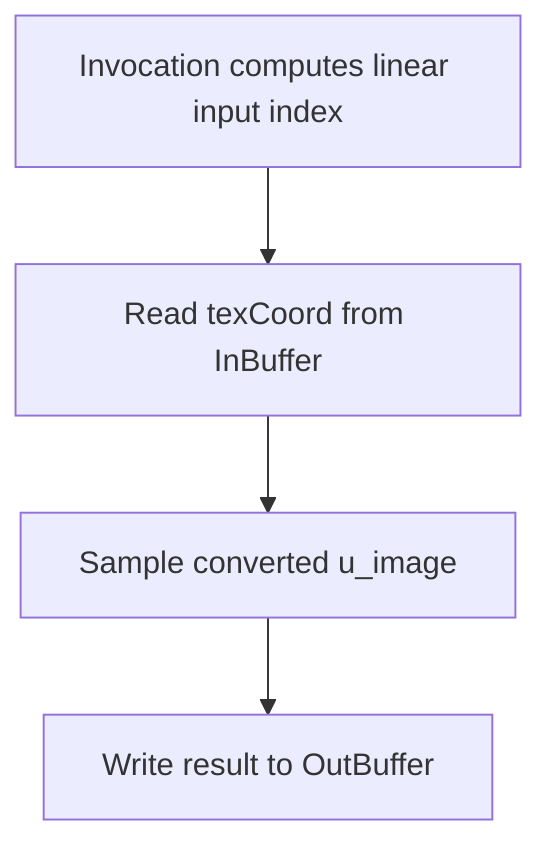

## Overview

**Core question:** Does each registered YCbCr format produce the expected sampled values across the supported image, shader, memory, and descriptor variants?

- [`vktYCbCrFormatTests.cpp`](../../../modules/vulkan/ycbcr/vktYCbCrFormatTests.cpp) implements the `ycbcr.format` test family returned by [`createFormatTests()`](../../../modules/vulkan/ycbcr/vktYCbCrFormatTests.cpp#L734-L737).
- Each case creates one YCbCr image, attaches a `VkSamplerYcbcrConversion` to its image view and sampler, samples it through a generated shader, and compares the result with a software reference.
- The format child is the behavioral axis. The matrix adds shader stages, optimal or linear tiling, array layers, mapped memory, disjoint planes, and descriptor-set, descriptor-buffer, or descriptor-heap access.

## Background Knowledge

- Multi-planar YCbCr formats store luma and chroma in separate planes. `420` formats halve chroma width and height, `422` formats halve chroma width, and `444` formats keep chroma at full resolution. Two-plane formats pack the chroma components together; three-plane formats keep them separate.
- A sampler YCbCr conversion supplies the format, component mapping, encoded range, chroma locations, reconstruction filter, and color model used when a shader samples the converted image view. This page's conversion uses the RGB identity model, full range, midpoint chroma locations, and nearest reconstruction.
- The GLSL `sampler2D` or `sampler2DArray` represents the converted image as one sampled resource. It does not expose the individual planes as separate shader variables.

## Registration Hierarchy

```text
ycbcr.format
├── b10x6g10x6r10x6g10x6_422_unorm_4pack16
├── b12x4g12x4r12x4g12x4_422_unorm_4pack16
├── b16g16r16g16_422_unorm
├── b8g8r8g8_422_unorm
├── g10x6_b10x6_r10x6_3plane_420_unorm_3pack16
├── g10x6_b10x6_r10x6_3plane_422_unorm_3pack16
├── g10x6_b10x6_r10x6_3plane_444_unorm_3pack16
├── g10x6_b10x6r10x6_2plane_420_unorm_3pack16
├── g10x6_b10x6r10x6_2plane_422_unorm_3pack16
├── g10x6_b10x6r10x6_2plane_444_unorm_3pack16
├── g10x6b10x6g10x6r10x6_422_unorm_4pack16
├── g12x4_b12x4_r12x4_3plane_420_unorm_3pack16
├── g12x4_b12x4_r12x4_3plane_422_unorm_3pack16
├── g12x4_b12x4_r12x4_3plane_444_unorm_3pack16
├── g12x4_b12x4r12x4_2plane_420_unorm_3pack16
├── g12x4_b12x4r12x4_2plane_422_unorm_3pack16
├── g12x4_b12x4r12x4_2plane_444_unorm_3pack16
├── g12x4b12x4g12x4r12x4_422_unorm_4pack16
├── g16_b16_r16_3plane_420_unorm
├── g16_b16_r16_3plane_422_unorm
├── g16_b16_r16_3plane_444_unorm
├── g16_b16r16_2plane_420_unorm
├── g16_b16r16_2plane_422_unorm
├── g16_b16r16_2plane_444_unorm
├── g16b16g16r16_422_unorm
├── g8_b8_r8_3plane_420_unorm
├── g8_b8_r8_3plane_422_unorm
├── g8_b8_r8_3plane_444_unorm
├── g8_b8r8_2plane_420_unorm
├── g8_b8r8_2plane_422_unorm
├── g8_b8r8_2plane_444_unorm
├── g8b8g8r8_422_unorm
├── r10x6_unorm_pack16
├── r10x6g10x6_unorm_2pack16
├── r10x6g10x6b10x6a10x6_unorm_4pack16
├── r12x4_unorm_pack16
├── r12x4g12x4_unorm_2pack16
└── r12x4g12x4b12x4a12x4_unorm_4pack16
```

`populateFormatGroup()` creates these direct children from the Vulkan YCbCr format range and the 2-plane 444 extension range. Each format child receives the generated stage and tiling matrix, array variants, and disjoint variants only when the format has more than one plane; descriptor-buffer and descriptor-heap variants are generated only for fragment execution.

## Parameter Dimensions and Observed Values

| Dimension | Registered values | Meaning in this test | Evidence |
|-----------|-------------------|----------------------|----------|
| Format | The 38 names in the registration tree | Selects component depth, plane count, component packing, subsampling, and reference-channel layout. | [`populateFormatGroup()`](../../../modules/vulkan/ycbcr/vktYCbCrFormatTests.cpp#L712-L729) |
| Shader type | `vertex`, `fragment`, `geometry`, `tess_control`, `tess_eval`, `compute` | Selects the executor and the stage that performs the sampled operation. | [`populatePerFormatGroup()`](../../../modules/vulkan/ycbcr/vktYCbCrFormatTests.cpp#L640-L672) |
| Tiling | `optimal`, `linear` | Selects the image layout and the format feature flags checked by support code. | [`tilings`](../../../modules/vulkan/ycbcr/vktYCbCrFormatTests.cpp#L649-L653) |
| Array layers | no suffix, `_array` | Uses one layer or two layers. Array cases sample layer 1. | [`array setup`](../../../modules/vulkan/ycbcr/vktYCbCrFormatTests.cpp#L363-L365) |
| Plane binding | no suffix, `_disjoint` | Selects one allocation or per-plane allocations for multi-planar formats. | [`disjoint cases`](../../../modules/vulkan/ycbcr/vktYCbCrFormatTests.cpp#L688-L704) |
| Host memory path | no suffix, `_mapped` | Uses host-visible linear image memory instead of the ordinary upload path. | [`mapped cases`](../../../modules/vulkan/ycbcr/vktYCbCrFormatTests.cpp#L694-L704) |
| Descriptor mode | no suffix, `_descriptor_buffer`, `_descriptor_heap` | Selects descriptor sets, descriptor buffers, or descriptor heaps. The extension modes are generated only for fragment execution. | [`descriptor modes`](../../../modules/vulkan/ycbcr/vktYCbCrFormatTests.cpp#L655-L672) |

The Vulkan mustpass file contains the expanded leaves for these generated combinations. The runtime filters cases by executor support, device features, image-format properties, and format feature flags, so the source matrix is not an exact count of cases that run on every device.

## Behavior Parameters

The registered format child is the primary behavioral axis. It changes how the image stores components and how the software reference obtains each channel. The other dimensions test access and execution coverage around that format choice.

### `b10x6g10x6r10x6g10x6_422_unorm_4pack16` and `b12x4g12x4r12x4g12x4_422_unorm_4pack16`: packed 4:2:2 formats

These formats store two luma samples and shared chroma components in packed 16-bit words. Their unused low bits and component depth exercise packed-format interpretation while the sampled result remains a normalized `vec4`.

### `b16g16r16g16_422_unorm`, `b8g8r8g8_422_unorm`, `g10x6b10x6g10x6r10x6_422_unorm_4pack16`, `g12x4b12x4g12x4r12x4_422_unorm_4pack16`, `g16b16g16r16_422_unorm`, and `g8b8g8r8_422_unorm`: interleaved 4:2:2 formats

These formats encode a 2 by 1 group with luma samples at full horizontal resolution and shared chroma. The reference view and sampler conversion must interpret the component order and normalized precision correctly.

### Three-plane `420`, `422`, and `444` formats: separate channel planes

The `g8_b8_r8_3plane_*`, `g10x6_b10x6_r10x6_3plane_*`, `g12x4_b12x4_r12x4_3plane_*`, and `g16_b16_r16_3plane_*` values keep G, B, and R in separate planes. `420` cases use reduced width and height for chroma, `422` cases reduce width only, and `444` cases keep all plane dimensions equal.

### Two-plane `420`, `422`, and `444` formats: packed chroma plane

The `g8_b8r8_2plane_*`, `g10x6_b10x6r10x6_2plane_*`, `g12x4_b12x4r12x4_2plane_*`, and `g16_b16r16_2plane_*` values keep G in plane 0 and pack B and R in plane 1. The sampler conversion hides that packing from the shader, while the reference accesses the packed plane through `MultiPlaneImageData`.

### Single and multi-component R formats: non-subsampled formats

`r10x6_unorm_pack16`, `r12x4_unorm_pack16`, `r10x6g10x6_unorm_2pack16`, `r12x4g12x4_unorm_2pack16`, `r10x6g10x6b10x6a10x6_unorm_4pack16`, and `r12x4g12x4b12x4a12x4_unorm_4pack16` provide one, two, or four components without chroma subsampling. Present channels use the reference data; missing RGB channels become zero and missing alpha becomes one.

## Shader Analysis

The compute case shows the tested operation with the least executor plumbing. `getShaderSpec()` supplies a sampler declaration and a single `texture()` assignment. `ComputeShaderExecutor` wraps that operation with storage-buffer input and output records.

### Representative Shader Walkthrough 1

#### Parameter Values Chosen

Representative path:

```text
dEQP-VK.ycbcr.format.g8_b8_r8_3plane_420_unorm.compute_linear
```

| Parameter choice | Meaning in this representative case |
|------------------|-------------------------------------|
| `g8_b8_r8_3plane_420_unorm` | Uses an 8-bit three-plane 4:2:0 format with separate G, B, and R planes. |
| `compute` | Runs one generated compute shader for the sample and writes the result to a storage buffer. |
| `linear` | Uses linear image tiling and the corresponding linear format feature flags. |
| no array or disjoint suffix | Uses one image layer and ordinary image-memory binding. |

#### Purpose

The generated shader reads one coordinate from the executor input buffer, samples the converted YCbCr image, and writes the resulting `vec4` to the output buffer. The host compares those values with a channel-wise software reference.

#### Structural Design



#### Shader Code

```glsl
#version 450
#extension GL_EXT_long_vector : enable
layout(set = 1, binding = 0) uniform highp sampler2D u_image;
layout(local_size_x = 1) in;

struct Inputs { vec2 texCoord; };
struct Outputs { vec4 result; };

layout(set = 0, binding = 0, std430) buffer InBuffer
{
    Inputs inputs[];
};
layout(set = 0, binding = 1, std430) buffer OutBuffer
{
    Outputs outputs[];
};

void main (void)
{
    /// The executor maps one workgroup to one input and output record.
    uint invocationNdx = gl_NumWorkGroups.x*gl_NumWorkGroups.y*gl_WorkGroupID.z
                       + gl_NumWorkGroups.x*gl_WorkGroupID.y + gl_WorkGroupID.x;
    vec2 texCoord = vec2(inputs[invocationNdx].texCoord);
    /// The sampler and image view carry the YCbCr conversion state. The shader does not address planes directly.
    vec4 result;
    result = texture(u_image, texCoord);
    outputs[invocationNdx].result = result;
}
```

#### Additional Info

- The source supplies no explicit `ShaderBuildOptions`, so this representative GLSL uses the `SourceCollections` baseline target, SPIR-V 1.0.
- `getShaderSpec()` uses `sampler2D` for this non-array case and changes to `sampler2DArray` with layer 1 in array cases.
- The host uses a 66 by 32 image and generates one lookup coordinate at the center of each texel.

#### Parameter Variation Summary

| Parameter dimension | Shader-level variation from this shader | Evidence |
|---------------------|---------------------------------------|----------|
| Format | The sampler declaration stays `sampler2D`; the image's plane layout and the conversion's format change. | [`getShaderSpec()`](../../../modules/vulkan/ycbcr/vktYCbCrFormatTests.cpp#L291-L310) and [`format loop`](../../../modules/vulkan/ycbcr/vktYCbCrFormatTests.cpp#L712-L729) |
| Shader type | Compute uses one compute shader. Vertex, tessellation, geometry, and fragment cases wrap the same operation in stage-specific generated shaders. | [`generateSources()`](../../../modules/vulkan/shaderexecutor/vktShaderExecutor.cpp#L4198-L4230) |
| Array layers | The shader changes from `sampler2D` to `sampler2DArray` and adds a layer coordinate of `1u`. | [`array shader branch`](../../../modules/vulkan/ycbcr/vktYCbCrFormatTests.cpp#L298-L306) |
| Tiling, mapped, and disjoint modes | The shader source stays the same. These choices change image creation, memory allocation, and upload behavior. | [`testFormat()`](../../../modules/vulkan/ycbcr/vktYCbCrFormatTests.cpp#L367-L372) |
| Descriptor mode | The shader source stays the same. The executor binds the sampled image through a descriptor set, descriptor buffer, or descriptor heap. | [`descriptor setup`](../../../modules/vulkan/ycbcr/vktYCbCrFormatTests.cpp#L483-L501) |

#### SPIR-V

- Status: generated and validated
- Source: reconstructed `GLSL` from this walkthrough
- Stage: `comp`
- Target SPIRV version: `spirv1.0`

<details>
<summary>Click to expand SPIRV asm code</summary>

```llvm
; SPIR-V
; Version: 1.0
; Generator: Khronos Glslang Reference Front End; 11
; Bound: 70
; Schema: 0
               OpCapability Shader
          %1 = OpExtInstImport "GLSL.std.450"
               OpMemoryModel Logical GLSL450
               OpEntryPoint GLCompute %main "main" %gl_NumWorkGroups %gl_WorkGroupID
               OpExecutionMode %main LocalSize 1 1 1
               OpSource GLSL 450
               OpSourceExtension "GL_EXT_long_vector"
               OpName %main "main"
               OpName %invocationNdx "invocationNdx"
               OpName %gl_NumWorkGroups "gl_NumWorkGroups"
               OpName %gl_WorkGroupID "gl_WorkGroupID"
               OpName %texCoord "texCoord"
               OpName %Inputs "Inputs"
               OpMemberName %Inputs 0 "texCoord"
               OpName %InBuffer "InBuffer"
               OpMemberName %InBuffer 0 "inputs"
               OpName %_ ""
               OpName %result "result"
               OpName %u_image "u_image"
               OpName %Outputs "Outputs"
               OpMemberName %Outputs 0 "result"
               OpName %OutBuffer "OutBuffer"
               OpMemberName %OutBuffer 0 "outputs"
               OpName %__0 ""
               OpDecorate %gl_NumWorkGroups BuiltIn NumWorkgroups
               OpDecorate %gl_WorkGroupID BuiltIn WorkgroupId
               OpMemberDecorate %Inputs 0 Offset 0
               OpDecorate %_runtimearr_Inputs ArrayStride 8
               OpDecorate %InBuffer BufferBlock
               OpMemberDecorate %InBuffer 0 Offset 0
               OpDecorate %_ Binding 0
               OpDecorate %_ DescriptorSet 0
               OpDecorate %u_image Binding 0
               OpDecorate %u_image DescriptorSet 1
               OpMemberDecorate %Outputs 0 Offset 0
               OpDecorate %_runtimearr_Outputs ArrayStride 16
               OpDecorate %OutBuffer BufferBlock
               OpMemberDecorate %OutBuffer 0 Offset 0
               OpDecorate %__0 Binding 1
               OpDecorate %__0 DescriptorSet 0
               OpDecorate %gl_WorkGroupSize BuiltIn WorkgroupSize
       %void = OpTypeVoid
          %3 = OpTypeFunction %void
       %uint = OpTypeInt 32 0
%_ptr_Function_uint = OpTypePointer Function %uint
     %v3uint = OpTypeVector %uint 3
%_ptr_Input_v3uint = OpTypePointer Input %v3uint
%gl_NumWorkGroups = OpVariable %_ptr_Input_v3uint Input
     %uint_0 = OpConstant %uint 0
%_ptr_Input_uint = OpTypePointer Input %uint
     %uint_1 = OpConstant %uint 1
%gl_WorkGroupID = OpVariable %_ptr_Input_v3uint Input
     %uint_2 = OpConstant %uint 2
      %float = OpTypeFloat 32
    %v2float = OpTypeVector %float 2
%_ptr_Function_v2float = OpTypePointer Function %v2float
     %Inputs = OpTypeStruct %v2float
%_runtimearr_Inputs = OpTypeRuntimeArray %Inputs
   %InBuffer = OpTypeStruct %_runtimearr_Inputs
%_ptr_Uniform_InBuffer = OpTypePointer Uniform %InBuffer
          %_ = OpVariable %_ptr_Uniform_InBuffer Uniform
        %int = OpTypeInt 32 1
      %int_0 = OpConstant %int 0
%_ptr_Uniform_v2float = OpTypePointer Uniform %v2float
    %v4float = OpTypeVector %float 4
%_ptr_Function_v4float = OpTypePointer Function %v4float
         %52 = OpTypeImage %float 2D 0 0 0 1 Unknown
         %53 = OpTypeSampledImage %52
%_ptr_UniformConstant_53 = OpTypePointer UniformConstant %53
    %u_image = OpVariable %_ptr_UniformConstant_53 UniformConstant
    %float_0 = OpConstant %float 0
    %Outputs = OpTypeStruct %v4float
%_runtimearr_Outputs = OpTypeRuntimeArray %Outputs
  %OutBuffer = OpTypeStruct %_runtimearr_Outputs
%_ptr_Uniform_OutBuffer = OpTypePointer Uniform %OutBuffer
        %__0 = OpVariable %_ptr_Uniform_OutBuffer Uniform
%_ptr_Uniform_v4float = OpTypePointer Uniform %v4float
%gl_WorkGroupSize = OpConstantComposite %v3uint %uint_1 %uint_1 %uint_1
       %main = OpFunction %void None %3
          %5 = OpLabel
%invocationNdx = OpVariable %_ptr_Function_uint Function
   %texCoord = OpVariable %_ptr_Function_v2float Function
     %result = OpVariable %_ptr_Function_v4float Function
         %14 = OpAccessChain %_ptr_Input_uint %gl_NumWorkGroups %uint_0
         %15 = OpLoad %uint %14
         %17 = OpAccessChain %_ptr_Input_uint %gl_NumWorkGroups %uint_1
         %18 = OpLoad %uint %17
         %19 = OpIMul %uint %15 %18
         %22 = OpAccessChain %_ptr_Input_uint %gl_WorkGroupID %uint_2
         %23 = OpLoad %uint %22
         %24 = OpIMul %uint %19 %23
         %25 = OpAccessChain %_ptr_Input_uint %gl_NumWorkGroups %uint_0
         %26 = OpLoad %uint %25
         %27 = OpAccessChain %_ptr_Input_uint %gl_WorkGroupID %uint_1
         %28 = OpLoad %uint %27
         %29 = OpIMul %uint %26 %28
         %30 = OpIAdd %uint %24 %29
         %31 = OpAccessChain %_ptr_Input_uint %gl_WorkGroupID %uint_0
         %32 = OpLoad %uint %31
         %33 = OpIAdd %uint %30 %32
               OpStore %invocationNdx %33
         %45 = OpLoad %uint %invocationNdx
         %47 = OpAccessChain %_ptr_Uniform_v2float %_ %int_0 %45 %int_0
         %48 = OpLoad %v2float %47
               OpStore %texCoord %48
         %56 = OpLoad %53 %u_image
         %57 = OpLoad %v2float %texCoord
         %59 = OpImageSampleExplicitLod %v4float %56 %57 Lod %float_0
               OpStore %result %59
         %65 = OpLoad %uint %invocationNdx
         %66 = OpLoad %v4float %result
         %68 = OpAccessChain %_ptr_Uniform_v4float %__0 %int_0 %65 %int_0
               OpStore %68 %66
               OpReturn
               OpFunctionEnd
```

</details>

## Runtime Execution and Result Checking

- `checkSupport()` calls [`checkImageSupport()`](../../../modules/vulkan/ycbcr/vktYCbCrUtil.cpp#L176-L204), which requires sampler YCbCr conversion, a chroma-location feature, and disjoint support when requested. Array cases require `VK_EXT_ycbcr_image_arrays` and an image limit of at least two layers. Vertex, tessellation, and geometry cases require `DEVICE_CORE_FEATURE_VERTEX_PIPELINE_STORES_AND_ATOMICS`. Descriptor-buffer and descriptor-heap cases require their respective extensions.
- `testFormat()` creates a one-mip-level 2D image with extent 66 by 32. It uses `VK_IMAGE_USAGE_TRANSFER_DST_BIT | VK_IMAGE_USAGE_SAMPLED_BIT`, one or two array layers, and `VK_IMAGE_LAYOUT_PREINITIALIZED` for mapped linear cases or `VK_IMAGE_LAYOUT_UNDEFINED` otherwise.
- The test allocates and binds image memory. Mapped cases require host-visible memory. The test fills `MultiPlaneImageData`; mapped cases write it through host-visible allocations, while other cases upload it with the shared YCbCr utility. A second array layer is zero-filled before the active layer receives the gradient.
- The conversion uses `VK_SAMPLER_YCBCR_MODEL_CONVERSION_RGB_IDENTITY`, `VK_SAMPLER_YCBCR_RANGE_ITU_FULL`, identity component swizzles, `VK_CHROMA_LOCATION_MIDPOINT` for both axes, `VK_FILTER_NEAREST`, and `VK_FALSE` for `forceExplicitReconstruction`. The sampler clamps U, V, and W to the edge.
- The test queries `VkSamplerYcbcrConversionImageFormatProperties` through `vkGetPhysicalDeviceImageFormatProperties2` and requires `combinedImageSamplerDescriptorCount >= 1`. It then binds the converted image view through the selected descriptor mode.
- The host generates one coordinate at the center of every texel. The shader executor samples all coordinates and returns one `vec4` per coordinate. The fragment executor uses generated stage plumbing around the same operation; descriptor-buffer and descriptor-heap modes are limited to its fragment path.
- For each channel present in the format, the host creates a `tcu::Texture2DView` over the corresponding reference channel and samples it with the same nearest, clamp-to-edge sampler state. Missing channels use zero, except alpha, which uses one.
- The test compares every component with a `0.02f` threshold. It logs the first class of mismatches with the coordinate, result, and reference, then returns `Got invalid results`; otherwise it returns `All samples passed`.

## Failure Meaning

### Failure Cause Mapping

| If this behavior parameter value fails | Possible failure cause(s) |
|----------------------------------------|---------------------------|
| Any registered format child | Format-specific plane interpretation, image creation or binding, sampler conversion, shader sampling, descriptor setup, reference construction, or result comparison failed. |

### Cause Analysis

#### Format storage and plane interpretation

**Possible failure symptoms:** Failures cluster on one component depth, plane count, packing scheme, or subsampling suffix while nearby formats pass.

**Possible implementation causes:** The implementation may decode packed bits, plane dimensions, shared chroma, or normalized values incorrectly. The failing format and comparison with a related 2-plane or 3-plane format are needed to separate these possibilities.

#### Image creation, binding, and upload

**Possible failure symptoms:** All shader stages fail for one tiling, mapped-memory, or `_disjoint` variant, or image creation and binding return an error.

**Possible implementation causes:** The image's usage, layout, allocation requirements, per-plane binding, or transfer visibility may not match the selected format and tiling. The source does not identify one defect location without the failing Vulkan result.

#### Sampler conversion and image view

**Possible failure symptoms:** Failures affect formats or cases that require midpoint chroma support, or sampled values differ across subsampled and non-subsampled formats.

**Possible implementation causes:** The conversion state attached to the sampler and image view may be inconsistent, or chroma reconstruction may use the wrong location or filter. The requested state and format feature bits provide the evidence for narrowing the cause.

#### Shader stage and descriptor access

**Possible failure symptoms:** A failure affects one shader stage or only descriptor-buffer or descriptor-heap leaves while descriptor-set cases pass.

**Possible implementation causes:** Stage-specific executor setup, descriptor binding, descriptor consumption, or sampled-image access may be wrong. The generated GLSL operation is shared, so the failing matrix dimension is needed before assigning the cause to stage or descriptor handling.

#### Reference construction and result comparison

**Possible failure symptoms:** The sampled values are close to the software reference but cross the `0.02f` threshold, or absent channels have unexpected values.

**Possible implementation causes:** Channel extraction, normalized precision, coordinate generation, sampler state, absent-channel defaults, or comparison logic may disagree. Source inspection can establish the expected reference path, but a device-specific cause needs the logged result and reference.

## Case Pruning

### Requirement-based pruning

- `checkImageSupport()` removes cases when sampler YCbCr conversion or the required chroma-location feature is unavailable.
- Disjoint cases require `VK_KHR_bind_memory2`, `VK_KHR_get_memory_requirements2`, and `VK_FORMAT_FEATURE_DISJOINT_BIT`.
- Array cases require `VK_EXT_ycbcr_image_arrays` and `maxArrayLayers >= 2` for the selected format and tiling.
- Vertex, tessellation, and geometry cases require `DEVICE_CORE_FEATURE_VERTEX_PIPELINE_STORES_AND_ATOMICS`; executor support also filters stage and descriptor combinations.
- Descriptor-buffer and descriptor-heap cases require `VK_EXT_descriptor_buffer` and `VK_EXT_descriptor_heap`, respectively.
- Cases require the selected image tiling to support the requested YCbCr sampling features, including midpoint chroma samples.

### Design-based pruning

- The format loop covers the Vulkan YCbCr format range and the specified 2-plane 444 extension range rather than arbitrary Vulkan formats.
- Linear mapped cases exist only for linear tiling.
- Disjoint variants exist only when `getPlaneCount(format) > 1`.
- The matrix fixes the image extent at 66 by 32, one mip level, nearest filtering, clamp-to-edge addressing, full range, midpoint chroma locations, RGB identity conversion, and identity swizzles.
- Array cases always use two layers and sample layer 1. They do not create a separate shader behavior beyond the `sampler2DArray` declaration and layer coordinate.

## Key Takeaways

- The format child controls the behavior under test because it changes component storage, plane layout, subsampling, and channel reference construction.
- The shader sees one converted sampler. Plane selection and YCbCr interpretation happen through the image view and sampler conversion state.
- The same sample operation is exercised through compute and graphics executor paths, while tiling, mapped memory, disjoint binding, and descriptor mode change host or binding setup.
- A pass requires every available channel to stay within `0.02f` of the software reference at every generated coordinate; absent RGB channels must be zero and absent alpha must be one.
- Compare neighboring format, tiling, binding, descriptor, and shader-stage cases before assigning a failure cause.

## Source Reference Appendix

| Entry point | Link | Why it matters |
|-------------|------|----------------|
| Format registration | [`createFormatTests()`](../../../modules/vulkan/ycbcr/vktYCbCrFormatTests.cpp#L734-L737) | Adds the `format` test family to the YCbCr category. |
| Format children | [`populateFormatGroup()`](../../../modules/vulkan/ycbcr/vktYCbCrFormatTests.cpp#L712-L729) | Enumerates the registered format names. |
| Per-format matrix | [`populatePerFormatGroup()`](../../../modules/vulkan/ycbcr/vktYCbCrFormatTests.cpp#L640-L710) | Creates stage, tiling, array, mapped, disjoint, and descriptor variants. |
| Shader specification | [`getShaderSpec()`](../../../modules/vulkan/ycbcr/vktYCbCrFormatTests.cpp#L291-L310) | Defines sampler type, coordinate input, and sampled output. |
| Support and execution | [`checkSupport()` and `testFormat()`](../../../modules/vulkan/ycbcr/vktYCbCrFormatTests.cpp#L312-L631) | Checks support, builds resources, samples, constructs references, and reports results. |
| Shared image support | [`checkImageSupport()`](../../../modules/vulkan/ycbcr/vktYCbCrUtil.cpp#L176-L204) | Checks conversion, chroma, and disjoint format features. |
| Generated shader dispatch | [`generateSources()`](../../../modules/vulkan/shaderexecutor/vktShaderExecutor.cpp#L4198-L4230) | Selects the executor's shader generator for each stage. |
| Compute wrapper | [`ComputeShaderExecutor::generateComputeShader()`](../../../modules/vulkan/shaderexecutor/vktShaderExecutor.cpp#L3061-L3110) | Adds compute layout, input and output buffers, indexing, and the sampled operation. |
| Buffer I/O | [`declareBufferBlocks()` and `generateExecBufferIo()`](../../../modules/vulkan/shaderexecutor/vktShaderExecutor.cpp#L2034-L2130) | Defines executor storage buffers and transfers values to and from them. |
| Multi-planar format rules | [`formats.adoc`](../../../../vulkan-docs/src/chapters/formats.adoc#L901-L965) | Defines plane components, dimensions, and subsampling. |
| Sampler conversion rules | [`samplers.adoc`](../../../../vulkan-docs/src/chapters/samplers.adoc#L773-L1045) | Defines conversion fields, feature requirements, and reconstruction. |
| Registered coverage | [`vk-default/ycbcr.txt`](../../../mustpass/main/vk-default/ycbcr.txt) | Lists the Vulkan mustpass leaves for the category. |
