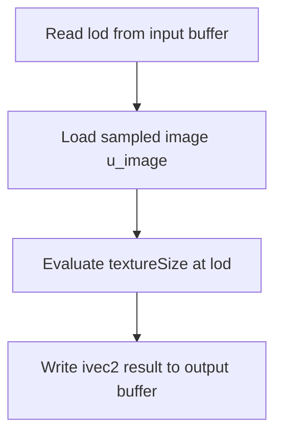

## Overview

**Core question:** Do shader image queries report the image view's configured extent and mip-level count?

- `vktYCbCrImageQueryTests.cpp` implements the `ycbcr.query` test family, with `size_lod` and `levels` test families registered by [`populateImageQueryGroup()`](../../../modules/vulkan/ycbcr/vktYCbCrImageQueryTests.cpp#L593-L599).
- Each case builds a sampled 2D image, creates an image view, binds it as `u_image`, and runs a generated shader that uses `textureSize` or `textureQueryLevels`.
- The matrix covers `VK_FORMAT_R8G8B8A8_UNORM`, the YCbCr format ranges, multi-planar disjoint variants, and every executor-supported shader stage.
- The host compares the returned query value with the image extent or the configured one-level mip count.

## Background Knowledge

- Vulkan image queries describe image metadata exposed through an image view. `OpImageQuerySizeLod` returns dimensions for a selected mip level, while `OpImageQueryLevels` returns the view's `levelCount`. Neither operation reads image texels. See [SPIR-V image queries](../../../../vulkan-docs/src/chapters/images.adoc#images-spirv-queries).
- YCbCr formats can have multiple planes. A disjoint image stores those planes in separately bound memory, but the sampled image view still exposes one logical image whose queried extent is not the plane count.

## Registration Hierarchy

```text
ycbcr.query
├── size_lod
└── levels
```

`populateQueryGroup()` adds a child for each executor-supported shader stage under both test families. Each stage group then receives the reference format, the YCbCr format ranges, and a `_disjoint` case when `getPlaneCount(format) > 1`. See [`populateQueryInShaderGroup()`](../../../modules/vulkan/ycbcr/vktYCbCrImageQueryTests.cpp#L548-L577).

## Parameter Dimensions and Observed Values

| Dimension | Registered values | Meaning in this test | Evidence |
|---|---|---|---|
| Query type | `size_lod`, `levels` | Selects the shader expression and expected host result. | [`populateImageQueryGroup()`](../../../modules/vulkan/ycbcr/vktYCbCrImageQueryTests.cpp#L593-L599) |
| Shader stage | Executor-supported shader type names | Runs the same query through each supported executor stage. | [`populateQueryGroup()`](../../../modules/vulkan/ycbcr/vktYCbCrImageQueryTests.cpp#L579-L590) |
| Format | `VK_FORMAT_R8G8B8A8_UNORM`, `VK_YCBCR_FORMAT_FIRST` (inclusive) through `VK_YCBCR_FORMAT_LAST` (exclusive), and `VK_FORMAT_G8_B8R8_2PLANE_444_UNORM_EXT` through `VK_FORMAT_G16_B16R16_2PLANE_444_UNORM_EXT` (inclusive) | Selects the sampled image format. The first format is a non-YCbCr reference; the other ranges are YCbCr formats. | [`populateQueryInShaderGroup()`](../../../modules/vulkan/ycbcr/vktYCbCrImageQueryTests.cpp#L548-L576) |
| Image flags | `0`, `VK_IMAGE_CREATE_DISJOINT_BIT` when the format has more than one plane | Compares ordinary and disjoint multi-planar image setup. | [`populateQueryInShaderGroup()`](../../../modules/vulkan/ycbcr/vktYCbCrImageQueryTests.cpp#L553-L575) |
| Image size | Six generated sizes for `size_lod`; `16x18` for `levels` | Tests extent queries across plane-divisor-aligned and irregular dimensions. | [`testImageQuery()`](../../../modules/vulkan/ycbcr/vktYCbCrImageQueryTests.cpp#L418-L439) |

## Behavior Parameters

The primary behavioral axis is the registered `query` test family. The shader operation and the expected result change with its value.

### `size_lod`: query the extent at a mip level

The generated shader evaluates `textureSize(u_image, lod)`. The executor supplies `lod = 0`, and the host expects the exact width and height used to create the current image.

### `levels`: query the image-view mip count

The generated shader evaluates `textureQueryLevels(u_image)`. Every image in this path has `mipLevels = 1`, so the host expects the returned value to be `1`.

## Shader Analysis

The compute executor shows the query expression in one generated stage, so it is the representative path here. Other executor-supported stages use the same `ShaderSpec` expression with a different stage wrapper.

### Representative Shader Walkthrough 1

#### Parameter Values Chosen

Representative path:

```text
dEQP-VK.ycbcr.query.size_lod.compute.r8g8b8a8_unorm
```

| Parameter choice | Meaning in this representative case |
|---|---|
| `size_lod` | Selects `textureSize(u_image, lod)` and an `ivec2` result. |
| `compute` | Selects the compute executor wrapper with `layout(local_size_x = 1)`. |
| `r8g8b8a8_unorm` | Selects the non-YCbCr reference image format. |

#### Purpose

This shader queries the width and height of the sampled image at the supplied mip level. It writes the returned `ivec2` to the executor output buffer for host comparison.

#### Structural Design



#### Shader Code

```glsl
#version 450
#extension GL_EXT_long_vector : enable

/// The sampled image is supplied through the extra descriptor set.
layout(binding = 0, set = 1) uniform highp sampler2D u_image;

/// The executor launches one invocation for this representative case.
layout(local_size_x = 1) in;

struct Inputs { int lod; };
struct Outputs { ivec2 result; };

/// Executor input and output records use storage buffers in set 0.
layout(set = 0, binding = 0, std430) buffer InBuffer { Inputs inputs[]; };
layout(set = 0, binding = 1, std430) buffer OutBuffer { Outputs outputs[]; };

void main (void)
{
    /// The executor maps each invocation to one input/output record.
    uint invocationNdx = gl_NumWorkGroups.x*gl_NumWorkGroups.y*gl_WorkGroupID.z
                       + gl_NumWorkGroups.x*gl_WorkGroupID.y + gl_WorkGroupID.x;
    int lod = int(inputs[invocationNdx].lod);

    /// Query image metadata without sampling a texel.
    ivec2 result = textureSize(u_image, lod);
    outputs[invocationNdx].result = result;
}
```

#### Additional Info

- The selected case is the reference-format case. The same generated operation is used for YCbCr formats and their supported disjoint variants.
- The source does not provide an explicit `ShaderBuildOptions` target for the compute path, so the executor's baseline SPIR-V target is used here.

#### Parameter Variation Summary

| Parameter dimension | Shader-level variation from this shader | Evidence |
|---|---|---|
| Query type | Changes the emitted expression and result type from `textureSize(u_image, lod)` with `ivec2` output to `textureQueryLevels(u_image)` with integer output. | [`getShaderSpec()`](../../../modules/vulkan/ycbcr/vktYCbCrImageQueryTests.cpp#L102-L142) |
| Shader stage | Changes the executor-generated stage wrapper; the `ShaderSpec` query expression remains the same. | [`populateQueryGroup()`](../../../modules/vulkan/ycbcr/vktYCbCrImageQueryTests.cpp#L579-L590) |
| Format and image flags | Do not change the query expression. They change the image view and, for multi-planar formats, the ordinary versus disjoint image setup. | [`populateQueryInShaderGroup()`](../../../modules/vulkan/ycbcr/vktYCbCrImageQueryTests.cpp#L548-L577) |

#### SPIR-V

- Status: generated and validated
- Source: reconstructed `GLSL` from this walkthrough
- Stage: `comp`
- Target SPIRV version: `spirv1.0`

<details>
<summary>Click to expand SPIRV asm code</summary>

```llvm
; SPIR-V
; Version: 1.0
; Generator: Khronos Glslang Reference Front End; 11
; Bound: 69
; Schema: 0
               OpCapability Shader
               OpCapability ImageQuery
          %1 = OpExtInstImport "GLSL.std.450"
               OpMemoryModel Logical GLSL450
               OpEntryPoint GLCompute %main "main" %gl_NumWorkGroups %gl_WorkGroupID
               OpExecutionMode %main LocalSize 1 1 1
               OpSource GLSL 450
               OpSourceExtension "GL_EXT_long_vector"
               OpName %main "main"
               OpName %invocationNdx "invocationNdx"
               OpName %gl_NumWorkGroups "gl_NumWorkGroups"
               OpName %gl_WorkGroupID "gl_WorkGroupID"
               OpName %lod "lod"
               OpName %Inputs "Inputs"
               OpMemberName %Inputs 0 "lod"
               OpName %InBuffer "InBuffer"
               OpMemberName %InBuffer 0 "inputs"
               OpName %_ ""
               OpName %result "result"
               OpName %u_image "u_image"
               OpName %Outputs "Outputs"
               OpMemberName %Outputs 0 "result"
               OpName %OutBuffer "OutBuffer"
               OpMemberName %OutBuffer 0 "outputs"
               OpName %__0 ""
               OpDecorate %gl_NumWorkGroups BuiltIn NumWorkgroups
               OpDecorate %gl_WorkGroupID BuiltIn WorkgroupId
               OpMemberDecorate %Inputs 0 Offset 0
               OpDecorate %_runtimearr_Inputs ArrayStride 4
               OpDecorate %InBuffer BufferBlock
               OpMemberDecorate %InBuffer 0 Offset 0
               OpDecorate %_ Binding 0
               OpDecorate %_ DescriptorSet 0
               OpDecorate %u_image Binding 0
               OpDecorate %u_image DescriptorSet 1
               OpMemberDecorate %Outputs 0 Offset 0
               OpDecorate %_runtimearr_Outputs ArrayStride 8
               OpDecorate %OutBuffer BufferBlock
               OpMemberDecorate %OutBuffer 0 Offset 0
               OpDecorate %__0 Binding 1
               OpDecorate %__0 DescriptorSet 0
               OpDecorate %gl_WorkGroupSize BuiltIn WorkgroupSize
       %void = OpTypeVoid
          %3 = OpTypeFunction %void
       %uint = OpTypeInt 32 0
%_ptr_Function_uint = OpTypePointer Function %uint
     %v3uint = OpTypeVector %uint 3
%_ptr_Input_v3uint = OpTypePointer Input %v3uint
%gl_NumWorkGroups = OpVariable %_ptr_Input_v3uint Input
     %uint_0 = OpConstant %uint 0
%_ptr_Input_uint = OpTypePointer Input %uint
     %uint_1 = OpConstant %uint 1
%gl_WorkGroupID = OpVariable %_ptr_Input_v3uint Input
     %uint_2 = OpConstant %uint 2
        %int = OpTypeInt 32 1
%_ptr_Function_int = OpTypePointer Function %int
     %Inputs = OpTypeStruct %int
%_runtimearr_Inputs = OpTypeRuntimeArray %Inputs
   %InBuffer = OpTypeStruct %_runtimearr_Inputs
%_ptr_Uniform_InBuffer = OpTypePointer Uniform %InBuffer
          %_ = OpVariable %_ptr_Uniform_InBuffer Uniform
      %int_0 = OpConstant %int 0
%_ptr_Uniform_int = OpTypePointer Uniform %int
      %v2int = OpTypeVector %int 2
%_ptr_Function_v2int = OpTypePointer Function %v2int
      %float = OpTypeFloat 32
         %51 = OpTypeImage %float 2D 0 0 0 1 Unknown
         %52 = OpTypeSampledImage %51
%_ptr_UniformConstant_52 = OpTypePointer UniformConstant %52
    %u_image = OpVariable %_ptr_UniformConstant_52 UniformConstant
    %Outputs = OpTypeStruct %v2int
%_runtimearr_Outputs = OpTypeRuntimeArray %Outputs
  %OutBuffer = OpTypeStruct %_runtimearr_Outputs
%_ptr_Uniform_OutBuffer = OpTypePointer Uniform %OutBuffer
        %__0 = OpVariable %_ptr_Uniform_OutBuffer Uniform
%_ptr_Uniform_v2int = OpTypePointer Uniform %v2int
%gl_WorkGroupSize = OpConstantComposite %v3uint %uint_1 %uint_1 %uint_1
       %main = OpFunction %void None %3
          %5 = OpLabel
%invocationNdx = OpVariable %_ptr_Function_uint Function
        %lod = OpVariable %_ptr_Function_int Function
     %result = OpVariable %_ptr_Function_v2int Function
         %14 = OpAccessChain %_ptr_Input_uint %gl_NumWorkGroups %uint_0
         %15 = OpLoad %uint %14
         %17 = OpAccessChain %_ptr_Input_uint %gl_NumWorkGroups %uint_1
         %18 = OpLoad %uint %17
         %19 = OpIMul %uint %15 %18
         %22 = OpAccessChain %_ptr_Input_uint %gl_WorkGroupID %uint_2
         %23 = OpLoad %uint %22
         %24 = OpIMul %uint %19 %23
         %25 = OpAccessChain %_ptr_Input_uint %gl_NumWorkGroups %uint_0
         %26 = OpLoad %uint %25
         %27 = OpAccessChain %_ptr_Input_uint %gl_WorkGroupID %uint_1
         %28 = OpLoad %uint %27
         %29 = OpIMul %uint %26 %28
         %30 = OpIAdd %uint %24 %29
         %31 = OpAccessChain %_ptr_Input_uint %gl_WorkGroupID %uint_0
         %32 = OpLoad %uint %31
         %33 = OpIAdd %uint %30 %32
               OpStore %invocationNdx %33
         %43 = OpLoad %uint %invocationNdx
         %45 = OpAccessChain %_ptr_Uniform_int %_ %int_0 %43 %int_0
         %46 = OpLoad %int %45
               OpStore %lod %46
         %55 = OpLoad %52 %u_image
         %56 = OpLoad %int %lod
         %57 = OpImage %51 %55
         %58 = OpImageQuerySizeLod %v2int %57 %56
               OpStore %result %58
         %64 = OpLoad %uint %invocationNdx
         %65 = OpLoad %v2int %result
         %67 = OpAccessChain %_ptr_Uniform_v2int %__0 %int_0 %64 %int_0
               OpStore %67 %65
               OpReturn
               OpFunctionEnd
```

</details>

## Runtime Execution and Result Checking

- `testImageQuery()` creates a sampler. For YCbCr formats it also creates a `VkSamplerYcbcrConversion` using the format, midpoint chroma locations, nearest filtering, and the RGB identity model.
- `TestImage` creates a 2D optimal-tiled image with sampled and transfer-destination usage, one mip level, one array layer, and the selected image flags. It allocates and binds memory, creates the view, and transitions the image to `VK_IMAGE_LAYOUT_SHADER_READ_ONLY_OPTIMAL`.
- The image view and sampler are written to binding `0` in descriptor set `1`. `ShaderExecutor::execute()` supplies the input and output buffers in descriptor set `0`, submits the selected shader, and waits for completion.
- For `size_lod`, the host checks each returned `UVec2` against the corresponding `TestImage` size. For `levels`, it checks the returned scalar against `1`.
- A mismatch logs the image index and values, sets `allOk` to false, and produces `fail("Got invalid results")` after the loop. The test returns `pass("Queries passed")` only when all images match.

## Failure Meaning

### Failure Cause Mapping

| If this behavior parameter value fails | Possible failure cause(s) |
|----------------------------------------|---------------------------|
| `size_lod` | The implementation reports incorrect image-view dimensions for the selected mip level, or the image/view setup does not preserve the configured extent. |
| `levels` | The implementation reports an incorrect image-view `levelCount`, or the image/view setup does not preserve the one-level configuration. |

### Cause Analysis

#### Image extent query

**Possible failure symptoms:** `size_lod` returns an `ivec2` different from the image extent passed to `TestImage`, and the log reports the image index, returned value, and expected value.

**Possible implementation causes:** The shader-visible image query may not reflect the selected image view and mip level correctly. The source and Vulkan specification establish the expected query semantics, but they do not identify a specific driver, compiler, hardware, or host component for a mismatch. Further source-level investigation is needed for that attribution.

#### Image level-count query

**Possible failure symptoms:** `levels` returns a value other than `1`, and the log reports the image index, returned scalar, and expected value.

**Possible implementation causes:** The shader-visible image view may expose an incorrect `levelCount`, or the image/view creation path may not preserve the one-level configuration. The test evidence does not identify a more specific failing implementation component. Further source-level investigation is needed.

## Case Pruning

### Requirement-based pruning

- YCbCr cases call `checkImageSupport()` for the selected format and image flags.
- YCbCr cases require `VK_FORMAT_FEATURE_MIDPOINT_CHROMA_SAMPLES_BIT`; otherwise the test reports that the format does not support midpoint chroma subsampling.
- Every case requires support for its selected shader stage through `checkSupportShader()`. Unsupported executor stages are not registered by `populateQueryGroup()`.

### Design-based pruning

- `size_lod` fixes `lod` to `0` and generates six image sizes rather than testing other mip levels. The image itself has one mip level.
- `levels` uses one `16x18` image because its behavioral result is the one-level view count, not an extent matrix.
- Disjoint variants are generated only for formats with more than one plane. The non-YCbCr reference format is included as a control path and is not a YCbCr conversion case.

## Key Takeaways

- `size_lod` checks the shader-visible extent at `lod = 0`; `levels` checks the image view's one-level count.
- The query operations inspect image metadata and do not sample texels, so YCbCr pixel conversion is not the property under test.
- The same query logic runs across executor-supported shader stages, while format and disjoint parameters exercise image and view setup variants.
- A failure identifies a mismatch between the image configuration and the value exposed by the shader query. The test result alone does not assign the fault to a particular implementation layer.

## Source Reference Appendix

| Entry point | Link | Why it matters |
|---|---|---|
| Query shader specification | [`getShaderSpec()`](../../../modules/vulkan/ycbcr/vktYCbCrImageQueryTests.cpp#L102-L142) | Selects the GLSL expression, input/output types, descriptor declaration, and GLSL version. |
| Test image construction | [`createTestImage()`](../../../modules/vulkan/ycbcr/vktYCbCrImageQueryTests.cpp#L145-L167) | Defines the 2D image extent, one mip level, usage flags, and initial layout. |
| Image view and layout setup | [`createImageView()`](../../../modules/vulkan/ycbcr/vktYCbCrImageQueryTests.cpp#L169-L248) | Creates the view, binds memory, and transitions the image for shader access. |
| Query execution and validation | [`testImageQuery()`](../../../modules/vulkan/ycbcr/vktYCbCrImageQueryTests.cpp#L330-L492) | Creates resources, executes the shader, and checks returned values. |
| Support checks | [`checkSupport()`](../../../modules/vulkan/ycbcr/vktYCbCrImageQueryTests.cpp#L495-L515) | Applies YCbCr format and shader-stage requirements. |
| Case registration | [`populateQueryInShaderGroup()`](../../../modules/vulkan/ycbcr/vktYCbCrImageQueryTests.cpp#L548-L577) | Adds reference, YCbCr, and disjoint format cases. |
| Query-family registration | [`populateImageQueryGroup()`](../../../modules/vulkan/ycbcr/vktYCbCrImageQueryTests.cpp#L593-L605) | Registers `ycbcr.query`, `size_lod`, and `levels`. |
| Compute shader wrapping | [`generateComputeShader()`](../../../modules/vulkan/shaderexecutor/vktShaderExecutor.cpp#L3061-L3122) | Wraps the generated operation in the compute executor source. |
| Executor buffer interface | [`declareBufferBlocks()` and `generateExecBufferIo()`](../../../modules/vulkan/shaderexecutor/vktShaderExecutor.cpp#L2034-L2130) | Defines input/output storage buffers and transports query values. |
| Vulkan image-query semantics | [SPIR-V image queries](../../../../vulkan-docs/src/chapters/images.adoc#images-spirv-queries) | Defines the values returned by `OpImageQuerySizeLod` and `OpImageQueryLevels`. |
