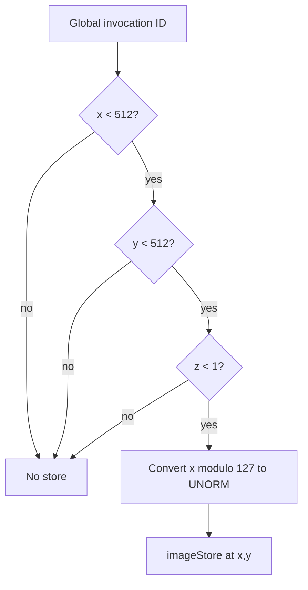

## Overview

**Core question:** Can a compute shader write every YCbCr plane through a storage-image view and produce the expected channel data after copyback?

- [`vktYCbCrStorageImageWriteTests.cpp`](../../../modules/vulkan/ycbcr/vktYCbCrStorageImageWriteTests.cpp) implements the `ycbcr.storage_image_write` test family.
- Each registered case selects a YCbCr format, a 2D extent, and either `joint` or `disjoint` image binding.
- The test generates one compute shader per plane, writes a coordinate-derived pattern, copies the planes to a host-visible buffer, and checks every present channel.
- The page explains the registration matrix, plane-specific shader, support gates, synchronization, copyback layout, and failure meaning.

## Background Knowledge

- A multi-planar image stores its channels in separate planes. A disjoint image binds those planes separately; a joint image binds the image as one allocation. Vulkan selects a plane with `VK_IMAGE_ASPECT_PLANE_0_BIT`, `VK_IMAGE_ASPECT_PLANE_1_BIT`, or `VK_IMAGE_ASPECT_PLANE_2_BIT`.
- A plane can use a compatible single-plane image-view format when the formats have the required block extent and size relationship. This lets the test expose a plane as a storage image while retaining the original YCbCr image format. See [plane-compatible formats](../../../../vulkan-docs/src/chapters/formats.adoc#formats-compatible-planes).
- A storage-image descriptor supplies an image view for shader image operations. Compute shader stores require `VK_FORMAT_FEATURE_STORAGE_IMAGE_BIT`, and the accessed subresource must use `VK_IMAGE_LAYOUT_GENERAL`. See [storage images](../../../../vulkan-docs/src/chapters/descriptors.adoc#descriptors-storageimage).

## Registration Hierarchy

```text
ycbcr.storage_image_write
├── b10x6g10x6r10x6g10x6_422_unorm_4pack16
├── b12x4g12x4r12x4g12x4_422_unorm_4pack16
├── b16g16r16g16_422_unorm
├── b8g8r8g8_422_unorm
├── g10x6_b10x6_r10x6_3plane_420_unorm_3pack16
├── g10x6_b10x6_r10x6_3plane_422_unorm_3pack16
├── g10x6_b10x6_r10x6_3plane_444_unorm_3pack16
├── g10x6_b10x6r10x6_2plane_420_unorm_3pack16
├── g10x6_b10x6r10x6_2plane_422_unorm_3pack16
├── g10x6_b10x6r10x6_2plane_444_unorm_3pack16
├── g10x6b10x6g10x6r10x6_422_unorm_4pack16
├── g12x4_b12x4_r12x4_3plane_420_unorm_3pack16
├── g12x4_b12x4_r12x4_3plane_422_unorm_3pack16
├── g12x4_b12x4_r12x4_3plane_444_unorm_3pack16
├── g12x4_b12x4r12x4_2plane_420_unorm_3pack16
├── g12x4_b12x4r12x4_2plane_422_unorm_3pack16
├── g12x4_b12x4r12x4_2plane_444_unorm_3pack16
├── g12x4b12x4g12x4r12x4_422_unorm_4pack16
├── g16_b16_r16_3plane_420_unorm
├── g16_b16_r16_3plane_422_unorm
├── g16_b16_r16_3plane_444_unorm
├── g16_b16r16_2plane_420_unorm
├── g16_b16r16_2plane_422_unorm
├── g16_b16r16_2plane_444_unorm
├── g16b16g16r16_422_unorm
├── g8_b8_r8_3plane_420_unorm
├── g8_b8_r8_3plane_422_unorm
├── g8_b8_r8_3plane_444_unorm
├── g8_b8r8_2plane_420_unorm
├── g8_b8r8_2plane_422_unorm
├── g8_b8r8_2plane_444_unorm
├── g8b8g8r8_422_unorm
├── r10x6_unorm_pack16
├── r10x6g10x6_unorm_2pack16
├── r10x6g10x6b10x6a10x6_unorm_4pack16
├── r12x4_unorm_pack16
├── r12x4g12x4_unorm_2pack16
└── r12x4g12x4b12x4a12x4_unorm_4pack16
```

`populateStorageImageWriteFormatGroup()` creates one direct child for each format, then adds size intermediate nodes with `joint` and `disjoint` test case leaves below each size.

## Parameter Dimensions and Observed Values

| Dimension | Registered values | Meaning in this test | Evidence |
|-----------|-------------------|----------------------|----------|
| Format | `VK_YCBCR_FORMAT_FIRST` through the format before `VK_YCBCR_FORMAT_LAST`, plus `VK_FORMAT_G8_B8R8_2PLANE_444_UNORM_EXT` through `VK_FORMAT_G16_B16R16_2PLANE_444_UNORM_EXT` | Selects the number of planes, channel classes, subsampling, bit widths, and compatible storage-image formats | [`populateStorageImageWriteFormatGroup()`](../../../modules/vulkan/ycbcr/vktYCbCrStorageImageWriteTests.cpp#L923-L932) |
| Image size | `512_512_1`, `1024_128_1`, `66_32_1` | Changes plane extents, generated shader bounds, dispatch counts, and output-buffer size | [`populateStorageImageWriteFormatGroup()`](../../../modules/vulkan/ycbcr/vktYCbCrStorageImageWriteTests.cpp#L887-L909) |
| Image binding mode | `joint`, `disjoint` | Chooses whole-image or per-plane memory binding and changes the required support checks | [`populateStorageImageWriteFormatGroup()`](../../../modules/vulkan/ycbcr/vktYCbCrStorageImageWriteTests.cpp#L911-L916) |
| Writable plane format | Format-specific compatible single-plane format, with redirects for several YCbCr formats | Determines the image-view format qualifier and whether `VK_IMAGE_CREATE_MUTABLE_FORMAT_BIT` is needed | [`getPlaneCompatibleFormatForWriting()`](../../../modules/vulkan/ycbcr/vktYCbCrStorageImageWriteTests.cpp#L67-L86) |

## Behavior Parameters

The primary behavioral axis is the image binding mode. It changes how the image is backed and how the test accesses its planes; the format and size dimensions provide the data and geometry exercised by both modes.

### joint: whole-image binding

The test creates the YCbCr image without `VK_IMAGE_CREATE_DISJOINT_BIT`, allocates one backing allocation, and checks storage-image support for the image format. Each plane still receives an aspect-specific view and compute dispatch when the format has multiple planes.

### disjoint: per-plane binding

The test creates the image with `VK_IMAGE_CREATE_DISJOINT_BIT | VK_IMAGE_CREATE_EXTENDED_USAGE_BIT`, binds separate allocations to its planes, and checks disjoint support. For a multi-planar image, transfer operations use plane views and each plane-compatible format must support storage-image access.

## Shader Analysis

The shader generator emits one compute shader for each plane. The walkthrough below uses the exact registered case `dEQP-VK.ycbcr.storage_image_write.r10x6_unorm_pack16.512_512_1.joint`, a single-plane 10-bit UNORM case whose writable view uses `VK_FORMAT_R16_UNORM` and the `r16` qualifier. The coordinate pattern is the same for every plane, while the generator changes the image format, data type, and bounds for the selected format.

### Representative Shader Walkthrough 1

#### Parameter Values Chosen

Representative path:

```text
dEQP-VK.ycbcr.storage_image_write.r10x6_unorm_pack16.512_512_1.joint
```

| Parameter choice | Meaning in this representative case |
|------------------|-------------------------------------|
| `r10x6_unorm_pack16` | Selects a single-plane 10-bit UNORM image and its `VK_FORMAT_R16_UNORM` compatible writable view |
| `512_512_1` | Sets the shader bounds to 512 by 512 by 1 |
| `joint` | Uses whole-image memory binding and the image format's storage-image support path |

#### Purpose

The shader writes the x-coordinate pattern to every in-range image texel. The host later checks the stored value against the same pattern after copying the image to a buffer.

#### Structural Design



#### Shader Code

```glsl
#version 440
layout (local_size_x = 128, local_size_y = 1, local_size_z = 1) in;
/// Binding 0 exposes the single-plane compatible view as a writable storage image.
layout (binding = 0, r16) writeonly uniform highp image2D u_image;
void main (void)
{
    /// Reject invocations outside the selected plane extent.
    if( gl_GlobalInvocationID.x < 512 )
    if( gl_GlobalInvocationID.y < 512 )
    if( gl_GlobalInvocationID.z < 1 )
    {
        /// Channel 0 varies with x. The other components are zero for this single-channel case.
        imageStore(u_image, ivec2( gl_GlobalInvocationID.x, gl_GlobalInvocationID.y ), vec4(float(int(gl_GlobalInvocationID.x) % 127) / 127.0, 0, 0, 0));
    }
}
```

#### Additional Info

- `initPrograms()` chooses `vec4`, `ivec4`, or `uvec4` from the channel class. This representative UNORM case uses `vec4`.
- The local workgroup size is computed from the plane extent and capped at 128 total invocations. The dispatch rounds each dimension up, so the bounds checks protect the edge when a plane extent is not an exact multiple of the local size.
- Multi-planar shaders sort channels by bit offset before constructing the `imageStore` vector. This maps the shader vector components to the plane's packed channel order.

#### Parameter Variation Summary

| Parameter dimension | Shader-level variation from this shader | Evidence |
|---------------------|-----------------------------------------|----------|
| Format | Changes the image type, data type, format qualifier, plane channel order, and plane extent | [`initPrograms()`](../../../modules/vulkan/ycbcr/vktYCbCrStorageImageWriteTests.cpp#L802-L881) |
| Image size | Changes the generated bounds and the computed local and global workgroup sizes | [`computeWorkGroupSize()`](../../../modules/vulkan/ycbcr/vktYCbCrStorageImageWriteTests.cpp#L225-L237) and [`initPrograms()`](../../../modules/vulkan/ycbcr/vktYCbCrStorageImageWriteTests.cpp#L857-L877) |
| Plane index | Selects `comp0`, `comp1`, or `comp2`, with that plane's compatible view format and channel vector | [`initPrograms()`](../../../modules/vulkan/ycbcr/vktYCbCrStorageImageWriteTests.cpp#L831-L880) |
| Joint/disjoint | Does not change the generated write expression, but changes the image-view usage chain and host image binding path | [`testStorageImageWrite()`](../../../modules/vulkan/ycbcr/vktYCbCrStorageImageWriteTests.cpp#L240-L355) |

#### SPIR-V

- Status: generated and validated
- Source: reconstructed `GLSL` from this walkthrough
- Stage: `comp`
- Target SPIRV version: `spirv1.0`

<details>
<summary>Click to expand SPIRV asm code</summary>

```llvm
; SPIR-V
; Version: 1.0
; Generator: Khronos Glslang Reference Front End; 11
; Bound: 58
; Schema: 0
               OpCapability Shader
               OpCapability StorageImageExtendedFormats
          %1 = OpExtInstImport "GLSL.std.450"
               OpMemoryModel Logical GLSL450
               OpEntryPoint GLCompute %main "main" %gl_GlobalInvocationID
               OpExecutionMode %main LocalSize 128 1 1
               OpSource GLSL 440
               OpName %main "main"
               OpName %gl_GlobalInvocationID "gl_GlobalInvocationID"
               OpName %u_image "u_image"
               OpDecorate %gl_GlobalInvocationID BuiltIn GlobalInvocationId
               OpDecorate %u_image NonReadable
               OpDecorate %u_image Binding 0
               OpDecorate %u_image DescriptorSet 0
               OpDecorate %gl_WorkGroupSize BuiltIn WorkgroupSize
       %void = OpTypeVoid
          %3 = OpTypeFunction %void
       %uint = OpTypeInt 32 0
     %v3uint = OpTypeVector %uint 3
%_ptr_Input_v3uint = OpTypePointer Input %v3uint
%gl_GlobalInvocationID = OpVariable %_ptr_Input_v3uint Input
     %uint_0 = OpConstant %uint 0
%_ptr_Input_uint = OpTypePointer Input %uint
   %uint_512 = OpConstant %uint 512
       %bool = OpTypeBool
     %uint_1 = OpConstant %uint 1
     %uint_2 = OpConstant %uint 2
      %float = OpTypeFloat 32
         %32 = OpTypeImage %float 2D 0 0 0 2 R16
%_ptr_UniformConstant_32 = OpTypePointer UniformConstant %32
    %u_image = OpVariable %_ptr_UniformConstant_32 UniformConstant
        %int = OpTypeInt 32 1
      %v2int = OpTypeVector %int 2
    %int_127 = OpConstant %int 127
  %float_127 = OpConstant %float 127
    %float_0 = OpConstant %float 0
    %v4float = OpTypeVector %float 4
   %uint_128 = OpConstant %uint 128
%gl_WorkGroupSize = OpConstantComposite %v3uint %uint_128 %uint_1 %uint_1
       %main = OpFunction %void None %3
          %5 = OpLabel
         %12 = OpAccessChain %_ptr_Input_uint %gl_GlobalInvocationID %uint_0
         %13 = OpLoad %uint %12
         %16 = OpULessThan %bool %13 %uint_512
               OpSelectionMerge %18 None
               OpBranchConditional %16 %17 %18
         %17 = OpLabel
         %20 = OpAccessChain %_ptr_Input_uint %gl_GlobalInvocationID %uint_1
         %21 = OpLoad %uint %20
         %22 = OpULessThan %bool %21 %uint_512
               OpSelectionMerge %24 None
               OpBranchConditional %22 %23 %24
         %23 = OpLabel
         %26 = OpAccessChain %_ptr_Input_uint %gl_GlobalInvocationID %uint_2
         %27 = OpLoad %uint %26
         %28 = OpULessThan %bool %27 %uint_1
               OpSelectionMerge %30 None
               OpBranchConditional %28 %29 %30
         %29 = OpLabel
         %35 = OpLoad %32 %u_image
         %36 = OpAccessChain %_ptr_Input_uint %gl_GlobalInvocationID %uint_0
         %37 = OpLoad %uint %36
         %39 = OpBitcast %int %37
         %40 = OpAccessChain %_ptr_Input_uint %gl_GlobalInvocationID %uint_1
         %41 = OpLoad %uint %40
         %42 = OpBitcast %int %41
         %44 = OpCompositeConstruct %v2int %39 %42
         %45 = OpAccessChain %_ptr_Input_uint %gl_GlobalInvocationID %uint_0
         %46 = OpLoad %uint %45
         %47 = OpBitcast %int %46
         %49 = OpSMod %int %47 %int_127
         %50 = OpConvertSToF %float %49
         %52 = OpFDiv %float %50 %float_127
         %55 = OpCompositeConstruct %v4float %52 %float_0 %float_0 %float_0
               OpImageWrite %35 %44 %55
               OpBranch %30
         %30 = OpLabel
               OpBranch %24
         %24 = OpLabel
               OpBranch %18
         %18 = OpLabel
               OpReturn
               OpFunctionEnd
```

</details>

## Runtime Execution and Result Checking

- The host creates a 2D, one-mip-level, one-layer, sample-count-one optimal-tiled `VkImage` with `VK_IMAGE_USAGE_TRANSFER_SRC_BIT | VK_IMAGE_USAGE_STORAGE_BIT`. It adds `VK_IMAGE_CREATE_MUTABLE_FORMAT_BIT` when the first writable plane format differs from the image format.
- `testStorageImageWrite()` allocates and binds the image as one object for `joint`, or obtains separate plane allocations for `disjoint`. It creates a descriptor-set layout with one `VK_DESCRIPTOR_TYPE_STORAGE_IMAGE` binding and creates one descriptor set, image view, and compute pipeline per plane.
- Each plane view selects the appropriate plane aspect and compatible format. The descriptor records `VK_IMAGE_LAYOUT_GENERAL`. A barrier changes the plane from `VK_IMAGE_LAYOUT_UNDEFINED` to `VK_IMAGE_LAYOUT_GENERAL` with shader-write access before dispatch.
- The shader extent comes from the selected plane's subsampling divisors. The host computes a local workgroup size, rounds up the dispatch dimensions, and rejects a dispatch that exceeds the `65535` limit in any dimension.
- After each dispatch, a barrier changes the plane from `GENERAL` to `VK_IMAGE_LAYOUT_TRANSFER_SRC_OPTIMAL` and makes shader writes visible to transfer reads. The host copies each plane into a separate region of one output buffer using `vkCmdCopyImageToBuffer`.
- A transfer-to-host barrier covers the output buffer. After `submitCommandsAndWait()` and `invalidateAlloc()`, the host derives each plane pointer from its accumulated offset and row pitch.
- The host decodes each channel with `getChannelAccess()`. Channel 0 expects `offsetX % 127`, channel 1 expects `offsetY % 127`, channel 2 expects `offsetZ % 127`, and channel 3 expects `1`. Integer channels must match exactly. Fixed-point channels allow `1e-5` plus the format's fixed-point error; floating-point channels allow `1e-5`.

## Failure Meaning

### Failure Cause Mapping

| If this behavior parameter value fails | Possible failure cause(s) |
|----------------------------------------|---------------------------|
| `joint` | Whole-image storage-image support, compatible view creation, image layout transition, compute storage write, image-to-buffer copy, or channel decoding is incorrect. |
| `disjoint` | Disjoint plane support, per-plane memory binding, plane-compatible storage-image support, plane view access, layout transition, copy, or channel decoding is incorrect. |

### Cause Analysis

#### Whole-image binding or storage write

**Possible failure symptoms:** A `joint` case can be skipped during support checks, fail while creating the image or view, or return a copied channel value that differs from the coordinate-derived reference.

**Possible implementation causes:** The device may not advertise storage-image support for the requested image or compatible view format, or the implementation may mishandle the format-compatible view, GENERAL layout access, compute image store, or the visibility of shader writes to the transfer operation. The test source does not identify which implementation layer is responsible for a mismatch, so further source and device investigation is needed.

#### Disjoint plane binding or transfer

**Possible failure symptoms:** A `disjoint` case can be skipped when disjoint or extension support is absent, fail during per-plane binding or view creation, or return incorrect values for one plane after copyback.

**Possible implementation causes:** The implementation may mishandle separate plane memory bindings, a plane aspect, a compatible plane format, or the synchronization from a plane's shader store to its transfer read. A mismatch can also arise from incorrect plane extent, row-pitch, or packed-channel interpretation. The source establishes these checks and operations but cannot assign a failing result to a specific implementation layer without further investigation.

## Case Pruning

### Requirement-based pruning

- `checkSupport()` skips a disjoint case when `VK_KHR_bind_memory2` or `VK_KHR_get_memory_requirements2` is required but unavailable.
- The image format must support the requested image type, tiling, usage, and create flags. Joint cases require `VK_FORMAT_FEATURE_STORAGE_IMAGE_BIT` for the image format. Disjoint cases require `VK_FORMAT_FEATURE_DISJOINT_BIT`, and multi-planar disjoint transfers require storage-image support for every plane-compatible format.
- A candidate size is skipped when its width or height is not aligned to `getImageSizeAlignment(format)`. The test also reports `NotSupportedError` when the rounded dispatch would exceed the device's `65535` limit.

### Design-based pruning

- The generator uses the fixed size set `{512,512,1}`, `{1024,128,1}`, and `{66,32,1}` rather than arbitrary extents.
- It emits only the YCbCr base format range and the additional 2-plane 444 EXT range described in `Parameter Dimensions and Observed Values`.
- The test has one behavioral write pattern. `joint` and `disjoint` repeat that pattern to compare whole-image and per-plane resource handling.

## Key Takeaways

- The shader writes planes independently, but the host validates the reconstructed channel data against a format-aware plane layout.
- `joint` tests whole-image binding and storage-image access. `disjoint` adds separate plane memory bindings and plane-compatible transfer views.
- Plane subsampling affects shader bounds, dispatch geometry, buffer offsets, row pitches, and the locations that the host checks.
- A passing case requires both the compute store and the later image-to-buffer visibility and layout transitions to produce readable data.

## Source Reference Appendix

| Entry point | Link | Why it matters |
|-------------|------|----------------|
| Test-family construction | [`createStorageImageWriteTests()`](../../../modules/vulkan/ycbcr/vktYCbCrStorageImageWriteTests.cpp#L939-L942) | Creates the `storage_image_write` test family |
| Format and case generation | [`populateStorageImageWriteFormatGroup()`](../../../modules/vulkan/ycbcr/vktYCbCrStorageImageWriteTests.cpp#L884-L934) | Defines format range, sizes, and `joint`/`disjoint` leaves |
| Support gates | [`checkSupport()`](../../../modules/vulkan/ycbcr/vktYCbCrStorageImageWriteTests.cpp#L89-L215) | Checks extensions, image-format properties, and format features |
| Plane-compatible format mapping | [`getPlaneCompatibleFormatForWriting()`](../../../modules/vulkan/ycbcr/vktYCbCrStorageImageWriteTests.cpp#L67-L86) | Selects writable view formats and special redirects |
| Workgroup sizing | [`computeWorkGroupSize()`](../../../modules/vulkan/ycbcr/vktYCbCrStorageImageWriteTests.cpp#L225-L237) | Caps local workgroup dimensions and total invocations |
| Shader generation | [`initPrograms()`](../../../modules/vulkan/ycbcr/vktYCbCrStorageImageWriteTests.cpp#L802-L881) | Emits plane-specific GLSL compute programs |
| Resource setup and dispatch | [`testStorageImageWrite()`](../../../modules/vulkan/ycbcr/vktYCbCrStorageImageWriteTests.cpp#L240-L405) | Creates resources, records barriers, and dispatches each plane |
| Copyback and result checking | [`testStorageImageWrite()`](../../../modules/vulkan/ycbcr/vktYCbCrStorageImageWriteTests.cpp#L407-L585) | Packs plane copies and compares channel values |
| Plane extents and buffer sizes | [`getPlaneExtent()`](../../../framework/vulkan/vkImageUtil.cpp#L2568-L2577) and [`getPlaneSizeInBytes()`](../../../framework/vulkan/vkImageUtil.cpp#L2548-L2556) | Defines subsampled extents and packed output regions |
| Storage-image semantics | [Storage Image](../../../../vulkan-docs/src/chapters/descriptors.adoc#descriptors-storageimage) | Defines descriptor, feature, store, and GENERAL layout requirements |
| Plane compatibility semantics | [Compatible Formats of Planes](../../../../vulkan-docs/src/chapters/formats.adoc#formats-compatible-planes) | Defines compatible single-plane formats and plane dimensions |
| Plane aspects | [Multi-Planar Format Image Aspect](../../../../vulkan-docs/src/chapters/formats.adoc#formats-multiplanar-image-aspect) | Defines the valid plane aspect bits |
| Synchronization semantics | [Synchronization](../../../../vulkan-docs/src/chapters/synchronization.adoc#synchronization) | Defines compute, transfer, shader-write, and host-read synchronization stages and accesses |
